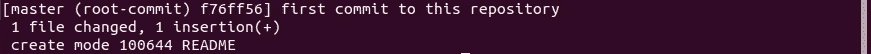

# 饭桶。数据工程师的必备工具。第 1 部分，共 2 部分。

> 原文：<https://medium.com/analytics-vidhya/git-a-data-engineers-must-have-tool-part-1-of-2-fd7e32f490b2?source=collection_archive---------17----------------------->

*由@ Eduardo Lomonaco 进行同行评审*

**Git 及其使用的简单说明。**

如果两个或更多的参与者在一个项目中合作更新计算机存储的文件，他们会怎么做？有人会说，这可以通过电子邮件、电话、面对面会议或虚拟聊天等方式实现。虽然这些方法可能适用于小项目和少量资源，但随着资源数量的增加或项目范围的扩大，它们往往效率很低。保持**跟踪**的**变化**以及在必要时**回滚**这些变化的能力成为一项艰巨的任务。一个名为 Git 的开源(免费)工具有助于缓解大多数挑战。

所以有人可能会问，Git 是什么？

Git 是一个版本控制系统，用于跟踪计算机文件的变化。这是一个开源工具，任何人都可以免费使用，只要他们遵守其条款和条件。[ [1](https://www.youtube.com/watch?v=albr1o7Z1nw)

我们为什么要使用 Git 以及如何使用？

Git 主要用于协调多个贡献者之间的工作，它跟踪谁对文件进行了更改，更改是什么以及何时进行的。Git 可以将文件上的更改回滚到过去的任何“提交”点。这些文件保存在一个称为存储库的目录中。存储库可以存储在远程服务器(云)或本地机器/服务器上。您不需要互联网连接来处理本地存储的存储库，但是您需要互联网来访问远程存储库。

**Git vs GitHub。**

Git 是让你对文件进行版本控制的软件。**另一方面，GitHub** 是一个网站或用户界面(UI ),它允许用户在云上访问 Git，也可以在云上存储他们的项目或存储库。值得注意的是，没有 GitHub 也可以使用 Git。您可能会遇到这两个术语(Git 和 GitHub)可以互换使用的情况。理解两者之间的区别很重要。

因此，对于有抱负的数据工程师、数据科学家和开发人员来说，了解这个工具的基础知识是潜在雇主的一个很好的指标，表明您可以轻松地在一个项目中进行协作！随着越来越深入，Git 确实变得越来越复杂，但是对于初学者和中间用户来说，这里涵盖的范围是一个良好的开端。

**典型的 Git 用例。**

让我们来看一个可以使用 Git 的场景。假设有一个团队正在进行一个项目，构建一个端到端的 ETL 或任何计算机文件存储项目。每个团队成员的任务是对项目可交付成果的不同部分进行编码。项目负责人将在 Git 上创建一个主存储库，然后授予每个团队成员访问权限。这将允许成员将主资料库下载或“克隆”到他们的本地计算机上，在克隆的资料库中进行更改，将更改放入暂存区，提交这些更改，然后将它们上传或“推送”回主资料库。现在，这些变更在与主存储库“合并”之前可以由同行进行审查。我承认这一部分可能有点混乱，坚持住，更多的细节将在本系列的第二部分讨论。现在，我们需要理解对存储库的更改将被 Git 跟踪。如果需要回滚过去所做的任何更改或提交，Git 将允许我们这样做，因此有了术语“**版本控制**”。

理论讲够了，让我们来看一个例子:

**Git 安装在 Ubuntu / Debian 上。**

如果你使用的是 **Ubuntu / Debian** ，你应该已经安装了 Git。您可以通过打开终端并运行以下命令来确认这一点:

```
$ git --version
```

您应该得到这样的结果:

```
git version 2.25.1
```

这告诉你你的机器有什么 Git 版本，在我写这篇文章的时候，我的版本是 2.25.1

如果你没有 Git，要在 Ubuntu / Debian 上安装它，运行:

```
$ sudo apt-get update
```

然后运行:

```
$ sudo apt-get install git
```

您可能需要等待几分钟才能完成安装。

完成后运行:

```
$ git --version
```

…您应该获得版本。

**在 Mac OS 上安装 Git。**

对于 Mac OS 用户来说，你很可能已经安装了 Git，因为苹果实际上维护和发布了他们自己的 Git 分支，但是它比主流 Git 落后了几个主要版本。[ [2](https://www.atlassian.com/git/tutorials/install-git)

如果你需要在 Mac 上安装 Git，请阅读 [Atlassian](https://www.atlassian.com/git/tutorials/install-git) 教程，并遵循 Mac 安装说明。

**Git 安装在 Windows 上。**

对于 Windows 用户来说，最正式的版本可以在 T2 Git 网站下载。选择 Git for Windows 安装程序，然后下载。转到机器上的下载文件夹，双击 Git。exe 文件开始安装。在所有窗口中单击“下一步”接受默认设置，在最后一个窗口中单击“安装”。除非您在安装过程中特别选择了 none default 选项，否则您将使用不同于常规 windows“cmd”终端的终端来运行 Git 命令。安装完成后，您的桌面上会出现一个 Git-Bash 图标。用它来启动 Git 命令的 Git-Bash 终端。如果您在桌面上找不到它，您可能会在“应用程序”或“已安装的程序”下找到它。

在使用 Git 的时候尽量避免使用 GUI，因为这不会让你对你正在做的事情有一个内在的理解。在与 Git 交互时，坚持使用终端或所谓的命令行界面(CLI)。

**创建一个项目存储库和一个自述文件。**

首先，让我们在本地机器上任何方便的地方创建一个空的文件夹/目录，并将其命名为 myFirstGit。我将使用终端在桌面上创建我的，键入:

```
$ cd ~/Desktop
```

该命令将我从我所在的位置带到我的桌面目录，然后我通过运行以下命令创建“myFirstGit”目录:

```
$ mkdir myFirstGit
```

现在这个目录 myFirstGit 是我放与我们的项目相关的文件的地方。接下来，让我们通过运行以下命令进入我们创建的目录:

```
$ cd myFirstGit
```

首先我们要检查 git 是否知道这个目录，所以让我们检查这个目录的“Git 状态”。我们运行:

```
$ git status
```

我们应该得到这样的错误:

```
fatal: not a git repository (or any of the parent directories): .git
```

这意味着我们的目录没有被初始化为 Git 存储库。让我们这样做:

```
$ git init
```

我们得到类似这样的回应:

```
Initialized empty Git repository in *home*/isr/Desktop/myFirstGit/.git/
```

这告诉我们 Git 已经开始跟踪这个目录的变化，尽管我们的目录现在是空的。此时，这个目录正式成为一个存储库，尽管是一个本地存储库。让我们在存储库中创建一个名为 README 的文件。我将使用我的首选文本编辑器称为纳米，你可以使用任何你喜欢的编辑器，只要你会使用命令行界面。因此，在我的情况下，我将运行:

```
$ nano README
```

Nano 将创建一个名为 README 的文件，并同时打开它。在文件中只需键入:


所有者提供的图像

第一次用 nano 的，输入你的消息后，按 Control 加 O，然后按 Enter 保存，再按 Control 加 X 回到你的终端。

**关于自述文件的几点注意事项。**

创建新的存储库或提交现有存储库时，最好总是包含这个名为 README 的文件。这可以保存为一个简短的描述，描述存储库是关于什么的，包括任何与项目相关的指令，或者它可以用来描述已经做出的变更以及变更的原因。所以，在这里记下，千万不要错过自述文件，尽可能使它简短而清晰。

让我们检查我们的存储库的 git 状态:

```
$ git status
```

我们应该得到:


图片由所有者提供。

Git 将一个文件添加到暂存区。

正如我们在前面的截图中看到的，Git 现在意识到了存储库中的这一新变化，它告诉我们“git add”将文件移动到暂存区，并准备好“commit”。让我们这样做:

```
$ git add README
```

让我们再次检查 git 状态:

```
$ git status
```

我们得到:


图片由所有者提供。

Git 现在正在跟踪我们的 README 文件，它已经将该文件放在暂存区，准备“提交”到我们的存储库中。

**提交文件**

我们不妨提交 README 文件，看看会是什么样子，但是首先我们需要告诉 Git 我们的“用户名”和“用户电子邮件”,如果我们还没有这样做的话。

让我们使用“git config”命令来实现:

```
$ git config --global user.name "your-user-name-here"$ git config --global user.email "your-email-here"$ git config --global user.password "your-password-here"
```

您可以通过运行以下命令随时检查您的 Git 配置列表:

```
$ git config --list
```

让我们提交自述文件:

```
$ git commit -m “my first commit to this repository”
```

我们得到确认:



图片由所有者提供。

这表明我们已经创建了我们的存储库的主分支，并带有简短的注释“首次提交到此存储库”，它还显示了此提交所做的更改，即只创建了一个文件 README。

为了这里的内务，让我们退后一步，看看我们是否能回答一两个“如果……会怎样的问题”。

**处理多个文件和拆分文件**

假设我们有多个文件要提交，这将如何工作？让我们回到我们的终端，创建两个文件(我们可以选择任何我们需要的文件类型，可以是 excel，doc，csv。py、jpg 等)。

为了简单起见，我们将使用 nano 再次创建两个文本文件。首先，我们创建“第二个文件”。

```
$ nano secondFile
```

我们在 secondFile 中输入一个简短的文本:


图片由所有者提供。

像我们之前做的那样保存文件，然后创建第三个文件并在里面写任何东西，我写了“我们的存储库的第三个文件”。保存它，然后运行:

```
$ ls
```

这为我们提供了当前目录中的文件列表:


图片由所有者提供。

让我们检查“git 状态”:

```
$ git status
```

我们得到:


图片由所有者提供。

Git 现在知道了如上所示的两个新的未跟踪文件，让 git 将它们“添加”到临时区域:

```
$ git add .
```

请注意，这次我没有键入任何文件名，我只是使用了一个“.”(单个空格和句号或句号)放在末尾。使用单个空格和句点告诉 Git 在目录中添加所有未跟踪的文件。我可以像以前一样用他们的名字一个一个地添加他们。

再次运行“git status”命令，我们得到:


图片由所有者提供。

我们的两个文件现在已经暂存并准备好“提交”，但是如果我们想将它们中的任何一个或全部取消暂存呢？

如上图所示，Git 已经在括号“()”中给出了如何操作的提示。

让我们打开第二个文件。

```
$ git restore --staged secondFile
```

运行“git status ”,我们会得到:


图片由所有者提供。

正如我们所看到的，第二个文件现在未被跟踪，而第三个文件仍处于暂存状态。在这一点上，我们甚至可以删除 secondFile，如果我们想或作出任何改变，而不影响主分支。如果我们愿意，我们可以继续“提交”第三个文件本身，没有问题。

接下来，我不会展示我们在上面讨论过的命令。这是一个很好的时间来看看你是否记得他们。

让我们再次“git add”second file，然后在我们将两个文件“git commit”到我们的存储库之前检查“git status ”,在我们的 commit 中包括一条消息“added two new files”。我们得到:


图片由所有者提供。

这两个新文件已经被添加到我们的本地存储库主分支，如果我们运行“git status ”,我们会得到一个“nothing to commit”消息。

乡亲们就这样吧！2 部分系列的第 1 部分到此结束。

**快速总结。**

因此，让我们快速浏览一下到目前为止我们已经学过的 Git 命令。

```
$ git initInitializes the present directory with Git so that we can start tracking changes in it.$ git statusTo check the git status of our directory/repository. It tells us if the directory has been initialized as a Git repository, it tells us which files are being trucked in the repository, it tells us if there are files ready to “commit”.$ git add <file name> or git add .*Will add the named file or* ***all*** *files to the staging area of Git ( in case of single space and period, “ .” ). They will now be tracked and they are ready to “commit” to the repository.*$ git restore --staged <file name>*To unstage a file, removing it from the tracked list.*$ git config --global user.name “your username here”*To register a user name with Git. We need this to initialize a repository.*$ git config --global user.email “your preferred email here”*To register an email address with Git. Again we need this to initialize a repository.*$ git config list*To check your configuration list at anytime.*$ git commit -m “short description message here” <file name>*To commit changes on one file into our repository.*$ git commit -m “short description message here” .*To commit changes on multiple files into our repository. Note the single space and “.” at the end of this command.*
```

现在，如果我们的计算机在**本地网络**上，那么这个存储库可以与本地网络中有权访问其位置的任何人共享。他们可以将存储库“克隆”到他们的本地机器上，进行更改，然后将更改提交回主分支。模拟**本地网络**场景对我们来说是不可能的，但是，在本系列的第 2 部分，我将介绍我们如何注册 GitHub，然后将我们的存储库推到云端，这样任何有互联网和权限的人都可以从任何地方访问我们的存储库。

感谢您的阅读，请继续关注第 2 部分…

## **免责声明。**

分享这篇教程的唯一目的是帮助其他人理解如何使用 Git 和 GitHub。请注意，它**不会覆盖**Git、GitHub、Mac OS、Linux Ubuntu/Debian、微软及其附属机构的官方文档中的信息。你自己决定使用它。

**参考文献:**

[1] *Traversy Media，2017 年 2 月 5 日。*[*https://www.youtube.com/watch?v=albr1o7Z1nw*](https://www.youtube.com/watch?v=albr1o7Z1nw)

【2】*https://www.atlassian.com/git/tutorials/install-git*阿特拉斯钻头教程[](https://www.atlassian.com/git/tutorials/install-git))