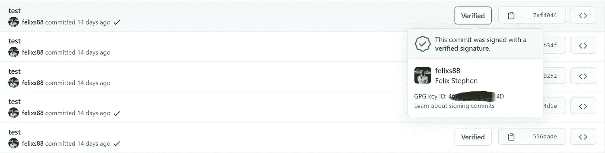
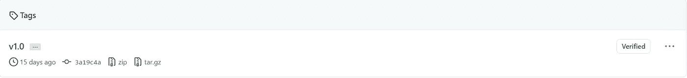

# git-数字签名

> 原文：<https://medium.com/analytics-vidhya/git-digital-signature-ed934153deab?source=collection_archive---------24----------------------->

> 努力工作吧，有一天你的签名会被称为亲笔签名！


我们所有的 git 提交都基于在`.*gitconfig*` 或`*.git/config*` 全局或本地配置文件中配置的用户名和电子邮件 id，如果没有配置 git，使用下面的命令不会允许任何提交。

```
***$ git config --global user.name username
$ git config --global user.email email@example.com*** *# check all your global configuration using below commands.* ***$ vi ~/.gitconfig******$ git config --local user.name username
$ git config --local user.email email@example.com*** *# check all your local configuration using below commands.* ***$ vi your-git-repo/.git/config***
```

每当我们提交用户名和电子邮件记录作为 git 提交的一部分。有一种方法可以在提交时覆盖已配置的用户名和电子邮件，这意味着它允许使用任何人的用户名和电子邮件，而无需获得用户的许可。最后，如果用户存在于 GitHub 中，他们的配置文件与 GUI 中的 commit 链接，但是在配置文件页面上，没有记录贡献活动。

```
***$ git commit --author="Anonymous User <anonymous@example.com>" -m "anonymous commit message"***
```

*   假设您的计算机受到推送访问的威胁，任何恶意([***git-horror-story***](https://mikegerwitz.com/2012/05/a-git-horror-story-repository-integrity-with-signed-commits))代码都有可能用您的名字提交，这可能会破坏您的组织名称和您的名字。

为了避免这种情况，git 想出了一个新特性叫做 [***签署提交***](https://docs.github.com/en/github/authenticating-to-github/signing-commits) *。*使用此功能，每次提交都用`*git*`验证。

如何创建已签名的提交？

要创建签名提交，我们需要配置 Gnu 隐私保护[](https://gnupg.org/)**并安装个人密钥，公钥必须存储在 GitHub 配置文件`settings` → `SSH and GPG keys`部分。下面是配置 GPG 公钥配置所需遵循的步骤，**

```
*# To list the existing keys(public and private keys)*
***$ gpp --list-key(s)*** *or* ***gpg --list-secret-key(s)***
*# To list the existing signature*
***$ gpg --list-signature*** *# To list the existing fingerprint* ***$ gpg --fingerprint****# To generate new pair of gpg keys. If gpg version is 2.1.17 and above less then this version use (****gpg --gen-key****)* ***$ gpg --generate-key*** *or* ***gpg --full-generate-key*** *gpg (GnuPG) 2.2.9; Copyright (C) 2018 Free Software Foundation, Inc.
This is free software: you are free to change and redistribute it.
There is NO WARRANTY, to the extent permitted by law.**Please select what kind of key you want:
   (1) RSA and RSA (default)
   (2) DSA and Elgamal
   (3) DSA (sign only)
   (4) RSA (sign only)
Your selection?* ***1*** *RSA keys may be between 1024 and 4096 bits long.
What keysize do you want? (2048)* ***1024*** *Requested keysize is 1024 bits
Please specify how long the key should be valid.
         0 = key does not expire
      <n>  = key expires in n days
      <n>w = key expires in n weeks
      <n>m = key expires in n months
      <n>y = key expires in n years
Key is valid for? (0)* ***0*** *Key does not expire at all
Is this correct? (y/N)* ***y****GnuPG needs to construct a user ID to identify your key.**Real name:* ***Felix Stephen*** *Email address:* [***my_email@example.com***](mailto:felsen88@gmail.com) *Comment: 
You selected this USER-ID:
    "Felix Stephen <*[*my_email@example.com*](mailto:felsen88@gmail.com)*>"**Change (N)ame, (C)omment, (E)mail or (O)kay/(Q)uit?* ***O*** *We need to generate a lot of random bytes. It is a good idea to perform
some other action (type on the keyboard, move the mouse, utilize the
disks) during the prime generation; this gives the random number
generator a better chance to gain enough entropy.
We need to generate a lot of random bytes. It is a good idea to perform
some other action (type on the keyboard, move the mouse, utilize the
disks) during the prime generation; this gives the random number
generator a better chance to gain enough entropy.
gpg: key A33AFD6BAC5AD0F9 marked as ultimately trusted
gpg: revocation certificate stored as '/root/.gnupg/openpgp-revocs.d/81E68D24686B87703B61E00EA33AFD6BAC5AD0F9.rev'
public and secret key created and signed.**pub   rsa1024 2021-02-04 [SC]
      81E68D24686B87703B61E00EA33AFD6BAC5AD0F9
uid                      Felix Stephen <*[*my_email@example.com*](mailto:felsen88@gmail.com)*>
sub   rsa1024 2021-02-04 [E]*# Once the key is generated we need to get export the key and add it into github profile settings--> SSH and GPG Keys section.
***$ gpg --armor --export <key-id*** *or* ***finger-print*** *or* ***email-id>*** -----BEGIN PGP PUBLIC KEY BLOCK-----
<encrypted secret key>
-----END PGP PUBLIC KEY BLOCK-----
```

**将密钥添加到 GitHub 帐户后，需要在 git 配置设置中配置密钥细节。下面是实现 git 配置所需遵循的步骤，**

```
# *Git username configuration settings* ***$ git config --global user.name "Felix Stephen"*** # *Git user email configuration settings* ***$ git config --global user.email "my_email@example.com"*** # To get the gpg key id ***$ gpg --list-secret-keys --keyid-format LONG***
sec   rsa1024/A33AFD6BAC5AD0F9 2021-02-04 [SC]
      *81E68D24686B87703B61E00EA33AFD6BAC5AD0F9*
uid                 [ultimate] Felix Stephen <[my_email@example.com](mailto:felsen88@gmail.com)>
ssb   rsa1024/5821E0924BF659ED 2021-02-04 [E]# Add the key id into git configuration settings ***$ git config --global user.signingkey A33AFD6BAC5AD0F9*** # Enabling signed commit configuration settings ***$ git config --global commit.gpgsign true*** # Enabling signed tag configuration settings
***$ git config --global tag.gpgSign true***
```

**一旦添加了所有的 git 配置，我们就差不多完成了！😄**

****Git 签名提交！****

```
# To create signed a commits!
***$ git commit -S -m "commit message"*** # To check the signature using git log
***$ git log --show-signature*** # To push all your changes ***$ git push origin main***
```

**一旦您将所有的更改推送到 GitHub 中，您的带有`verified`批次标记的提交，**

****

****Git 签名标签！****

```
# To create a signed tag
***$ git tag -s v1.0 -m "Release 1.0"*** # To publish your tags ***$ git push origin v1.0***
# To view the signed tag
***$ git show v1.0***
```

**一旦你按下你所有的标签，你的标签就会标上`verified` 批次。**

****

**每当您提交时，如果您得到以下错误，请使用下面的命令来纠正它！**

```
error: gpg failed to sign the data
fatal: failed to write commit object
***$ export GPG_TTY=$(tty)***
```