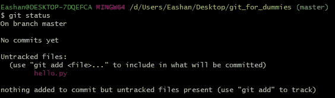

# 给初学者的 Git

> 原文：<https://medium.com/analytics-vidhya/git-for-beginners-b3020ceb6d95?source=collection_archive---------10----------------------->

每个程序员新手都会遇到 Git 这个词，但是很少有人会使用它，这是一语双关。对于新手来说，Git 很难理解，不是因为它很复杂，而是因为他们不理解它的用法。这篇文章将帮助您理解您可能会遇到的使用最常见和最基本的 git 命令的场景。这是一篇介绍性的文章，是为那些想了解 git 的初学者准备的。

1.  **Git 和 GitHub 简介**
2.  **我们为什么要用 Git？**
3.  **Git 工作流程**
4.  **基本 Git 命令**
5.  **结论**

# Git 和 GitHub 简介

很多程序员不明白“Git”和“GitHub”这两个术语的区别。 [Git 是一个免费的开源分布式版本控制系统，旨在快速高效地处理从小到大的项目。](https://git-scm.com/)而 GitHub 是一个基于云的服务，让你管理 Git 仓库(仓库是你的项目文件)。我们可以使用任何其他实现来管理 Git 存储库，比如 GitLab 或 Bitbucket，但是 GitHub 是 Git 最常用的托管服务。

# 为什么要用 Git？

在上一段中，我将 Git 解释为一个*版本控制系统(VCS)* 。简单地说，VCS 帮助我们跟踪我们的项目。我将用一个现实生活中的例子来解释这一点:想象自己是一个团队的经理，负责为一个客户部署一个出租车预订网站。您已经成功部署了网站的第一个版本-1。您的团队目前正在开发第二个版本的网站版本 2，但是当您部署您的版本 2 网站时，由于一些技术错误，整个网站崩溃了，现在您的客户很生气，希望您恢复到版本 1。你怎么能这样做？如果你足够聪明的话，你应该做一个版本 1 网站的拷贝，然后简单地部署代码。这是版本控制，在开始处理版本 2 之前，您制作了版本 1 的副本。但是现在想象一个长期的项目，在项目的整个生命周期中你会有几个版本，那么你会复制你所有的版本并浪费这么多空间吗？不，你不想那样，这就是 VCS 的用武之地。VCS 帮助您以一种节省内存的方式跟踪项目的各种版本，并且能够在任何时候恢复到任何版本。

> 每个版本都充当指向以前版本的指针，并且只包括以前版本的更改，而不是整个代码。

现在让我们了解一下 VCS 分布式的一面。继续前面的例子，假设三个团队在做项目，团队 1 负责前端开发，团队 2 负责后端开发，团队 3 负责数据库管理。您希望每个团队成员在编写代码时与其他团队成员有效地同步。你怎么能这样做？VCS 也会帮你的。每个团队成员都在他们本地系统的本地存储库上工作，然后将变更与远程存储库合并，让每个人都可以看到。

# Git 工作流

未跟踪的文件:git 不会跟踪这些文件，git 也不会保存它的更改历史。这些文件只是被 git 忽略，并不是 git 工作树的一部分。

提交:git commit 命令是一种获取项目当前阶段变更快照的方法。这些快照可以被认为是项目的“安全”版本——Git 永远不会更改它们，除非您明确要求它这样做。

跟踪文件:这些文件由 git 控制，可以分为两种类型——修改的文件和未修改的文件。未修改的跟踪文件意味着自最后一次提交以来，没有对最终文件进行任何修改。未修改的跟踪文件可以是先前提交的，也可以是刚刚从未跟踪的文件中添加的。自上次提交以来，已修改的跟踪文件以某种方式发生了更改。

暂存文件:暂存文件已准备好提交，一旦提交，它们将被视为未修改的跟踪文件。提交之后，我们可以将当前的 git 工作树推入远程存储库。如前所述，这些远程存储库可以位于 GitHub、Bitbucket、GitLab 或任何其他基于云的 git 托管服务中。

注:在进入下一部分之前，安装 [git 软件](https://git-scm.com/downloads)。

# 基本 Git 命令

在你的桌面上创建一个名为 git_for_dummies 的文件夹，从现在开始我将把这个文件夹叫做工作目录。进入您的工作目录，右键单击目录中的任意位置，然后单击“Git Bash Here”。这将打开一个 git 命令行界面，在这里您可以编写 Git 命令。

在这里写下你的第一个 git 命令，**，*，*，**。您将能够看到所有可用的基本 git 命令。***‘git help-a’***和***‘git help-g’***列出了可用的子命令和一些概念指南。参见***‘git help<命令>’***或***‘git help<概念>’***阅读具体的子命令或概念。系统概述见' ***git 帮助 git'*** 。

在你的工作目录中，点击视图面板>选项>改变文件夹和搜索选项。

将会打开以下窗口。在视图面板中选择“显示隐藏的文件、文件夹和驱动器”，同时取消选择“隐藏已知文件类型的扩展名”。

您可以看到您的工作目录是空的，现在转到您的 git bash 并运行最重要的 git 命令***‘git init’***，如果成功，它会给您以下消息‘I*在 C:/Users/eas Han/Desktop/Git _ for _ dummies/中初始化空的 Git 存储库。git/'* 。

之后，再次进入你的工作目录，现在你将能够看到一个. git 文件夹。恭喜您将工作目录转换成了 git 存储库。

现在让我们创建一个 python 文件 hello.py 并编写代码打印(' Hello World！!')在里面。这个文件是未跟踪的，您可以通过运行 git bash 中的命令***‘git status’***来检查这个文件。

要跟踪这个文件，你需要运行***‘git add hello . py’***命令。运行此命令后，您的文件将被跟踪和暂存。

让我们进行你的第一次提交，***“git commit-m ' my first commit '”***，你需要在你的提交中写一个有意义的消息，让你团队的其他成员能够理解。在您成功地提交检查您的工作树的状态之后，您将看到您的工作树是干净的。

让我们修改 hello.py，编写 print('Hello World Git 太棒了！').现在，当您检查工作树的状态时，您将看到 hello.py 被修改了。这意味着 hello.py 仍然会被 git 跟踪，但是在最后一次提交之后被修改了。

让我们创建一个 hello_1.py 文件并编写代码打印(' Hello World ')，现在如果您检查您的工作树的状态，您认为输出会是什么？？？我鼓励您先思考，然后运行 git status 命令。

您可以看到 hello.py 被跟踪和修改，而 hello_1.py 未被跟踪。现在运行命令***‘git add’*** ，再次检查你的工作树的状态。' git 添加'意味着一次添加所有文件。

两个文件都已准备好提交。现在运行带有有意义的提交消息的提交命令。这将使你的工作树再次干净。 ***试着再做三个文件，然后一个接一个地提交到你自己的 git 库*** 。

现在您的 git 存储库中总共有 5 个提交，尝试运行***‘git log’***命令。您将能够看到您的存储库中的所有提交及其唯一的 ID、提交作者、提交日期和提交消息。

您可以尝试运行的其他 git log 命令有:**、*、【git log -p -3】、*、**，其中**、*、*、**、**、【git log - stat】、、**，这将为您的提交提供简要的统计信息，即您进行了多少次插入和删除。

假设您想要恢复到第四次提交而不删除第五次提交，运行命令***‘git revert<commit unique ID>’***。这将打开 vim 编辑器。只需键入:wq 并按回车键。现在，当您查看日志时，可以看到一个新的提交，并带有一条消息“第四次提交”。

注意:第五次提交仍然存在于日志中，此命令将进行新的提交或删除其他提交。

现在，如果您想转到第二次提交并删除当前提交和第二次提交之间的所有提交，请运行命令***‘git reset-hard<commit unique ID>’。***

# **结论**

git 有比我在这篇博客中讨论的更多的东西，比如分支、分叉、推、拉请求、合并冲突等等。但是这个博客只是让你开始使用 git 的一种方式。我鼓励你自己尝试下面的命令，因为你可能每天都会遇到它们。