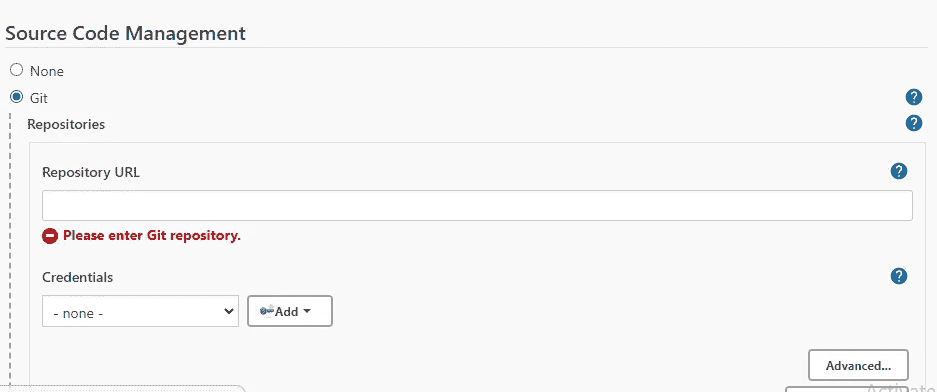
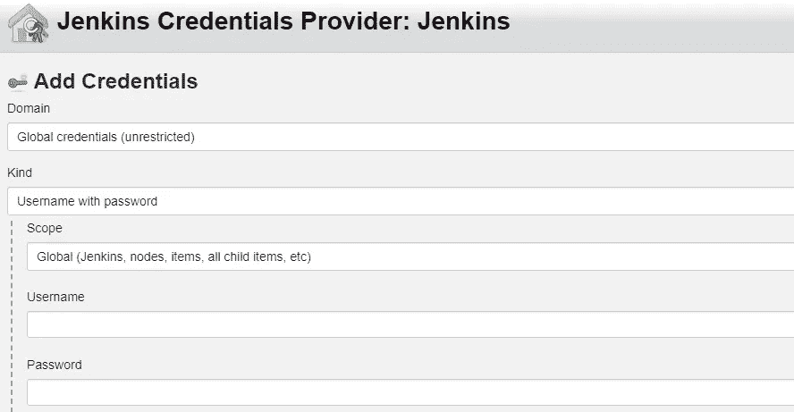
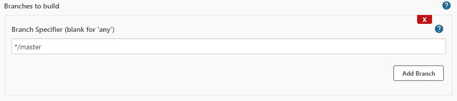
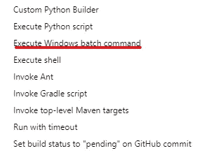
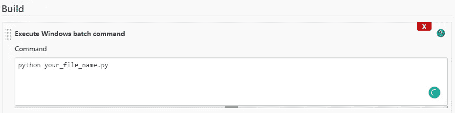

# Git 和 Jenkins 集成

> 原文：<https://medium.com/analytics-vidhya/git-jenkins-integration-460ba8a2b307?source=collection_archive---------8----------------------->

在前面的故事中，我已经简要地提到了如何安装 Jenkins 和一些 python 配置。在这里，我将直接开始创建一个关于 Jenkins 的项目。

在此之前，在 Github 中创建一个 repo 并向其中添加一个 python 文件。

然后在 Jenkins 中创建一个新项目，给出名称和描述。在配置中，您必须遵循以下步骤

复制您的回购网址并粘贴到这里

添加您的 git 凭证和一个带有描述的 Id

默认分支是主分支，您也可以根据您的分支名称进行更改

在“添加构建”中，选择“windows 批处理命令”,然后按照以下步骤操作

您需要在 python 之后指定您的文件名

创建后，您可以运行您的构建。