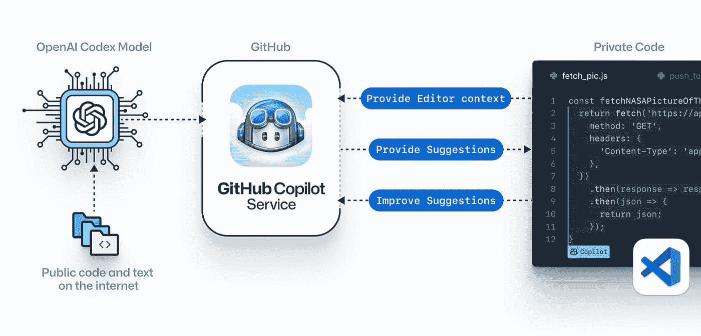
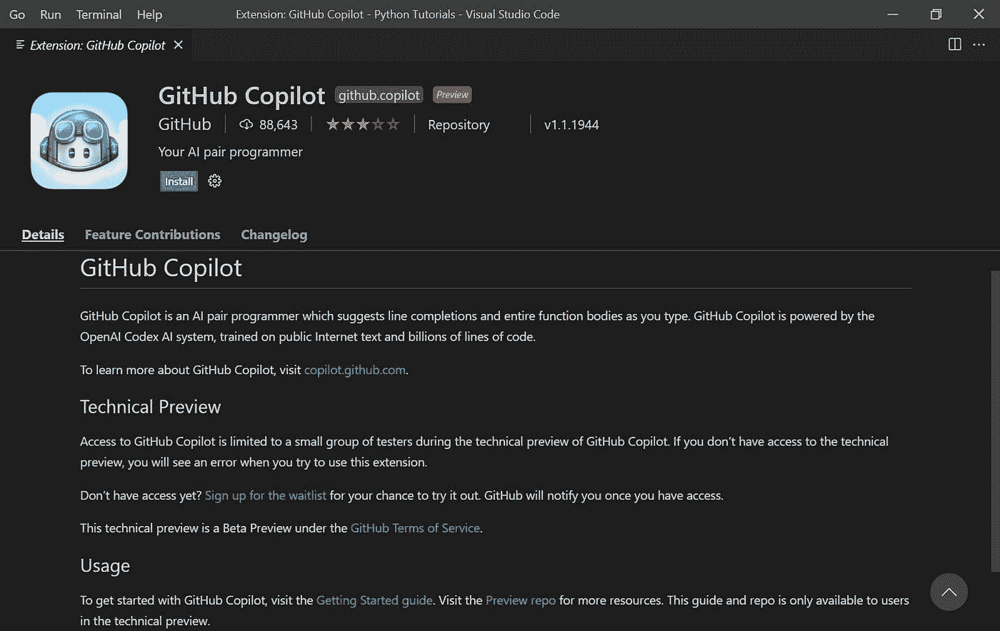
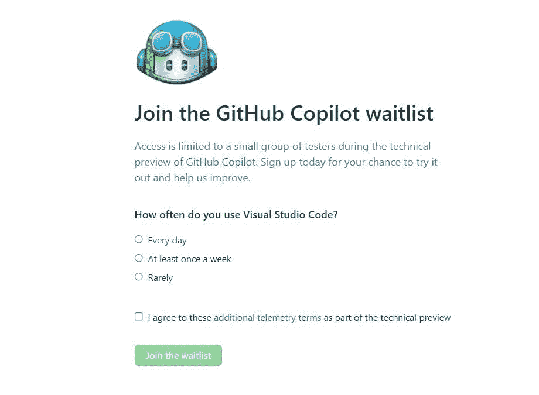
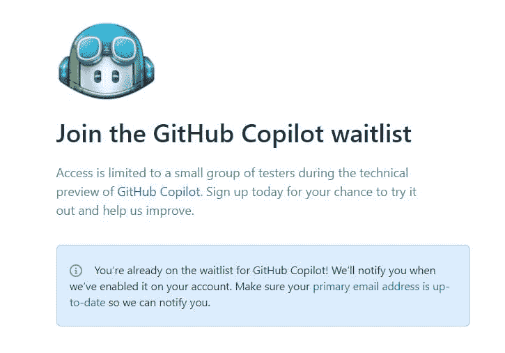
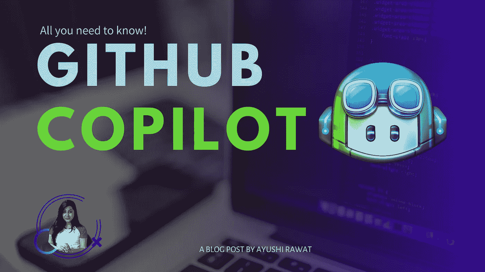

# GitHub 副驾驶:你需要知道的一切

> 原文：<https://medium.com/analytics-vidhya/github-copilot-all-you-need-to-know-8e6fc1d5ccc?source=collection_archive---------0----------------------->

读者你好！

微软子公司 GitHub 推出 Copilot，为人工智能编程提供动力。在这篇博文中，我将分享你需要知道的一切。

你可以参考我的 YouTube 视频教程来看一个工作教程，以便更好地理解和一步一步的指导。

# 这个博客将会涵盖什么

```
1\. What is GitHub Copilot?
2\. How does GitHub Copilot work?
3\. How good is GitHub Copilot?
4\. Does GitHub Copilot write perfect code?
5\. Will your private code be shared with other users?
6\. Availability
7\. How can You contribute?
8\. Ownership
```

*我们开始吧！*

# 什么是 GitHub Copilot？

GitHub Copilot 是一个 AI 对程序员。GitHub Copilot 由 OpenAI Codex 开发的新人工智能系统提供支持，即将推出 Visual Studio Code。它旨在帮助程序员更快地编码。它基本上从你正在处理的代码中提取上下文，建议整行或整个函数。

OpenAI Codex 对人们如何使用代码有广泛的了解，在代码生成方面比 GPT-3 更有能力

# GitHub Copilot 是如何工作的？



它可以通过分析你如何编码来建议完整的代码行或整个功能。GitHub Copilot 可以从用户注释中汇编代码，只需读取您声明的函数名就可以预测您的代码。它允许您在备选建议中循环，并手动编辑建议的代码。它自动填充重复的代码，或者为你的方法创建单元测试。

GitHub Copilot 编辑器扩展将您的评论和代码发送到 GitHub Copilot 服务，然后该服务使用 OpenAI Codex 来合成和建议代码。它实际上是通过通读全球 GitHub repos 上的所有开源代码，然后收集数据并试图找到与之相关的最佳代码来工作的！据说它能很好地处理重复的代码模式，因此用户可以让它生成其余的代码。人工智能助手还可以帮助你学习一门新的编程语言。

# GitHub Copilot 有多好？

这项技术确实很有前途。

> Copilot 帮助开发人员快速发现解决问题的替代方法，编写测试，并探索新的 API，而不必在 Stack Overflow 和 internet 等网站上繁琐地搜索答案。

弗里德曼说。

据说已经对一组 Python 函数进行了测试，这些函数在开源 repos 中有很好的测试覆盖率，测试方法是删除函数体，并让 GitHub Copilot 填充它们。该模型在第一次尝试中有 43%的正确率，在允许尝试 10 次的情况下有 57%的正确率。而且它一直在变得越来越聪明。

# GitHub Copilot 写的代码完美吗？

不。GitHub Copilot 试图理解您的意图并尽可能生成最好的代码，但是它建议的代码可能并不总是有效，甚至没有意义。“GitHub Copilot 从您正在处理的代码中提取上下文，建议使用完整的线条或完整的功能，”GitHub 首席执行官 Nat Friedman 在介绍该技术的 T2 博客中解释道。该算法通过记录每个建议是否被接受来持续改进。

为了充分利用它，建议将代码分成更小的函数，提供有意义的函数名、参数和文档字符串。

# 您的私人代码会与其他用户共享吗？

不。他们声称使用遥测数据，包括用户接受或拒绝哪些建议的信息，来改进模型。

# 有效性



目前，GitHub Copilot 将只能在 Visual Studio 代码中使用，访问权限仅限于一小部分测试人员。预览版是免费的。预览版已经由 88，783 名程序员安装。

技术预览在 Python、JavaScript、TypeScript、Ruby 和 Go 中运行良好，但最终版本将适用于更广泛的框架和语言。它将被用来学习人们如何使用 GitHub Copilot 以及如何大规模操作它。

# 您如何贡献？


贡献的最好方式是注册技术预览。在 GitHub Copilot 技术预览期间，访问权限仅限于一小部分测试人员，因此您可以在此处加入 GitHub Copilot 等待列表[。](https://github.com/features/copilot/signup)



你只需要回答一个简单的问题，关于你多久使用一次 Visual Studio 代码，接受条款和条件，你就可以走了。技术预览的名额有限，所以今天就注册吧！



GitHub 表示，由于项目需要“最先进的人工智能硬件”，目前的预览阶段受到限制。一旦免费预览阶段结束，该公司计划建立一个商业版本，应该“尽可能广泛地提供”。

关于在社交媒体上分享代码片段，GitHub 说:

> 发帖时请使用 [#GitHubCopilot](https://twitter.com/hashtag/GitHubCopilot) 以便我们可以看到你制作的东西！

# 所有权

GitHub 将权限分配给编写代码的人，因此用户对它生成的建议和用 Copilot 创建的代码负责。它属于您，您获得了代码的唯一所有权。

# GitHub Copilot 会影响开发人员的工作吗？

Copilot 自动完成代码片段，建议新的代码行，甚至可以根据提供的描述编写整个功能。它适应你写代码的方式，帮助你更快的完成工作。该技术将使现有的工程师更加高效，减少手动任务，并帮助他们专注于有趣的工作。它只是建议了一段代码，它仍然需要像你通常对每一段代码所做的那样被手工检查和测试。

观察事件将如何发展以及我们的未来是非常有趣的，但无论如何，我不认为它会很快取代开发人员的工作。对此你怎么看？在下面的评论框中分享你的想法。



就是这样。就这样，结束了！我希望你觉得这篇文章很有用，现在你可以开始用 API 构建一些项目了！

我创建关于职业、博客、编程和生产力的内容，如果你对此感兴趣，请与你的朋友和关系人分享这篇文章。你也可以订阅我的时事通讯，在我每次写东西的时候得到更新！

谢谢你的阅读，如果你已经到目前为止，请喜欢这篇文章，它会鼓励我写更多这样的文章。请分享您的宝贵建议，感谢您的真诚反馈！

我强烈推荐你去看看 T2 的 YouTube 视频，别忘了订阅我的频道。我很乐意在 [Twitter](https://twitter.com/ayushi7rawat) | [LinkedIn](https://www.linkedin.com/in/ayushi7rawat/) 与你联系。

你绝对应该看看我的其他博客:

*   [Python 3.9:你需要知道的一切](https://ayushirawat.com/python-39-all-you-need-to-know)
*   [GitHub CLI 1.0:你需要知道的一切](https://ayushirawat.com/github-cli-10-all-you-need-to-know)
*   [如何制作自己的谷歌 Chrome 扩展](https://ayushirawat.com/how-to-make-your-own-google-chrome-extension-1)
*   [从 Python 运行 Javascript】](https://ayushirawat.com/run-javascript-from-python)
*   [使用 Python 自动化 WhatsApp](https://ayushirawat.com/automate-whatsapp-using-python)
*   [使用 Python 自动提供 Cowin 疫苗槽](https://ayushirawat.com/automate-cowin-vaccine-slots-availablity-using-python)
*   [什么是竞争性编程](https://ayushirawat.com/what-is-competitive-programming-or-beginners-guide)

# 资源:

*   【copilot.github.com 号
*   【marketplace.visualstudio.com/items?itemName.. 
*   [github.blog/2021–06–29-introducing-github-c..](https://github.blog/2021-06-29-introducing-github-copilot-ai-pair-programmer/)

在我的下一篇博客文章中再见，保重！！