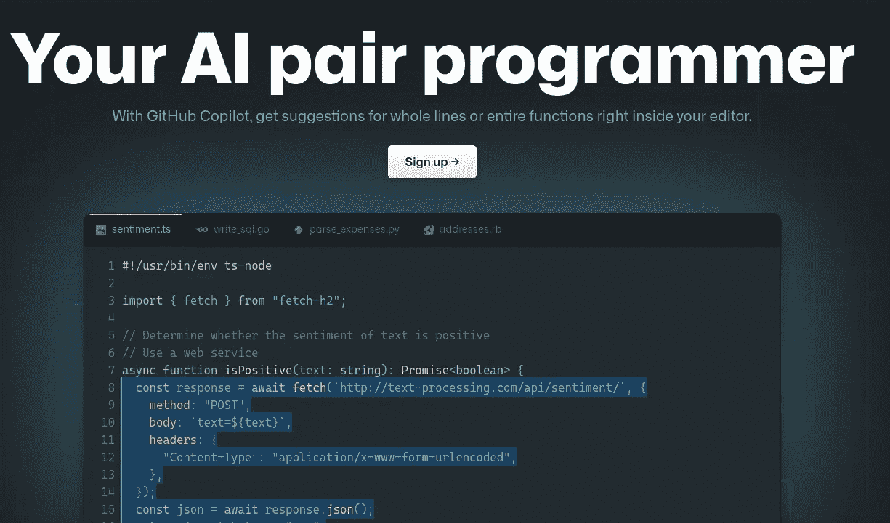
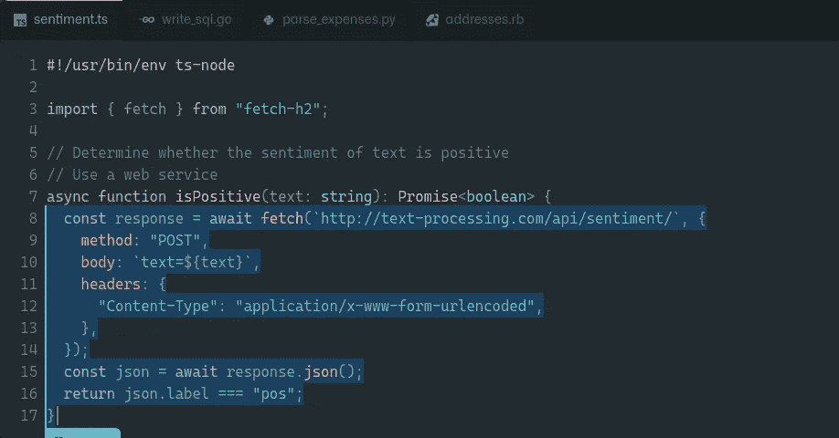
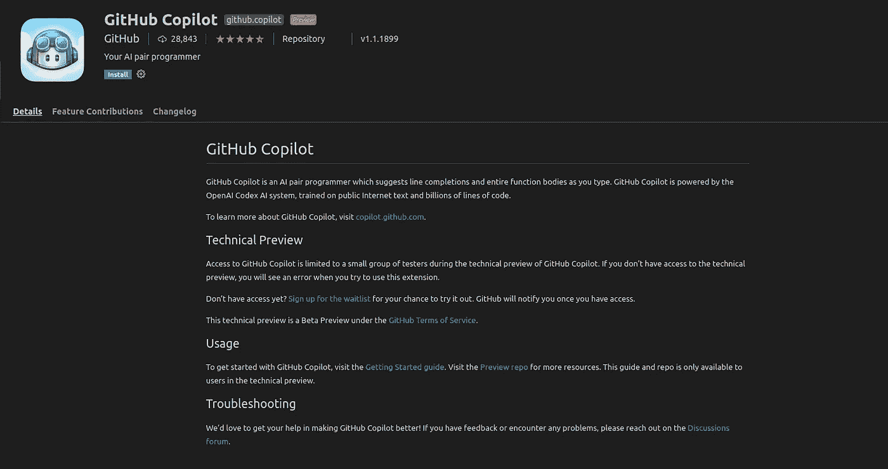
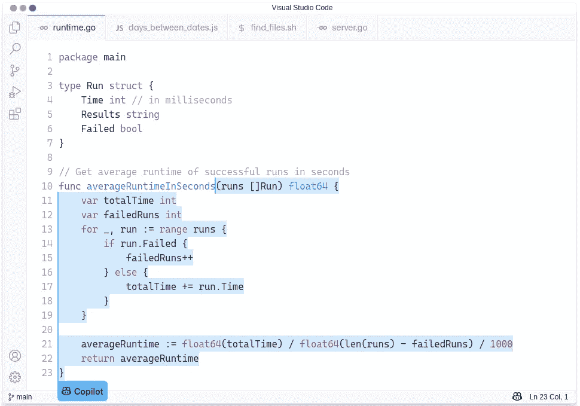

# github Copilot——您的人工智能配对程序员

> 原文：<https://medium.com/analytics-vidhya/github-copilot-your-ai-pair-programmer-efe199f5f863?source=collection_archive---------12----------------------->

> [**大新闻——Github 和 Open AI 推出了一款新工具，可以生成自己的代码**](https://github.blog/2021-06-29-introducing-github-copilot-ai-pair-programmer/)

Copilot 是 GitHub 和 OpenAI 推出的一款新的人工智能工具，可以在 Visual Studio 代码编辑器中运行，并自动完成代码片段，它已经作为技术预览版发布。

它评估您已经编写的代码，并创建与之匹配的新代码，包括以前执行的函数。即使在注释的基础上，我们也可以很容易地生成代码，它会自动为我们做这些。自动开发代码来导入推文、制作散点图或获得 Goodreads 评级只是该项目的网站上的几个例子。它与 Python、JavaScript、TypeScript、Ruby 和 Go 配合得最好。

根据 GitHub 的说法，这是结对编程的扩展，在结对编程中，两个程序员在同一个项目中工作，以发现彼此的错误并加快开发过程。

Copilot 基于新的 OpenAI Codex 算法。要了解更多算法参考- [点击这里](https://www.cnbc.com/2021/06/29/microsoft-github-copilot-ai-offers-coding-suggestions.html)

截至目前，GitHub Copilot 是一个 Visual Studio 代码插件。它可以在你的电脑上运行 Visual Studio 代码，也可以在云中运行 GitHub 代码空间。它也足够快，可以在打字时使用。

Codex 是 OpenAI 的最新人工智能系统，位于 GitHub Copilot 的核心。大多数编码助手不像 GitHub Copilot 那样理解上下文。GitHub Copilot 会分析您提供的上下文，并综合代码进行匹配，无论是在文档字符串、注释、函数名还是代码本身。他们以一种更智能的方式设计了 Github Copilot，开发者可以很容易地使用它。

GPT-3 是 OpenAI 的旗舰语言生成算法，能够生成通常无法从人类书写中识别的文本。OpenAI Codex 生成代码，而 GPT-3 生成英文。据 OpenAI 的一位官员称，该公司希望在今年夏天晚些时候通过其 API 发布一个版本的 Codex，以便开发人员可以使用该技术创建自己的应用程序。

Copilot 目前处于有限的技术预览阶段，但你可以通过访问该项目的网站来注册一个试用的机会。参考- [点击这里](https://copilot.github.com/)

更多信息请参考- [点击此处](https://copilot.github.com/)

“永远不要停止学习”