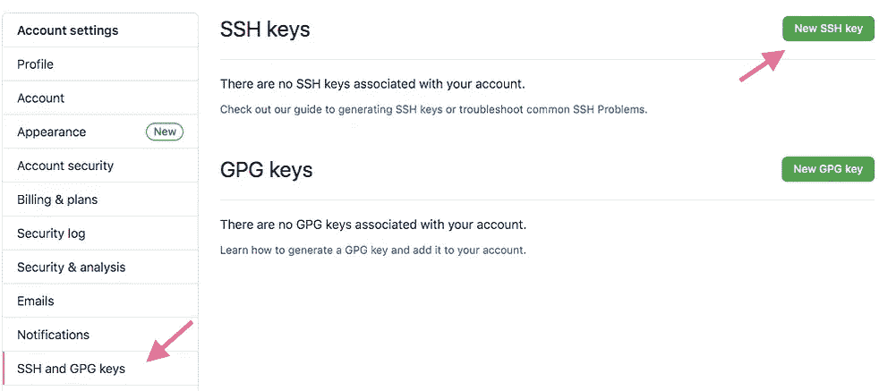
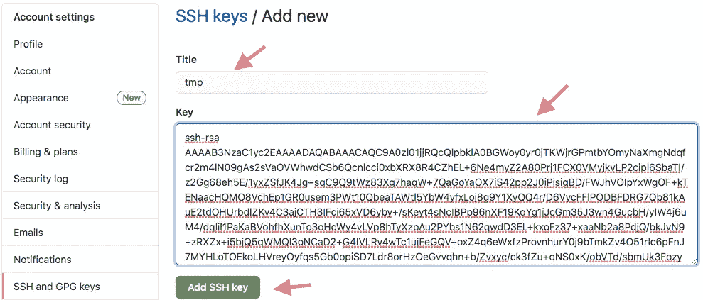

# Github 错误远程:无效的用户名或密码，解决方案

> 原文：<https://medium.com/analytics-vidhya/github-error-remote-invalid-username-or-password-a-solution-bdf16a693f5?source=collection_archive---------4----------------------->

如果 GitHub 上启用了 ***双因素认证*** ，那么当尝试提交到 git 存储库时，您可能会遇到以下错误消息:

```
remote: Invalid username or password.
fatal: Authentication failed for '[https://github.com/mohamad-wael/tmp.git/'](https://github.com/mohamad-wael/tmp.git/')
```

对于这样的错误消息，一个可能的解决方案是 ***使用 ssh*** ，提交到您的 git 存储库，如下所示。

首先， ***开始生成*** 您的公钥和私钥`ssh`，密钥对:

```
# Select only one of the following commands , the
# first one uses a newer algorithm , which might
# not yet be supported by the client.$ ssh-keygen -t ed25519 -C "[your_email@example.com](mailto:your_email@example.com)"
# Generate user own ssh public , and private
# key pairs , using the algorithm ed25519 ,
# with a comment of user email .
Generating public/private ed25519 key pair.
Enter file in which to save the key (/Users/difyel/.ssh/id_ed25519):
Enter passphrase (empty for no passphrase):
Enter same passphrase again:
Your identification has been saved in /Users/difyel/.ssh/id_ed25519.
Your public key has been saved in /Users/difyel/.ssh/id_ed25519.pub.
The key fingerprint is:
SHA256:a9JAoN2pwMcYaYxNsi0shyqGmVl0ZeG8YMV2KuQiDcw [your_email@example.com](mailto:your_email@example.com)
The key s randomart image is:
+--[ED25519 256]--+
|+=+.oo=.         |
|+E=B.Bo..        |
|==Oo*.*o         |
|=Bo+o+..         |
|Bo ...o S        |
|o      o .       |
|      . +        |
|       o         |
|                 |
+----[SHA256]-----+$ ssh-keygen -t rsa -b 4096 -C "[your_email@example.com](mailto:your_email@example.com)"
# uses the rsa algorithm with a key size of 4096 ,
# with a comment containing an email .
Generating public/private rsa key pair.
Enter file in which to save the key (/Users/difyel/.ssh/id_rsa):
Enter passphrase (empty for no passphrase):
Enter same passphrase again:
Your identification has been saved in /Users/difyel/.ssh/id_rsa.
Your public key has been saved in /Users/difyel/.ssh/id_rsa.pub.
The key fingerprint is:
SHA256:GDdMlCeNp/+xc9EuxTmSvEgaMeKc/pe/km/0Lycrr4s [your_email@example.com](mailto:your_email@example.com)
The key s randomart image is:
+---[RSA 4096]----+
|       .o+       |
|       o+ +      |
|      . +=       |
|       =.+       |
|      + S.o . .o.|
|       + ....=.o+|
|      .   +.=o++.|
|       . . B=o=.o|
|        ..E B@+*o|
+----[SHA256]-----+
```

该 ***将在`~./ssh/`文件夹中创建以下*** 文件:

```
$ ls -al ~/.ssh
# list the content of the ~/.ssh
# folder .# If the ed25519 algorithm was used to 
# generate keys , and the default name
# was selected , then these two files 
# will be created . 
id_ed25519
id_ed25519.pub# If the rsa algorithm was used to 
# generate keys , and the default
# name was selected , then these 
# files will be created .
id_rsa
id_rsa.pub
```

***将生成的*** 公钥复制到剪贴板，例如通过先回显它，然后再复制它。

```
$ cat ~/.ssh/id_ed25519.pub 
# If the chosen algorithm is ed25519 .
ssh-ed25519 AAAAC3NzaC1lZDI1NTE5AAAAIMa4Mrn6kaZXEsbhTQqvkFYUQN1d1exvauDut1ssD8np [your_email@example.com](mailto:your_email@example.com)$ cat ~/.ssh/id_rsa.pub
# If the chosen algorithm was rsa .
ssh-rsa AAAAB3NzaC1yc2EAAAADAQABAAACAQC9A0zl01jjRQcQlpbklA0BGWoy0yr0jTKWjrGPmtbYOmyNaXmgNdqfcr2m4lN09gAs2sVaOVWhwdCSb6Qcnlcci0xbXRX8R4CZhEL+6Ne4myZ2A80Prj1FCX0VMyjkvLP2cipl6SbaTl/z2Gg68eh5E/1yxZSfJK4Jg+sqC9Q9tWz83Xg7haqW+7QaGoYaOX7iS42pp2J0iPjsigBD/FWJhVOIpYxWgOF+kTENaacHQMO8VchEp1GR0usem3PWt10QbeaTAWtl5YbW4yfxLoj8g9Y1XyQQ4r/D6VycFFlPODBFDRG7Qb81kAuE2tdOHUrbdlZKv4C3ajCTH3IFci65xVD6yby+/sKeyt4sNcIBPp96nXF19KqYg1jJcGm35J3wn4GucbH/ylW4j6uM4/dqIil1PaKaBVohfhXunTo3oHcWy4vLVp8hTyXzpAu2PYbs1N62qwdD3EL+kxoFz37+xaaNb2a8PdjQ/bkJvN9+zRXZx+i5bjQ5qWMQl3oNCaD2+G4IVLRv4wTc1ujFeGQV+oxZ4q6eWxfzProvnhurY0j9bTmkZv4O51rIc6pFnJ7MYHLoTOEkoLHVreyOyfqs5Gb0opiSD7Ldr8orHzOeGvvqhn+b/Zvxyc/ck3fZu+qNS0xK/obVTd/sbmUk3FozyU3JH/8Adtmo1DlPVLoxuw== [your_email@example.com](mailto:your_email@example.com)
```

并将其添加到 GitHub，方法是转到 ***ssh 和 gpg 密钥*** ，并创建一个新的 ssh 密钥:



要在本地计算机中从 https、、、*、*更改为 ssh，请转到存储您的存储库的位置，并发出以下命令:

```
$ git remote -v
# Check the configured protocol .
origin  [https://github.com/mohamad-wael/tmp.git](https://github.com/mohamad-wael/tmp.git) (fetch)
origin  [https://github.com/mohamad-wael/tmp.git](https://github.com/mohamad-wael/tmp.git) (push)$ git remote set-url origin [git@github.com](mailto:git@github.com):mohamad-wael/tmp.git
# Switch to ssh , by replacing [https://github.com/](https://github.com/) ,
# with [git@github.com](mailto:git@github.com):$ git remote -v
# Check the configured protocol .
origin  [git@github.com](mailto:git@github.com):mohamad-wael/tmp.git (fetch)
origin  [git@github.com](mailto:git@github.com):mohamad-wael/tmp.git (push)$ git push origin main
# Push to GitHub 
The authenticity of host 'github.com (140.82.121.4)' can't be established.
RSA key fingerprint is SHA256:nThbg6kXUpJWGl7E1IGOCspRomTxdCARLviKw6E5SY8.
Are you sure you want to continue connecting (yes/no)? yes
Warning: Permanently added 'github.com,140.82.121.4' (RSA) to the list of known hosts.
Branch main set up to track remote branch main from origin.
Everything up-to-date
```

将 ***切换回 https*** ，发出:

```
$ git remote set-url origin [https://github.com/:mohamad-wael/tmp.git](https://github.com/:mohamad-wael/tmp.git)
```

*最初发表于 2021 年 2 月 8 日*[*https://twiserandom.com*](https://twiserandom.com/git/github-error-remote-invalid-username-or-password-a-solution/)*。*