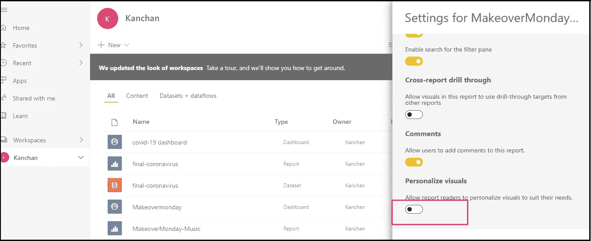
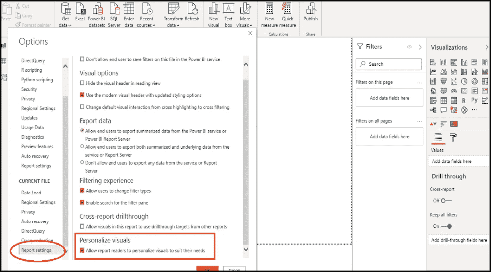
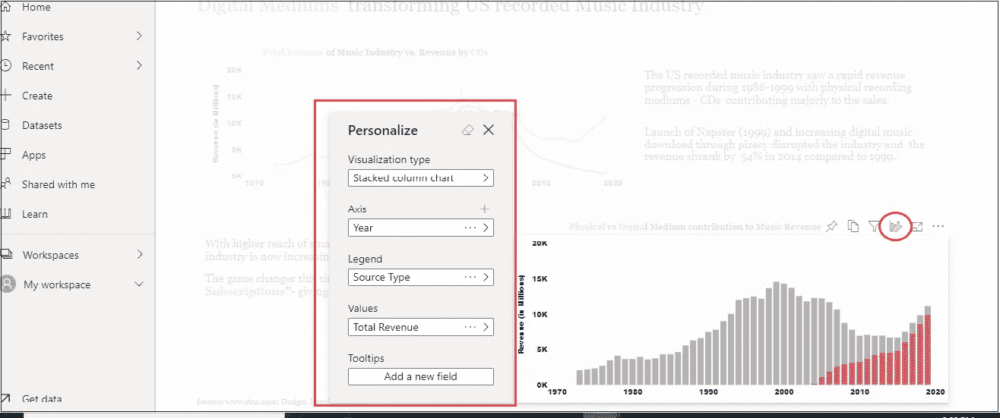
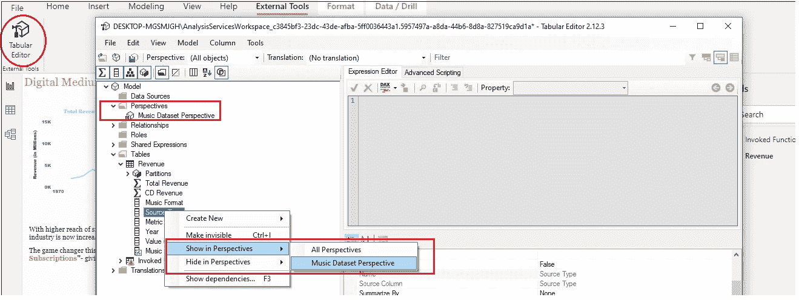
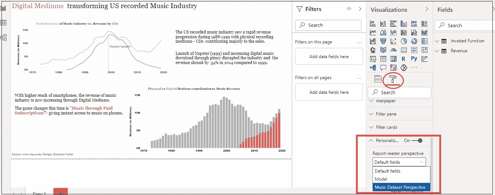

# 通过“个性化视觉效果”为 PowerBI 报告受众提供更多动力

> 原文：<https://medium.com/analytics-vidhya/give-your-powerbi-report-audience-more-power-through-personalize-visuals-be1e4aea52cd?source=collection_archive---------18----------------------->

## Power BI 个性化视觉和透视功能

乔希·希尔德在 [Unsplash](https://unsplash.com/s/photos/super-power?utm_source=unsplash&utm_medium=referral&utm_content=creditCopyText) 上的照片

**“我们能不能把这个条形图改成饼状图或者可能是甜甜圈图？”**

作为一名报表开发人员，您一定经常从报表受众那里听到类似的问题或建议。我可以说，我已经不止一次地收到少数热心观众/终端用户的这种请求，要求改变报告中的视觉效果，以适应他们的视觉偏好。

我一直认为，报告开发人员的目标是使用视觉效果(图形/图表/表格)开发报告，最有效地将预期信息传达给业务用户、利益相关者和管理团队，他们是我们主要的报告消费者/受众。然而，我们都必须面对这样的情况，即在我们看来完美的报表可能不符合少数用户的想法，他们想要更改图表类型、图表轴、图表值或添加/更改工具提示中的信息。

现在，我必须承认，我经常同意最终用户的要求，但有时我不喜欢改变图表，如果改变的请求是来自一个用户，而大多数其他用户同意当前的格式，并且该改变可能总体上影响报告中信息的显示和流动。

现在，PowerBI 的新功能“个性化视觉”和“视角”可以成为这种情况下的救星，为最终用户提供在报告视图模式下探索和定制报告的能力，而不会影响其他用户的报告显示。

**用户可以通过个性化视觉效果做出哪些改变？**

个性化视觉效果非常适合为报表使用者提供一些基本的修改功能，以修改他们的特定视图；比如:

*   更改可视化类型
*   更改报告中的测量/尺寸，或者换句话说，更改可视化中的轴和值
*   添加或删除图例
*   更改图表中的聚合类型

**如何启用“个性化视觉”功能？**

“个性化视觉”功能是一项报告功能，不适用于仪表板。要使用该功能，需要在特定报告的设置选项中启用它。可以从 PowerBI 服务以及桌面启用该功能

PowerBI 服务:转到工作区；选择报告旁边的省略号，然后单击设置。将会打开以下窗口。启用“个性化视觉”选项。

图 1:从 PowerBI 服务启用个性化可视功能

PowerBI Desktop:个性化视觉也可以通过 PowerBI Desktop 激活。转到**文件>选项和设置>选项>当前文件。**启用个性化视觉功能

图 2:从 PowerBI 桌面启用个性化视觉功能

现在，当此功能打开时，报告用户可以定制/修改报告中的所有视觉效果。为了防止这种情况，假设您只希望用户能够修改报告中的一个可视内容，对于不应该具有自定义功能的可视内容，请在可视内容级别禁用“个性化可视内容”。这可以在 PowerBI Desktop 中通过选择视觉>转到其格式化选项卡并关闭个性化视觉选项来完成。

**报表使用者如何对报表进行修改？**

报告消费者/读者可以在通过工作区或应用程序与用户共享的报告阅读视图中进行更改。在报告中，单击视觉图标，如果读者可以对报告进行个性化/修改，则会出现“个性化此视觉图标”。单击该图标将向报告消费者/读者提供选项，以对视觉效果进行更改。读者可以进行更改，如更改图表类型、可视化轴、可视化中显示的值、修改图例以及在工具提示中添加字段。

图 3:在 PowerBI 服务中个性化视觉效果

用户可以通过个人书签保存对报告所做的更改。转到书签(在报告顶部)>添加个人书签并保存书签，以便查看报告的个性化视图。

**附注:**对报告所做的更改是特定于定制可视化效果的用户的，不会对其他用户的报告视图产生任何影响。但是，如果用户希望与其他人共享定制视图，可以通过共享按钮共享报告(前提是用户具有重新共享权限)并选择“包括我的更改”来共享。

**什么是“视角”及其目的？**

到目前为止，我们已经了解了如何允许报告用户定制他们的报告视图。在数据模型很简单，只有很少的字段和表的情况下，这个过程工作得很好。然而，在复杂的数据模型中，对于不能访问数据模型并且不知道不同表之间关系的用户来说，提供对数据模型中所有维度和度量的完全访问的个性化视觉特征可能被证明是混乱的。

因此，在这种情况下，使用“透视图”只向用户提供对数据模型相关子集的访问是有意义的。透视可以包括数据模型中的任何或所有字段；但是，我倾向于只包含与包含可个性化视觉效果的特定报告页面上显示的信息相关的字段。

**如何创建透视图？**

为了简单起见，我理解的透视图是数据模型的一个子集。它可以使用表格编辑器创建；因此，在机器上安装表格编辑器非常重要。从 PowerBI Desktop >外部工具>选择表格编辑器。将会打开表格编辑器窗口。通过选择表/列并选择“在透视中显示”，创建新的透视并在透视中添加所需的表和列。将所有必填字段添加到透视图后，单击保存图标。

图 4:在表格编辑器中创建透视图

现在已经创建了透视图，可以在报告中使用了。要在个性化视图时仅向用户提供对创建的透视图的访问，请在 PowerBI Desktop 的“报表”页面的“转到格式”选项中，单击下图中突出显示的格式图标。在个性化可视字段中，选择为报告创建的视角。

图 5:选择报告的视角

现在，用户在个性化报表中的视图时，将只能访问创建的透视图和添加到透视图中的字段。因此，创建透视图限制了向用户显示的字段，从而减少了用户的困惑。

# **结论:**

个性化视觉是一个强大的功能，它为报告受众提供了一个更具交互性和可定制性的报告，特别是对于那些希望根据自己的特定要求定制或更改报告的用户。该特性是报告创建者和用户的福音，因为它能够为广大受众创建通用报告，为特定用户创建定制报告。好处是——所有的更改都在报表阅读器视图中完成！！