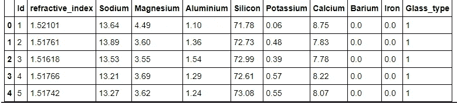
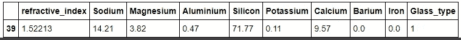
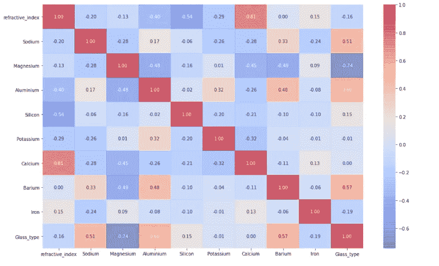
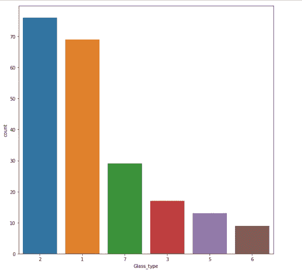
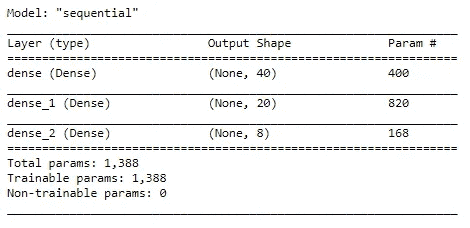
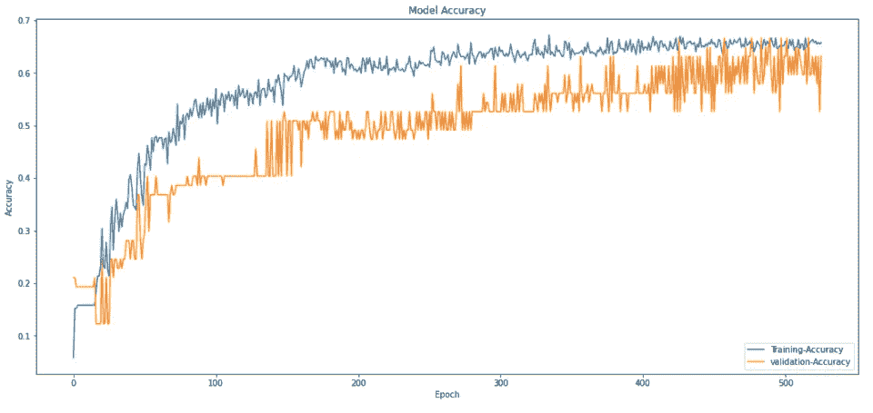
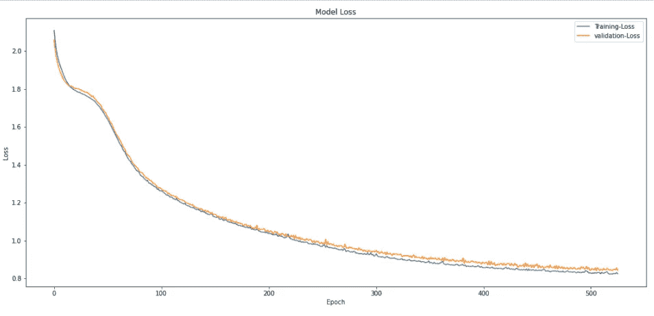

# 基于神经网络的玻璃分类

> 原文：<https://medium.com/analytics-vidhya/glass-classification-using-neural-networks-165a97242de6?source=collection_archive---------7----------------------->

> 将不同类型的玻璃分类


来源: [Unsplash](https://images.unsplash.com/photo-1481026469463-66327c86e544?ixid=MnwxMjA3fDB8MHxwaG90by1wYWdlfHx8fGVufDB8fHx8&ixlib=rb-1.2.1&auto=format&fit=crop&w=524&q=80)

**问题陈述** 这个问题与根据某些特征对玻璃进行分类有关。这个特殊的问题可以通过使用机器学习算法来解决，如 SVC、随机森林或任何其他分类算法，但我使用的是神经网络。然而，选择简单的算法会更好，因为我们没有太多的数据。

**数据来源** 数据可以通过 **Kaggle** 从[这里](https://www.kaggle.com/uciml/glass)你可以很容易地下载。

**关于数据
Ba)中，除了 Id 列之外的所有列在确定玻璃的类型中起着重要作用，这也是我们的目标变量。在提供的关于数据集的描述中有 7 种类型的玻璃，但是在玻璃的数据集中，我们没有关于类型 4 玻璃的数据。每种类型的玻璃都有其自己的名称，但是在数据中，目标变量从 1 到 7 编号。 因此，基于可用的特征，我们必须预测目标变量(玻璃的类型)。**

```
**import** **pandas** **as** **pd**
**import** **seaborn** **as** **sns**
**import** **numpy** **as** **np**
**import** **matplotlib.pyplot** **as** **plt**
**from** **imblearn.over_sampling** **import** SMOTE
**from** **sklearn.model_selection** **import** train_test_split
**from** **sklearn.preprocessing** **import** MinMaxScaler, StandardScaler
**from** **sklearn.metrics** **import** classification_report
**from** **sklearn.model_selection** **import** train_test_split
**from** **sklearn.metrics** **import** confusion_matrix
**import** **tensorflow** **as** **tf** from **tensorflow** **as** keras **from** **tensorflow.keras.optimizers** **import** Adam
**from** **tensorflow.keras.utils** **import** to_categorical, normalize
**from** **keras.callbacks** **import** Callback, EarlyStopping
**import** **warnings**
warnings.filterwarnings('ignore')
```

我可用的数据集不包含任何标题。如果您下载的数据有标题，则忽略" *header=None"*

```
df=pd.read_csv('/content/glass_data.csv',header=**None**)
df.columns=['Id','refractive_index','Sodium','Magnesium',\
'Aluminium','Silicon','Potassium','Calcium','Barium','Iron','Glass_type']
df.head()
```



Id 列没有用，所以删除它是一个好的选择。这里需要注意的一件事是，当我们删除 Id 列时，我们发现该数据也包含一些重复值。

```
df.drop('Id',axis=1,inplace=**True**)
```

**数据汇总**

数据汇总是对数据帧的有用操作之一，它为我们提供了*计数、平均值、标准偏差*以及关于数据特征的 5 个数字汇总。
这 5 个数摘要包含:

1.  福建话
2.  雌三醇环戊醚
3.  中位数
4.  Q3
5.  最大

因此*描述*函数返回 5 个数字摘要以及其他统计方法，如标准差、计数和平均值

```
df.describe()
```

**空检查**

数据集中没有空值。

```
df.isna().sum()
```

**重复检查**

从数据帧中删除 Id 为的列，我们留下了一个重复的值，因此删除该列是避免数据冗余的更好选择。

```
df[df.duplicated()]
```



**删除重复的**

**如何处理重复记录**
有多种方法可以处理重复记录，但我们采用了保留数据集中最后一行并删除最先出现的行的方法。

```
df.drop_duplicates(keep='last',inplace=**True**
```

**简明摘要**

**info**Data frame 的函数提供了特性的简明摘要，包括有多少个非空值，每个特性的数据类型和内存使用情况。

```
df.info()
```

**配对图**

**Pairplot** 显示特征之间的成对关系。每个特征都是沿着轴的网格绘制的，所以每个特征都是沿着行和列绘制的

```
corr_mat=df.corr()
plt.figure(figsize=(16,10))
sns.heatmap(corr_mat,annot=**True**,fmt='.2f',alpha = 0.7,   cmap= 'coolwarm')
plt.show())
```



相互关系

**班级分布**

玻璃类型数据集的分布，显示每种玻璃在数据集中的分布，即特定玻璃在数据集中出现的次数。这种分布告诉我们数据是不平衡的

```
plt.figure(figsize=(10,10))
sns.countplot(x='Glass_type', data=df, order=df['Glass_type'].value_counts().index);
```



**分离特征和目标变量**

我们已经分离了特征和目标变量，所有自变量都存储在 X 变量中，而因变量存储在 y 变量中。
通过使用 Keras 中的归一化函数对独立变量进行归一化。Keras 的 Util API。也可以通过使用标准缩放器、最小最大缩放器或健壮缩放器的 Scikit-Learn API 来执行标准化。有许多方法可以处理这种情况。

**为什么要正常化？**
通常，执行标准化是为了在相同的尺度上降低所有的特征。
通过将所有功能降低到相同的规模，好处是模型将每个功能视为相同。

```
X=df.drop('Glass_type',axis=1)
X=normalize(X)
y=df['Glass_type']
```

**阶级平衡**

如上所述，从类的分布可以看出，类是不平衡的，因此如果我们开发不平衡数据集的模型，模型将偏向包含大多数样本的类，因此处理不平衡类将有助于开发公平模型

```
**from** **imblearn.over_sampling** **import** RandomOverSampler

ros = RandomOverSampler(random_state=42)
x_ros, y_ros = ros.fit_resample(X, y)
```

**分割数据**
现在数据是平衡的，所以我们将平衡的数据集分割成训练测试和验证数据。通过使用 Scikit-Learn API 训练测试拆分两次，我们拆分了数据，75%的数据作为训练数据，并且我们进一步将 25%的测试数据拆分为测试和验证数据。
通过打印数据的形状，我们可以看到 75%的数据位于训练集中，剩余的 25%的数据被进一步分成测试和验证数据

```
X_train, X_test, y_train, y_test = train_test_split(x_ros,y_ros,test_size=0.25,random_state=42)
X_test, X_val, y_test, y_val = train_test_split(X_test,y_test,stratify=y_test,test_size = 0.5,random_state=42)y_train=to_categorical(y_train)
y_test=to_categorical(y_test)
y_val=to_categorical(y_val)print('X_train :',X_train.shape)
print('y_train :',y_train.shape)
print('X_test :',X_test.shape)
print('y_test :',y_test.shape)
print('X_val :',X_val.shape)
print('y_val :',y_val.shape)# Output:
# X_train : (342, 9)
# y_train : (342, 8)
# X_test : (57, 9)
# y_test : (57, 8)
# X_val : (57, 9)
# y_val : (57, 8)
```

**模型建立**

选择一个既不过度拟合也不欠拟合的模型就是应用试凑法，选择一个能提供更好结果的模型。

人们可以通过使用 Keras 的库来调整参数并找出最佳层数，从而找到一个好的模型。但是我采用了一种简单方法，因为我们的问题并不复杂。

```
model = tf.keras.models.Sequential([
tf.keras.layers.Dense(40,input_shape=(9,),activation='relu'),

tf.keras.layers.Dense(20,activation='relu'),

tf.keras.layers.Dense(8, activation='softmax')
])

model.compile(optimizer = 'adam', loss = 'categorical_crossentropy', metrics = ['accuracy'])model.summary()
```



**止损**

在根据数据训练模型之前，我们定义了早期停止方法，当历元较大时，反复训练模型可能非常耗时。因此，添加早期停止是测量验证损失的更好选择，只要模型验证损失在使用耐心参数设置的 20 个时期内停止改善，模型将停止训练。模型在训练数据上拟合，同时在验证集上验证。

```
early_stop = EarlyStopping(
                monitor='val_loss', *#Quantity to be monitored.*
                mode='auto', *#direction is automatically inferred from the name of the monitored quantity*
                verbose=1, *#verbosity mode.*
                patience=20 *#Number of epochs with no improvement after which training will be stopped*
              )
```

**模特培训**

现在模型架构已经最终确定，我们也已经设置了早期停止。现在是时候根据训练数据训练模型，并使用验证数据对其进行验证了。如果验证损失持续减少，则模型将训练 1000 个时期。如果验证损失停止减少，则模型将在进一步检查后停止迭代，直到 20 个时期

```
history = model.fit(X_train, y_train,
                    epochs=1000,
                    validation_data=(X_val, y_val),
                    callbacks=[early_stop],
                    verbose=2,
                   )
```

**精度图**

该模型已成功训练并通过数据验证，现在我们可以绘制模型在训练集上的准确性和验证数据集上的准确性。下图显示了两种精度的直观表示，并在右下角显示了图例

```
plt.figure(figsize=(18,8))
plt.plot(history.history['accuracy'])
plt.plot(history.history['val_accuracy'])
plt.title('Model Accuracy')
plt.ylabel('Accuracy')
plt.xlabel('Epoch')
plt.legend(['Training-Accuracy', 'validation-Accuracy'], loc='lower right')
plt.show()
```



**损失剧情**

在下图中可以看到模型损耗表示以及图例

```
plt.figure(figsize=(18,8))
plt.plot(history.history['loss'])
plt.plot(history.history['val_loss'])
plt.title('Model Loss')
plt.ylabel('Loss')
plt.xlabel('Epoch')
plt.legend(['Training-Loss', 'validation-Loss'], loc='upper right')
plt.show()
```



**模型评估**

现在，我们已经完成了所有与模型训练相关的事情，现在是时候在模型没有看到的测试数据上测试我们的模型，以检查模型如何在看不见的数据集上执行。我们可以看到，该模型也达到了超过测试数据 63%的准确率。准确性分数不是衡量模型性能的好选项，该模型是在不平衡数据集上训练的，但是我们已经平衡了数据集，因此我们可以认为这是一个可靠的指标。

```
model.evaluate(X_test, y_test)
```

**分类报告**

C 分类报告给出了模型预测的正确和不正确的类别。对角线中的值代表预测正确的类别，而对角线以外的值则是不正确的预测

```
y_pred = model.predict(X_test) *# model predicions of test data* y_pred_max = np.argmax(y_pred,axis=1) *# choosing the max probability predicted by model* y_test_max = np.argmax(y_test,axis=1) *# selecting max from y_test for comparison* confusion_matrix(y_test_max, y_pred_max)#Output
array([[1, 2, 8, 0, 0, 0],
      [0, 6, 6, 0, 0, 0],
      [0, 1, 5, 0, 0, 0],
      [0, 0, 0, 7, 0, 0],
      [0, 0, 0, 0, 8, 2], 
      [0, 0, 1, 1, 0, 9]])
```

**结论**

对于神经网络，我们实现了大约 65%的准确度，这是通过应用试错法来找到既不过拟合也不欠拟合的神经网络的最佳架构而实现的。由于神经网络被认为最适合大量数据，因此可以通过添加更多数据来提高精确度。对于较小的数据集，传统的机器学习算法效果更好。我们拥有的数据越多，就越有助于模型学习最佳参数。