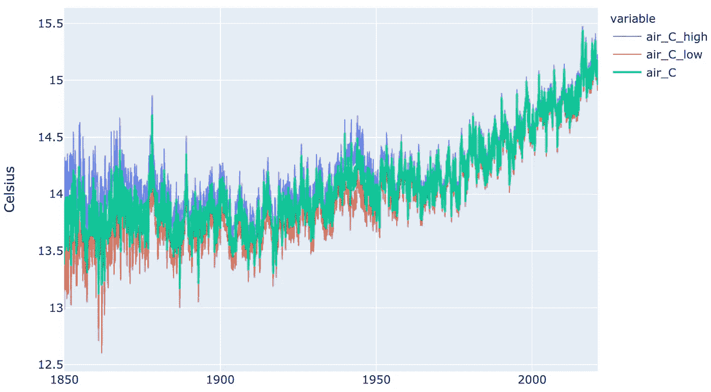
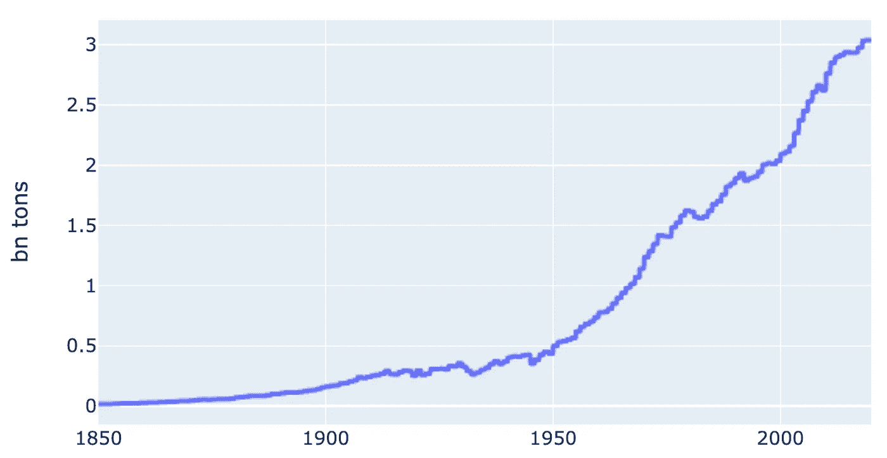
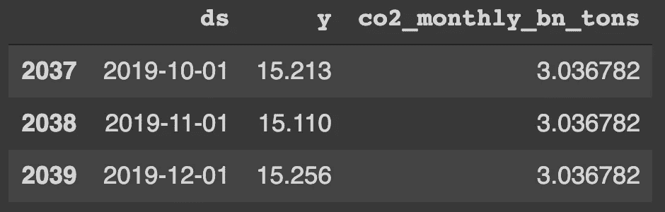
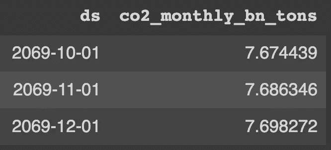
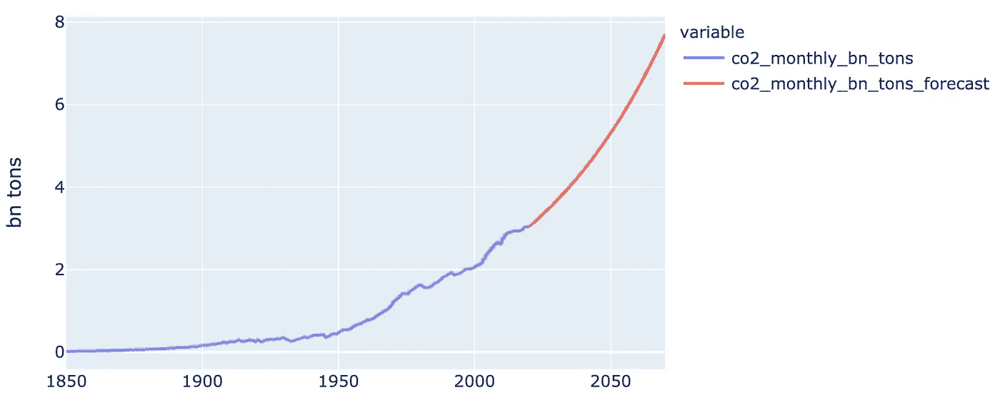
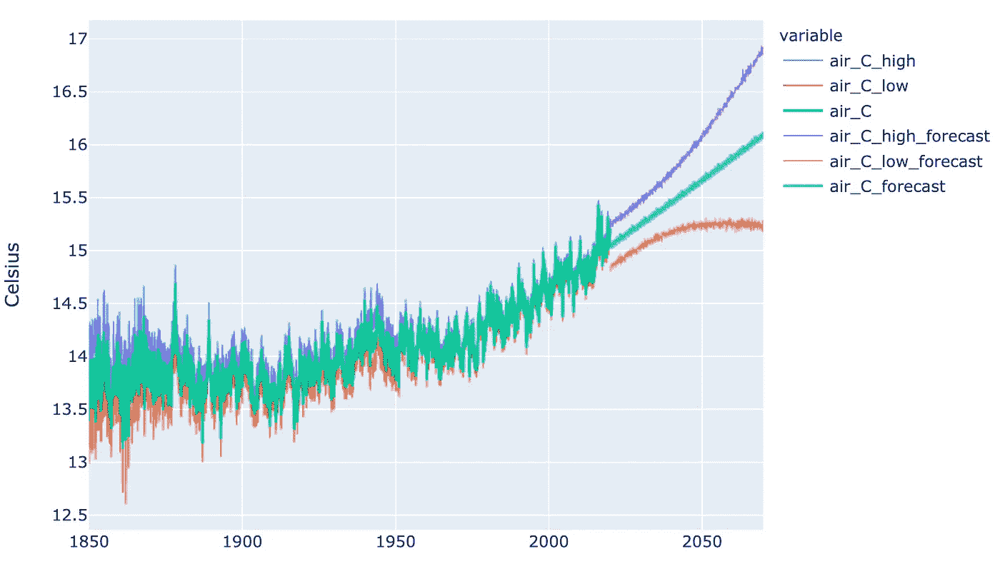
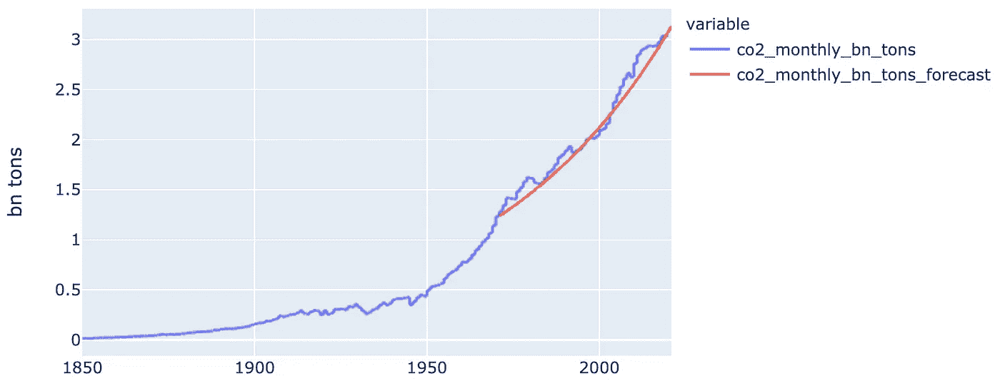

# 使用 Prophet 和 CO2 的全球温度预报

> 原文：<https://medium.com/analytics-vidhya/global-temperature-forecast-using-prophet-and-co2-811f8601e3df?source=collection_archive---------9----------------------->

在本文中，我将利用我之前讨论过的全球[气温数据集](https://adamnovotny.com/blog/berkeley-earth-global-temperature-data2.html)，使用[脸书预言家](https://facebook.github.io/prophet/)对未来 50 年的气温进行预测。注意:温度数据集仅作为学习如何使用 Prophet 进行预测的工具。总的来说，气候和其他复杂的科学不能用一个简单的工具如 ash Prophet 来解决。

所有代码都可以在这个[要旨](https://gist.github.com/adamnovotnycom/8752aa0732576eac32de4e0b9fbda601)中找到。

## 数据

回顾一下，温度数据集涵盖了自 1850 年以来的月度数据，包括 95%的置信区间(高置信区间—蓝色，低置信区间—红色):



此外，我将使用来自 ourworldindata.org 的二氧化碳排放数据:



## 预报

我在这里只强调 Prophet API 是如何工作的(特别是当我们想要包括一个额外的回归变量，如 CO2 时)。首先，我们需要格式化训练数据集，使得标签列是 *y* 并且日期是 *ds*



接下来，我们训练 Prophet 模型并添加自定义回归变量(CO2):

```
m = Prophet() m.add_regressor("co2_monthly_bn_tons", prior_scale=0.5, mode="multiplicative", standardize=True) m.fit(prophet_train_set)
```

然后，我们需要创建一个预测数据集，其中包括要预测的日期和自定义回归变量的假设。在温度预测数据集中，我创建了未来 50 年的时间戳。预测数据集的最后 3 行(" prophet_forecast_set "):



为了创建上面的数据集，我必须对二氧化碳的增长做一个假设。我假设未来 50 年的月增长率将继续保持 2000 年至 2020 年间的水平:



实际上，温度预测的价值来自数据科学家的领域背景知识。在本例中，为了使温度预测有价值，我们必须能够以较高的可信度预测 CO2 排放量(以及其他回归量)。

使用 Prophet 执行实际预测非常简单:

```
forecast_prophet = m.predict(prophet_forecast_set) forecast_prophet.head(5)
```

Prophet 为其预测生成有价值的置信区间。这些置信区间比点位预测本身更有价值。在下面的图表中，2070 年的预测点是 16.1 摄氏度。然而，预测范围从接近 17 摄氏度到 15.2 摄氏度



## 确认

许多做预测的人“方便地”跳过的步骤是验证。换句话说，如果我们过去以同样的方式处理这个问题，我们今天会变得多么不正确。

让我们假设我们站在 1970 年，我们应用与上述完全相同的方法来预测未来 50 年(因此我们预测的是 1970-2020)。与我们已经经历的现实相比，预测图会是什么样子？首先，我们假设的二氧化碳假设与现实相当吻合:



然而，我们的温度点预测会低估现实。我们的预测仍然在置信区间内，因为它几乎完全符合上限。然而，预测的行为似乎没有反映出我们历史上经历的上升趋势:


这是为什么置信区间比点估计更重要的一个例子。此外，它反映了在预测和执行历史验证时保持理智诚实是多么重要。这里的要点可能是，我们缺少额外的回归变量，无法正确预测温度物理过程。

*最初发表于*[*【https://adamnovotny.com】*](https://adamnovotny.com/blog/berkeley-global-temperature-forecast-prophet.html)*。*