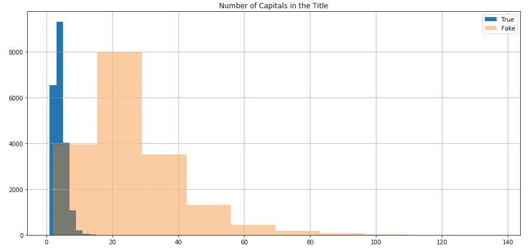

# 手套嵌入检测假新闻

> 原文：<https://medium.com/analytics-vidhya/glove-embeddings-to-detect-fake-news-424accf3fa4c?source=collection_archive---------11----------------------->

在这个项目中，我建立了一个模型来区分新闻的真假。作为一个假设的商业场景，我正在为一个社交媒体平台做咨询任务，该平台报告了大量假新闻。

雅各布·欧文斯在 [Unsplash](https://unsplash.com?utm_source=medium&utm_medium=referral) 上的照片

假新闻的增加引起了该公司的极大关注，因为它可能导致用户参与度下降，更不用说假新闻针对的任何实体的潜在声誉损害，该平台可能被视为提供便利。

通过使用机器学习来检测假新闻，发布在平台上的新故事可以被系统地检查，如果模型预测它们是假的，它们最初会被拒绝。

# 数据

该项目的数据来自 [Kaggle](https://www.kaggle.com/clmentbisaillon/fake-and-real-news-dataset) 。真实的新闻故事来自 Reuters.com(一个新闻网站)。假新闻故事是从不同来源收集的，但不幸的是没有提供来源。至于假新闻文章，它们是从不同的来源收集来的。它们被 Politifact(美国的一个事实核查组织)和维基百科标记为假的。

# EDA 结果

从最初的数据探索中，我们看到标题中大写字母的数量是区分真假新闻的关键，假新闻的数量明显更高，如下图所示。

图片:作者自己的

我们可以简单地通过观察大写字母的数量来建立一个高度精确的模型。然而，这将无法很好地概括，很容易被反击。

# 预处理

我们对数据进行了以下预处理:

*   将标题和新闻文本合并成一个特写
*   已将文本转换为小写
*   删除了停用词和标点符号

对文本进行预处理后，我们做了进一步的探索性分析。我们还研究了 n-gram，特别是 unigrams、bigrams 和 trigrams。下面是排名靠前的二元模型的条形图。

# 系统模型化

我们使用手套嵌入来捕捉单词之间的全局关系。该算法通过建立单词-单词共现矩阵来工作。我们使用了一组来自 twitter 数据的预训练词向量。我们的最终模型表现得非常好，在测试集上达到了 99.5%的准确率。我们评估了该模型，并确认它没有过度拟合训练数据，并且已经达到收敛。

见下图，显示了各个时期的训练集和测试集的准确度和损失值。

图片:作者自己的

我们看到，在 1 个时期后，准确度分数保持大致恒定，表明已经达到收敛。我们还注意到训练集和测试集之间结果的相似性，表明没有过度拟合。

图片:作者自己的

类似于前面的准确性可视化，我们注意到在第一个历元之后损失稳定，并且对于训练集和测试集是相似的。

测试集的混淆矩阵如下所示。我们总体上看到，假阳性(即模型预测的是真实消息，但实际上是假消息)比假阴性高，这是一种耻辱，因为这些更有害。然而，总的来说，错误分类的数量非常低。

# 结论

我们的模型表现很好，在看不见的测试数据上达到了 99.5%的准确率。

我们建议社交媒体平台使用它来检测假新闻。

# 未来的工作

收集更多的数据:从其他来源获取新闻故事，以在更广泛的故事范围内训练模型。考虑来自 Twitter 等社交媒体平台的新闻，因为这些新闻与我们参与工作的社交媒体平台上发布的新闻更相似。

探索迁移学习工具:虽然我们在这里使用了手套嵌入，但我们可以看看其他迁移学习工具和 NLP 的进步，以继续构建和迭代我们的模型。

要了解更多细节并查看带有代码的 Jupyter 笔记本，请访问我的 [GitHub 库](https://github.com/nadinezab/fake-news)。