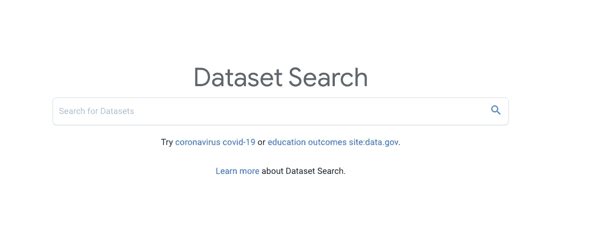
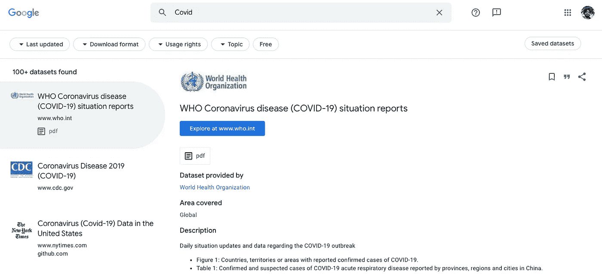

# 谷歌 2500 万免费数据集

> 原文：<https://medium.com/analytics-vidhya/google-25-million-free-datasets-e8ccdd2dcb62?source=collection_archive---------23----------------------->

谷歌最近发布了一款免费工具，用于搜索 2500 万个可公开访问的数据集。

搜索工具包括过滤器，根据许可证(免费或付费)、格式(CSV、图像等)和…