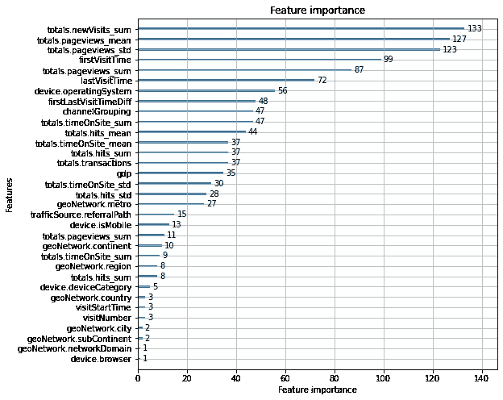

# 谷歌分析客户收入预测

> 原文：<https://medium.com/analytics-vidhya/google-analytics-customer-revenue-prediction-416066fa91cf?source=collection_archive---------5----------------------->

oogle 商品商店(也称为 [GStore](https://googlemerchandisestore.com/) )出售谷歌的赠品，如 t 恤、帽子、钱包等。在线。[谷歌分析](https://analytics.google.com/analytics/web/) (GA)是谷歌提供的一款网络分析工具，用于分析网站流量和用户的各种统计数据，可以与任何网站集成。


作为本案例研究的一部分，任务是预测用户使用 GStore 的 Google Analytics 数据所产生的总收入。

# 概述

1.  *商业问题*
2.  *ML 问题公式化*
3.  *数据来源*
4.  *数据概述*
5.  *探索性数据分析(EDA)*
6.  *数据清理和特征工程*
7.  *验证策略*
8.  *造型*
9.  *部署*
10.  *结论*
11.  *未来工作*
12.  *参考文献*

# 1.商业问题

GStore 为其网站收集了谷歌分析数据，包括用户的设备、位置、日期时间、访问频率、每次访问花费的时间、页面浏览量、产生的收入等。大约 100 万用户访问和大约 2 年的时间范围。使用该数据，如果每个客户产生的总收入是预先已知的，则组织/营销团队知道用户在特定时间范围内对特定产品的行为，并且在广告/营销上的投资可以更加有效和以客户为中心。因此，任务是预测 2 个月时间窗口内访客产生的总收入。

这种分析主要对营销团队有用，以便对促销策略进行适当的投资。以下是该分析的一些其他可能的使用案例:特定于客户/地区的广告、营销预算、不同地区的用户偏好等。

# 2.ML 问题公式化

这个问题可以公式化为一个时间序列预测问题来预测每个客户的总收入。训练数据集包含有关不同用户的信息，我们应该预测这些客户在未来 2 个月的时间窗内产生的总收入。因此，这个问题可以被视为一个双向分类(用户是否会在 2 个月内返回 GStore 回归(如果用户返回，他/她产生的收入)。


均方根误差(RMSE)和决定系数(R)将用作评估性能的指标。


决定系数


均方根误差/除法

# 3.数据来源

这些数据由 RStudio 在 Kaggle 平台上提供，用于竞赛和研究目的。

[](https://www.kaggle.com/c/ga-customer-revenue-prediction/data) [## 谷歌分析客户收入预测

### 预测 GStore 客户的消费金额

www.kaggle.com](https://www.kaggle.com/c/ga-customer-revenue-prediction/data) 

# 4.数据概述

数据集包含两个 CSV 文件:train 和 test。训练数据包含大约 2 年时间范围内的用户访问。列车数据范围为 2016 年 1 月 8 日至 2018 年 4 月 30 日。测试集从 2018 年 1 月 5 日到 2018 年 10 月 15 日，这是 162 天的窗口。Kaggle 将对 2018 年 1 月 12 日至 2019 年 1 月 31 日(62 天)范围内的车型进行评分。因此，实际预测窗口和测试窗口之间有 46 天的差距。以下是数据集中给出的一些主要特征。

1.  用户设备相关功能:操作系统、浏览器、类别(台式机、平板电脑、移动设备)
2.  地理特征:国家，大陆，州，城市，纬度，经度，地区，次大陆
3.  网络流量特征:来源、媒介、关键词
4.  访问日期
5.  其他统计数据，如页面浏览量，点击率，访问量，在 GStore 网站上花费的时间等。

我们应该预测所有客户产生的总收入的自然对数。

# 5.探索性数据分析

这里是详细的 EDA 的关键，这样做是为了理解给定的数据。


目标分布

上图将目标分布显示为 PDF 曲线。大部分收益目标集中在~ 0 ~ 8 之间(数字为对数刻度)。

以下是各种设备相关功能的分布。


设备功能

这是按国家划分的地理收入。收入最高的国家是美国。


每个国家产生的收入

下图显示了整个培训期间产生的收入。


每日收入

下图显示了每个页面浏览量产生的收入。大量的页面浏览量产生大量的收入。22 次页面浏览量创造了约 5 万美元的收入。这意味着，用户在花钱之前会多次浏览同一个产品页面。这是一个预期的行为，也是我们模型的一个有希望的特性。


每页收入视图

# 6.数据清理和特征工程

这是机器学习最重要的部分。在清理数据之后，需要从给定的数据中仔细地提取特征/进行工程设计，以使任何模型表现良好。

在给定的数据集中，有许多没有用的单值特征，因此我放弃了这些特征。我还删除了丢失值超过 90%的特性。删除这些要素后，有几个要素有少量缺失值。我用中值(如果特征是连续的)或众数(分类特征)来填充。这里我使用了中位数来克服异常值问题。

在这个案例研究中，我提取了许多不同的特征(通过自己和参考 Kaggle 讨论线程和其他博客)。在这里，我将解释在我的模型中提取并具有显著特征重要性的主要特征。

1.  页面浏览量和页面点击率及其聚合特征，如每个用户的总和、平均值和标准差(STD)。
2.  用户的商店访问时间相关特征，如用户的首次/最后一次访问时间，它们之间的差异。第一次/最后一次就诊时间和当前就诊时间之间的差异。
3.  在现场花费的时间及其总和，如总和、平均值和标准差。
4.  用户访问 GStore 的国家的 GDP。
5.  引荐路径和关键词中是否有一些类似“Google”、“Youtube”的特定词语。
6.  与日期时间相关的特征，如月、日、周、季度、年、周末、星期等。

除了上面列出的特征之外，默认特征也是有希望的，并且对预测有贡献。

作为数据准备的一部分，我使用标签编码对分类值进行了编码，因为一些要素具有大量的类别，使用一种热编码并不可取，尤其是在处理基于树的模型时，因为它会创建稀疏的要素。

# 7.验证策略

为了评估模型的泛化性能和超参数调整，需要一个可靠的验证策略。由于这个问题是典型的时间序列预测问题，我最初尝试用 Sklearn 的 TimeSeriesSplit 进行交叉验证。它以[正向链接](https://stats.stackexchange.com/a/14109/176418)的方式分割数据，使得验证集始终是相应训练集的未来数据。

但这种分割并不代表数据集的实际分布，在这个特定问题中，模型是在数据集上进行测试的。因此，它在本地验证集上提高了模型性能，但在 Kaggle 上，当使用实际测试集(与模型的训练集明显不同)进行测试时，性能非常低。在仔细阅读了许多 Kaggle 讨论线程和数据描述后，我知道在训练集日期和测试集日期之间有 46 天的差距。因此，我需要在培训时也考虑到这个差距。

基于这个观察，我改变了验证策略。我将整个训练数据集分成 4 个 168 天的非重叠窗口。对于每个窗口，目标是同一客户在 46 天间隔后的 62 天未来窗口中产生的总收入。


1 个培训窗口的表示

在将数据分割成这样的分割后，3 个窗口用于模型训练，1 个窗口用于验证和超参数调整。这种队形显著地改进了模型，并且在 Kaggle 测试集上也取得了很好的成绩。

# 8.建模

如前所述，我用了 3 个 168 天的窗口来训练模型，用了 1 个窗口来验证。在特征提取之后，训练数据集包含 13，31，148 个数据点，验证数据包含 4，71，114 个数据点，具有 67 个特征。

在训练了基线模型(均值和中值)之后，我训练了 LGBM 和 TabNet 模型。在这个问题中，因为几乎所有的访问者都没有产生任何收入(总收入为 0)，所以平均值和中值基线非常强劲，很难超越。使用 Optuna 对 LGBM 模型进行超参数调整后，其性能优于最佳基线。TabNet 的结果与基线模型相似。

以下是我用来获得最佳性能的最佳超参数和 LGBM 模型配置。

## 分类模型

```
clf_params = {
    "objective": "binary",
    "max_bin": 256,
    "learning_rate": 0.01,
    "num_leaves": 31,
    "bagging_fraction": 0.9,
    "feature_fraction": 0.8,
    "feature_fraction_seed": 28,
    "bagging_seed": 28,
    "min_child_samples": 1,
    "bagging_freq": 1,
    "metric": "binary_logloss"
}clf_model = lgb.train(
    params=clf_params,
    train_set=train_data,
    num_boost_round=200,
    valid_sets=[val_data],
    early_stopping_rounds=200,
    verbose_eval=200
)
```

## 回归模型

```
reg_params = {
    "objective": "binary",
    "max_bin": 256,
    "learning_rate": 0.01,
    "num_leaves": 9,
    "bagging_fraction": 0.9,
    "feature_fraction": 0.8,
    "feature_fraction_seed": 28,
    "bagging_seed": 28,
    "min_child_samples": 1,
    "bagging_freq": 1,
    "metric": "rmse"
}reg_model = lgb.train(
    params=reg_params,
    train_set=train_data,
    num_boost_round=200,
    valid_sets=[val_data],
    early_stopping_rounds=200,
    verbose_eval=200
)
```

我将两个模型的预测汇总如下:

```
will_return_preds = clf_model.predict(...)
revenue_preds = reg_model.predict(...)
revenue = will_return_preds * revenue_preds
```

结合这两个模型得到的验证 RMSE 为 0.6042，R 系数为 0.12。在 Kaggle 上，它获得了 0.8844 的 RMSE。


Kaggle 分数

在 1084 名竞争者中排名第 19 位(前 2%)。。


Kaggle 排行榜

我还训练了 TabNet(基于深度学习的表格数据集模型)。以下是用于训练回归和分类模型的代码片段。

```
from pytorch_tabnet.tab_model import TabNetClassifier, TabNetRegressor# Classifier
clf_tabnet = TabNetClassifier()
clf_tabnet.fit(
    x_train.values,
    y_train.values,
    eval_set=[(x_val.values, y_val.values)],
    max_epochs=3
)# Regressor
reg_tabnet = TabNetRegressor()reg_tabnet.fit(
    x_train.values, y_train.values.reshape(-1, 1),
    eval_set=[(x_val.values, y_val.values.reshape(-1, 1))],
    eval_metric=['rmse'],
    max_epochs=15
)
```

具有默认超参数的 TabNet 在验证数据集上实现了 0.6343 RMSE。在 Kaggle 上，它得到了 0.8866，比强基线略好。

以下是分类和回归 LGBM 模型的特征重要性图。



回归特征重要性


分类特征重要性

以下是我的模型的汇总结果:


模型分数

# 9.部署

我使用 Flask(用于后端 API)和 Jinja2(用于模板)来部署我的模型。以下是一个简短视频的链接，展示了预测的演示:

部署

# 10.结论

完成这个案例研究后，我了解了验证策略的重要性以及它如何影响模型的泛化性能。

在时间序列预测问题中，如果适当地调整超参数，像 LGBM 这样的三个基本模型工作得非常好。还有基于深度学习的模型，如 TabNets，它在没有超参数调整的情况下提供了与 LGBM 相当的性能。

# 11.未来的工作

如前所述，我对这个数据集尝试了 TabNets，但是没有执行超参数调优。因此，我计划调整 TabNet 的超参数，并将它的性能与 LGBM 模型进行比较。除此之外，目前，我保持 LGMB 模型的几个超参数不变(如学习率)，并从调整中排除它们，以减少搜索空间。如果我获得了足够的处理能力，我还计划将它们全部包含进来，并运行更长时间的超参数搜索，以检查性能是否进一步提高。

# 12.参考

 [## BigQuery 导出架构

### 此功能不受服务级别协议(SLA)的控制。本文解释了…的格式和模式

support.google.com](https://support.google.com/analytics/answer/3437719?hl=en) [](https://www.kaggle.com/c/ga-customer-revenue-prediction/discussion/82746) [## 谷歌分析客户收入预测

### 预测 GStore 客户的消费金额

www.kaggle.com](https://www.kaggle.com/c/ga-customer-revenue-prediction/discussion/82746) [](https://www.kaggle.com/c/ga-customer-revenue-prediction/discussion/82614) [## 谷歌分析客户收入预测

### 预测 GStore 客户的消费金额

www.kaggle.com](https://www.kaggle.com/c/ga-customer-revenue-prediction/discussion/82614) [](https://github.com/optuna/optuna/blob/master/examples/lightgbm_simple.py) [## optuna/optuna

### 超参数优化框架。在 GitHub 上创建一个帐户，为 optuna/optuna 的发展做出贡献。

github.com](https://github.com/optuna/optuna/blob/master/examples/lightgbm_simple.py) [](https://github.com/dreamquark-ai/tabnet) [## dreamquark-ai/tabnet

### 这是 Tabnet 的 pyTorch 实现(Arik，S. O .，& Pfister，T. (2019)。TabNet:专注的可解释表格…

github.com](https://github.com/dreamquark-ai/tabnet)  [## TabNet:专注的可解释表格学习

### 我们提出了一种新的高性能和可解释的规范深度表格数据学习架构 TabNet。TabNet…

arxiv.org](https://arxiv.org/abs/1908.07442)  [## 欢迎阅读 LightGBM 的文档！-light GBM 3.1.1.99 文档

### LightGBM 是一个梯度推进框架，使用基于树的学习算法。它被设计成分布式的…

lightgbm.readthedocs.io](https://lightgbm.readthedocs.io/en/latest/) 

如果你喜欢这篇文章，请为这个故事鼓掌，并在 LinkedIn 上与我联系:[https://www.linkedin.com/in/kaushal-shah-466587110/](https://www.linkedin.com/in/kaushal-shah-466587110/)