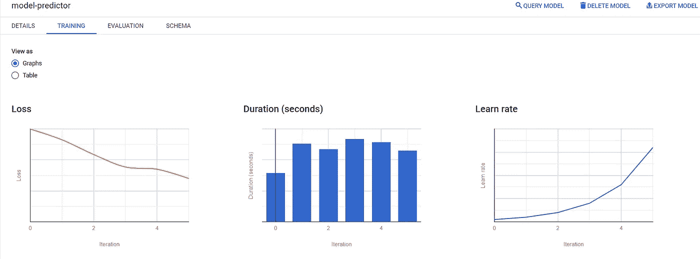

# 新冠肺炎数据集上的 Google BigQuery 机器学习

> 原文：<https://medium.com/analytics-vidhya/google-bigquery-machine-learning-bqml-on-covid-19-data-set-3685f8887275?source=collection_archive---------15----------------------->

编写 ML 算法是一项单调乏味的工作，需要你了解很多东西，包括 Python、R、Ruby 等强大的编程能力。但是，如果我们可以使用每个人都喜欢的简单易用的 SQL 语句来实现复杂的 ML 算法，那会怎么样呢？一些新时代的云数据仓库应用程序正在提供 SQL 模式 ML。毫无疑问，Bigquery 在这个列表中名列前茅。

BigQuery 机器学习(BQML)使用户能够使用 SQL 查询在 BigQuery 中创建和执行机器学习模型。BQML 的好处是

1.  用简单的 SQL 语句训练和部署 ML 模型
2.  不需要从 Bigquery 移动数据
3.  自动化 ML 任务

BigQuery 在回归、分类、聚类、推荐/个性化、时间序列和深度学习方面提供了 ML 模型

*线性回归
逻辑回归
多类逻辑回归
K 均值聚类
矩阵分解
时间序列
提升树(XGBoost)
深度神经网络
Auto ML
TensorFlow 模型*

# **分析新冠肺炎数据集**

从 ka ggle([*https://www . ka ggle . com/arashnic/covid 19-case-supervision-public-use-dataset*](https://www.kaggle.com/arashnic/covid19-case-surveillance-public-use-dataset))获取了 10 GB 大小的新冠肺炎数据集，我们正试图根据年龄、种族和民族、医院条件找出死亡率。

让我们先看一下数据集

新冠肺炎数据集峰值

根据上述数据，目的是预测性别、种族、年龄、医院状况、ICU 状况和医疗条件如何影响死亡率(death_yn)

**特征集**:【性别、年龄、年龄组、种族和伦理、当前状态、医院、重症监护室、医疗条件】

**标签**:死亡 _yn

**模型**:逻辑回归

# 步伐

1.  将数据加载到 Bigquery
2.  设置培训数据
3.  创建模型
4.  评估模型
5.  预测模型

加载数据:第一步是将数据集摄取到 Google Cloud 中。由于是 10 GB 的文件，所以无法通过 UI 将文件直接上传到 Bigquery。另一种方法是将文件上传到 Google 云存储中，然后在云存储上的 Bigquery 中创建外部表，或者将其从 GCS 加载到 Bigquery 中作为原生表

设置训练/测试数据:一旦数据以表的形式进入 Bigquery，我们就可以使用 BQML 了。为了避免每次 SQL 扫描的额外数据成本，让我们在表的顶部创建一个具有有限列(如功能、标签)的视图，并将数据集分为训练、评估和预测(测试)数据。您可以看到，80%的数据用于培训，10%用于评估和预测。你可以用更好的方法来分割数据。但这只是给你如何分割它的一般概念。视图创建不需要任何数据扫描。

创建模型:让我们创建一个模型，我们已经有了特征和标签以及它的分类问题，所以让我们用 BQML 定义逻辑回归模型

BQML 逻辑回归

如您所见，创建 7.5 GB 数据的模型花费了 7 分钟。BQML 在 hood 下生成张量流代码，进行数据预处理和模型训练。您还可以通过在 SQL 中指定附加参数来进行功能工程和超参数调整 BQML。一旦生成了模型，就可以在 Bigquery 数据集中对其进行检查。

理解模型效率的关键指标是准确性和混淆矩阵。这个模型的准确性看起来不错 74%。我确信这可以通过 ML 调优机制得到改善，这是一个不同的主题，也是一个相当大的主题，我现在正在研究这个主题

评估模型:`ML.EVALUATE`函数接受由`SELECT`子查询训练的模型和返回的评估数据。该函数返回关于模型的单行统计信息。该查询使用来自 *covid-data-view* 的数据作为评估数据。`WHERE`子句过滤输入数据，以便子查询只包含`evaluation`数据帧中的行

预测模型:一旦模型被训练和评估，接下来的事情就是评估模型，看它如何看待新数据。ML 模型的整体思想是泛化。

`[ML.PREDICT](https://cloud.google.com/bigquery-ml/docs/reference/standard-sql/bigqueryml-syntax-predict)`函数使用您的模型和 covid-data-view 中的数据来预测结果，这些数据经过过滤后只包含“预测”数据框架中的行。最顶层的`SELECT`语句检索`ML.PREDICT`函数的输出

预言；预测；预告

前两列描述了预测值和每个可能值的概率。模型将最高可能值作为预测值。

希望它给你一些使用简单的 SQL 语句开发 ML 模型的感觉。这么简单不是吗？

目前就这些。