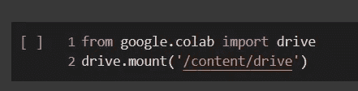

# 谷歌实验室——初学者的演练

> 原文：<https://medium.com/analytics-vidhya/google-colab-beginners-walkthrough-c8b4034a586e?source=collection_archive---------19----------------------->

Google Colab 是一个很棒的 web IDE，可以用于任何类型的编码项目(尤其是涉及更大数据集或需要更高计算能力的项目)，并且是我在创建项目时首选的 IDE。可以把 Google Colab 想象成一个完全在云端运行的 Jupyter 笔记本，并且预装了许多核心库。如果你想知道如何在 Google Colab 中设置自己的笔记本，你来对地方了！在这篇博客中，我将介绍如何建立你自己的 Google Colab，并以讨论利弊结束。

# 如何设置:

1.  导航至[谷歌实验室](https://colab.research.google.com/notebooks/welcome.ipynb#recent=true)
2.  选择**文件**选项卡下的“新建笔记本”


文件>新建笔记本

3a。通过键入并运行以下单元格，将笔记本连接到您的 Google Drive:



通过代码单元安装 Google Drive

如果您选择运行上面的单元格，它会要求您在浏览器中转至一个新的 URL。单击该链接，并选择您想要登录的配置文件。请务必阅读，通读有关 Google Drive 将获得哪些访问权限的信息，并确保您对此满意。如果您选择继续，请单击“允许”按钮并复制代码，切换回笔记本，然后将代码粘贴到此处:


在此输入授权码

3b。或者，你也可以点击“文件”侧边栏下的 Google Drive 图标来安装 Google Drive。这也将提示与上面相同的内容，您只需要确保在每次想要重新连接到运行时时手动执行此操作:


点击 Google Drive 文件夹图标

4.接下来，我们将选择在我们的内核中使用的运行时类型。为了选择一个运行时，点击“运行时”标签->选择“改变运行时类型”->并选择你想为笔记本使用的硬件加速器的类型，一旦你做了选择，点击“保存”。


选择硬件加速器的类型

有关使用哪种类型的硬件加速器的更多信息，实际上取决于项目的类型和您正在处理的数据量。当处理神经网络或更大的数据集时，我选择 GPU 加速器。当处理较小的数据集时，TPU 加速器是一个不错的选择。

如果您想查看哪个硬件加速器被分配到您的笔记本电脑，您可以复制并粘贴以下代码，并在您的笔记本电脑中运行它来找出答案:

```
gpu_info = !nvidia-smi
gpu_info = '\n'.join(gpu_info)if gpu_info.find('failed') >= 0:
  print('Select the Runtime → "Change runtime type" menu to enable a         GPU accelerator, ')
  print('and then re-execute this cell.')else:
  print(gpu_info)
```


选择的硬件加速器类型

就这样，我们都准备好开始编码了！

# 要查找 Google Colab 中预装的库列表，只需输入:

```
!pip freeze
```

它将打印出一份已经安装在 Google Colab 中的所有库的列表。如果您需要安装其他尚未安装的库，只需键入:

```
# Template:
!pip install <library_name># example:
!pip install lime
```

# 使用 Colab 的优点

*   免费使用
*   笔记本保存在 Google Drive 上
*   免费 GPU 加速
*   许多预装的库使它可以立即使用
*   轻松协作


让我们先关注一下协作方面。Google Colab 允许多个用户共享和编辑同一个笔记本，而无需下载或安装任何东西——你只需要访问一个浏览器。假设你在工作中忘记带笔记本电脑(由于某种原因),需要在第二天之前编辑笔记本上的一些内容。只需登录到可以访问笔记本的同一个谷歌帐户，瞧，可以即时访问笔记本，无需安装任何库。

要共享 Google Colab 笔记本，请点击页面右上角附近的“共享”按钮。


点击“分享”按钮

# 使用 Colab 的缺点

*   如果空闲时间过长，运行时将会断开连接
*   每次实例化新会话时，需要安装所有未预安装的库
*   如果使用免费版本的 Google Colab，内存限制为 12GB


与 Jupyter 笔记本和其他 ide 不同，如果 Google Colab 空闲时间太长(免费版大约 30 分钟，Colab Pro 大约 90 分钟)，运行时将会断开连接，您将会丢失所有本地变量。假设您创建了一个模型并对其进行了训练，但训练可能需要几个小时，您需要在笔记本运行时手动与之交互。对此有一些变通办法，如果你想更深入地了解这些变通办法，这里有一个讨论这个主题的 [stackoverflow 链接](https://stackoverflow.com/questions/57113226/how-to-prevent-google-colab-from-disconnecting)。

感谢您的阅读，如果您有任何问题或意见，欢迎在下面发表！