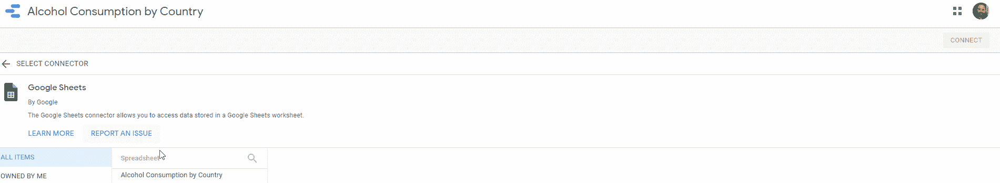

# 谷歌数据工作室——实用指南

> 原文：<https://medium.com/analytics-vidhya/google-data-studio-practical-guide-70ddf01d4842?source=collection_archive---------24----------------------->

> “人类大脑处理图像的速度比处理文本的速度快 6 万倍，而传输到大脑的 90%的信息都是视觉信息。”

想象一下，我们有一个巨大的电子表格，有 138 列，2546 行，我们的老板需要清楚数据背后的信息是什么。不容易给他看，对吧？

在这个任务中，排序、创建图表、过滤和绘制单元格会有所帮助，但我认为当显示大量标签、线条、文本和数字时，我们不会成功。
如果你需要回答一个简单的问题，那么这个月的销售额是多少？那么一个简单的公式就可以回答这个问题。但是，如果分析数据的人有更多的问题呢？例如:

*   最畅销的产品有哪些？
*   这些产品的平均价值是多少？
*   X 产品在哪个地区卖得最好？

我在本指南开头的第一个短语中说过，我们的大脑处理图像的速度比处理文本快得多。因此，最好和最明智的选择是使用图形工具来更精确地分析数据并回答问题。

为了简化这项任务，谷歌在 2018 年发布了谷歌数据工作室，它已经是营销平台数据分析工具的一部分。此时，将有可能创建外部数据的可视化，而不仅仅是与 Google 家族相关的数据。

该工具基本上由两个模块组成:

*   数据源
*   报告

还有另一个工具叫做 Explorator，但是对我们的向导来说，它不是必需的。

## 让我们把手弄脏吧

我们将在数据集中开发一些可视化工具来展示如何使用该工具。
根据我们的指南，我们将使用来自 Kaggle 的公共数据集，其中包含每个国家的饮酒数据。

这些数据被导入到谷歌的电子表格中，以方便我们的工作。让它也成为你的数据集。

**提问**

每一个好的数据可视化都需要回答一个或多个问题，然后我们会提出一些问题来指导我们，并帮助我们为将要构建的内容指明方向。
这些是问题:

*   世界上哪些国家消费的饮料更多？
*   各大洲哪个消耗更多？
*   哪个洲消费更多？
*   按饮料类型划分，哪个大陆消费更多？
*   关于各国减少酒精消费的世界愿景是什么？

让我们开始构建我们的可视化。

1-设置数据源
第一步是创建数据源。访问 Google Data Studio 后，使用您的 Google 帐户创建一个新的数据源:

2-选择数据源
给它命名:

选择电子表格、工作表并点击“连接”:

3-设置字段
验证表格的每一列类型和组是否正确。如有必要，请纠正:

4-创建报告
点击“创建新报告”:

添加要报告的数据:

5-第一个图形【Data Studio 制作的第一个图形是表格。这将是我们第一次看到:

6-设置表格
让我们在维度(洲)中包含新字段，并添加度量字段，即表格中的数字。最后一步是排除自动填充的“记录计数”字段:

为了完成表格，我们将更改顺序，使用字段“酒精升数”:

更改表格，使其占据整个页面，但在顶部留出一点空间，以便我们在下一步中输入一些信息:

7-添加汇总者
为了了解每个字段的总和，我们在页面顶部添加汇总者。
点击【插入】，【记分卡】:

将该字段更改为“酒精升数”:

对“啤酒”、“葡萄酒”和“烈酒”字段重复该步骤。
页面的顶部应该是这样的:

我们现在有了国家、饮料消费和每种饮料的总数的表格，除了总的总数之外。

8-添加控件
现在我们可以轻松选择信息。
点击“添加控件”，选择“下拉列表”。我们将看到 Data Studio 已经选择了字段“Country ”,这是我们希望添加第一个过滤器的字段。

对“洲”字段执行相同的操作。

让我们检查一下我们工作的最终结果。
点击“查看”与表格进行交互。

看一下数据是按照控制显示的。

10-插入新页面
回答其他问题让我们创建一个新页面:

点击“编辑”返回编辑模式，点击“添加新页面”:

让我们来回答这个问题:世界上哪个大洲消费更多的酒？
然后添加一个条形图:

设置图形参数:

12-改变风格
我们回答了第一个问题，但我们还可以提供更多信息，例如，了解这次消费代表的每种饮料的份数。因此，将图形的样式更改为“堆积条形图”并调整图形属性:

以下是最终结果:

13- Maps
让我们添加最后一张图表，让我们从全球角度来看酒精消费。重复最后一步，选择“地理图”:

设置参数:

15-显示最终结果
点击“可视化”并查看结果。第一页有完整的数据，第二页有帮助我们讲述数据故事的图表。

这只是一个关于 Google Data Studio 基本特性的快速演示。尽管是一个免费工具，但它提供了很好的资源，这使他成为 Excel 或 Google 电子表格等基本工具和 Tableau 和 Power BI 等强大的付费工具之间的一个很好的选择。
现在，您已经可以进行基本的可视化，也可以开始探索其他功能来帮助您的日常工作，让您更快地检查和可视化数据，并帮助您做出决策。

我们去工作吧！

下面是本教程中使用的电子表格和 Google Data Studio 中的可视化的链接。

[谷歌电子表格](https://datastudio.google.com/reporting/595d0e27-ef63-4d44-8d97-6cdf96eea1ad)

[谷歌数据工作室](https://docs.google.com/spreadsheets/d/11FXwTZTlJ9iwCtInX_pVeWVlne8KpXud4PodZ8dW_wc/edit?usp=sharing)