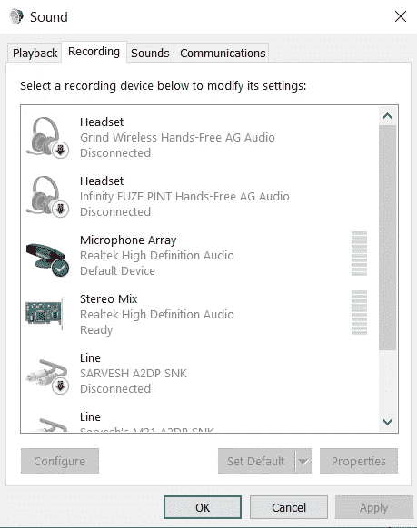

# 谷歌会议自我出席机器人 91 萨维斯瓦迪

> 原文：<https://medium.com/analytics-vidhya/google-meet-self-attendance-bot-sarvesh-wadi-a62978bb06f6?source=collection_archive---------8----------------------->


由于这种不规律的睡眠周期和拖延症，我最近错过了早上的在线讲座。所以我想出了这个创新的想法，开发一个 python 程序，它会自动为我打开会议链接，并使用我的帐户凭证加入讲座。

此外，我为这个项目添加了一个多功能的特性，使这个项目在处理 Google Meetings 网页时完全自动。我开发了一个程序，只要老师叫你的名字，它就会通过笔记本电脑的麦克风回答“在场”。Pygame，selenium 和 chrome 驱动程序在这个项目中使用。在本教程中，我将一步一步地引导您创建自己的 Google Meet 考勤机器人。

步骤 1:安装所需的软件

在命令提示符下运行以下命令来安装 selenium 和 pygame。

```
pip install seleniumpip install pygame==2.0.0.dev8
```

Selenium 支持市场上所有主流浏览器，如 Chromium、Firefox、Internet Explorer、Opera 和 Safari。WebDriver 的目标是尽可能模拟真实用户与浏览器的交互。在不同的浏览器中，这在不同的层次上都是可能的。Pygame 是用来播放和处理 mp3 文件的。

在这个项目中，我使用 Chrome Driver 作为 WebDriver 来自动化将要在 Chrome 上执行的任务。

下载与您的 chrome 版本匹配的最新 chrome 驱动程序。

[https://chromedriver.chromium.org/downloads](https://chromedriver.chromium.org/downloads)

如果你使用 firefox、Microsoft edge 或任何其他应用程序，你可以相应地为你的应用程序下载驱动程序

步骤 2:为 web 自动化编写 Python 代码。

**注意:片段中提供的缩进是不恰当的。可以参考文末 GitHub 回购的链接。**

```
import webbrowser
import time
import math
# importing webdriver from selenium 
from selenium import webdriver
from selenium.webdriver.common.keys import Keys
from selenium.webdriver.chrome.options import Options
from selenium.webdriver.common.by import By
from selenium.webdriver.support.ui import WebDriverWait
from selenium.webdriver.support import expected_conditions as EC
from selenium.common.exceptions import NoSuchElementException
from selenium.common.exceptions import StaleElementReferenceExceptionfrom pygame._sdl2 import get_num_audio_devices, get_audio_device_name #Get playback device names
from pygame import mixer #Playing sound
```

将所有需要的库导入 python 代码。

```
url = ‘[https://accounts.google.com/signin/v2/identifier?ltmpl=meet&continue=https%3A%2F%2Fmeet.google.com%3Fhs%3D193&&flowName=GlifWebSignIn&flowEntry=ServiceLogin'](https://accounts.google.com/signin/v2/identifier?ltmpl=meet&continue=https%3A%2F%2Fmeet.google.com%3Fhs%3D193&&flowName=GlifWebSignIn&flowEntry=ServiceLogin%27)# Here Chrome will be usedchrome_options = Options()#chrome_options.add_argument(‘use-fake-device-for-media-stream’)chrome_options.add_argument(‘use-fake-ui-for-media-stream’)chrome_options.add_argument(‘ — disable-notifications’)driver=webdriver.Chrome(“D://openlink_meet/chromedriver.exe”,chrome_options=chrome_options)
```

片段开头的 URL 是 google meet 登录页面的 URL。这个 URL 和提供的 chrome 选项一起提供给 chromedriver。

提供给 chrome 驱动程序的 3 个 chrome 选项确保了 chrome 上允许一些特定的权限。

最后，在代码片段的末尾添加您安装到 webdriver 的 chromedriver 的路径。Chrome(“此处”)

```
# Opening the website 
driver.get(url) 

# getting the button by class name 
SignIn = driver.find_element_by_id("identifierId") # clicking on the button SignIn.send_keys("your email here")
SignIn.send_keys(Keys.ENTER) 
driver.implicitly_wait(10) EnterPass =driver.find_element_by_xpath("//*[@id='password']/div[1]/div/div[1]/input")
EnterPass.send_keys("your password here")
EnterPass.send_keys(Keys.ENTER)EnterCode=driver.find_element_by_xpath("//*[@id='i3']")EnterCode.send_keys("Enter the meet code here")JoinLink=driver.find_element_by_xpath("/html/body/cwiz/div/div[2]/div/div[1]/div[3]/div/div[2]/div[2]/button/span") 
JoinLink.click()
```

driver.get 函数在一个新的 chrome 标签中加载参数中提供的 URL。登录用于在文本字段中输入您的电子邮件。在 SignIn.send_keys 函数的参数中输入您的电子邮件 id。同样，在 EnterPass.send_keys 函数的参数中输入您的密码。再次在 EnterCode.send_keys 函数的参数中输入您的会议代码。

在这里，find_element_by_path 函数接受 web 页面上任何元素的 XPath 作为输入，并为您加载它。implicitly_wait 函数使 web 驱动程序等待(什么也不做)给定的时间来加载网页上的一些元素

提示:要获取网页上任何元素的 XPath，请在 chrome 浏览器上右键单击该元素，然后单击 inspect->右键单击 inspect 部分中该元素的高亮定义->copy->copy full XPath。

```
ignored_exceptions=(NoSuchElementException,StaleElementReferenceException)Mute = driver.find_element_by_xpath(“//*[[@id](http://twitter.com/id)=’yDmH0d’]/c-wiz/div/div/div[9]/div[3]/div/div/div[4]/div/div/div[1]/div[1]/div/div[4]/div[1]/div/div/div”)
Mute.click()CamOff = driver.find_element_by_xpath(“/html/body/div/c-wiz/div/div/div[9]/div[3]/div/div/div[4]/div/div/div[1]/div[1]/div/div[4]/div[2]/div/div”)
CamOff.click()JoinNow=WebDriverWait(driver,10,ignored_exceptions=ignored_exceptions).until(EC.element_to_be_clickable((By.XPATH, “/html/body/div[1]/c-wiz/div/div/div[9]/div[3]/div/div/div[4]/div/div/div[2]/div/div[2]/div/div[1]/div[1]/span/span”)))
JoinNow.click()
```

忽略的异常是代码在运行时发生的一组异常。同样，静音按钮和相机关闭按钮是通过 XPath 找到的，然后使用。单击()函数。代码片段的最后一行定义了加入会议的 join now 按钮。由于加载该按钮需要时间，因此提供了一个带有给定异常的显式驱动程序等待。它会一直等到元素可点击或者时间(这里是 10 秒)结束。

```
TurnOnCaptions = driver.find_element_by_xpath(“/html/body/div[1]/c-wiz/div[1]/div/div[9]/div[3]/div[10]/div[2]/div/div[3]/div/span/button/span[2]”)
TurnOnCaptions.click()students=WebDriverWait(driver,20,ignored_exceptions=ignored_exceptions).until(EC.element_to_be_clickable((By.XPATH, “/html/body/div[1]/c-wiz/div[1]/div/div[9]/div[3]/div[10]/div[3]/div[2]/div/div/div[2]/div/div”)))text = students.text
Total_numStudents = int(text)
print(Total_numStudents)Caption_tray=WebDriverWait(driver,100,ignored_exceptions=ignored_exceptions).until(EC.presence_of_element_located((By.XPATH, “/html/body/div[1]/c-wiz/div[1]/div/div[9]/div[3]/div[7]/div”)))Captions=WebDriverWait(driver,100,ignored_exceptions=ignored_exceptions).until(EC.presence_of_element_located((By.XPATH,”/html/body/div[1]/cwiz/div[1]/div/div[9]/div[3]/div[7]/div/div[2]/div/span/span”)))count = 0
```

此外，我们需要打开字幕来阅读和分析它们。TurnOnCaptions 对我们来说也是如此。students 变量跟踪出席会议的人数，如果很多人离开会议，该变量随后用于结束会议。

Caption_tray 是存放我们需要转录的所有标题的托盘。Caption_tray 和 Caption 也是通过它们的 XPath 定位的。

```
staleElement = Truewhile staleElement :try :Caption_tray = driver.find_element_by_xpath(“/html/body/div[1]/c-wiz/div[1]/div/div[9]/div[3]/div[7]/div”)Captions = driver.find_element_by_xpath(“/html/body/div[1]/c-wiz/div[1]/div/div[9]/div[3]/div[7]/div/div[2]/div”)if Captions.is_displayed() :Caption_text= Captions.text
Caption_text = Caption_text.lower()
print(Caption_text)except(StaleElementReferenceException):
staleElement = Trueexcept(NoSuchElementException) :
staleElement = True
```

这个代码片段不断地将标题托盘中的文本提取到 python 终端。如果你的名字，卷号等显示在这个文本中，你可以分析它，并进一步播放录音一旦上述事件发生。

```
changed_numstudents = int(students.text)
print(changed_numstudents)if changed_numstudents > Total_numStudents :
Total_numStudents = changed_numstudentselif changed_numstudents < Total_numStudents :if changed_numstudents <=math.floor(0.2*Total_numStudents):
EndCall=driver.find_element_by_xpath(“/html/body/div[1]/c-wiz/div[1]/div/div[9]/div[3]/div[10]/div[2]/div/div[7]/span/button/i”)
EndCall.click()
```

这是一种算法，如果很多人离开会场，它会自动为您结束通话。EndCall 变量定义网页上的结束呼叫按钮。

```
if count ==0 :words = (“roll number 22”, “Jondoe” , “Johndoe” , “Jon Doe” ,”June Doe” , “Jon” )if any(name in Caption_text for name in words): UnMute = driver.find_element_by_xpath(“/html/body/div[1]/c-wiz/div[1]/div/div[9]/div[3]/div[10]/div[2]/div/div[1]/div/div/span/button/div[2]”)
UnMute.click()
mixer.init(devicename=’CABLE Input (VB-Audio Virtual Cable)’) mixer.music.load(“Enter path of your voice recording here”) mixer.music.play()
time.sleep(4)
mixer.music.stop()
UnMute.click()
count+=1
```

现在我们检查你的名字或编号是否显示在标题中。在开头的单词元组中添加您的姓名以及文本到语音转换拼写错误的不同组合。如果为真，取消静音按钮被点击，音频由 pygame 混音器播放。麦克风又静音了。

在 mixer.music.load("here ")的参数中输入您录制的语音 mp3 文件的路径。

步骤 3:安装和设置 VB-Audio 虚拟电缆

[**v B-音频虚拟应用**](https://vb-audio.com/Cable/)

【https://vb-audio.com/Cable 

从上面的链接下载并安装 VB-Audio 虚拟电缆。

VB-CABLE 是一种虚拟音频设备，可作为虚拟音频电缆使用。所有来自电缆输入端的音频都被简单地转发到电缆输出端。它有助于我们向麦克风播放您设备上本地存储的录音文件。

要设置 VB-Audio 虚拟电缆，请正常安装设置并重新启动您的设备。现在你需要选择 VB-Audio 作为你的麦克风设备。在 windows 搜索栏上搜索更改系统声音。点击后会出现如下对话框。



转到录音选项卡，在列表中找到电缆输出，单击并设置默认此设备。

注:VB-audio 虚拟电缆将您电脑的扬声器输出虚拟连接到您的麦克风。因此，在通话时，请记住将默认麦克风更改为您的麦克风设备。

步骤 4:为运行我们的 python 应用程序创建一个批处理文件。

```
python D:\openlink_meet\openlink_meet_CV.py
pause
```

打开记事本，将上面的代码片段输入其中。并将文件另存为。蝙蝠分机。现在，只需单击这个批处理文件，就可以启动 python 程序了。

步骤 5:使用 windows 任务计划程序在特定时间(会议开始时)计划批处理文件。


在 windows 搜索栏中搜索并单击任务计划程序。在右边，您可以看到创建任务选项。提供我们在 actions 选项卡的新选项中创建的批处理文件的路径。在触发器选项卡中定义会议时间。你也可以定义多个触发器！

现在您的会议将在指定时间自动启动，并为您参加整个会议。它会标记您出席，并且在大多数人离开会议时结束会议。

检查我的 GitHub repo:

[](https://github.com/Wadi-Sarvesh/Google-meet-self-attendance-bot) [## GitHub-Wadi-Sarvesh/Google-meet-self-考勤机器人:一个加入 google meet 的考勤机器人…

### 一个根据 google meet 中的日程和标记自动加入 google meet 的出席机器人。…

github.com](https://github.com/Wadi-Sarvesh/Google-meet-self-attendance-bot) 

请喜欢并分享我在 LinkedIn 上的帖子(项目演示)

LinkedIn 链接:

[](https://www.linkedin.com/posts/sarvesh-wadi-546531186_programming-python-coding-activity-6721649520037371904-FhGh) [## LinkedIn 上的 Sarvesh Wadi 编程# python #编码| 135 条评论

### 拖延导致创新。😉我最近错过了早上的在线讲座，因为我不规律的…

www.linkedin.com](https://www.linkedin.com/posts/sarvesh-wadi-546531186_programming-python-coding-activity-6721649520037371904-FhGh) 

谢谢你！