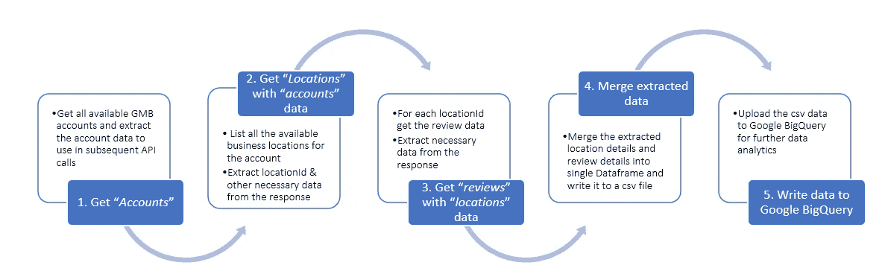
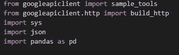
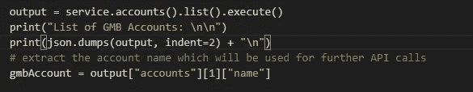
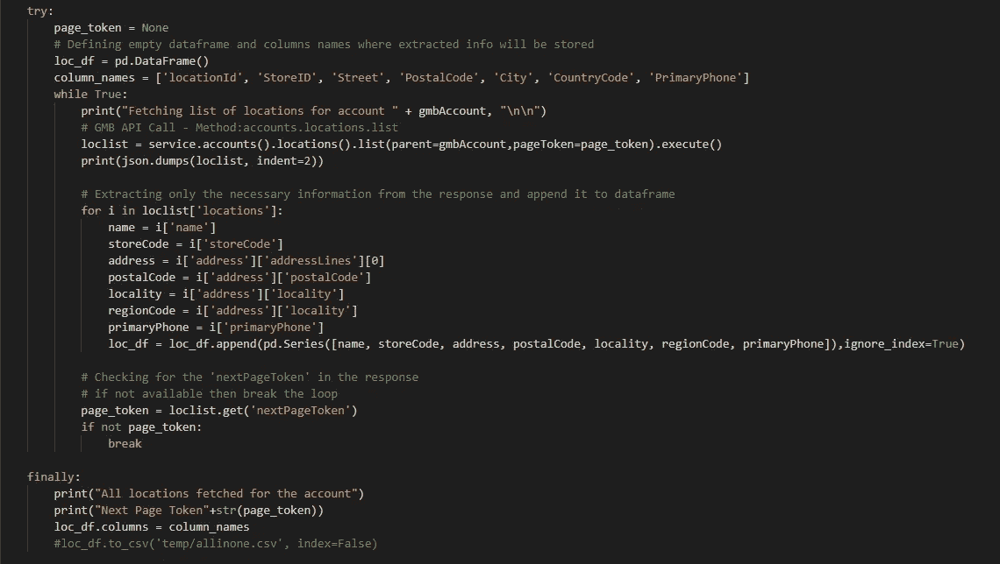
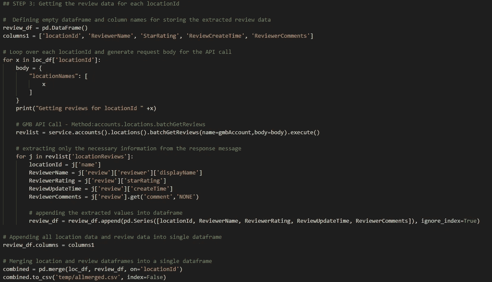
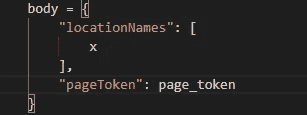

# Google My Business API 应用程序——使用 Python——第 1 部分

> 原文：<https://medium.com/analytics-vidhya/google-my-business-api-application-using-python-part-1-f6be43115645?source=collection_archive---------4----------------------->

## 在这篇博客中，我将谈论使用 Google My Business API 和 Python 脚本分析 Google 评论。

> 对于管理大量 Google My Business 列表的组织来说，处理评论数据至关重要。通过审查数据，我们可以收集定量和定性数据进行分析，并计算净推介值(NPS)。

Google My Business (GMB)API 是一个编程接口，允许开发人员编写应用程序。我们将看到如何使用 API 提取每个商业地点的所有可用评论，并将它们写入 Google BigQuery。

通过 Google My Business API 获取信息

在使用 Google My Business API 之前，您需要注册您的应用程序并获得 OAuth 2.0 凭据。关于如何开始使用 Google My Business API 的详细信息，请完成以下 [*先决条件*](https://developers.google.com/my-business/content/prereqs) :

完成前提条件后，可以 [*启用 Google My Business API*](https://developers.google.com/my-business/content/basic-setup) ， [*请求一个 OAuth 2.0 客户端 ID*](https://developers.google.com/my-business/content/oauth-setup)；然后就可以开始使用你的 API 了。

## **OAuth 2.0 凭证和发现文档**

创建 OAuth 2.0 客户端 ID 后，下载 JSON 并将该文件复制到包含您的 Python 脚本的目录中，并将该文件重命名为***“client _ secrets . JSON”***。

接下来，下载“ [*发现文档*](https://developers.google.com/my-business/samples/#discovery_document) ”并将该文件另存为***“gmb _ Discovery . JSON”***，保存在与您的 Python 脚本和客户端凭证相同的目录中。您使用的发现文档是与 Google API 发现服务结合使用的。

## **客户端库安装**

接下来，我们需要为 Python 安装一些 Google API 客户端库，以便与 Google 的 API 一起工作。

> Google API Python 客户端—**“pip 安装 google-api-python 客户端”**
> 
> OAuth 客户端库—**“pip 安装 OAuth 客户端”**
> 
> Google BigQuery Python 客户端—**“pip 安装 Google-cloud-big query”**

## 附加库

由于我们将处理大量数据，我们需要一个额外的库，它是一个快速、强大、灵活且易于使用的数据分析和操作工具。没错，我说的就是“*熊猫*”。我们将安装 pandas，并使用 Dataframes 进行数据操作。

> **《pip 装熊猫》**

一旦安装了必要的库，我们就可以开始编写 python 脚本来调用 Google My Business API。

## **通过谷歌我的商业 API 获取信息**

Google 已经提供了一些 Google My Business API [*样本*](https://github.com/google/google-my-business-samples) 。这是一个很好的开始。但是仍然缺少一些东西。我们可以复制脚本并进行如下讨论的调整:

我们将需要下面的代码导入功能。

现在，我们将使用 discovery 文档——我们之前下载并保存了该文档，以构建一个服务，我们可以使用该服务对用户进行身份验证，并通过访问他们的帐户进行 Google My Business API 调用。

> service，flags = sample_tools.init(argv，" mybusiness "，" v4 "，__doc__，__file__，scope = " https://www . Google APIs . com/auth/business . manage "，discovery _ filename = discovery _ doc)

既然已经构建了服务，我们将进行第一次 API 调用来获取经过身份验证的用户的所有帐户列表。

## 列出谷歌我的业务“帐户”

在下面截取的代码中，我们进行了一个 API 调用，以列出经过身份验证的用户的所有可用帐户。从响应(JSON)中，我们提取了帐户的" ***name"*** "，我们将在后续的 API 调用中使用它。

> **方法:accounts.list**

**Ex:****【名称】** — **【账户/123456789101112】**的值。

## 列出“位置”数据和“帐户”数据

列出所有位置数据的 API—***“方法:accounts . locations . list”***。这将列出指定帐户的位置。

默认情况下，每页取 100 个位置。如果位置的数量超过了页面大小，则在对 **locations.list** 的后续调用中，用令牌填充“ **nextPageToken** ”字段以获取位置的下一页。如果没有更多的位置，则该字段不会出现在响应中。

我们将通过 API 调用传递两个参数:

***父*** *—是要从中提取位置的帐户的名称。*

***page token****—‘next page token’的值。*

在上面的代码片段中，我获取了该帐户的所有业务位置数据，并从响应中提取了必要的信息，并将它们写入 Dataframe。这些信息将用于后面的部分。这段代码可以根据您的需要进行修改。

为了得到审核日期，我们需要的是键的值 ***【姓名】******-【accounts/123456789101112/locations/212223242526272829】****哪个是****location id****。*

## 获取审查数据

既然我们已经有了所有的 locationId，我们就可以获得它的相关审查数据了。要得到复习数据，我们有两种方法。

> 使用方法:accounts . locations . batchgetreviews
> 
> 使用方法:accounts . locations . reviews . list

它们之间的区别在于“*batchGetReviews()*”—API 在单个请求中返回多个位置的评论。另一方面，“ *reviews.list()* ”返回与一个位置相关联的所有评论。

我在下面的代码片段中使用了“ *batchGetReviews()* ”。

这个方法需要两个参数。

**名称** — *从其中检索多个位置的评论列表的帐户名称*

**请求体** — *请求体实质上提供了数组中的位置标识*

此方法返回所有指定位置的评论的分页列表。审查的批量限制为每次呼叫 200 个位置名称。每个 API 调用在每个位置的每个页面上最多获取 50 条评论。

我首先定义一个空的 Dataframe 来写入提取的数据和列名。从之前提取的位置数据中，我循环遍历 locationId，并获取每个位置的评论。

从响应中提取所需的信息，如“ *locationId* ”、“ *ReviewerName* ”、“ *ReviewerRating* ”、“ *ReviewUpdateTime* ”、“ *ReviewerComments* ”，并将其附加到数据帧中。

在收集了每个 locationId 的所有审查数据之后，我基于 locationId 将它们合并到一个 Dataframe 中，并将输出写入一个 CSV 文件。因此，最终的数据帧将包含地址及其相关评论等位置信息。

**注**:默认情况下，获取的评论按“*更新时间 desc* 排序。这意味着最后 50 条评论被提取。您可以在响应中填充了' *nextPageToken* '标记的主体中传递' *pageToken* '参数。那么身体应该是这样的。

既然我们已经提取并过滤了评论数据。下一步是将它们写入 Google BigQuery 进行存储，并做进一步的分析。

## 将熊猫数据帧写入 Google BigQuery

我们有三个选择来上传熊猫数据到谷歌大查询

1.  *使用“熊猫”上传数据帧。DataFrame.to_gbq()'函数*
2.  *将数据帧保存到 CSV 文件，然后使用 python API 将其作为文件上传到 big query*
3.  *将数据帧保存为 CSV 文件，然后将文件上传到谷歌云存储，然后从 BigQuery 读取数据*

基于数据量和时间消耗，我们需要从上面的备选方案中选择最合适的。

## 注意

当您第一次运行该脚本时，它应该会打开一个浏览器窗口来验证请求。这是一次性的过程。

认证完成后，在 python 脚本所在的目录下创建一个名为“ *mybusiness.dat* 的文件。如果您检查该文件，就会发现它包含所有认证信息，如—*“access _ token”、“client-id”、“client-secret”、“refresh-token”、“token-expiry”、“scopes”*等。该信息用于所有对 API 的后续请求。

> 你可以在这里 下载完整的 python 脚本 [*。*](https://github.com/mygithubARK/GMB_API-Python)

**注**:python 脚本是根据我最近从事的业务需求编写的。你需要根据自己的需求定制脚本。

## 未完待续—第二部分

*   我们将看到如何使用*方法:accounts . locations . reviews . list*通过使用“ *pageToken* ”参数来获取某个位置的所有评论数据。
*   如何将提取的数据写入 Google big query——上面讨论的每个备选方案的示例。

## 参考资料:

可以参考 Google 文档，了解更多关于 Google My Business API、方法及其使用限制。

 [## 谷歌我的商业应用编程接口|谷歌开发者

### 注意:API 很快会有重大变化，需要进行迁移工作。请查看我们即将推出的…

developers.google.com](https://developers.google.com/my-business/reference/rest)