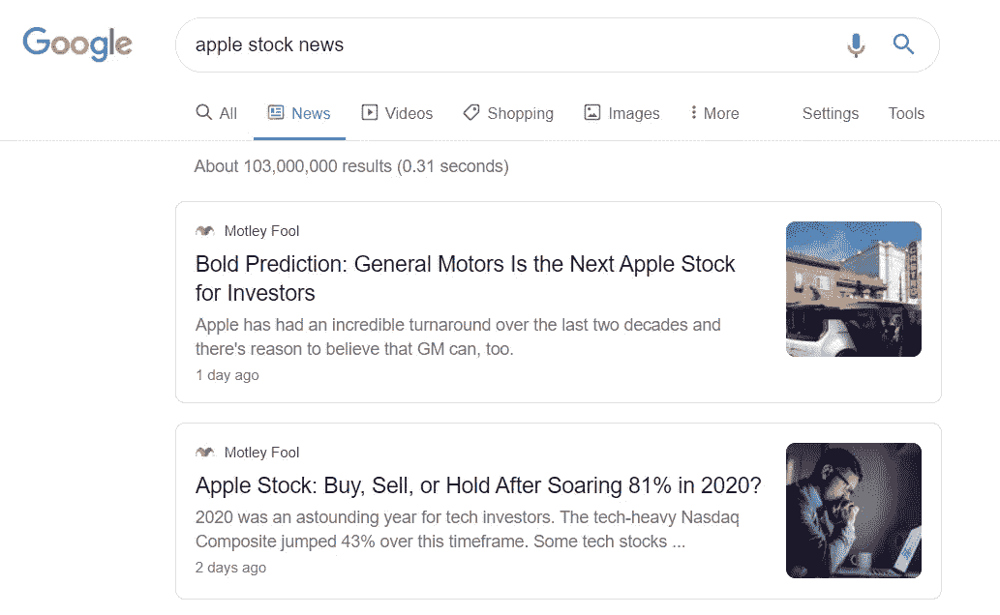

# 从谷歌抓取新闻

> 原文：<https://medium.com/analytics-vidhya/google-scraping-using-beautifulsoup-d53746ef5a32?source=collection_archive---------4----------------------->

基本上，我们可以使用几个网页抓取工具(如 BeautifulSoup、Scrapy、Selenium 等。)从谷歌上提取信息。对于本文，作者使用 BeautifulSoup，因为它易于实现。其实要看你能做什么或者你适应什么。

此外，本文还解释了如何从 google 中抓取以及如何处理 Google 查询和请求限制。有谷歌抓取的 python 代码示例，包括**谷歌新闻**和常见的**谷歌搜索**



谷歌新闻

## 从谷歌新闻获取股票新闻

谷歌新闻抓取代码

谷歌新闻用于搜索几家出版商的新闻。对于这个例子，我们正在搜索与股票相关的公司新闻。

在上面的代码中，我们有一个函数，用于获取我们注册的所有 tickers 的新闻。

谷歌抓取的一个重要内容是谷歌查询设置，你可以在 [***这里***](https://developers.google.com/custom-search/docs/xml_results) 设置和探索更多的谷歌查询，但在这段代码中，查询包括搜索关键字、语言、按日期和新闻数量排序。

```
keyword = '{} stock news'.format(t)        
url = f"https://www.google.com/search?q={keyword}&tbm=nws&lr=lang_en&hl=en&sort=date&num=5"
```

## 从谷歌搜索中获取公司描述

维基百科抓取代码

与此同时，在普通的谷歌搜索中，我们试图从维基百科中抓取公司描述。我们使用“维基百科”和股票名称作为关键字来获得关于股票的描述，例如“*维基百科苹果公司*”。

```
url = f"https://www.google.com/search?q=wikipedia {ticker_name.lower()} company&lr=lang_en&hl=en"
```

实际上代码可以和 google 新闻抓取一样，但是不同的是在查询中，没有代表 google 新闻的 ***tbm = nws***

## 处理请求限制

```
res = request.get(url, headers=random_header)
```

我们需要为谷歌抓取标题，因为谷歌需要有关您的请求信息。标题设置对防止请求限制很重要(有时当你超过一定数量的请求时，谷歌会阻止你的 IP)。

我们可以使用几种方法来处理 google scraping 上的请求限制，比如图书馆使用或用户代理轮换。

```
# random header library
from fake_useragent import UserAgent
from user_agent import random_header
```

用户代理轮换代码

您可以创建和设置标题列表以轮换您的用户代理，有关用户代理轮换的更多信息，请查看此[源](https://www.scrapehero.com/how-to-fake-and-rotate-user-agents-using-python-3/)

> 谷歌抓取最重要的事情是如何在你的代码上设置查询 url 和标题

一旦你可以处理查询和请求限制，你就可以根据你想要的抓取新闻