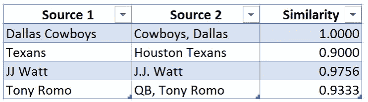

# 模糊查找谷歌工作表

> 原文：<https://medium.com/analytics-vidhya/google-sheets-approximate-match-fuzzy-match-up-and-fuzzy-lookup-4fc4f60ac0f3?source=collection_archive---------7----------------------->

## [深入分析。](/@benabrin/excel-approximate-match-fuzzy-match-up-7cf5abda2764?source=friends_link&sk=d111cd27d29168f4ec9844d979556641)

## 功能强大的 google sheets 工具，用于匹配姓名或类似文本。

## [点击这里在谷歌市场下载](https://workspace.google.com/marketplace/app/fuzzy_lookup_for_sheets/400020812065)

你有没有尝试过在 google sheets 中使用 VLOOKUP，但是当它没有返回任何匹配时，你会感到沮丧？ **Fuzzy Lookup 是 google sheets 的一个插件，它接受输入，搜索它能找到的最佳匹配，并返回最佳匹配以及相似性评级。**

模糊查找利用高级数学来计算它找到的内容与您的搜索条目匹配的概率，这意味着该工具即使在字符(数字、字母、标点符号)不完全匹配时也能工作。

模糊查找让我能够快速理解无组织的客户数据，并得出结论，否则可能需要几个小时才能发现。为了说明模糊查找的主要功能，下面是该工具识别为相似的几个示例(相似性得分从 0 到 1，1 表示可能的最高相似性):

你可以看到左边的每个条目在技术上与右边的相应条目有所不同，但是模糊查找意识到它们有可能真的是同一个意思。模糊查找返回每一对的概率分数，这意味着您可以快速整理、编辑和比较类似这样的列表。

如果您有一个以不一致的方式输入的名称的大列表，或者如果一些条目是缩写的而另一些不是，那么这个工具是有用的。

# 使用模糊查找

[点击本网站关于如何使用模糊查找匹配添加的链接](https://fuzzylookup.com/)