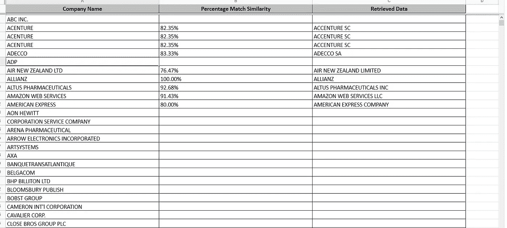
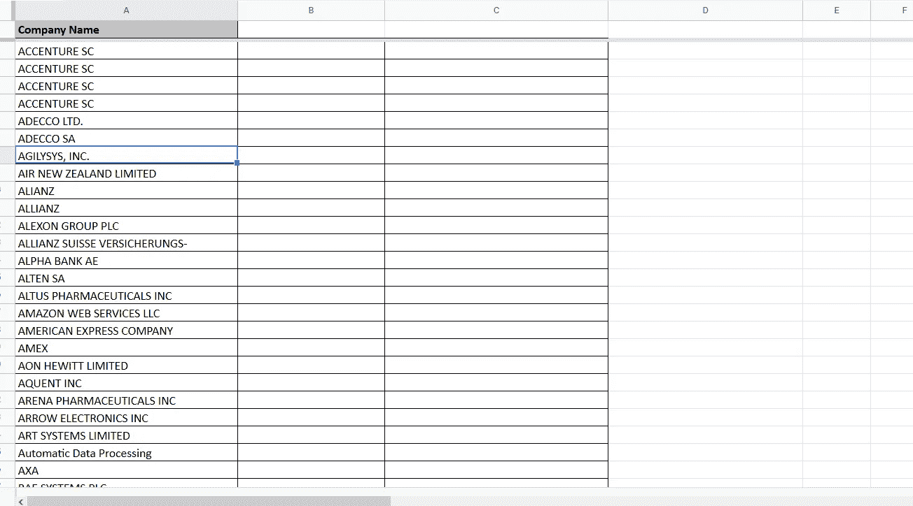
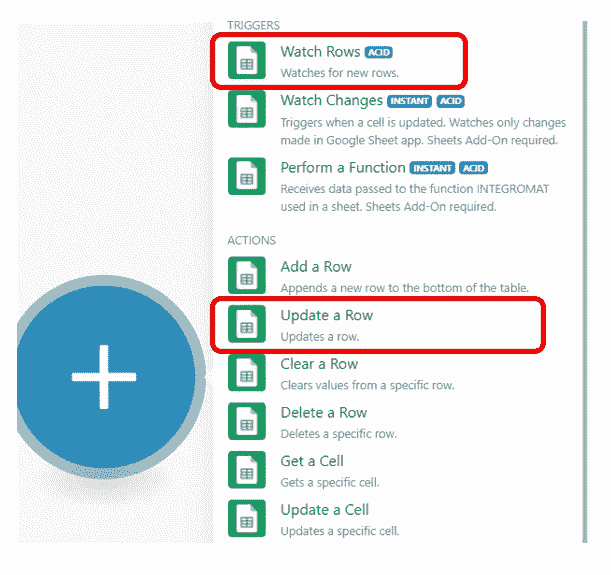
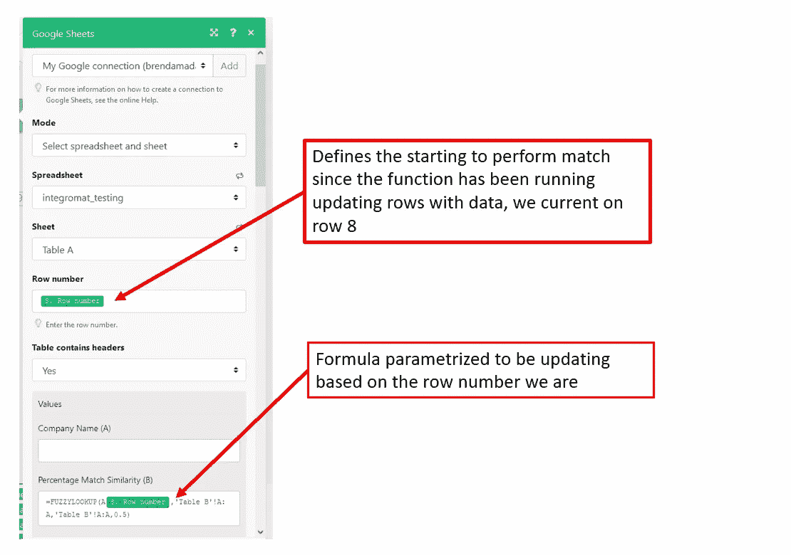

# 关于工作表的积分模糊查找的 Google 工作表公式

> 原文：<https://medium.com/analytics-vidhya/google-sheets-formula-on-integromat-fuzzy-lookup-for-sheets-6980a2d2abae?source=collection_archive---------4----------------------->

## [深入分析。](/@benabrin/excel-approximate-match-fuzzy-match-up-7cf5abda2764?source=friends_link&sk=d111cd27d29168f4ec9844d979556641)

## 使用 integromat 和 google sheets fuzzy add on 基于姓名相似度的自动姓名匹配。

在本教程中，我们将展示如何使用 fuzzy look 和 integromat 基于文本相似性自动匹配姓名。

工作表模糊查找是一个允许部分名称匹配的工作表智能插件 [**点击此处下载工作表模糊查找**](https://workspace.google.com/marketplace/app/fuzzy_lookup_for_sheets/400020812065)

[**Integromat**](https://www.integromat.com/) 让您只需点击几下鼠标，即可连接应用并自动化工作流程。轻松地在应用程序之间移动数据，以便您可以专注于发展业务。

在这种情况下，我们使用模糊查找插件来检索基于文本相似性的数据，如下表所示。

源数据如下表所示:

为了执行上述匹配，我们使用如下所示的 google 工作表 integromat 功能，我们将使用观察行功能来观察新行，并使用更新行和公式的工作表模糊查找来执行匹配。

integromat 的 Watch rows 触发器允许我们查看添加到 google sheets 的任何新数据，然后我们使用 update row 来执行文本相似性，使用 sheets addon 的模糊查找。

使用工作表模糊查找更新行的工作流集成器

