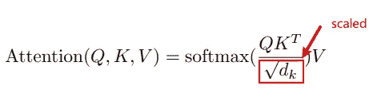

# 实现 Transformer Paper(从头开始使用 Google T5 Transformer 并使用它创建聊天机器人)

> 原文：<https://medium.com/analytics-vidhya/googles-t5-transformer-theory-ffd0acc738d2?source=collection_archive---------2----------------------->

本文全面论述了利用 Tensorflow 使用 Google[T5](https://ai.googleblog.com/2020/02/exploring-transfer-learning-with-t5.html)变压器。

要在运行中直接使用它，请参考我的文章-
' [**使用 T5**'](/@ar9avg/create-chatbot-using-chatformer-t5-based-chat-bot-1b3445f87d72)-w*这是一个关于如何使用我的库创建上下文聊天机器人的* ***3 步教程*** *(不需要深入学习，因为我已经为您完成了)并将其部署在 Reddit/Telegram/Mobile 应用程序上*

# **T5 简介**

摘自 T5 变压器论文

[T5 变压器的纸链接](https://arxiv.org/pdf/1910.10683.pdf)

## 什么是变压器？

Transformer 是一种语言模型，它是位置感知的前馈神经网络。

只要你明白注意力计算向量之间的相似性，注意力的确切内部工作方式就无关紧要了。

他们一下子“读”完了整个句子。每个单词都有自己的位置，句子中所有其他的单词都有自己的位置。

注意，默认实现假设最大序列长度(与 RNNs 不同)。对于无限/非常长的序列，需要不同的架构(Transformer-XL)。

总的来说，转换器实际上也知道单词的顺序，它们被编码在一个单独的位置向量中。然后，将位置向量与表示每个单词之间相似性的向量合并，然后将其传递给编码器中的前馈层。

在这篇文章中，我不会详细介绍它的工作原理和细微差别，你肯定能很容易地理解它(http://www.peterbloem.nl/blog/transformers)这是我找到的最好的解释。

**T5 变压器是做什么的？**

最近几年，大量的预训练模型，如乌尔姆菲特、伯特、GPT 等被开源到 NLP 社区。
最新的 SOTA 之一是 T5:文本到文本传输变压器模型，该模型于 2019 年 12 月开源。

T5 转换器可以适应多个文本类，因为它将所有的 NLP 任务重新组织成一个统一的文本到文本格式(T25 ),其中输入和输出总是文本串。

该模型在清理版本[通用抓取](https://commoncrawl.org/)数据集大小超过 700GB 的情况下进行预训练。

和 BERT 一样，T5 也是掩蔽语言模型。

但是 BERT 和 T5 的关键区别在于:
— BERT 将单个令牌替换为单个屏蔽令牌
— T5 将多个令牌替换为单个屏蔽令牌

因此，作为输出，我们期望在 T5 的情况下，令牌上有一个序列。

T5 变压器可以微调到任何任务，如聊天机器人，翻译，文本摘要，句子相似性等。

# **变形金刚 NMT 聊天机器人**

**关注层**

注意，我们基本上采用两个单词嵌入(x 和 y)，通过查询变换矩阵(Q)传递一个单词，通过密钥变换矩阵(K)传递第二个单词，并通过它们的点积来比较结果查询和密钥向量有多相似。

我们开始创建一个多头注意力层(MHA)

[https://papers . nips . cc/paper/2017/file/3f 5ee 243547 dee 91 FBD 053 C1 C4 a 845 aa-paper . pdf](https://papers.nips.cc/paper/2017/file/3f5ee243547dee91fbd053c1c4a845aa-Paper.pdf)

使用 Tensorflow Keras 创建多头注意力类

这里的 *V，K* 和 *Q* 描述了值、键和查询。

*Q* 来自目标序列， *K，V* 来自源序列

这三个参数在结构上是相似的，序列中的每个单词都由一个向量表示。

根据图像，我们接受 V，K 和 Q 输入标记，并构建一个尺寸向量。

我们将 *q，k，v* 分割成与 q 中的令牌数量相等的大小。

split 函数将最后一个维度拆分为(数量头，深度)。
转置结果，使形状为(batch_size，num_heads，seq_len，depth)

**成比例的点产品注意事项**

这里我们计算注意力权重

q，k，v 必须有匹配的前导尺寸。

k，v 必须具有匹配的倒数第二个维度，即:seq_len_k = seq_len_v。掩码根据其类型(填充或前瞻)具有不同的形状，但它必须是可扩展的，以便添加。

我们通过应用上面的公式得到这个。

公式中的 dk 是 k 或 v 的倒数第二个维度，即:seq_len_k。

因此，在多头注意力的构建之后，我们调用***【scaled _ dot _ product _ Attention】***来获得权重以获得 scaled_attention，attention_weights 使用 q、k 和 v。

我们进一步转置和缩放它，以获得我们的连接注意力向量。

并将其通过一个线性层，该层给出了序列的**注意力输出向量**表示。

MHA 的最终实施

## 定义编码层

现在我们为 T5 变压器建立一个编码器层。

对于编码器层，

我们接受文本的编码表示，并通过 MHA 传递，以获得我们上面设计的注意力输出。

然后，我们添加一些漏失，并通过一个前馈网络对注意力输出和插入向量的总和进行归一化，该网络是 2 个连续的线性层，并在其上重复漏失和归一化部分。

**定位编码**

所以这个事情一直让我很困惑。

位置嵌入是更可取的添加到单词嵌入，而不是连接它们。我们已经知道单词嵌入的维度与语义有关。那么，为什么要将位置嵌入语义空间，而不是增加额外的维度来表示位置呢？

假设我们有一个单词列表。我们选择任意两个。

假设选择了 x 和 y。设 x 和 y 的位置分别是 e 和 f。

问题:
1)给定单词 y，我们应该对单词 x 给予多大的关注？

2)给定单词 y 的位置 f，我们应该对单词 x 给予多大的关注？

3)给定单词 x 的位置 e，我们应该对 y 给予多大的关注？

4)给定单词 y 的位置 f，我们应该对单词 x 的位置 e 给予多大的关注？

在论坛上读到这些后，我得到了这些。

具有位置编码的学习变换矩阵 Q’k 必须同时完成所有这四项任务。这可能是看起来效率低下的部分，因为直觉上，Q'K 同时做好四项任务的能力应该有所取舍。

串联将确保位置维度与单词维度正交，但我的猜测是，因为这些嵌入空间是如此高维，所以即使在添加时，您也可以免费获得近似正交性，而没有串联的成本(需要学习更多参数)。考虑到非线性，增加层只会对此有所帮助。

我们最终也希望 e 和 f 有一些好的表现，所以在向量表示中，对于位置的微小变化，有一些“接近”。sin 和 cos 表示很好，因为附近的位置在它们的位置编码中具有很高的相似性，这使得学习“保持”这种期望的接近性的变换更容易。

**TLDR:**

直观上可能的是，在高维空间中，单词向量在整个嵌入空间内形成较小维度的子空间，并且位置向量形成不同的较小维度的子空间，该子空间近似正交于单词向量所跨越的子空间。因此，尽管矢量相加，这两个子空间可以通过一些单一的学习转换基本上彼此独立地操纵。因此，串联并没有增加多少，但是极大地增加了学习参数的成本。

**编码器**

现在使用位置嵌入和令牌嵌入，我们通过多个编码器层传递它。

我们最终得到了序列的编码表示。

**解码层**

对于解码器层，

与编码器类似，我们将目标序列输入到输出中，进行嵌入和位置编码，从而产生编码表示。

这里的变化是:

我们需要一个**前瞻掩码**,因为当在解码器生成目标序列时，由于转换器使用自关注，它倾向于包括来自解码器输入的所有单词。

但是，实际上这是不正确的。只有当前单词之前的单词可以有助于下一个单词的生成。MHA 确保了这一点。下图解释了前瞻掩码的工作原理。

在解码器中，我们有两个 MHA 层。

首先采用具有前瞻掩码的上述向量，其次采用定位目标向量和编码输出向量的归一化形式。

**解码器**

现在，使用目标的位置嵌入和令牌嵌入，我们将它与前瞻掩码一起通过多个解码器层。

**变压器**

现在我们定义我们的转换器，它基本上是编码器和解码器层的叠加。

在顶部，我们添加了一个输出所需序列的密集层。

加载创建标记器:

对于记号赋予器，我们使用 load [Tensorflow 子字编码器](https://www.tensorflow.org/datasets/api_docs/python/tfds/deprecated/text/SubwordTextEncoder)

子词标记化器的主要优点是它在基于词和基于字符的标记化之间进行插值。普通单词在词汇表中有一个位置，但是对于未知单词，标记器可以退回到单词片段和单个字符。

我们从给定的训练数据中构建输入和输出标记器。

**自定义调度器**

我们为我们的任务使用一个定制的学习率调度器。它考虑了预热步骤，然后是步骤数平方根倒数的最小值或 arg2(预热步骤),如下所示。

配置加载程序

对于训练参数，我们制作如下 yml 文件并指定参数。我们在这里输入所有可配置的参数。

配置文件:

> 我们建造了自己的变压器。

**培训司机**

现在我们已经完成了模型构建。

我们把所有的东西都拿走，把司机包起来。

我们根据自己创建的 CustomScheduler 设置学习率。

Optimizer = >根据我的经验，在 Transformer 风格的模型上，Adam 确实看起来比 SGD 用 momentum 训练得更快，即使在很好地调整 momentum 之后。参见[https://arxiv.org/abs/1910.05446](https://arxiv.org/abs/1910.05446)中图 2 的第四个面板。

我们使用 *tf.keras.metrics.Mean* 来测量 *train_loss。*

我们使用*TF . keras . metrics . sparsecategoricalaccuracy*来度量 *train_accuracy。*

*@tf.function* 将 train_step 跟踪编译成 tf 图，以便更快地执行。该函数专用于自变量张量的精确形状。为了避免由于可变序列长度或可变批次大小(最后一个批次较小)而导致的重新跟踪，请使用 input_signature 指定更通用的形状。

***疑惑，建议，联系我。***

[我的 LinkedIn](https://www.linkedin.com/in/ar9av/)