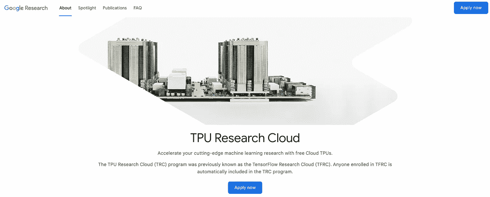
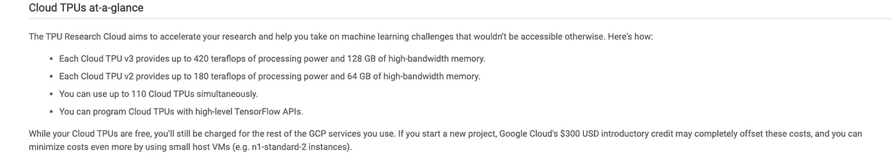
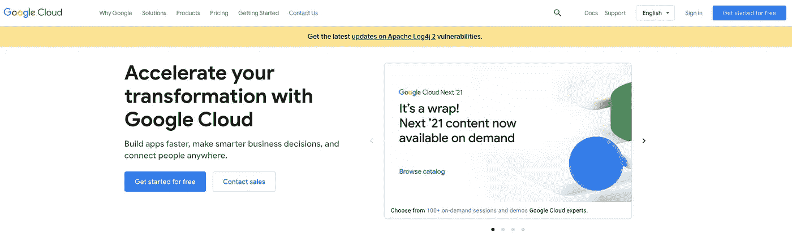
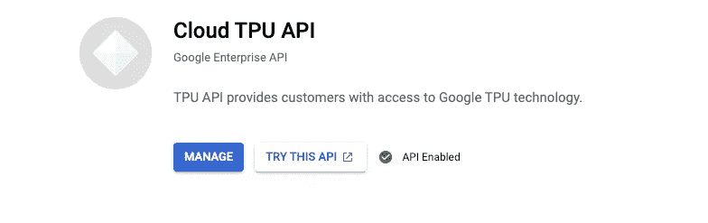

# 谷歌的 TPU 研究云！深度学习项目的免费 TPU 硬件…

> 原文：<https://medium.com/analytics-vidhya/googles-tpu-research-cloud-free-tpu-hardware-for-deep-learning-projects-7dfecd82b024?source=collection_archive---------1----------------------->



在训练包括“硬件”和“时间”的机器学习模型时，“成本”是最大的问题之一。庞大的模型需要大量的资源来训练。这使得超参数调整变得困难。

谷歌已经发布了大量资源来帮助机器学习社区，包括他们的开源框架 TensorFlow。它还免费发布了在 GPU 加速器中运行模型的 Colab，但有一些限制。付费的 pro 和 pro+版本可以克服其中的一些限制。

为了充分利用 TensorFlow 框架的优势，Google 创建了专门的硬件来高效地执行张量运算和训练 ML 模型。这些硬件被称为张量处理单元(TPU)。

TPU 可以执行从 180 万亿次浮点运算/秒到 480 万亿次浮点运算/秒的操作。万亿次浮点运算意味着百万到百万次操作。从这个角度来看，免费的 Colab 版本提供了 4.1 万亿次浮点运算/秒，这使得 TPU 比 GPU 加速器快 100 倍。



目前，TPU 硬件还没有上市，只能通过谷歌获得。在这篇文章中，我们将看到如何获得免费的 TPU 访问为研究目的。

TPU 研究云(TRC)是谷歌的一项举措，旨在让研究人员能够在 TPU 实施和测试他们的模型。为此，TRC 可同时免费访问多达 110 个云 TPU。

是不是很棒？？

研究人员的唯一条件是:

TRC 计划的参与者将通过同行评审的出版物、开源代码、博客帖子或其他方式与世界分享他们的 TRC 支持的研究。他们也应该愿意与谷歌分享详细的反馈，以帮助我们随着时间的推移改进 TRC 计划和底层的云 TPU 平台。此外，参与者接受谷歌的[条款和条件](https://policies.google.com/terms)，承认他们的信息将根据我们的[隐私政策](https://policies.google.com/privacy)使用，并同意根据[谷歌人工智能原则](https://ai.google/principles)进行他们的研究。

被 TRC 计划接受的研究人员将免费使用 v2 和 v3 设备，并可以利用包括 TensorFlow、PyTorch、Julia 和 JAX 在内的各种框架来加速下一波开放研究突破。

本文分为四个部分

第一部分:申请储税券

第 2 部分:创建谷歌云平台账户(别担心，这是免费的)

第 3 节:设置 CloudSDK 和 VM 实例

第 4 部分:VS 代码远程连接

让我们开始吧…

# 第一部分:申请储税券

这是一个简单的步骤。您只需使用以下链接申请云访问

[https://sites.research.google/trc/about](https://sites.research.google/trc/about/)

填写完成后，团队可能需要 3-4 个工作日向您发送创建项目的步骤。

# 第 2 部分:创建 Google 云平台帐户

使用您的 Gmail 帐户登录到[https://cloud.google.com/](https://cloud.google.com/)并打开控制台选项卡。虽然您的云 TPU 是免费的，但您使用的其他 GCP 服务仍需付费。如果你开始一个新项目，谷歌云的 300 美元入门信用可能会完全抵消这些成本，并且你可以通过使用小型主机虚拟机(例如 n1-standard-2 实例)来进一步降低成本。

从 GCP 控制板创建新项目



稍后打开该项目的 TPU API，并将项目编号发送到 TRC，TRC 将在几天后被允许 TPU 访问。



一旦你获得访问权，你将有 30 天的免费 TPU 为您的工作。

# 第 3 节:设置 CloudSDK 和 VM 实例

我们在项目中使用一个 VM 实例来工作。在设置 VM 实例之前，我们必须在本地安装 Cloud SDK。

云 SDK 包括`gcloud`、`gsutil`和`bq`命令行工具。获取云 SDK 特性的列表。

从 https://cloud.google.com/sdk/docs/install[下载并安装 Google-cloud-SDK](https://cloud.google.com/sdk/docs/install)

```
Run  $./google-cloud-sdk/install.shAfter installation Run $./google-cloud-sdk/bin/gcloud init
```

在初始化中，添加您的 Gmail 帐户，并选择具有 TPU 访问权限的项目。

一旦完成这些步骤，我们就可以开始创建我们的 VM 实例了。

# 创建虚拟机实例

安装并初始化 Cloud SDK 后，关闭终端并打开一个新的终端。运行以下命令创建一个 TPU 虚拟机实例。详情可以在[这里](https://cloud.google.com/sdk/gcloud/reference/alpha/compute/tpus/tpu-vm/create)找到。

```
# gcloud alpha compute tpus tpu-vm create **tpu_project_name** — zone=europe-west4-a — accelerator-type=v3–8 — version=v2-alpha
```

您可以从 TRC 团队给出的版本列表中设置加速器类型和区域。

创建后，您可以使用以下命令激活虚拟机

```
# gcloud alpha compute tpus tpu-vm ssh **tpu_project_name** — zone europe-west4-a
```

您已经连接到 TPU，现在您可以通过终端使用您的虚拟机实例。

对于那些像我一样对终端不太适应，并且是 Visual Studio 代码(BTW 最佳代码编辑器)的超级粉丝的人，谢谢你，微软…

下一节将展示如何使用 VS 代码远程连接到 VM 实例。

# 第 4 部分:VS 代码远程连接

1.  在 VS 代码中获取扩展“Remote-SSH”并安装它。

2.对于 Mac 用户，按 cmd+shift+p 调出命令面板，键入 remote shh，然后单击 Remote SSH: Add new SSH host。

在弹出的 SSH 命令提示符中，输入

```
ssh -i ~/.ssh/[KEY_FILENAME] [USERNAME]@[External IP]
```

其中，KEY_FILENAME 通常是~/。ssh/谷歌计算引擎

该文件将在您第一次使用终端连接到 TPU 虚拟机时创建。

可以从 GCP 控制台仪表板中找到外部 IP。

3.再次完成后，按 cmd+shift+p 并单击 Remote SSH:Open SSH configuration file 并打开配置文件。

该文件看起来会像这样。

```
Host external_ipHostName external_ipIdentityFile ~/.ssh/google_compute_engineUser username
```

4.最后，按 cmd+shift+p 并单击远程 SSH 连接到主机，然后单击主机名称，这将是外部 ip 地址。

接下来，您将连接到 VM 实例，像在本地使用 VS 代码一样进行操作，还可以从 VS 代码的终端运行命令。

感谢阅读这篇文章。希望这对你的深度学习项目有所帮助:)