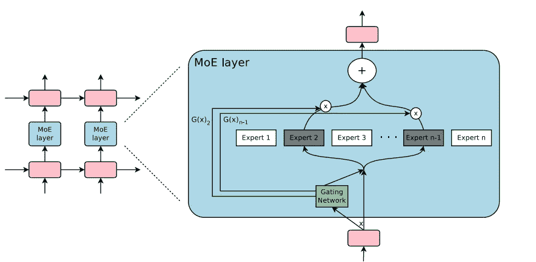
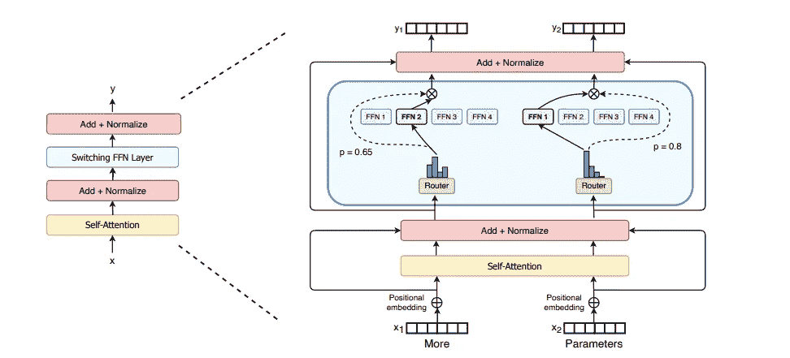
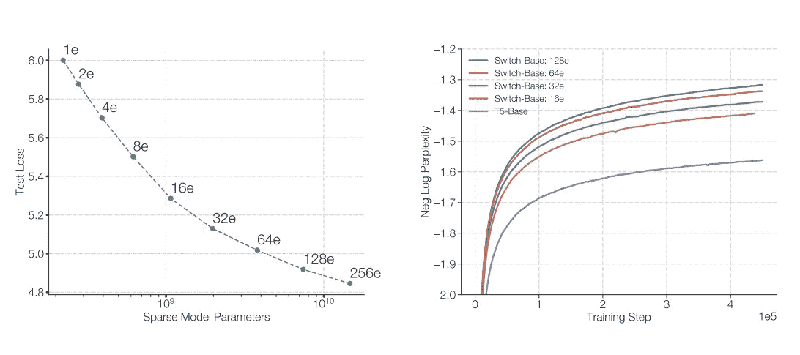
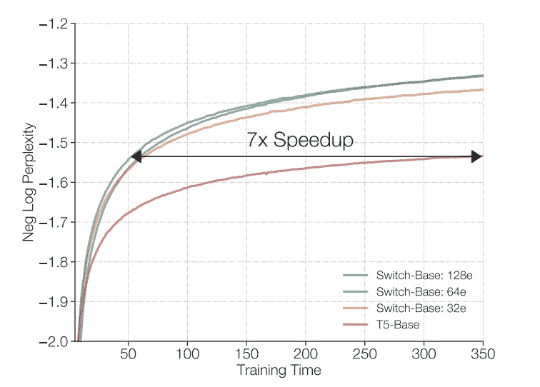
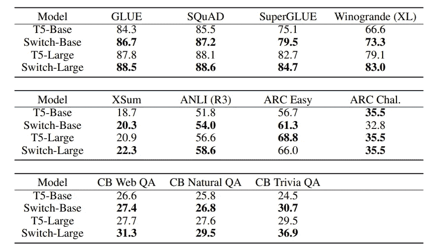

# 谷歌的万亿参数变压器模型:开关变压器

> 原文：<https://medium.com/analytics-vidhya/googles-trillion-parameters-transformer-model-switch-transformer-6b27d6b60920?source=collection_archive---------9----------------------->

在过去的几年里，Transformer 模型在解决自然语言处理(NLP)任务方面获得了很大的流行。变压器是大型预训练神经网络，在海量数据上进行训练，以掌握语言中的模式。这些模型可以被微调，以解决许多自然语言处理任务，如语义分析，问答，机器翻译等。

OpenAI 的 GPT-3 当然创造了许多炒作，并成为过去几年中最著名的深度学习变压器模型之一。众所周知，它拥有 1750 亿个参数，在某种程度上，它只不过是拥有更多参数的 GPT-2。

谷歌的 Switch Transformer 目前受到了很多关注，因为它的 1.6 万亿参数模型大小和在多个 NLP 基准中的排名超过了 T5 模型。

开关变压器的 1.6 万亿参数令人印象深刻，但最令人印象深刻的方面是它的简单和有效的计算，这不像 GPT-3(计算昂贵)。在计算资源相同的情况下，Switch Transformer 实现了与 T5 -Base 和 T5-Large 模型相同的复杂度，速度提高了 7 倍。

## **简介:**

在深度学习中，通常模型对所有输入重复使用参数。而专家混合(MoE)为每个输入的例子选择不同的参数。尽管 MoE 在机器翻译方面取得了显著的成功，但它的采用受到复杂性、通信成本和培训不稳定性的阻碍。在这里，专家只不过是前馈网络(FFN)。

图来自[稀疏门控 MoE 层论文](https://arxiv.org/pdf/1701.06538.pdf):嵌入在递归语言模型中的 MoE 层。这里，稀疏选通函数选择两个专家来执行计算。

在开关变压器中，开关意味着将输入路由到隐含遵循**的特定参数子集**，并非所有知识始终有用。开关变压器架构简化并改进了专家混合(MoE ),以获得训练稳定性和计算优势。Switch Transformer 有许多基于参数计数的实例，名称有 Switch-Base、Switch-Large、Switch-XXL、Switch-C(1.6 万亿个参数)。

***注:*** 开关变压器不仅仅指开关-C(1.6 万亿参数初始化)。

来自[开关变压器论文](https://arxiv.org/pdf/2101.03961.pdf)的图:开关变压器编码器模块的图示。

如上图所示，我们将变压器中密集的前馈网络(FFN)层替换为稀疏的开关 FFN 层。该交换 FFN 层对输入序列中的令牌独立操作。x1 和 x2 的令牌嵌入(由底层产生)被路由到四个 FFN 专家之一，在那里路由器独立地路由每个令牌。

***路由器如何知道该接通哪个专家？***

让嵌入、自我关注和 Add+Normalize 层后的标记 z 为 *x* (标记嵌入)。路由器需要确定通过令牌嵌入(x)的最佳专家。如何选择专家的步骤:

1.  让 *Wᵣ* 作为路由器变量(一个可学习的参数)乘以嵌入的 *x* 产生 logit*h(x)=wᵣ* x*
2.  *h(x)* 通过该层可用 N 名专家的 softmax 分布进行归一化。专家 *i* 门限值如下: *pᵢ = softmax(h(x)ᵢ)* 该 *pᵢ* 表示嵌入通过专家 *i* 的概率。
3.  嵌入 *x* 以最高概率通过专家 *i* 。最后，输出(即，更新的令牌嵌入)是由专家产生的激活，通过其概率得分进行加权: *y= pᵢ * Eᵢ (x)*

这里嵌入只通过概率最高的专家，而在正常的 MoE 层我们通过 *k(k > 1)* 专家。这种 *k=1* 路由策略被称为 ***交换层。*** 像教育部这样的前期研究在 LSTMs 环境下指出，网络选择多个专家(至少两个)并汇总结果。开关变压器只选择了一名专家，因此它否定了至少有两名专家对路由参数进行可靠培训的先验直觉。

***开关层的好处*** :

1.  路由器的计算量减少了，因为我们只需要将一个令牌路由给一个专家。
2.  每个专家的批量至少可以减半，因为每个令牌只发送给一个专家。
3.  简化了路由实现，降低了通信成本(因为计算只需要一名专家)。

Switch Transformer 是一个稀疏激活的专家模型，其中稀疏性来自于为每个传入的示例激活神经网络权重的子集。模型的稀疏性会引入训练的不稳定性(由于参数的初始化，不同的训练运行会导致不同的性能)。

***训练不稳定原因:***

由于每一层的硬切换(路由)决策和 bfloat16(大脑浮点)等低精度格式，可能会导致不稳定。低精度格式会加剧我们路由器的 softmax 计算中的问题。

***训练不稳定的解决方法:***

通过在模型的局部部分(路由器)内选择性地铸造 *float32* 精度来实现稳定性，而不会导致 float32 张量的昂贵通信成本。路由器输入被转换为 float32 精度，消除了 softmax 计算中的恶化问题。Precision 仅在路由器函数体中使用，因此没有昂贵的通信成本，但我们仍然受益于增加的稳定性。

减小初始化规模导致更好的模型质量和更稳定的开关变压器训练。

深度学习模型的一个更自然的问题是过度拟合。缓解这一问题的简单方法是通过增加专家内部的流失称为 ***专家流失*** 。因此，非专家层的较小辍学率(0.1)和专家层的较大辍学率(0.4)可以提高性能。

## ***对缩放属性的观察:***

开关变压器架构在许多方面进行了扩展，如专家、层数。

专家的数量是缩放我们的模型的最有效的维度，因为增加专家保持计算成本固定，因为模型只选择一个专家令牌。选择专家是一个轻量级的计算，所以专家的增加不会影响模型的计算。

来自[开关变压器论文](https://arxiv.org/pdf/2101.03961.pdf)的图 4:开关变压器的缩放特性

***从图 4 左图:*** 从左上到右下，我们将专家数量从 1 增加到 2、4、8、16、32、64、128、256。我们可以观察到，随着专家数量的增加，在同等计算预算的情况下，性能会不断提高。

***从图 4 右图:*** 开关变压器更早实现了与 T5-model 相同的困惑。随着专家数量的增加，开关变压器可以更早地获得结果。

图 5 来自[开关变压器论文](https://arxiv.org/pdf/2101.03961.pdf):开关变压器的速度优势

***上图观察:*** 在计算量和训练时间相同的情况下，开关变压器明显优于密集变压器(T5-model)，64 专家开关基模型达到相同质量的速度是 T5-Base 模型的 7 倍。

## ***下游结果:***

在本节中，作者使用高度调谐 223 米参数 T5-基本模型，739 米参数 T5-大模型作为基线，并与 7.4 米参数开关-基本模型，26.3 米参数开关-大模型进行比较。作者对基本模型使用 124B 浮点运算(FLOPS ),对大型模型使用 425B 浮点运算(FLOPS)。在大多数 NLP 任务中，如问题回答、分类、总结，开关变压器模型比翻牌匹配的 T5-Base 和 T5-Large 模型表现得更好。

跨不同 NLP 数据集的 T5 基线和交换机模型的微调结果。

***结论:***

在大型模型不断增加的今天，看到这些大型模型使用有限的计算能力是一种激励。这项研究也激发了稀疏模型作为一个有效的架构，并缓解了稀疏模型的问题，如模型复杂性，训练困难，通信成本。开关变压器的研究使我们在自然语言任务中考虑这些灵活的模型。

> **参考文献:**
> 
> Fedus 等人:[开关变压器:利用简单有效的稀疏性扩展到万亿参数模型](https://arxiv.org/pdf/2101.03961.pdf) (2021)
> 
> Raffel 等人:[用统一的文本到文本转换器探索迁移学习的极限](https://arxiv.org/pdf/1910.10683.pdf) (2019)
> 
> Shazeer 等人:[异常庞大的神经网络:稀疏门控的专家混合层(](https://arxiv.org/pdf/1701.06538.pdf) 2017)