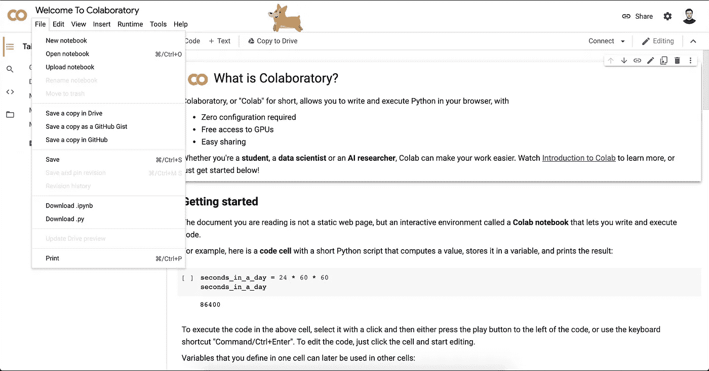
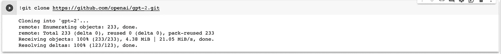
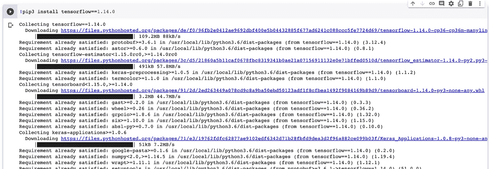
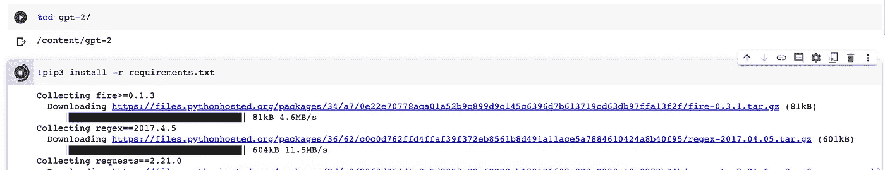
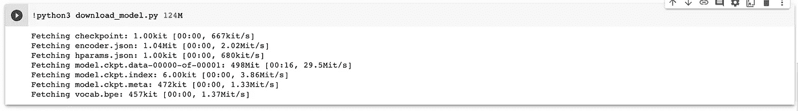
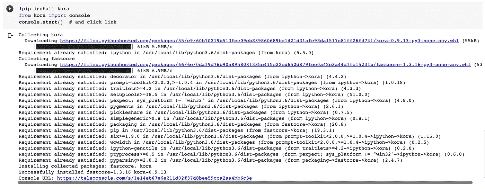
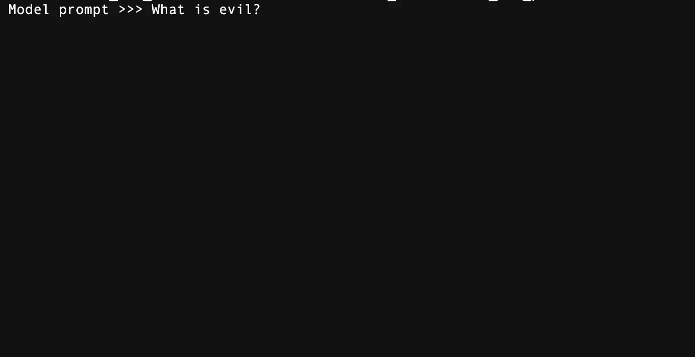
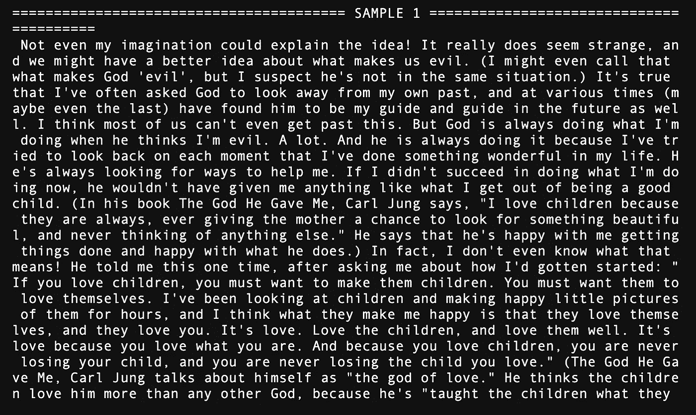

# GPT-2 Colab 教程

> 原文：<https://medium.com/analytics-vidhya/gpt-2-colab-tutorial-6a5567e7b759?source=collection_archive---------8----------------------->

2021 年 1 月 6 日

在今天的教程中，我将带你了解如何开始使用 GPT-2。GPT-2 是由开放人工智能构建的语言模型，如果你在这里，那么你可能已经听说过 GPT-2 或者他的继任者 GPT-3。更深入的解释是这里的[官方文件中的](https://blog.akbuluteren.com/blog/gpt2-colab-tutorial/if%20you%20are%20here)。

为了简单起见，我们今天将使用 google colab，colab 就像一个更高级的 jupyter 笔记本，它已经在云端准备好了，正等着你。你甚至可以在 colab 的免费层上使用 GPU 驱动的应用程序，很难找到免费层的限制，因为每天都有像这样的常规训练任务。

我将主要通过图片按顺序展示该做什么，所以如果你不想写我展示给你自己的东西(有意义)，你可以继续检查这个项目的[回购](https://github.com/eren23/gpt2-colab-tutorial)。本教程实际上是基于官方的 GitHub [页面](https://github.com/openai/gpt-2)，然而由于文档中有一些错误，我建议你使用本教程中的内容。

首先，我们将创建一个新的 colab 项目。

然后，我们可以使用 git 命令拉动 GPT-2 项目。

然后，我们可以使用下面的命令在我们的环境中安装 Tensorflow。

之后，我们需要找到我们的 GPT-2 文件夹，然后安装需求，我们可以按顺序使用这两个命令。

在能够运行模型之前的最后一步是获取我们选择的模态，为了简单起见，我们将选择最小的一个。

因为我们需要用我们自己的句子来测试模型，所以我们需要一个提示，而 colab 没有为自由层提供提示。然而，在这一点上，我们将使用另一个模块来解决这个问题。

我们将使用 kora 模块在一个不同的 URL 中创建我们的控制台。

在我们代码的最后一部分成功运行之后，我们就可以通过使用输出中的链接在我们的控制台上玩游戏了。在运行下面的命令之前，我们基本上需要先运行`cd gpt-2`命令，这样我们才能最终运行我们的模态。

下面是我对 GPT-2 的问题，即使对人类来说也不是最容易的任务，对吗？

然而，GPT-2 方面的结果对我来说相当不错，因为这个模型只是真正的 GPT-2 和 GPT-3 的一小部分，甚至比原来的 GPT-2 还要大，我甚至不能决定结果是有希望的还是可怕的:)。

在博客的后面，我可能会发表更多关于在容器上运行 GPT-2 的工作，或者/和如何根据我们自己的需要微调 GPT-2 模型。在那之前，照顾好自己:)

*最初发表于*[*【https://blog.akbuluteren.com】*](https://blog.akbuluteren.com/blog/gpt2-colab-tutorial)*。*

*在*[*https://margin.io/blogs*](https://margin.io/blogs)结账加密相关物品