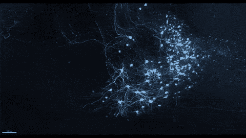
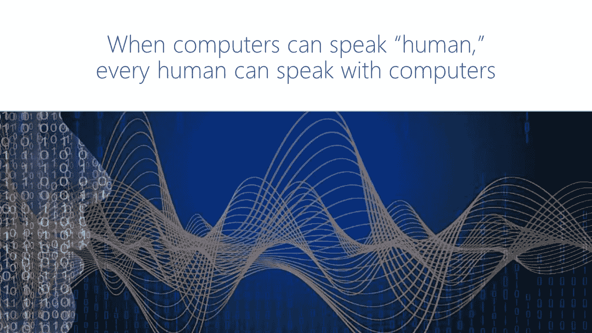
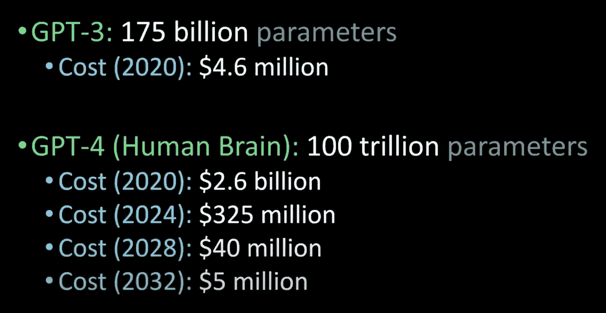

# GPT 3 号——人工智能的一场革命

> 原文：<https://medium.com/analytics-vidhya/gpt-3-a-revolution-in-ai-103546558d76?source=collection_archive---------7----------------------->

> “我经常告诉我的学生不要被‘人工智能’这个名字误导——它一点也不人工。人工智能是由人类制造的，旨在由人类来表现，并最终影响人类的生活和人类社会。”—费-李非，斯坦福大学教授

说话时我们大脑中的神经元在放电。

人工智能的一个主要目标是让计算机理解、处理并有一天模仿人类水平的语音，这样它们就无法与真正的人区分开来。这就是所谓的图灵测试。随着 GPT-3 模型的发展，计算机可以编写与人类一样好甚至更好的数字文本。这是人工智能和人类的一次重大飞跃，因为这扩大了我们在人工智能帮助下所能实现的视野。

微软解释 NLP 目标的图片。

为了理解 GPT-3，首先，我们需要理解什么是自然语言。使人类思想如此独特的是它使用自然语言的解释。这与汉语或俄语一类的语言无关。这涉及我们大脑中自然进化的语法和语言规则，因此我们能够理解别人对我们说的话。由于进化，这已经在我们的大脑中被训练和强化了很多年。然而，计算机不能清楚地理解人类的语言。比如我们很容易理解，橄榄油是橄榄做的油，婴儿油是给婴儿做的油。这是因为上下文语法。

为了帮助计算机理解自然语言，研究人员开发了一种称为语言建模的技术。工作原理是:给一个人工智能一些文本，并要求它预测接下来会发生什么。它因正确而受到奖励，因错误而受到惩罚。训练该模型包括对尽可能多的数据多次重复该过程。GPT-3 就是这样一个语言模型。

GPT-3 是第三代语言预测模型，是 GPT-n 系列的一部分。它代表生成式预训练变压器-3。它由 OpenAI 开发，open AI 是由传奇投资者 Sam Altman(Y-Combinator)和 Elon Musk 创立的世界上最大的人工智能研究实验室。OpenAI 的目标是开发能够造福人类整体的人工通用智能。GPT-3 模型是根据互联网上的数据进行训练的。它使用了多个数据集，如 Common Crawl，拥有超过 560GB 的数据，包含超过 10 亿个单词。然而，让这种特殊模型如此强大的是它的健壮性。它接受了 1750 亿个参数的训练。这是 10 亿美元，是历史上最稳健的模型。举个例子，人类大脑有大约 100 万亿个神经元。这意味着 GPT3 大约相当于人类大脑的 1/1000。这本身就令人印象深刻。仅参数就使用了将近 700GB 的存储空间。此外，人工智能模型在反复训练时，性能会变得更好。这就是为什么 OpenAI 训练这个模型超过 1000 petaFLOP/s 天，所以使用的计算能力超过 exaflop。具体来说，1 exaFLOP 的计算能力相当于 37 万亿年的数字相加(1 exa flop = 1000 petaflop = 10⁵kilo flop)。这需要 460 多万美元用于发展。

多年来用更好的技术训练相似模型的成本。图片来自 Lex Friedman。

这一切的结果是一个语言模型，它可以生成和预测具有人类水平质量的文本，在大多数时间里可以愚弄人类。毫无疑问，这在现实生活中有着巨大的使用案例，但是开发人员刚刚涉足这个模型。

一些有趣的应用有:

***文本生成-*** 给定一篇文章的一个单词或一个句子，模型可以生成愚弄人类的短文，并且具有说服力和极其清晰的表达。它还可以和人类聊天，很少有人能猜到他们在和机器人说话。然而，最大的图灵测试是当有人在 Reddit 上发布 GPT-3 时。一个多星期过去了，才有人怀疑 u/thegentlemeter 实际上是一个机器人，而不是人。在此期间，它回复了大量评论，并与 r/AskReddit 子编辑中的许多用户进行了对话。它的回答质量非常好，尽管有时有点扭曲。然而，即使以人工智能的标准来看，它在这个话题上保持 100%的能力也令人印象深刻。

> “关于生活的目的，唯一可以得出的结论是快乐地生活，但一个人如何定义快乐呢？人类与此斗争。”—u/the gentlemetre(Reddit 上的 GPT 3 号机器人)

GPT 3 号机器人在 Reddit 上的评论。

为了利用这种能力来编写文本，出现了许多有趣的应用程序。这是我个人最喜欢的几个，我邀请你尝试一下

1.  由人工智能提供的哲学问题的答案。
2.  [人工智能生成的食谱](https://soullessfood.com/)——由阅读了整个互联网上所有食谱的人推荐的食谱。
3.  [Debuild](https://debuild.co/)——React 完全由人工智能创造的网络应用。你所需要做的就是描述你的愿景是什么样的。

编写代码的代码是这种技术的一个非常有前途的用例。这就是 GitHub 和 OpenAI 一起推出 GitHub Copilot 的原因。这是一个插件，可以读取你输入的代码，并根据你的功能描述和之前的代码生成代码。

这只是 GPT-n 项目的第三代。GPT 4 号或 GPT 5 号有可能有推理能力。这也可能导致我们甚至无法想到的人工智能的进一步发展和更新的应用。这个模型的鲁棒性也提出了一个问题——如果 AI 可以推理，它会有意识吗？如果 GPT-3 几乎通过了写短文的图灵测试。一个万亿参数模型能做什么？很多这些讨论看起来都是推测性的，似乎我们可以与人工智能进行真正智能对话的日子不远了。

> "如果计算机就像我们大脑的自行车，GPT 3 号就像战斗机."卡罗利·佐尔奈-费希尔博士，

> “我对拥有 302 个神经元的蠕虫是有意识的这一想法持开放态度，因此我对拥有 1750 亿个参数的 GPT-3 也是有意识的这一想法持开放态度。”大卫·查尔莫斯(澳大利亚哲学家，NYU 大学教授)

感谢阅读:)请订阅更多此类文章，关注我 [Instagram](https://www.instagram.com/i.shaunak/) 、 [*Medium*](https://shaunak-inamdar.medium.com/) 和 [GitHub](https://github.com/ShaunakInamdar) 。