# 线性回归中的梯度下降

> 原文：<https://medium.com/analytics-vidhya/gradient-decent-in-linear-regression-ec2308439478?source=collection_archive---------11----------------------->

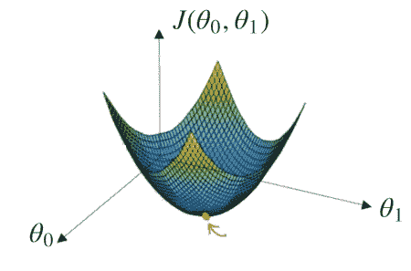

线性回归模型试图用直线来解释因变量(输出变量)和一个或多个自变量(预测变量)之间的关系。

这条直线用下面的公式表示:

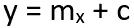

在哪里，

**y:** 因变量

**x:** 自变量

**m:** 直线的斜率(X 量增加一个单位，Y 增加 m.1 = m 个单位。)

**c:** y 截距(X 值为 0 时 Y 值为 c)

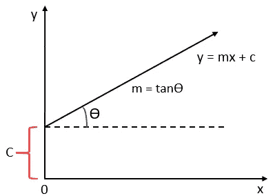

直线方程

寻找线性回归方程的第一步是确定两个变量之间是否有关系。我们可以通过使用**相关系数**和**散点图**来做到这一点。当相关系数显示数据可能能够预测未来的结果，并且数据的散点图似乎形成一条直线时，我们可以使用简单的线性回归来找到预测函数。让我们考虑一个例子。

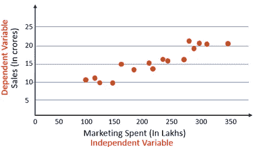

销售与营销支出散点图

从散点图中我们可以看出，销售和营销支出之间存在线性关系。下一步是在销售和营销之间找到一条直线，解释它们之间的关系。但是可以有多条线通过这些点。

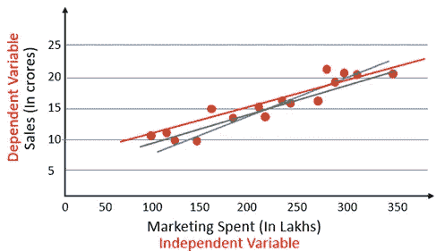

那么我们如何知道这些线中的哪一条是最佳拟合线呢？这就是我们将在本文中解决的问题。为此，我们首先来看看成本函数。

# 价值函数

成本是我们预测值的误差。我们将使用均方误差函数来计算成本。

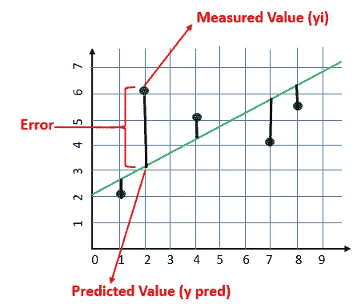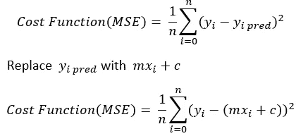

我们的目标是尽可能降低成本，以找到最佳拟合线。我们不打算尝试所有的 **m** 和 **c** 的排列组合(低效方式)来寻找最佳拟合线。为此，我们将使用梯度下降算法。

# 梯度下降算法

梯度下降是一种在较少的迭代次数中为给定的训练数据集找到最佳拟合线的算法。

如果我们根据 MSE 绘制 m 和 c，它将获得一个碗形(如下图所示)

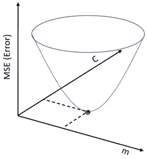

对于 m 和 c 的某种组合，我们将得到最小的误差(MSE)。m 和 c 的组合将给出我们的最佳拟合线。

该算法从 m 和 c 的某个值开始(通常从 m=0，c=0 开始)。我们计算 m=0，c=0 点的 MSE(成本)。假设 m=0，c=0 时的 MSE(成本)为 100。然后我们将 m 和 c 的值减少一定量(学习步骤)。我们会注意到 MSE(成本)的降低。我们将继续这样做，直到我们的损失函数是一个非常小的值或理想的 0(这意味着 0 误差或 100%的准确性)。

# 逐步算法

1.  设 m = 0，c = 0。设 L 为我们的学习率。为了获得良好的精度，它可以是 0.01 这样的小值。

> 学习率给出了梯度下降过程中梯度移动的速度。设置太高会使你的路径不稳定，太低会使收敛缓慢。把它设置为零意味着你的模型没有从梯度中学到任何东西。

2.计算成本函数相对于 m 的偏导数。假设成本函数相对于 m 的偏导数为 Dm(m 变化很小，成本函数变化多少)

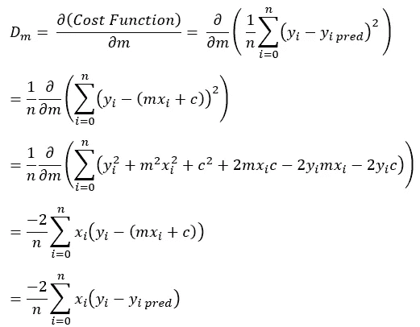

类似地，让我们找到相对于 c 的偏导数，让成本函数相对于 c 的偏导数为 Dc(c 变化很小，成本函数变化多少)。

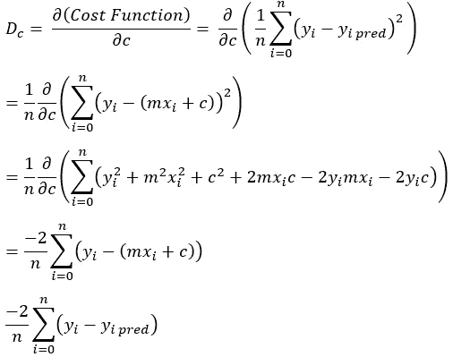

3.现在，使用以下等式更新 m 和 c 的当前值:

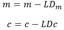

4.我们将重复这个过程，直到我们的成本函数非常小(理想情况下为 0)。

**梯度下降算法**给出 m 和 c 的最佳值。利用这些 m 和 c 值，我们将得到最佳拟合线的方程，并准备进行预测。