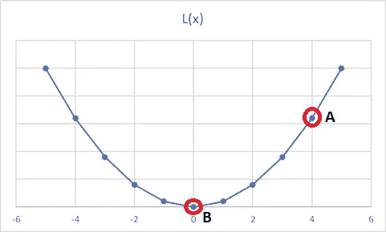

# 梯度下降

> 原文：<https://medium.com/analytics-vidhya/gradient-descent-68aad4203c5f?source=collection_archive---------19----------------------->

现在是凌晨 4:30，诗人倾向于称这个时间为“破晓”。你搭上一辆公共汽车，飞驰到这座美丽的山脚下。当你开始攀登时，天空仍然是柔和的紫色，当你到达顶峰时，你的视线被染成了明亮的橙色。恭喜，你及时赶上了日出！但并不是每个人都像你一样敏捷，所以你最终会在孤独中享受大自然的奇迹。现在是时候回去了，但是荒野对你并不友好。这条路被灌木和杂草踩过，这些灌木和杂草抹去了任何纳姆和 T2 的路标。你手机上的信号棒完全没电了。现在你怎么找到回去的路？

直觉上，你会走下坡路。

走几步，检查你现在的坡度是否比之前低。如果是，继续。

最初，这很容易做到，因为山顶更陡，所以你可以很容易地感觉到下山的路。然而，当你到达中间时，坡度变小，你可能不得不慢一点，以确保你仍然向下。到最后，会更加困难，但是谢天谢地，人类的粪便会指引你回家。

简单？太简单了。

让我们把它转化为手动梯度下降的主题。这是我在机器学习中碰到的。但是你想想，你可以在任何地方使用这个。即使你发现自己在远足中迷路了:p .这个问题的目标是找到一个数学函数的最低点。为了使事情变得简单，假设我们有一个凸函数，基本上是 U 形的。你在顶端的某个地方，你想要触底。为什么？因为你正在处理的函数是一个损失函数，你想得到尽可能低的值。

现在是时候调用一些数学函数了。

假设我们的损失 L 是 x 的函数，表示为 L(x)。

损失函数

我们随机输入 x 为 4，发现自己在点 a。目标是下降到 B，其中 L(x)为 0，从它的外观来看，它的最低点。为此，我们需要以很小的步长- dx(比如 0.001)递减 x，直到达到 b。这种方法的最大问题是 dx 太小，可能需要很长时间才能收敛。

但是，在徒步旅行的例子中，我们知道我们爬得越高，斜坡就越高，我们可以确定地感觉到前进的方向。也就是说，它允许我们迈出更大的步伐。但是随着我们越来越接近最低点，斜率越来越平缓，辨别方向变得越来越困难，所以我们需要迈出更小的步伐。这就好比说，在 A 点，我们可以以 100*dx 的速率下降，但是当我们到达 x=1 时，我们可以以 10*dx 的速率下降。如果我们在底部走得太快，穿过 B 点的风险就会成为一个真正的考虑因素。在我们的山的例子中，如果我们太匆忙，我们可能会绕过山而不是直接下山。

现在这看起来好多了，但是我们能以某种方式使它自动化吗？

不要什么任意的 100 或者 10*dx，直接取点的斜率。图中 x=4 时，斜率为 2x(损失函数- x 的导数),即 8。但是这太高了，所以我们可以附加一个常数来缩小它。就这样，给大家介绍一下学习率' **α** '。

因此，在梯度下降的每次迭代中，我们以**α***斜率的步长递减 x。

*-菲尼-*