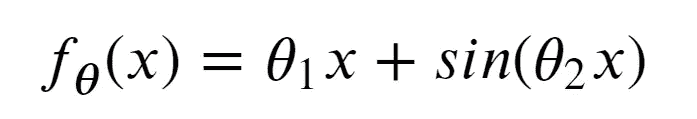
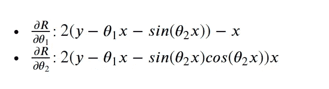
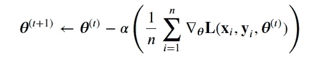
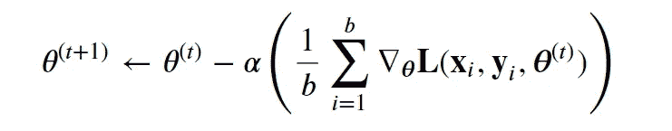
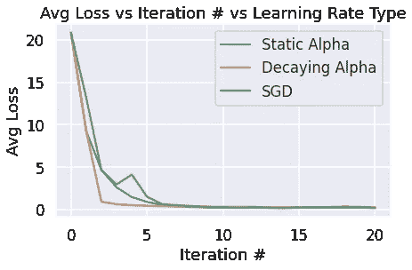
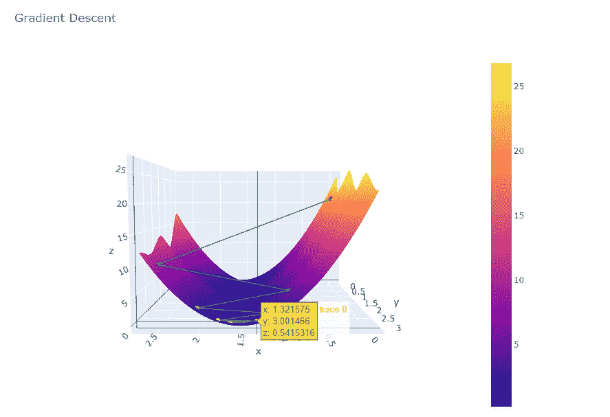
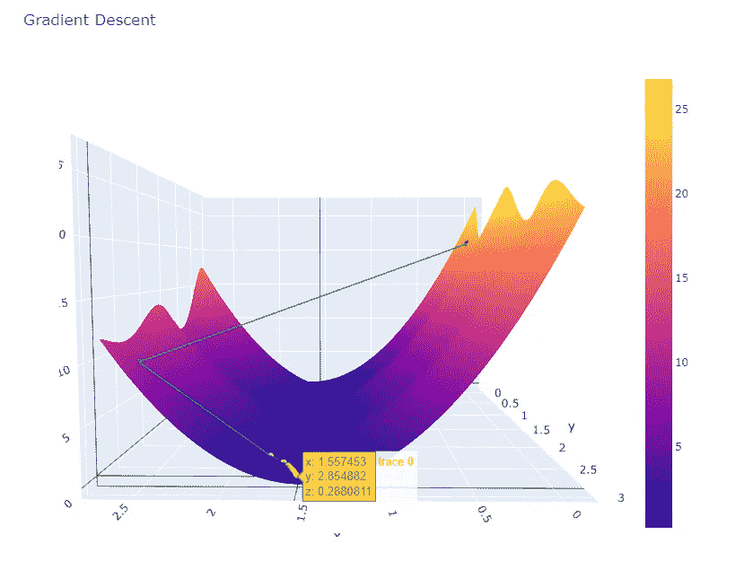
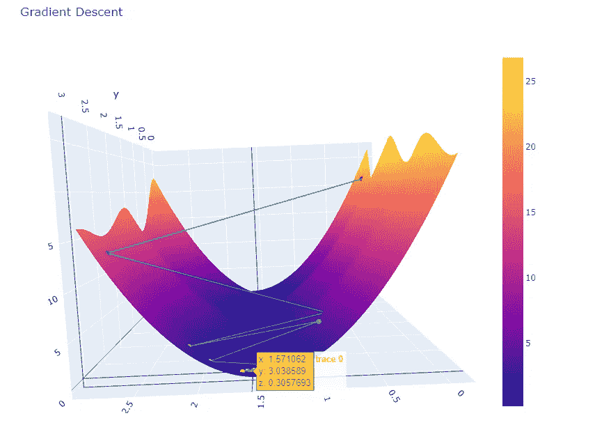

# 30 分钟内梯度下降应用(无 BS)

> 原文：<https://medium.com/analytics-vidhya/gradient-descent-application-in-30-mins-no-bs-e0654e302775?source=collection_archive---------2----------------------->

让我们首先定义一个简单的多项式模型:



我们的模型示例

```
def sin_model(x, theta):
    """
    Predict the estimate of y given x, theta_1, theta_2 Keyword arguments:
    x -- the vector of values x
    theta -- a vector of length 2
    """ theta_1 = theta[0]
    theta_2 = theta[1]
    return theta_1 * x + np.sin(theta_2 * x)
```

**梯度下降背后的直觉:**

1.  最佳θ值最小化损失函数。
2.  我们找到θ最小值的方法是**通过对损失函数对θ**求导

第一步是为我们的模型选择一个损失函数。

假设我们使用均方损失函数作为损失函数，因此:((y_hat — y_obs) ** 2) / n

```
def sin_MSE(theta, x, y):
    """
    Compute the numerical value of the l2 loss of our sinusoidal model given thetaKeyword arguments:
    theta -- the vector of values theta
    x     -- the vector of x values
    y     -- the vector of y values
    """ y_hat = sin_model(x, theta)
    return np.mean((y - y_hat)** 2)
```

我们将这个损失函数对θ_ 1 和θ_ 2 求导，我们得到如下结果:



```
def sin_MSE_dt1(theta, x, y):
    """
    Compute the numerical value of the partial of l2 loss with respect to theta_1Keyword arguments:
    theta -- the vector of values theta
    x     -- the vector of x values
    y     -- the vector of y values
    """

    theta_1 = theta[0]
    theta_2 = theta[1]

    dt_1 = -2 * (y - theta_1 * x - np.sin(theta_2 * x)) * x
    return np.mean(dt_1)

def sin_MSE_dt2(theta, x, y):
    """
    Compute the numerical value of the partial of l2 loss with respect to theta_2Keyword arguments:
    theta -- the vector of values theta
    x     -- the vector of x values
    y     -- the vector of y values
    """
    theta_1 = theta[0]
    theta_2 = theta[1]

    dt_2 = -2 * (y - theta_1 * x - np.sin(theta_2 * x)) * x * np.cos(theta_2 * x)
    return np.mean(dt_2)
```

最后，我们将它们放在一个整体梯度损失函数中

```
def sin_MSE_gradient(theta, x, y):
    """
    Returns the gradient of l2 loss with respect to vector thetaKeyword arguments:
    theta -- the vector of values theta
    x     -- the vector of x values
    y     -- the vector of y values
    """
    return np.array([sin_MSE_dt1(theta, x, y), sin_MSE_dt2(theta, x, y)])
```

## 实现梯度下降功能

有很多方法可以写出你的梯度下降函数；请记住，对您来说，最重要的事情是理解所有这些实现背后的逻辑，并在您自己的分析中找到对您来说最有意义的实现。

**需要记住的一些直觉:**

*   我们试图找到导致损失函数整体最小值的θ_ 1 和θ_ 2 的组合
*   梯度下降在负梯度方向轻推θ，直到θ收敛。

我们开始吧！

1.  **实施梯度下降的逐步指南**

*   其中`df`是我们要最小化的函数的梯度(又名。损失函数)和`initial_guess`是该函数的起始参数(任意的)。

```
**def** gradient_descent(df, initial_guess, alpha, n):
    guesses = [initial_guess]
    guess = initial_guess **while** len(guesses) < n:
        guess = guess - alpha * df(guess)
        guesses.append(guess)
    **return** np.array(guesses)
```

正如您可能注意到的，我们的 sin_MSE_gradient 函数接受 3 个参数(theta，x，y)，如果我们想在 gradient_descent 函数中使用它，我们可能希望对它进行如下优化，以便它只接受 1 个参数(theta):

```
**def** mse_loss_derivative_single_arg(theta):
    x = data['a', 'b']
    y_obs = data['y']

    **return** sin_MSE_gradient(theta, x, y_obs)
```

然后让我们尝试运行梯度下降函数，初始θ向量[0，0]，alpha = 0.001，max_iteration = 100:

```
gradient_descent(mse_loss_derivative_single_arg, np.array([0, 0]), 0.0001, 100)
```

2.**有限次迭代的梯度下降**



更新功能

在每个时间步，使用梯度和`alpha`来更新你当前的`theta`。我们还将电流`theta`保存在`theta_history`中，同时将平均平方损耗(用电流`theta`计算)保存在`loss_history`中

*   让我们首先定义初始θ值，它实际上是图上的任意点

```
def init_theta():
    """Creates an initial theta [0, 0] of shape (2,) as a starting point for gradient descent""" return np.zeros((2,))
```

梯度下降函数:

```
def grad_desc(loss_f, gradient_loss_f, theta, data, num_iter=20, alpha=0.1):
    """
    Run gradient descent update for a finite number of iterations and static learning rateKeyword arguments:
    loss_f -- the loss function to be minimized (used for computing loss_history)
    gradient_loss_f -- the gradient of the loss function to be minimized
    theta -- the vector of values theta to use at first iteration
    data -- the data used in the model 
    num_iter -- the max number of iterations
    alpha -- the learning rate (also called the step size)

    Return:
    theta -- the optimal value of theta after num_iter of gradient descent
    theta_history -- the series of theta values over each iteration of gradient descent
    loss_history -- the series of loss values over each iteration of gradient descent
    """ theta_history = []
    loss_history = []

    #initial x and y values
    x = part_1_data['x']
    y = part_1_data['y']

    #append the original theta and loss     
    theta_history.append(theta)
    loss_history.append(loss_f(theta, x, y))

    #main update function for iteration in range (num_iter):

        #update and append theta
        theta_cur = theta - alpha * gradient_loss_f(theta, x, y)
        theta_history.append(theta_cur)

        #calculate and append loss using cur_theta
        cur_loss = loss_f(theta_cur, x, y)
        loss_history.append(cur_loss)

        #reset theta
        theta = theta_curreturn theta, theta_history, loss_history#running gradient descent 
theta_start = init_theta()
theta_hat, thetas_used, losses_calculated = grad_desc(
    sin_MSE, sin_MSE_gradient, theta_start, part_1_data, num_iter=20, alpha=0.1
)
for b, l in zip(thetas_used, losses_calculated):
    print(f"theta: {b}, Loss: {l}")
```

# E 体验更多的梯度下降

## **衰减阿尔法(学习率)梯度下降**

**直觉:**

通过衰减的学习速率，而不仅仅是一个数字𝛼，学习现在应该是𝛼/(𝑡+1)其中𝑡是梯度下降的当前迭代的数字。

你几乎可以回收上面的大部分代码，而不是每次迭代只更新𝛼到𝛼/(iteration+1。

## 随机梯度下降

**直觉:**



每批大小的θ更新函数

在上面的更新规则中，𝑏(批量大小)比𝑛(数据的总大小)小得多。我们将使用一个静态学习率和一个参数`batch_size`来表示每次迭代的小批量样本的大小。

上面代码的主要变化是我们迭代时的更新功能:

```
for iteration in range (num_iter):
        #sample batch size each iterations 
        sample = data.sample(batch_size)
        out_arr_x = sample['x']
        out_arr_y = sample['y']

        #update and append theta
        theta_cur = theta - alpha * gradient_loss_f(theta, out_arr_x, out_arr_y)
        theta_history.append(theta_cur)

        #calculate and append loss using cur_theta
        cur_loss = loss_f(theta_cur, out_arr_x, out_arr_y)
        loss_history.append(cur_loss)

        #reset
        theta = theta_cur
```

注意:对于 cur_loss，我们计算并保存每个批量的 loss_val，而不是整个数据集。

## 可视化和比较性能

让我们想象一下我们的函数，看看每个函数在收敛到全局最小值时的表现。

```
plt.plot(np.arange(len(loss)), loss, label='Static Alpha')
plt.plot(np.arange(len(loss)), loss_decay, label='Decaying Alpha')
plt.plot(np.arange(len(loss)), loss_stoch, label='SGD')
plt.xlabel('Iteration #')
plt.ylabel('Avg Loss')
plt.title('Avg Loss vs Iteration # vs Learning Rate Type')
plt.legend();
```



```
#3D plot (gradient descent with static alpha)
plot_3d(thetas[:, 0], thetas[:, 1], loss, average_squared_loss, sin_model, x, y)
```



静态阿尔法梯度下降

```
#3D plot (gradient descent with decaying alpha)
plot_3d(thetas_decay[:, 0], thetas_decay[:, 1], loss_decay, average_squared_loss, sin_model, x, y)
```



阿尔法衰减的梯度下降

```
#3D plot (stochastic gradient descent)
plot_3d(thetas_stoch[:, 0], thetas_stoch[:, 1], loss_stoch, average_squared_loss, sin_model, x, y)
```



随机梯度下降

G 梯度下降为我们提供了一种通用的方法，当我们无法解析地求解θ的最小值时，可以使损失函数最小化。随着我们的模型和损失函数越来越复杂，我们将转向梯度下降作为拟合模型的工具。

由于计算大型数据集可能成本高昂且耗时较长，因此随机 GD 计算更新比批量梯度下降快得多。到批量梯度下降完成一次更新时，它可以朝着最优θ取得显著进展。

而衰减的αGD 考虑了更新学习率，这有利于防止过冲，因此步长更精确。