# 梯度下降

> 原文：<https://medium.com/analytics-vidhya/gradient-descent-c37ef7011a2f?source=collection_archive---------28----------------------->

梯度下降是机器学习领域中使用的基本参数优化技术。它实际上是基于成本函数相对于参数的斜率。让我们考虑一个例子:

你是一个喜欢冒险的人，你有机会攀登珠穆朗玛峰，地球上海拔最高的山峰。你的团队开始攀登，不知何故，经过许多努力，你们都到达了顶端。你们都决定庆祝这次胜利，所以你的一个朋友开了一瓶香槟。作为一个敏锐的观察者，你看到软木塞从山上滚下来，它朝着地形最陡峭的方向移动。

梯度下降算法显示了与丘陵地形相同的行为。但是这里的丘陵地形是成本函数。

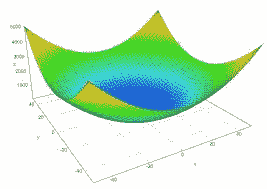

价值函数

我们必须走下这个成本函数山，以达到成本函数的全局最小值或最优值。


我们的成本函数的斜率由参数的偏导数决定。让我们详细讨论一下成本函数。

# 机器学习模型

考虑两个变量 X 和 Y，各有 100 个不同的值。其中 X 是特征变量，Y 是目标变量。

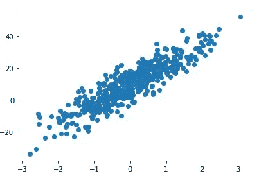

这是我们数据的散点图

> 让我们考虑一个假设:Y' = mX + b

这个 X 和 Y 数据被输入到我们的假设模型中，我们的模型预测每个 X 值的 Y ’,而 *m* 和 *b* 分别是假设函数和偏差的斜率。

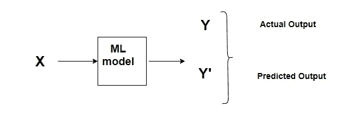

假设模型

因此 *Y* 是对应的 *X* 的实际值，而*Y’*是将 *X* 输入模型时的预测结果。

因此，Y 和 Y’可能具有不同的值。对吗？

> D 差值= Y '(预测)- Y(实际)

这种差异就是模型的误差。更具体地说，这个错误帮助我们定义我们的*成本函数。*

# 价值函数

成本函数/损失函数有助于评估模型的性能。代价函数给出了整个训练样本的平均损失，这里 *N* 是训练样本的总数。

成本函数由误差平方和给出。

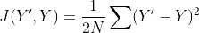

价值函数

> 我们采用总平方误差，因为它使误差距离更大，使得坏的预测比好的预测更引人注目，并且很容易计算平方函数的导数。


成本函数山

现在我们已经定义了我们的丘陵地形，我们准备沿着斜坡开始我们的旅程，让重力做所有的工作。Wheeeeeee。

## 最小化成本函数

最终，我们的目的只是降低成本，以获得与成本函数值相对应的参数的最优值。

为了最小化成本，我们沿着成本函数的斜率得到最低点(全局最小值)。

成本函数的斜率由成本相对于参数***【m】****(假设函数的斜率)****b****(偏差)的偏导数决定。*

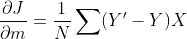

衍生产品

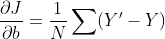

衍生工具

这些导数给了我们成本函数的斜率。但是我们怎么下山呢？

为了沿着斜坡前进，我们需要沿着斜坡定义我们的步骤，这样我们将到达最低点(全局最小值)。

# 学习率:α

> 我们的步伐是由学习速度决定的。学习率越高，我们的步数就越大，因此我们可能会超过预期的点。然而，对于一个小的学习率，我们可能要走很多步才能到达最低点。

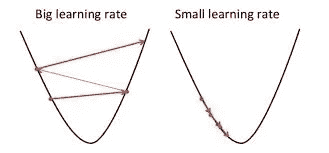

错误选择的学习率可能导致我们的成本函数永远不会达到全局最小值。

这个值从来不是一个特定的值，它随成本函数而变化，因此必须调整这个值以达到他/她的成本函数的最佳结果。

## 在每个步骤之后更新参数

现在我们有了山坡，也定义了我们的步骤，我们可以沿着山坡走了。

当我们将我们的数据 *X* 和 *Y* 给假设函数时，我们的成本函数在每次迭代后计算损失，并且根据损失，我们借助于关于我们的参数 ***m*** 和 ***b.*** 的导数来获得我们的陡峭侧，因此在获得成本函数的陡峭侧之后，成本函数值更接近最小值和我们的参数 ***m***

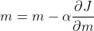

m 的值被更新

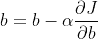

b 的值被更新

> 这就是线性回归线随斜率和偏差更新的方式。

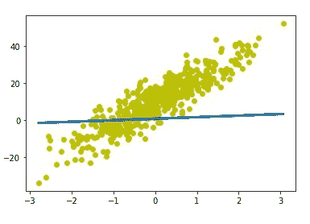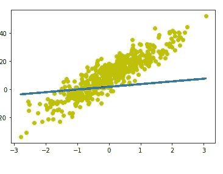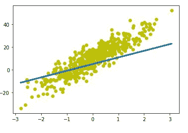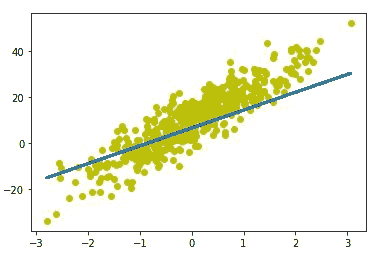

> 最后，我们得到了斜率和偏置的优化值，这是最终的图表

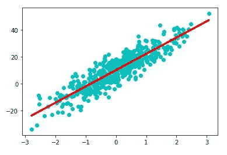

斜率和偏差的优化值

> 这是梯度下降算法的 python 实现，你可以在我最后提供的链接中找到它。

```
def gradient_descent(X,y):
    m = b = 0
    learning_rate = 0.01
    epochs = 1000 
    n = len(X)
    for epoch in range(epochs):
        y_predicted = m*X + b
        cost = (1/(2*n))*sum([val**2 for val in (y_predicted-y)]) 
        derivative_wrt_m = (1/n)*sum((y_predicted-y)*X)
        derivative_wrt_b = (1/n)*sum(y_predicted-y) 
        m = m - learning_rate * derivative_wrt_m
        b = b - learning_rate * derivative_wrt_b 
    return m,b,cost
```

以这种方式，我们得到参数 ***m*** 和 ***b*** 的最优值，对应于成本函数的最小值。因此我们得到了我们的最小值。

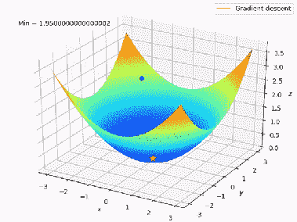

达到最低限度

我已经在我的 [Github 库](https://github.com/pradyyadav/Gradient_Descent/blob/main/gradient_descent.ipynb)中的 jupyter 笔记本上实现了这个算法。请看一看。

这里，我们已经达到了全局最小值，这是成本函数的期望值。但是有时可能会发生这样的情况，即成本函数值不是达到全局最小值，而是停留在局部最小值。

好了，这是下一部分的故事。

谢了。