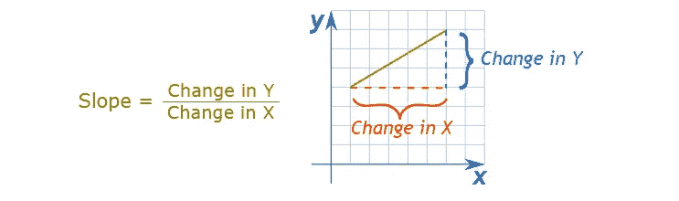
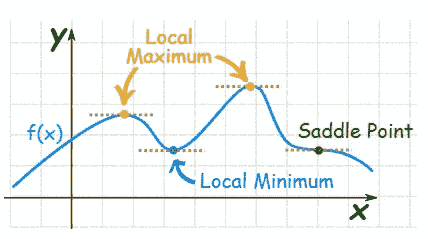

# 梯度下降第一部分:直觉

> 原文：<https://medium.com/analytics-vidhya/gradient-descent-part-1-the-intuition-a154a6d43c2e?source=collection_archive---------13----------------------->

什么是机器学习中的梯度下降？

每个在机器学习领域学习/工作的人都会遇到一种叫做梯度下降的算法，我们不得不承认梯度下降让算法的生活变得更加简单。这篇文章是关于梯度下降的，在这里我们将看到什么是梯度下降，以及我们如何使用它来简化 ML 算法的工作，以获得最好的结果。

我们开始吧，

众所周知，维基百科拥有任何人想阅读的大部分信息，因此维基百科对梯度下降有自己的定义。让我们看看维基百科是怎么说的，

> [梯度下降](https://en.wikipedia.org/wiki/Gradient_descent)是一种寻找可微函数局部极小值的一阶迭代优化算法。为了使用梯度下降找到函数的局部最小值，我们采取与函数在当前点的梯度(或近似梯度)的负值成比例的步骤。但是如果我们取而代之采取与梯度的正值成比例的步骤，我们就接近了该函数的局部最大值；这个过程被称为梯度上升。

非常简单的权利，我只是喜欢维基百科，因为它简单的定义。现在让我们从一个简单的例子开始，看看维基百科试图从上面的定义中传达给我们什么，

图片提供:[https://www . potatonewsoday . com/2021/01/04/webinar-global-climate-change-and-potato-storages/](https://www.potatonewstoday.com/2021/01/04/webinar-global-climate-change-and-potato-storages/)

你一定对上面的土豆很熟悉，现在想象一下你在市场上买土豆，然后你遇到了上面的土豆商店。现在你开始从这一堆土豆中挑选好的土豆，因为每个人都想要最好的土豆来烹饪，你也想要一样的。假设你开始从山顶上摘土豆，然后一直向下，向下，向下，直到你发现质量最好的土豆在这座土豆山的底部。于是你在那个地方停下来，高高兴兴地挑了一些质量最好的土豆买了下来。

在上面的场景中你到底做了什么？你在那座大土豆山上找到了最好的地方，那里的土豆质量最好，对吗？

同样的，

***梯度下降*** 算法帮助我们找出*‘x’*的最佳(最优)值，在这里我们得到函数 *f(x)的最小值。*我希望你现在已经知道我们到底要用梯度下降做什么了，如果没有，那么继续读下去，我正在慢慢揭示梯度下降的秘密。

这是对梯度下降算法的直观理解，但是当它用于机器学习时，我们必须知道它的数学公式，以便理解它的实际用途。

在深入研究梯度下降的数学之前，我们需要了解以下概念:

A.斜率是多少？

直线的斜率(也叫[坡度](https://www.mathsisfun.com/gradient.html))表示**一条直线有多陡**。

要计算斜率:

将**的高度变化**除以**的水平距离变化:**

[https://www.mathsisfun.com/geometry/slope.html](https://www.mathsisfun.com/geometry/slope.html)

以另一种方式，斜率由' *df(x)/dx '，*表示，其中 *f(x)* 可以是任何可微函数，并且该符号通常在机器学习方面处理斜率时使用。

斜率的值可以是负值也可以是正值，看下图，

[https://www.mathsisfun.com/geometry/slope.html](https://www.mathsisfun.com/geometry/slope.html)

B.什么是最大值和最小值？

这些概念基本上与我们上面讨论的斜率值有关。

[https://www.mathsisfun.com/calculus/maxima-minima.html](https://www.mathsisfun.com/calculus/maxima-minima.html)

在平滑变化的函数中，最大值或最小值总是在函数**变平**的地方(除了**鞍点**)。

***哪里变平了？*** 其中**斜率为零**。

***斜率零点在哪里？*****导数**告诉我们，在‘x’的什么值，我们得到' *df(x)/dx '，即*斜率为零。

简单来说，

*   高点称为**最大值**(复数 ***最大值*** )。
*   低点称为**最小值**(复数 ***最小值*** )。

现在你可以从数学上理解梯度下降了，我会在博客的下一部分解释。我希望你喜欢读这个博客，如果你喜欢，分享它，也给一个掌声。谢谢你坚持到最后，我会很快在博客的下一部分见到你。

对于第 2 部分: [**点击这里**](https://harshjadhav100.medium.com/gradient-descent-part-2-the-math-c23060a96a13)

> 参考资料:

*   [https://en.wikipedia.org/wiki/Gradient_descent](https://en.wikipedia.org/wiki/Gradient_descent)
*   【https://www.mathsisfun.com/】T2微积分