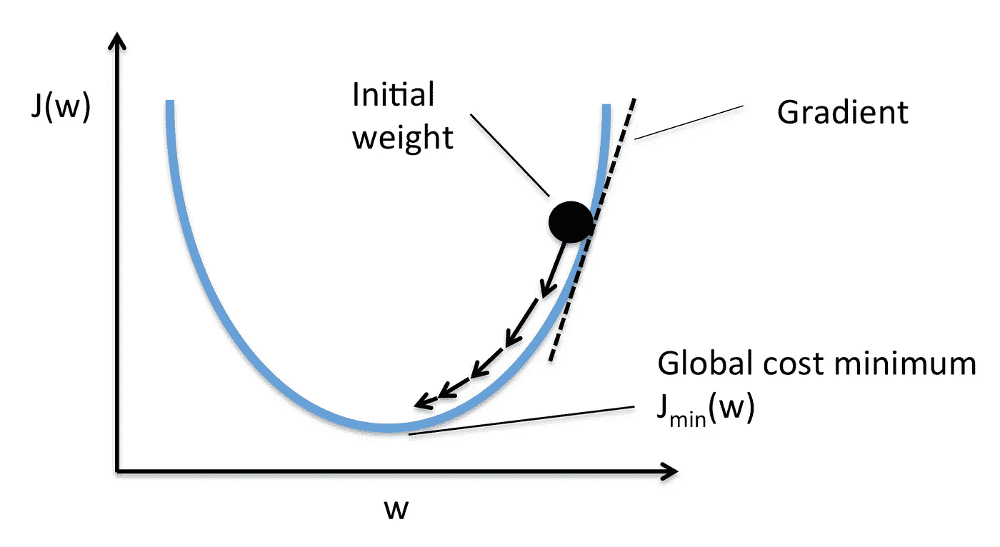

# 梯度下降第 2 部分:数学

> 原文：<https://medium.com/analytics-vidhya/gradient-descent-part-2-the-math-c23060a96a13?source=collection_archive---------18----------------------->

梯度下降的数学原理。


在本文的第一部分，我们看到了对梯度下降的直观理解，以及对其进行数学理解所需的一些概念。在这篇文章中，我们将深入梯度下降的数学细节。如果你还没有阅读这个博客的第一个直观部分，我建议你通过 [***点击这里***](https://harshjadhav100.medium.com/gradient-descent-part-1-the-intuition-a154a6d43c2e) *来阅读这个博客。*

本博客概述:

1.  什么是机器学习中的优化？
2.  我们如何使用梯度下降进行优化？

我们现在准备好出发了，

# 1.什么是机器学习中的优化？

你一定想知道为什么我们会读到这个优化的东西，原因很简单，梯度下降是一个优化算法，要理解它，我们必须先知道什么是优化。简单来说，优化就是“最大限度或最有效地利用环境或资源的行为。” 但是在机器学习方面那些情况或者资源是什么？当我们使用机器学习算法来执行一些预测任务时，每个算法都有一些损失函数来衡量该算法执行预测任务的性能。这个损失函数帮助我们了解机器学习算法预测期望输出的效果。损失越低，算法越好，因此任何机器学习任务的目标都是实现最小的损失，从而实现最大的准确性。损失基本上是一种误差测量技术，也称为成本函数。我们可以称之为计算期望输出和我们的模型预测之间的差异的函数。

优化的目标是找到最小化损失函数的特定算法的最佳参数。我们已经在之前的博客中看到了什么是最小值和最大值，优化试图找到损失函数的最小值，即' *x'* 的值，为此我们得到了' *f(x)* '的最小值。

酷，这并不复杂。

# **2。我们如何使用梯度下降进行优化？**

正如我们上面讨论的，我们建立了一个机器学习模型来执行预测任务，因此它总是具有成本/损失函数。现在在这一部分，我们将看到如何使用梯度下降进行优化。看看下面这张漂亮的图表，



图片提供:[https://paperswithcode.com/method/sgd](https://paperswithcode.com/method/sgd)

这里，在“X”轴上，我们有“w”变量，在“Y”轴上，我们有 J(w)，即“w”的某个函数。

以下是执行优化的步骤:

首先，初始化函数 J(w)的参数，即随机设置“w”的值，

然后，对于每次迭代，通过使用以下公式计算新的“w ”,

w _ new = w _ old-r *(*dJ(w)/dw)*

并迭代直到我们找到最小值 J(w ),即直到我们得到给出如上图所示的最小值 J(w)的值“w”。这里( *dJ(w)/dw)* 是斜率或梯度(损失函数 w.r.t .对参数的导数)，而‘r’是学习速率或步长。

学习速率或步长“r”是一个常数值，我们用它来定义成本函数在每次迭代中应该收敛多少值。

数学也没那么复杂，对吧？无论我们在上面看到了什么，我们都将以代码的形式看到，

```
weights **=** 0.01 # intial value we can keep any random valuestep_size **=** 0.001**for** epoch **in range**(**100**)**:** weights_grad **=** evaluate_gradient(loss_fun, data, weights)
    weights **=** weights **-** step_size ***** weights_grad *# parameter update*
```

就像它是数学一样，代码也很简单。相信我，这是许多机器学习算法中使用的优化的核心思想，如果你理解了这一点，你就能够很容易地理解其他方法。

好的，我们上面看到的梯度下降也称为批量梯度下降，因为它考虑了数据集中的所有数据点，用于每次迭代的计算，并在迭代后用整个数据集更新权重，这对于小数据集来说是好的，但在大数据集的情况下，考虑所有数据点在计算上变得非常昂贵。

因此，为了解决这个问题，研究人员提出了一个很好的 GD 变体，称为随机梯度下降(SGD)。在 SGD 中，唯一的区别是我们使用一个小的随机数据子集，而不是整个数据集，并且权重更新发生在每个数据点，而不是在整个迭代之后。这使得该算法的计算成本更低，即使对于大型数据集。其余部分同批次 GD。让我们看看 SGD 的代码，

```
weights **=** 0.01 # intial value we can keep any random valuestep_size **=** 0.001 **for** epoch **in range**(**100**):   
    np.random.shuffle(data)   
    **for** example **in** data:     
        weights_grad **=** evaluate_gradient(loss_fun, example, params)
        weights **=** weights **-** step_size ***** weights_grad
```

GD 还有另一种变体，即小批量梯度下降。我们将直接看到它的代码，你自己就会明白它与其他两个变体的不同之处。

```
weights **=** 0.01 # intial value we can keep any random valuestep_size **=** 0.001
batch_size **=** 50 **for** epoch **in** **range**(**100**):
    **for** batch **in** np.random.choice(data, batch_size): 
        weights_grad **=** evaluate_gradient(loss_fun, batch, weights)
        weights **=** weights **—** step_size ***** weights_grad
```

我知道你在这种类型的 GD 中得到了不同，是的，你很聪明，猜对了，小批量梯度下降对每个小批量训练样本执行权重更新。

很好，到目前为止，您已经了解了机器学习领域中非常常见且最重要的优化算法。

那么下一步是什么？我们应该检查这种优化对于实际的机器学习算法是如何工作的。我肯定会在以后的博客中报道这件事。非常感谢你坚持到最后。下一篇博客再见。

> 参考资料:

*   【https://cs231n.github.io/optimization-1/#optimization 
*   [https://ruder.io/optimizing-gradient-descent/index.html](https://ruder.io/optimizing-gradient-descent/index.html#gradientdescentvariants)