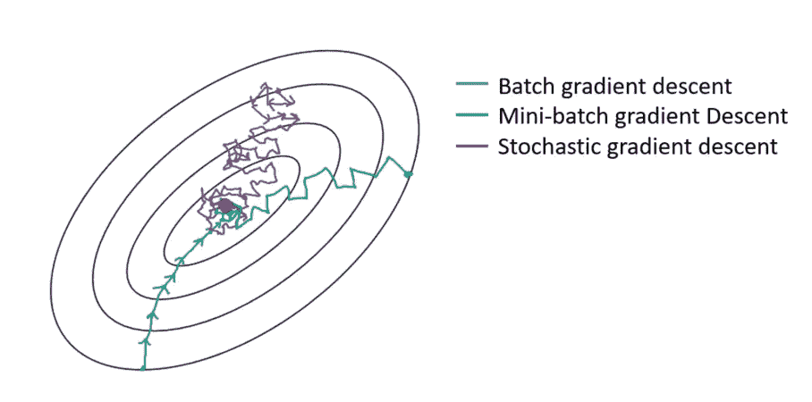
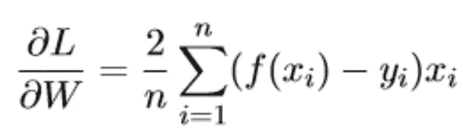
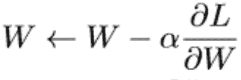
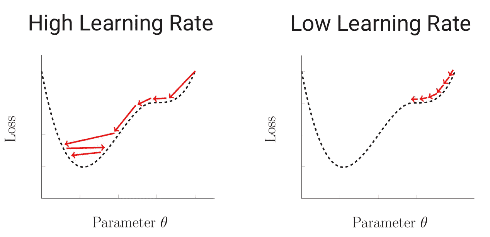
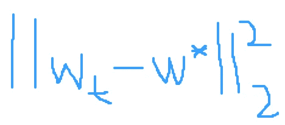
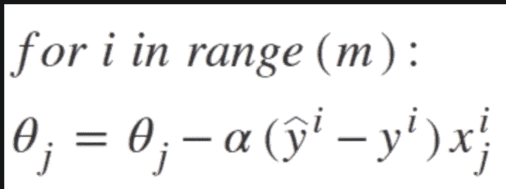

# 梯度下降 vs 随机 GD vs 小批量 SGD

> 原文：<https://medium.com/analytics-vidhya/gradient-descent-vs-stochastic-gd-vs-mini-batch-sgd-fbd3a2cb4ba4?source=collection_archive---------2----------------------->

警告:以防术语“偏导数”或“梯度”听起来不熟悉，我建议查看这些资源！

[https://www . mathsisfun . com/calculus/derivatives-partial . html](https://www.mathsisfun.com/calculus/derivatives-partial.html)

[https://www . khanacademy . org/math/multivariable-calculus/multivariable-derivatives/gradient-and-direction-derivatives/v/gradient](https://www.khanacademy.org/math/multivariable-calculus/multivariable-derivatives/gradient-and-directional-derivatives/v/gradient)

PS，批量梯度下降=梯度下降

梯度下降是一种迭代算法，其目的是对一组参数(即数据集的特征)进行改变，希望达到一组最佳参数，从而尽可能降低损失函数值。

损失或成本或目标函数(这些命名惯例中的任何一个在实践中都有效)是我们寻求最小化其值的函数。损失函数的形式如下:

当执行梯度下降时，每次我们更新参数，我们期望观察到 min f(w)的变化。也就是说，在每次迭代中，取包含 w 中的参数的函数的梯度，使得函数相对于参数的变化使我们更接近于达到最终将导致最低可能损失函数值的最佳参数集的目标。

我们使用的模型(例如最小二乘法、逻辑回归等。)需要学习这个最佳参数集，以便模型的预测非常接近我们想要获得的目标。

所以我们取损失函数关于参数向量 w 的梯度。

w 可以是 d 维向量或矩阵，其在梯度下降中的每次迭代之后通过采用朝向全局最小值移动的相反梯度方向来更新。所谓全局最小值，我指的是我们希望优化的函数值比所有其他可行点给出的值小的点。下面是如何更新参数 w 的向量的一般形式。

学习率α决定了我们达到这个全局最小值所采取的步骤的大小。

根据学习率的设置，向全局最优的收敛会有所不同。

图片来自:[https://www . math . purdue . edu/~ nwinovic/deep _ learning _ optimization . html](https://www.math.purdue.edu/~nwinovic/deep_learning_optimization.html)

我想我的职业是艺术。

左图代表执行梯度下降的主要目标。从一个初始向量 w 开始，最小化 w 和 w*之间的距离。

现在，有一些重要的性质(如凸性、严格凸性等。)某些功能可能会使下降方法的生活更容易。如果你有兴趣阅读更多关于这方面的内容，请查看下面的链接，链接到我觉得信息量很大的课堂讲稿。

[https://sboyles.github.io/teaching/ce377k/convexity.pdf](https://sboyles.github.io/teaching/ce377k/convexity.pdf)

在继续之前，先回顾一下梯度下降的步骤:

1.  最初从一组随机的参数值开始，这可以是一个权重向量:w
2.  使用整个数据集计算 w 中每个参数的偏导数
3.  更新 w 中的参数集
4.  返回更新的 w 和损失函数值

重要的是要注意，当权重向量中的参数改变时，损失函数中发生的改变不应以大得多的因子改变。如果出现这种情况，模型或系统被认为是病态的。梯度下降将花费比保证收敛到最佳权重向量更多的迭代。编程梯度下降时，跟踪 w 和损失函数值的变化很重要。指定 w 更新的次数或迭代次数。

让我们看一个例子。假设我们有 40，000 个训练样本和 20 个特征。这意味着我们使用 40，000 个样本来更新我们的 20 个功能中的每一个。我们正在计算 40，000 项，对于向量 w 的每个偏导数！这意味着计算 800，000 个偏导数以达到最低损失函数值。

因此，梯度下降要求使用整个数据集计算梯度，以更新模型的参数。实际上，梯度下降的计算成本可能非常高，并且达到最佳权重向量 w 所花费的时间可能非常长。

但是，如果我们不想使用可能包含数百万训练样本的整个数据集来更新我们的参数向量/矩阵 w，该怎么办呢？

随机梯度下降(SGD)是梯度下降的一种变体，它从数据集中随机抽取**一个**训练样本，用于计算每次迭代的梯度。随机梯度下降工作良好，因为我们仅使用一个数据点来计算梯度，更新权重向量 w，并计算损失函数值。更新 w 的等式稍微改变为。上标 I 表示用于更新下面θ的单个数据点。

图片来自:[https://www . geeks forgeeks . org/ml-随机-梯度-下降-sgd/](https://www.geeksforgeeks.org/ml-stochastic-gradient-descent-sgd/)

在算法的每次迭代中，随机梯度下降法随机抽取一个样本，并计算所有的偏导数。回到我们之前的例子，从我们的 n = 40，000 样本量中一次随机抽取一个样本，计算 20 个偏导数，因为我们有 20 个参数，并且这个过程持续指定数量的时期。

由于 SGD 一次从一个数据集中随机抽取一个样本(从头开始编码时，请确保在每次迭代中打乱数据集)，最终它必须遍历整个数据集。一次通过整个数据集称为一个时期。历元可用于梯度下降和 SGD 之间的比较，以比较 w 中的起始参数接近其最佳值的速率。

随机梯度下降算法；

1.  初始化权重向量
2.  对于 t = 0，1，…，T，其中 T 表示一个历元，请执行以下操作:

a.从数据集中随机抽取一个数据点

b.使用训练样本和权重来计算梯度

c.更新权重向量

d.降低学习率/步长(实践中很好)

3)返回(接近)最佳权重向量

在 SGD 中处理单个样本需要执行许多单个矩阵-向量(或向量-向量)乘法，这在计算上变得昂贵。

现在，如果我们不仅想在每次迭代中使用 1 个样本，而是想通过使用 1 个数据点和整个数据集之间的一批样本来推动事情的发展，会怎么样呢？对多个样本进行采样以计算 SGD 的梯度，这样 1 < **b** < n 被称为**小批量**随机梯度下降(MBSGD)。有些人可能称他们的算法实现为 SGD，同时使用**小批量**来解决他们的优化问题，所以请留意这一点！

在 MBSGD 中，梯度是在小批量的训练样本上计算的，以便更新参数，并且损失函数值(希望)在每次迭代中继续降低。小批量随机梯度下降的优势包括:

*   模型参数被更频繁地更新，这允许更强地向最佳参数值收敛
*   计算效率更高，因为 MBSGD 不使用完整的数据集。因为使用数百万训练样本来更新潜在的数千个参数是非常低效的

MBSGD 在算法实现上非常接近。使用小批量方法时，从数据集中随机抽取 b 个数据点来计算梯度。MBSGD 中的每个历元具有 n/b 次迭代(n 是数据集的大小),以使用 b 个样本来计算梯度和损失函数。

对于深度学习任务，为了适应 CPU 和 GPU 硬件的内存要求，请在对数据训练模型之前指定最小批量。在实现 MBSGD 时，8、32、64、128 等小批量是合适的批量。始终跟踪损失函数是如何变化的。

记住，在每一种梯度下降法中，我们都非常想最小化损失函数。因此，在 MBSGD 的情况下，如果函数值在一定数量的历元后碰壁，这可能意味着有必要微调批量大小和/或微调其他几个值(即学习率、正则化/权重衰减、动量等)。).

我希望你喜欢读这篇文章。快乐学习！