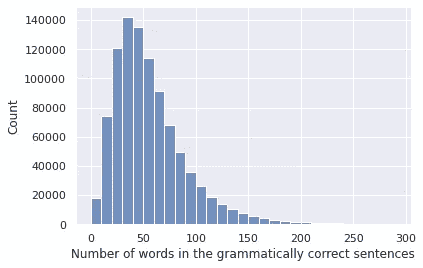
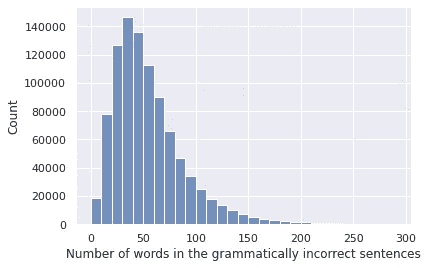
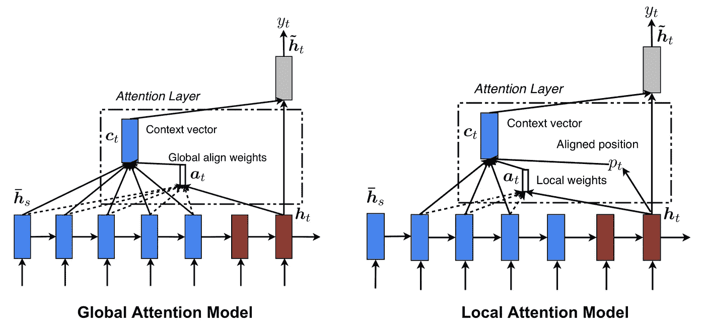
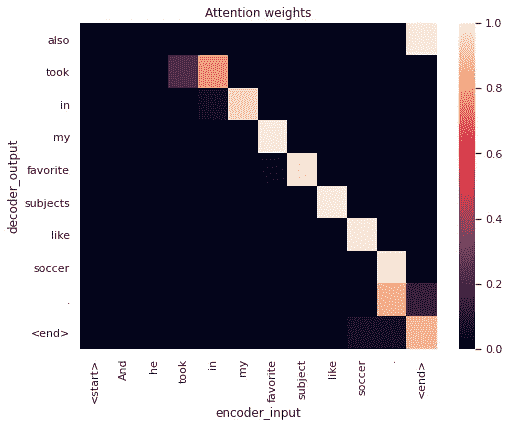
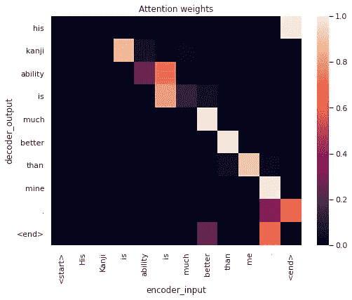
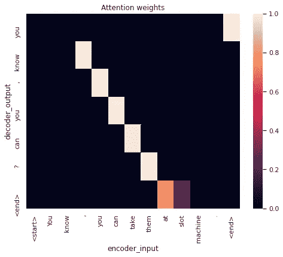

# 语法纠错:机器理解和纠正文本中的错误！

> 原文：<https://medium.com/analytics-vidhya/grammatical-error-correction-machines-understanding-and-correcting-errors-in-text-21638203ca9f?source=collection_archive---------5----------------------->

纳迪·博罗迪纳在 [Unsplash](https://unsplash.com?utm_source=medium&utm_medium=referral) 上拍摄的照片

**语法错误纠正(GEC)** 是指**检测和纠正语法错误句子的语法**中的错误的任务。这些错误可能包括各种语法错误，如**拼写错误、冠词、介词、代词、名词等的错误使用，甚至是糟糕的句子结构**。GEC 本质上是一项 NLP 任务，它通过学习如何像人类一样纠正语法，使我们的机器像我们一样思考。语法纠错有广泛的应用，用于测试输入文本的语法，例如在电子邮件应用、文本编辑器、记事本等中。

这个博客旨在解决使用神经网络纠正语法错误的任务，并试图分析改进它所需的步骤。

## **以下是本博客的内容:**

1.  文献调查
2.  问题的 ML 公式
3.  业务限制
4.  电子设计自动化(Electronic Design Automation)
5.  基线模型
6.  最终模型
7.  结果

# **文献调查**

Naghshnejad 等人。艾尔。谈论语法错误检测和纠正系统的最新趋势和以前的工作，以及这些工作面临的挑战。解决这个问题的方法主要是基于规则、基于语法、基于机器学习和基于深度神经网络。此外，资源较少的语言，如阿姆哈拉语、丹麦语、希腊语、拉脱维亚语、旁遮普语、菲律宾语、阿拉伯语也得到解决。

## **基于规则、基于语法 vs 机器学习和深度神经网络**

*基于规则的系统*使用一组预定义的规则(错误模式)来匹配文本，所有规则都是手工开发的。*另一方面，*基于语法的系统，使用文本的语法以及词汇数据库、词法分析器和语法分析器。解析器用给定的语法创建解析树，如果完整的树创建不成功，则认为文本是错误的。

这些方法对于一些语法错误是有利的，但是当我们想要覆盖许多不同种类的语法错误时，这些方法是低效的。此外，由于它们需要大量的存储和大量的劳动力，所以探索了其他方法。

*机器学习方法*主要包括两种方法，即基于分类和基于统计的方法。这些方法在 GEC 的任务中非常成功，但需要大量的功能工程，反过来，需要大量的时间和专业知识。

最近的工作表明，在语法错误纠正和检测任务中使用*神经网络和神经机器翻译*的结果非常令人鼓舞。许多这样的 NMT 体系结构已经使用了字符级翻译模型或单词级翻译模型。

> 为什么要使用神经网络？
> 
> -不需要特征工程，因为深度学习算法会自己学习最重要的特征
> 
> -已经证明在 GEC 任务中提供了非常强大的基线

用于 GEC 的几个常用数据集是 CoNLL-13、CoNLL-14(来自 CoNLL GEC 竞赛)、FCE 数据集等。

## **字符级与单词级翻译模型**

[袁与布里斯科等人。艾尔。](https://aclanthology.org/N16-1042/)使用了一个**词级**神经机器翻译模型，使用 RNNs 进行从不正确的句子到格式良好的句子的序列到序列映射，在 FCE 数据集上取得了 53.49 的 F0.5 分数，在 CoNLL-2014 测试集上取得了 39.9 的分数，这是一个相当不错的分数。

他们的模型用 UNK 符号取代了不常用的单词，并在 NMT 模型的输出中应用了 GIZA++和 METEOR 等无监督对齐模型，以找到未知单词的来源，然后他们使用在平行句子上训练的单词级翻译模型进行翻译。

这种方法的局限性是，该模型没有考虑词汇之外或上下文中的 OOV 词来做出正确的决策，并且不能很好地概括以纠正在并行训练数据中未看到的词。

另一方面，[谢等人](https://www.researchgate.net/publication/301879441_Neural_Language_Correction_with_Character-Based_Attention)使用了**字符级**翻译模型，而不是单词级模型，避免了单词的问题，在 CoNLL 14 测试集上取得了 40.56 F0.5 的成绩。

这种方法的局限性在于，即使与基于单词的语言模型一起使用，该模型也不能利用单词级信息。

## **CNN 的使用**

[金等人。艾尔。](http://nlp.seas.harvard.edu/papers/aesw2016.pdf)给出了一个模型，该模型是由**三个基于字符的编码器-解码器模型、一个基于单词的编码器-解码器模型和在 AESW 2016 二进制预测共享任务(识别句子中是否有错误)上执行最高的句子级 CNN** 的组合。

## **其他途径**

1.  [达尔迈尔等人。al](https://aclanthology.org/D12-1052.pdf) 。提出了一种**波束搜索解码器，它从当前假设中迭代生成新的假设修正，并基于语法正确性和流畅性的特征对其进行评分**。
2.  [Alikaniotis 等人](https://arxiv.org/pdf/1906.01733.pdf)提出了**在大型语言语料库上训练的最新变压器语言模型，并在没有任何监督训练的情况下在 GEC 任务上评估了它们的性能**。使用语言模型完成 GEC 任务背后的核心思想是，语法错误的句子出现的概率应该很低。我们需要学习如何将这种低概率序列转换成高概率序列或者语法正确的序列。
3.  [拉赫贾等人。艾尔。](https://aclanthology.org/2020.findings-emnlp.275.pdf)展示了**在使用生成器鉴别器架构的 GEC 任务中使用对抗学习方法**。该生成器是一个转换器模型，被训练成在给出语法不正确的句子的情况下产生语法正确的句子。鉴别器是一个句子对分类模型，用于从语法上判断句子对。这两个模型都是在平行文本上进行预训练，然后使用策略梯度方法进行进一步微调，该方法为可能是语法错误文本的真正更正的句子分配高奖励。

# **问题的 ML 公式化**

我们使用 NMT 将 GEC 任务建模为序列到序列学习任务，其中来自源语言的文本或向量被映射到目的语言的向量，这只是给定输入的输出的最大似然估计。

# **业务限制:**

*   系统应该具有高精度，并且优先考虑具有更高精度的系统，而不是召回。
*   低延迟总是首选。
*   此外，由于问题涉及将语法不正确的文本作为输入，当部署在服务器上时，我们需要优化的管道来处理输入数据量。

# **数据集**:

有多个数据集可用于这项任务，如 CoNLL-13、CoNLL-14、Lang-8、FCE、JFLEG 等。每个聚焦于不同种类的误差和目标。

对于这个任务，我使用了 Lang-8 数据集。

# **EDA:**

上图显示了输入的句子长度直方图，即语法错误的句子和输出的语法正确的句子。每个语料库的句子长度分布似乎是相似的。

语法正确的句子(左)和语法不正确的句子(右)的单词云

上面的图显示了单词云，以找出语法正确和语法不正确的句子中最常见的单词，这些单词有些相似(think，today，friend 等)。

我们还可以通过向从任何来源获得的文本中添加错误来创建自己的数据集。下面是一个使用 Spacy 的简单代码。

## **损失:**

我们使用**屏蔽稀疏分类交叉熵**损失作为损失函数。

## **指标:**

**Fbeta 分数**(beta = 0.5)用作训练指标，而 **BLEU 分数**用于判断最终表现。

# **基线模型:**

对于基线模型，我专门训练了一个普通的编码器解码器模型和一个编码器解码器模型。

## **编码器解码器和注意力模型**

由 [Sutskever 等人](https://papers.nips.cc/paper/2014/file/a14ac55a4f27472c5d894ec1c3c743d2-Paper.pdf)介绍的**编码器解码器模型**，广泛用于序列到序列的映射，基本上由编码器和解码器两部分组成，其中**编码器** *将输入向量*编码为*上下文向量*，而**解码器** *将该上下文向量解码为输出*。**上下文向量**被期望*捕获输入*的本质，其基本上是编码器的输出。rnn 被广泛用作编码器和解码器，因为它们非常好地捕获序列信息。

编码器/解码器模型执行得非常好，但是一旦输入向量开始变长，就很难捕捉到本质。为了解决这个问题，Bahdanau 等人引入了注意机制。艾尔。改进编码器/解码器模型，成功翻译较长的输入句子。

直观地说，**注意机制** *获取每一个时间步长*的上下文向量和编码器输出，*为每一个编码器时间步长*计算一个 **注意权重** *。这个权重告诉我们*对每个编码器输出*的重视程度，并与每个时间步的编码器输出相乘，然后在每个时间步馈送给解码器。因此，在确定每个时间步*的解码器输出时，解码器知道*对哪个输入字给予最大关注。下图解释了注意力网络。*

注意机制:[来源](https://lilianweng.github.io/lil-log/2018/06/24/attention-attention.html)

左下方由 hs 条表示的蓝色块代表所有时间步长的**编码器输出**。我们可以想象，五个蓝色模块代表编码器输入，或者换句话说，五个字(假设字级转换)，在每个时间步长都被输入到编码器模块，从而得到编码器在每个时间步长的输出。

由 ht 表示的右下方的栗色块表示每个时间步长的**解码器隐藏状态**，因此为了简单起见，我们假设最后一个块正在解码输入句子的第二个单词。

如左图所示，解码时，对于每一步，从编码器输出创建一个**上下文向量**，ct。如果使用**全局注意力**，所有编码器输出(即在所有时间步长)用于创建该向量。这个向量实际上就是每个输出与一个**注意力权重**相乘的和。at 表示包含每个时间步长的所有注意力权重的向量。

为了获得这个注意力权重，我们使用评分函数，并将其应用于编码器输出和解码器隐藏状态。例如，如果我们使用点积评分函数，我们简单地取编码器状态和解码器隐藏状态的点积来得到注意力权重。这个权重告诉我们每个编码器状态对于当前解码器状态给予我们多少重要性或上下文。

对于右侧所示的**局部注意**,我们仅使用解码器所处时间步长附近的编码器状态。

最后，我们将当前解码器隐藏状态 ht 与上下文向量 ct 连接起来，并将其馈送给解码器，以获得下一个解码器隐藏状态 ht~。

## **培训**

我使用 Adam 优化器训练模型，学习率为 0.01。对于嵌入，我参考 [this](https://github.com/mridul1012/Grammatical-Error-Correction-with-Neural-Networks) github 使用了 FastText 嵌入。为了达到最佳效果，我将句子的最大长度控制在 15 个。

## 结果:

注意图:

翻译结果:

最终 BLEU 分数:0.68

*感谢阅读！*

所有的代码都可以在[这里](https://github.com/aishani691/Grammar_Error_Correction)找到。

# 进一步的工作

通过利用最先进的 NLP 架构(如 GPT 架构、BERT 等)的能力，现有方法还有很大的改进空间。gan 也已经被证明是许多 NLP 应用的游戏规则改变者，并且可以进一步提高输出。

## **参考文献:**

1.  [https://lilian Weng . github . io/lil-log/2018/06/24/attention-attention . html](https://lilianweng.github.io/lil-log/2018/06/24/attention-attention.html)
2.  [https://www . Applied ai course . com/course/11/Applied-Machine-learning-course](https://www.appliedaicourse.com/course/11/Applied-Machine-learning-course)