# 使用神经网络的语法错误纠正

> 原文：<https://medium.com/analytics-vidhya/grammatical-error-correction-using-neural-networks-aaf3e9fc91c?source=collection_archive---------1----------------------->

[来源](https://www.google.com/url?sa=i&url=https%3A%2F%2Flink.springer.com%2Farticle%2F10.1007%2Fs10489-020-01980-1&psig=AOvVaw21ox4DuMEecL90mkal2FS2&ust=1624187307808000&source=images&cd=vfe&ved=0CAwQ3YkBahcKEwjInuG2x6PxAhUAAAAAHQAAAAAQAw)

# 目录

> 1.介绍
> 
> 2.商业问题
> 
> 3.文献评论
> 
> 4.数据集概述
> 
> 5.将商业问题映射到机器学习问题
> 
> 6.数据清理
> 
> 7.探索性数据分析
> 
> 8.准备好数据模型
> 
> 9.建模
> 
> 10.最佳模型的误差分析
> 
> 11.最终管道和部署
> 
> 12 .未来的工作
> 
> 13.参考
> 
> 14.结束注释

# 1-简介

当你读到这句话 ***“她喜欢在公园里玩，每周都来这里”你会怎么想*** 如果你懂英语，你可能会说这个句子语法不正确，正确的句子应该是 ***“她喜欢在公园玩，每周都来这里。”***

嗯，对我们来说并不太难，如果我们懂英语，但是我们能让计算机理解并纠正一个不正确的句子吗？

现在你可能想知道为什么我需要这样做。嗯，答案是，每个人都需要它，无论你是给客户写邮件，还是为理想的工作写求职信，还是参与社交媒体帖子，拼写或语法错误会分散注意力，使提议看起来不专业，我们肯定希望避免这种情况，以留下好印象。

现在明显的问题是，我们如何做到这一点？

为了做到这一点，在自然语言处理文献中有各种各样的技术，从基于规则的分类方法到最先进的深度学习方法。

在这篇博客中，我将使用神经网络来解决这个问题，并指导你建立一个端到端的管道。

**先决条件-** 我已经假设读者熟悉深度学习概念，但是我仍然对几乎每个概念都给出了直观的解释，并且我还提供了关于某个主题的另一个博客链接以了解更多细节。

# 2-业务问题

## 2.1-问题描述

语法错误纠正是自动纠正文本中语法错误的任务。

语法纠错系统将错误的句子作为输入，并期望发现所有上述错误，将句子转换成正确的版本。例如–

*   **错误句子 1:****她昨晚看见汤姆在公园被警察抓住了**
*   ***纠正句子 1:****她昨晚看见汤姆在公园被警察抓住了***
*   ****错误句子二:****这不只是你的事。”****
*   ****第二句纠正:****关你屁事。”****

## **2.2-业务用例**

**句子纠正系统有许多应用，其中一些如下:**

*   **母语学生以及第二语言学习者可以使用语法纠错系统作为写作工具来帮助他们提高写作水平。**
*   **句子纠正系统可以作为许多应用程序的后期编辑器，如机器翻译。**
*   **它也可以用在文字处理器中检查写作中的语法错误。即使在写这篇博客的时候，我也在使用语法纠错系统。**

## **2.3-业务限制**

*   ****严格的延迟限制**因为这是一个交互式应用程序，我们希望尽可能快地对用户做出响应。**
*   ****可解释性部分很重要**，因为用户不会问为什么你的模型会做出这样的预测，但是有一个可解释的模型是很好的，因为它有助于我们理解模型的行为。**

## **2.4-业务指标**

**业务指标定义了项目的成功或失败，它有助于评估项目可能产生的业务影响。**

**我们应该选择一个业务指标，使其与我们的绩效指标密切相关。**

**对于这个问题，我把业务度量作为“在句子总数中，有多少句子被我们的系统完美地纠正了”。**

# **3-文献调查**

**我参考了这篇名为**语法错误检查系统:方法回顾和新兴方向**的论文，做了大量的文献调查，可以在这里[找到](https://www.researchgate.net/publication/344160222_Recent_Trends_in_the_Use_of_Deep_Learning_Models_for_Grammar_Error_Handling)**

**在本文中，作者展示了以前使用多种方法的语法错误纠正系统，从基于**规则的**、**基于句法的**等旧学派方法到一些现代方法，如**统计建模**、**基于机器学习的方法**，它们还包括最近最先进的**基于深度学习的方法**，其中包括递归神经网络。**

****下面我总结了所有的技巧:****

*****基于规则:*** 基于规则的检查使用一组预定义的规则(错误模式)来匹配文本。所有的规则都是手工开发的。如果文本与其中一个规则匹配，则认为它是错误的。**

***上述方法的优点:*易于理解和扩展，规则可以增量添加。**

***上述方法的缺点:*随着不同错误案例的出现，语法的复杂性增加，这需要大量的劳动和专业知识**

*****基于句法:*** 在这种方法中，对文本的词法和句法进行全面分析。它需要一个词汇数据库、一个词法分析器和一个解析器。根据语言的语法，解析器给每个句子一个语法树结构。如果完全解析不成功，这意味着文本是错误的。**

***上述方法的优点:*如果定义的语法覆盖了语言的所有潜在句法规则，语法检查器将能够检测出所有不正确的句子，而不管错误的性质如何。**

***上述方法的缺点*:不可能向用户指定确切的错误是什么。为了克服这个问题，需要额外的规则。**

*****统计建模:*** 它是通过在大量句子上训练模型，并根据训练语料库中观察到的单词组合的计数，为一个新的单词序列分配一个概率，从而获得语言学知识的任务。**

**在语料库中经常出现的常见的和更可能的序列可以被认为是正确的，而不常见的序列可能包含错误。**

***上述方法的优点* ***:*** 不需要很深的语法知识，可以用来开发与语言无关的系统。**

***上述方法的缺点* ***:*** 它需要非常大的语料库，并且得到的结果难以理解。**

*****基于机器学习(分类)*** 在这种方法中，训练分类器来学习特定词类的模型，以处理特定的错误类型。**

**它使用错误站点的直接上下文中的标记作为特征，例如 n-grams 和语法关系。这些特征被嵌入到向量中，并且使用朴素贝叶斯和支持向量机等来训练分类器。**

***上述方法的优点* ***:*** 使用这种方法，通过将文本中的原始单词与模型预测的最合适的候选单词进行匹配，来检测和纠正先前未发现的错误。**

***上述方法的缺点* ***:*** 由于每个分类器纠正单一类型的错误，这忽略了句子中单词之间的依赖关系。**

*****基于深度学习:*** 这种方法越来越受欢迎，因为与机器学习不同，深度学习模型不需要特征工程，因为神经网络可以自动学习它们。**

**这是一个很大的优势，因为特征工程在时间方面要求很高，并且还需要领域专业知识。**

**bahdanau 等人提出的注意机制架构被 Yuan 和 Briscoe 用于使用 RNNs 执行从不正确的句子到格式良好的句子的序列到序列映射。**

**[谢等人](https://arxiv.org/abs/1603.09727)也在字符级使用了 [bahdanau 注意机制](https://arxiv.org/abs/1409.0473)而不是单词级的序列对序列神经模型，因为单词级模型有 OOV 词的问题。虽然该模型处理 OOV 词，但它不能有效地利用词级信息。**

***上述方法的优点:*同样的架构可以用来构建独立于语言的 GEC 系统。**

***上述方法的缺点* ***:*** 优质训练数据稀缺。**

# **4:数据集概述**

**这个问题的最大挑战之一是高质量大型数据集的可用性，但幸运的是，对于英语来说，我获得了合理数量的数据。**

**要获取数据，我们可以使用以下方法:-**

****4.1-收集所有公开可用的数据集-** 少数此类数据集为“*计算语言学协会(ACL)数据”、“参加剑桥大学出版社(CLC-FCE)提供的第一个英语证书的英语学习者的考试脚本”、“新加坡国立大学英语学习者语料库(NUCLE)”、“AESW 数据”*和“ *Lang-8 英语学习者数据集语料库”*。**

****4.2-在正确的句子中产生人为错误-** 这可以通过编写程序在正确的句子中故意犯一些语法错误，给出不正确的标点符号，替换句子中一个单词的一两个字符串等来实现。基本上，这里的想法是从正确的句子中创建一个不正确的句子。**

**这样做的一个主要缺点是，很难通过计算来复制这些错误，而这将由一个不太懂英语的人来完成。**

****4.3-手动创建数据集-** 我们并不太重视这一部分，但我们应该意识到，所有好的数据集，如 Imagenet、SQUAD 等，都是经过数千小时的手动工作手动标记的，只有这样才有可能得出好的结果。**

**对于这个问题，我选择了 Lang-8 语料库的学习者英语数据集，因为由于计算能力有限，为了建立第一次切割模型，这种数据量是足够合理的，它超过了所有其他数据集的总和。**

**我从[这个来源](https://docs.google.com/forms/d/e/1FAIpQLSflRX3h5QYxegivjHN7SJ194OxZ4XN_7Rt0cNpR2YbmNV-7Ag/viewform)中获取了这个数据，它是 M2 格式的，由一行后跟 S 组成，表示原句，而一行后跟 A 表示编辑注释一个不正确的句子有不止一个注释**

**数据格式示例:**

**昨晚我看电视时听到了一句话。
A 8 9|||R:动词:时态|||正在观看|||必选| | |-无-|||0**

**我们认识才半年，但他的课很有趣。A 13 14|||R:名词:NUM | | | lessons | | | REQUIRED | |-NONE-| | | 0
A 14 15 | | | R:动词:SVA | | | were | | | REQUIRED | |-NONE-| | | | 0**

**lang8.train.auto.bea19.m2 文件大小为 144 MB，包含 1037562 个句子**

**为了从上面的数据集中提取一对正确的和不正确的句子，可以使用下面的代码片段。**

# **5-将业务问题映射到机器学习问题**

## **5.1-机器学习问题的类型**

**在这种情况下，输入是一个语法不正确的句子，输出是一个语法正确的句子，所以我们可以把这个问题公式化为一个序列到序列的学习问题。**

## **5.2-绩效指标**

**在文献调查中，我发现有一堆性能度量标准，如*胶水分数*、 *F1 分数*、 *m 平方*等，但每种度量标准都有自己的优点和局限性。这个问题我选了*胶分。***

****GLEU score:** 为了计算 GLUE score，我们取输出和目标序列中的所有子序列 1、2、3 或 4 个标记，然后计算召回率和精度，召回率是目标序列中匹配 n-gram 的数量与总 n-gram 的数量之比，精度是生成的输出序列中匹配 n-gram 的数量与总 n-gram 的数量之比。**

****GLEU 评分简单来说就是召回率和准确率的最小值。****

**它的范围在 0 到 1 之间，0 表示最差的胶合分数，1 表示最好的胶合分数。**

**GLEU 评分可用于评估模型在训练和推理过程中的表现。**

## **5.3-列车测试分离**

**在继续之前，让我们将数据集分为训练、交叉验证和测试数据，我们将对训练数据本身进行所有分析。**

**我保留 80%的数据用于训练，10%用于交叉验证，剩下的 10%用于测试数据。**

# **6-数据清理**

***“垃圾进，垃圾出”——*是机器学习圈子里的老生常谈。任何从事机器学习的人都知道，数据的质量是决定结果质量的一个重要参数。**

## **6.1-以合适的格式存储数据**

**正如我们上面讨论的，给定的数据集是 m2 格式的，所以我们将把它转换成一对正确和不正确的句子，然后把它存储为一个 CSV 文件。**

## **6.2-删除同一对正确和不正确的句子**

**当我手动分析数据时，我发现有些句子有相同的一对正确和错误的句子。**

**移除后，我们只剩下 1037562 个句子中的 498362 个。**

## **6.3-检查重复值和空值**

**数据集中存在空值和重复值，因此我们应该删除它们。**

**删除重复和空值后，我们剩下 496339 个句子。**

## **6.4-从数据集中删除垃圾字符**

**数据集中有许多字符不是英语的一部分，所以我们将删除它们，为此我们将使用正则表达式。**

**在像情感分析这样的 NLP 任务中，我们可以做更多的文本清理和预处理，如词干提取、停用词移除、将每个字符转换成小写字母等。但是这些步骤对我们的问题是不敬的。**

# **7-探索性数据分析**

****探索性数据分析**是对数据进行初步调查的过程，以发现模式，发现异常，并找到有助于建模和业务决策的有意义的模式。**

**在今天的世界中，模型被美化了很多(特别是对于数据科学的初学者)，但是如果你做了适当的数据清理、ed a 和特征工程(特别是对于 ML 模型)，你的简单模型可以胜过疯狂的集合。**

**我希望你现在已经明白 EDA 的重要性了，所以开始做吧。**

## **7.1-分析句子的长度**

**让我们绘制 PDF，并对正确句子的长度进行百分位数分析。**

**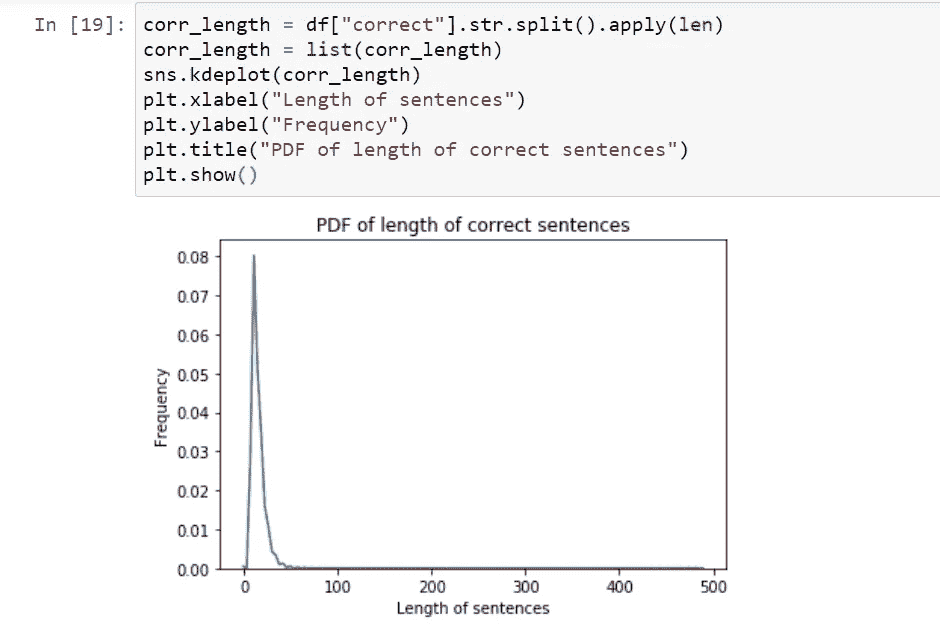**

**基于 PDF，我们可以看到大多数句子长度小于 50，极少数句子长度超过 50。**

**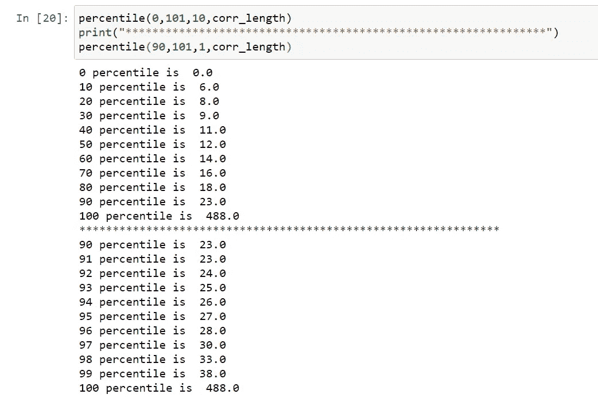**

**基于百分位数分析，我们可以看到 90%的输出(正确)句子长度小于 22，99%的输出句子长度小于 38。**

**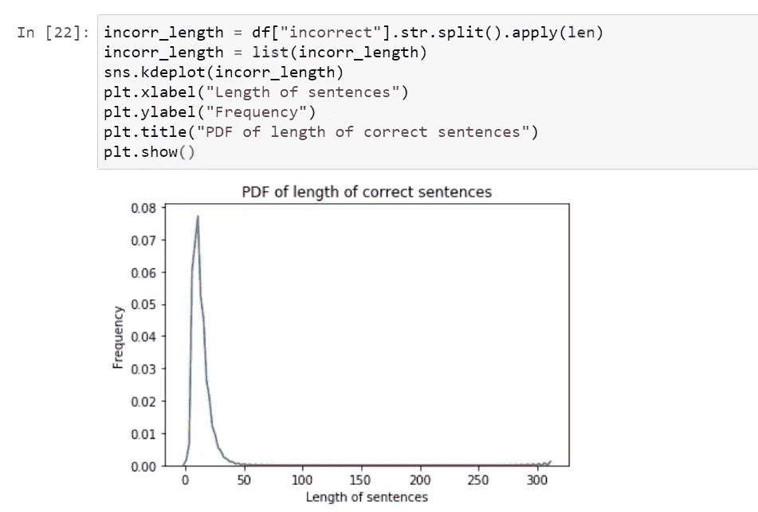**

**基于 PDF，我们可以看到大多数句子的长度小于 50，极少数句子的长度超过 50，这里的行为与输出句子相同**

**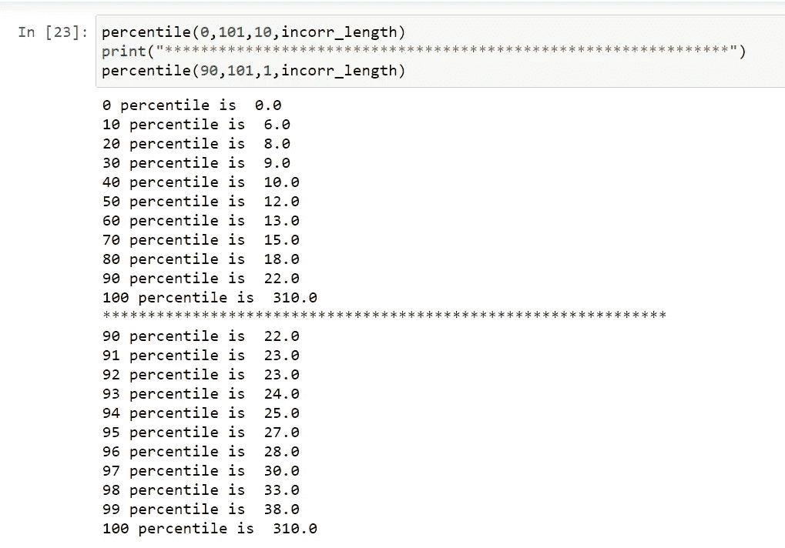**

**基于百分位数分析，我们可以看到 90%的输入(正确)句子长度小于 23，99%的输出句子长度小于 38。**

**因此，我们将从数据集中删除那些长度超过 25 的句子，我们也可以将阈值限制保持在 38，但这在计算上将是昂贵的。**

## **句子中的独特单词(正确的句子)**

**独特单词对模型具有显著影响，因为模型的参数数量将随着独特单词数量的增加而增加。**

**如果在给定输入和先前单词的情况下，我们选择具有最大概率的单词时，唯一的单词更多，那么即使是推断也会很麻烦。**

**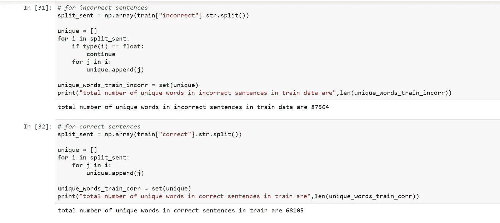**

**我们可以看到，在输入和输出句子中分别有 87564，68105 个唯一词**

## **使用词云的频繁词分析**

**单词云是一种用于表示文本数据的数据可视化技术，其中每个单词的大小指示其频率或重要性。**

**现在我们来分别看一下输出和输入句子的词云输出**

****

****输出(正确)句子的词云****

****

****用于输入(不正确)句子的词云****

**基于词云，我们可以看到，像“今天”、“喜欢”、“想要”、“想”这样的词在输入和输出句子语料库中出现频率最高。**

# **8-准备好数据模型**

**让我们对数据进行一些转换，使其适合输入到模型中。**

## **8.1-添加句首和句尾标记**

**对于我们的问题，编码器解码器似乎是一种合适的架构，在这种架构中，编码器逐字获取输入句子，然后解码器将“句子开始”令牌作为输入，并进行预测，该预测被发送到解码器的输入，用于下一个时间戳，并且该过程继续，直到解码器预测“句子结束”。**

**因此，我们将分别在输出句子的开头和结尾添加“@”来表示“句子的开始”(这将是解码器输入)，并添加“$”来表示“句子的结尾”(这将是解码器输出)。**

**例如，在对句子“我很好”进行上述操作后，解码器输入将是“@我很好”，解码器输出将是“我很好$”**

## **8.2-标记化和填充**

**在进行数据清理之后，我们已经扔掉了垃圾数据，并且在进行 EDA 之后，我们对我们的数据有了更好的理解，但是我们的数据仍然是文本形式的，这既不适合馈送到深度学习模型，**

**让我们对数据进行标记，这意味着每个唯一的单词将被分配给一个唯一的整数，我们将标记输入和输出，因为两者都是文本，但对于情感分析等任务，我们只需要标记输入，对于图像字幕，我们只需要标记输出。**

**标记化真的很简单，Keras 提供了一个内置函数来做这件事。完成标记化之后，我们还将保存这个标记化器，以便在运行时使用。**

**这里我使用了 char_level = True，因为我将把它用于字符级模型，但对于单词级模型，我们将保持它为 False。**

**现在，我们的输入和输出句子有不同的长度，所以将用零填充较短的句子，使长度相等，这样我们就可以批量训练它们，否则我们将不得不保持批量大小为 1，训练将非常慢。**

**通过使用内置函数，可以在 Keras 中轻松完成填充。**

## **8.3-将文本转换为矢量**

**在标记化之后，我们的数据集是整数的形式，但是它们仍然没有语义，并且单词的语义对于 NLP 相关的任务非常重要。**

**现在我们将它们转换成向量，这样这些词就有了语义，例如，让我们用三个词苹果，香蕉和老虎，这里苹果和香蕉的向量之间的距离与老虎相比要小，因为苹果和香蕉都是水果，而老虎是完全不同的。**

**现在，为了做到这一点，我们可以使用预训练的单词嵌入，如**手套、** **单词到 vec** 、**快速文本**嵌入，或者我们可以使用 **Keras 嵌入层**。**

**对于这个问题，我将同时使用嵌入层和快速文本嵌入，这将在下一节讨论。**

# **9-建模**

**现在我们已经到了真正有趣的开始部分，所以现在我们将尝试多种模型，但这里需要注意的重要一点是，虽然我在实际解决这个现实世界的问题时只使用了深度学习，但我们应该尝试使用我上面描述的所有方法的组合。**

**我们将从一个简单的模型开始，然后转向更复杂的模型，因为模型越复杂，它的性能就越好，但同样，在性能与训练和推理时间之间有一个权衡，复杂的模型也很难生产。**

## **9.1-编码器解码器字级模型**

**编码器解码器模型由 LSTM 或 GRU 单元组成，编码器读取输入序列，并以隐藏和单元状态的形式总结信息，用于初始化解码器，并在初始字处将*句子开始标记*传递给解码器，我们期望模型预测序列中的下一个字。**

**现在，我们应该将这个预测的单词作为输入传递给下一个时间戳中的解码，但这仅在推断期间完成，在训练期间，我们使用[教师强制](https://machinelearningmastery.com/teacher-forcing-for-recurrent-neural-networks/)。**

**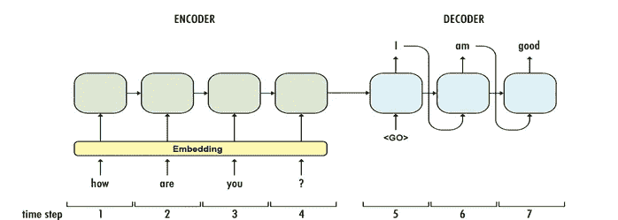**

**来源:[https://towards data science . com/sequence-to-sequence-model-introduction-and-concepts-44d 9 b41 CD 42d](https://towardsdatascience.com/sequence-to-sequence-model-introduction-and-concepts-44d9b41cd42d)**

**让我们使用 Keras 中的自定义模型来实现这个模型**

**定义编码器类别**

**定义解码器类别**

**定义编码器-解码器类**

**定义模型参数并训练模型**

**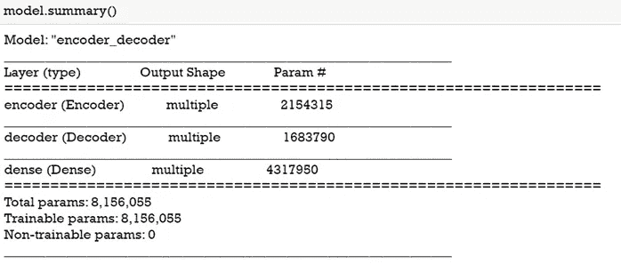**

**模型摘要**

**损失与纪元图**

**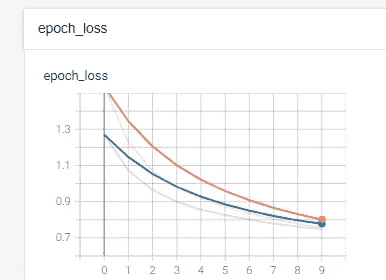**

**蓝线表示 CV，红线表示训练损失**

**根据测试数据获得的损耗和胶合分数是 0.74 和 0.17**

## **9.2:编码器解码器字符级模型**

**我们也将尝试使用字符级模型，因为它比单词级模型有一些优势，例如:**

**它可以处理词汇表之外单词(这些单词存在于训练数据中，但不存在于测试数据中)**

**与单词级模型相比，参数的数量更少，因为唯一字符的数量非常少(我们的数据集为 63 个)**

**这个代码几乎与单词级模型相同，这就是为什么我不写代码，你可以参考我的 [Github](https://github.com/mridul1012/Grammatical-Error-Correction-with-Neural-Networks) 简介。**

**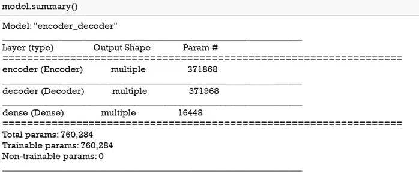**

**模型摘要**

**我已经用 256 个 LSTM 细胞和 1024 的批量训练了 25 个纪元。**

**根据测试数据获得的损耗和胶合分数是 0.17 和 0.21**

## **9.3:具有快速文本嵌入的编码器解码器字级模型**

**我们也将尝试快速文本嵌入，因为它有如下一些优点:**

**可训练参数总数减少**

**各种尺寸(50、100、200、300)可用于预拉伸嵌入，并可根据需要使用。**

**当训练数据较少时，最好使用预训练嵌入。**

**对于代码部分没有重大变化，所以我只显示编码器的相关代码，同样可以用于解码器。**

**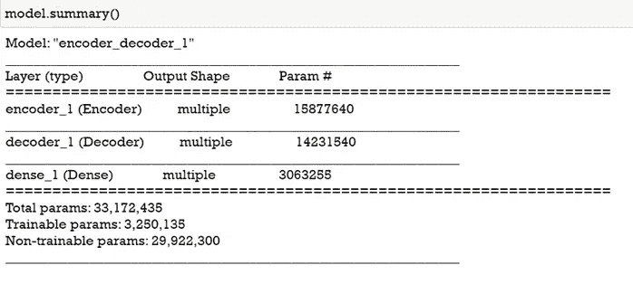**

**模型摘要**

**损失与纪元图**

**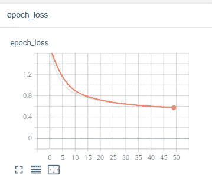**

**培训损失(在培训时，我忘记传递 CV 数据，所以这只是培训损失)**

**我已经用 64 个 LSTM 单元(最好使用 200 个以上的单元，但由于计算限制，我只使用了 64 个)和 1024 的批量训练了 50 个纪元。**

**根据测试数据获得的损耗和胶合分数是 0.57 和 0.26**

## **9.4:基于注意力的单词级模型**

**到目前为止，没有一个模型给出令人满意的结果，现在让我们尝试一些复杂的模型，这些模型已经在其他类似的 NLP 任务中被证明是好的，如机器翻译。**

**为此，由于计算限制，我尝试了 Luong attention 的点评分功能，尽管您可以尝试 bahdanu attention 和 general and concat 评分功能。**

**所以简单讨论一下注意机制的工作。**

**在编码器/解码器模型中，我们只使用最后一个隐藏状态来初始化解码器，这是编码器/解码器的主要问题，对于较长的句子来说更为严重。**

**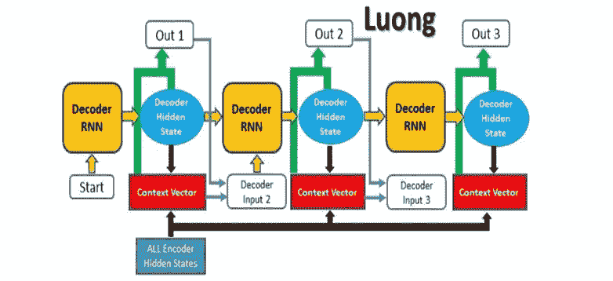**

**来源:https://blog.floydhub.com/attention-mechanism/**

**注意力模型通过使用来自每个时间戳的编码器的隐藏状态来解决这个问题，同时对每个单词进行预测(关于注意力的更多细节请参考这个漂亮的[博客](https://www.analyticsvidhya.com/blog/2019/11/comprehensive-guide-attention-mechanism-deep-learning/))。)**

**让我们使用自定义层在 Keras 中实现注意力模型。**

**注意，编码器与编码器-解码器相同，因此我们将从解码器开始。**

**关注层(点评分功能)**

**一步解码器**

**解码器类别:-**

**编码器-解码器类别:-**

**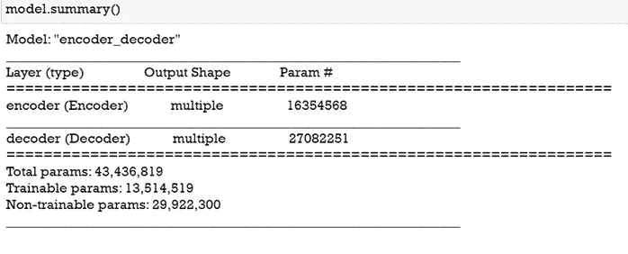**

**模型摘要**

**我已经用 64 个 LSTM 细胞和 256 的批量训练了 100 个纪元。**

**根据测试数据获得的损耗和胶合分数是 0.64 和 0.53**

## **9.5:使用 1D CNN 编码器的基于注意力的单词级模型**

**从注意力模型中获得的结果是好的，但是让我们通过使我们的模型更加复杂来进一步改进它。**

**为此，我们将增加一个与 LSTM 单元平行的 1D CNN 层，并将两个输出(来自 LSTM 和 CNN)相加，并使用该输出来初始化我们的解码器。**

**在解码器中，将没有变化，我们将像以前一样只关注 LSTM 细胞。**

**下面是修改后的编码器的代码片段。**

**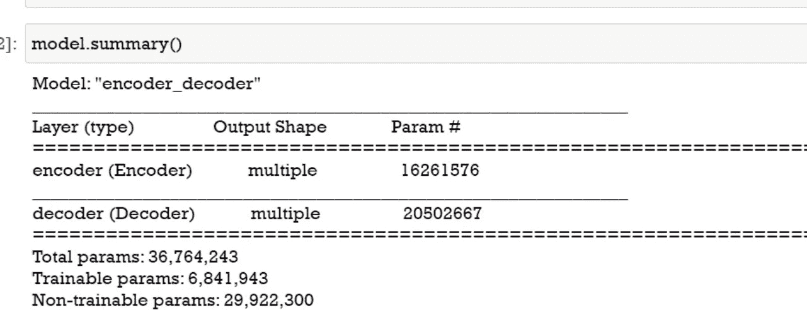**

**损失与纪元图**

**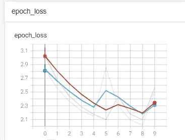**

**蓝线表示 CV，红线表示训练损失**

**我已经用 128 个 LSTM 细胞和 512 的批量对此进行了 10 个时期的训练。**

**根据测试数据获得的损耗和胶合分数是 2.09 和 0.12**

**由于 10 个纪元后模型表现不佳，我没有进一步训练它。**

## **9.6:基于注意的词级模型，三角学习率**

**到目前为止，我们已经使用了初始学习率为 0.001 的 Adam optimizer，但这里有一些问题:**

**我们的模型对初始学习率敏感，并且为了找出初始学习率，需要大量的超参数调整，这显然需要时间和计算资源，即使在所有这些之后，也不能保证模型将下降到低损失区域。**

**因此，为了解决这个问题，我们可以使用三角学习率，在这种情况下，我们将学习率限制在下限和上限之间，学习率在它们之间振荡。**

**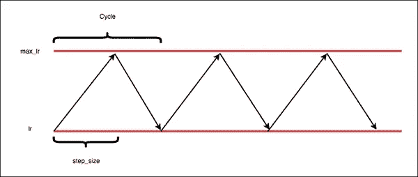**

**来源:[https://www . pyimagesearch . com/2019/07/29/cyclic-learning-rates-with-keras-and-deep-learning/](https://www.pyimagesearch.com/2019/07/29/cyclical-learning-rates-with-keras-and-deep-learning/)**

**完成实验后，当学习率达到最佳时，损失会急剧下降，如果你提高或降低学习率，损失可能会再次增加。**

**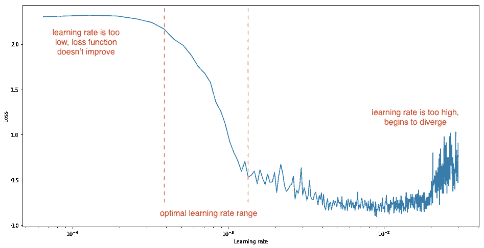**

**来源:[https://www . data camp . com/community/tutorials/cyclic-learning-neural-nets](https://www.datacamp.com/community/tutorials/cyclical-learning-neural-nets)**

**因此，这个最优学习率可以用作全局学习率，并且模型可以被再次训练，这减少了在尝试多个学习率时浪费的时间。**

**关于三角学习率的更多细节，你可以参考[这个](https://www.pyimagesearch.com/2019/07/29/cyclical-learning-rates-with-keras-and-deep-learning/)和[这个](https://www.datacamp.com/community/tutorials/cyclical-learning-neural-nets)博客。**

**要使用三角学习率，我们可以在 Keras 中实现自定义回调。**

**损失与纪元图**

**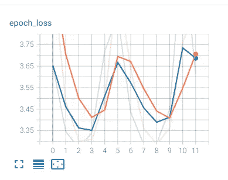**

**蓝线表示 CV，红线表示训练损失**

**最初，我用 128 个 LSTM 细胞和 512 个批量训练了 10 个时期。**

**在所有模型中，根据测试数据获得的损耗和胶合分数最差。**

**由于 10 个纪元后模型表现不佳，我没有进一步训练它。**

# **10:最佳模型的误差分析**

## **10.1:总结所有实验**

**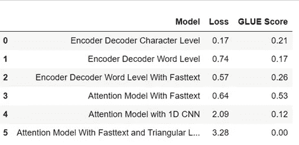**

**因此，我们最好的模型是注意力模型，所以现在我们将对此模型进行错误分析，以找出数据和胶水分数之间的模式。**

## **10.2:胶水分数的箱线图和百分位数分析**

**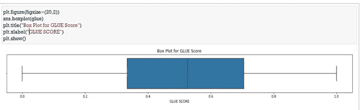****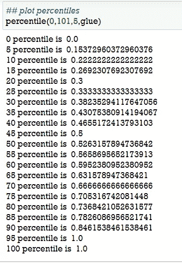**

## ****观察结果****

**1-最小胶合分数为 0
2-最大胶合分数为 1
3-胶合分数中值为 0.52
4-胶合分数的 IQR 范围从 0.33 到 0.7**

## **结论**

**基于以上分析，我们将胶水分数分为三类:低、中、高**

## **观察**

**1-基于低、中、高胶合分数的输入句子的平均长度分别是 10.56、11.9 和 12.03**

**2-基于低、中、高胶合分数的输入句子的中值长度分别是 10.0、11、12**

## **10.3:总单词和唯一单词的分析**

**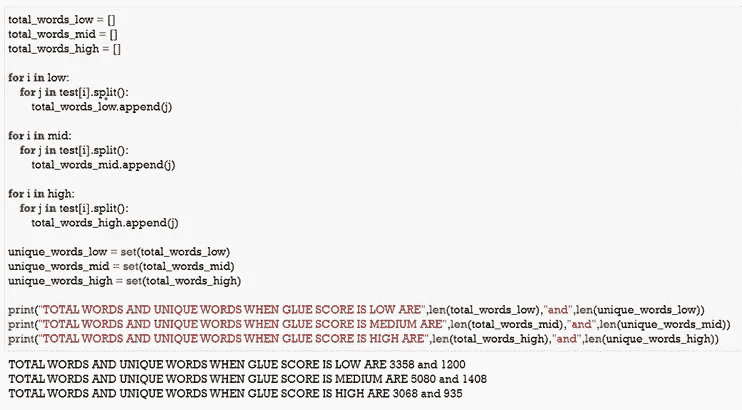**

## **10.4:分析一对不正确和正确句子之间的常用词**

**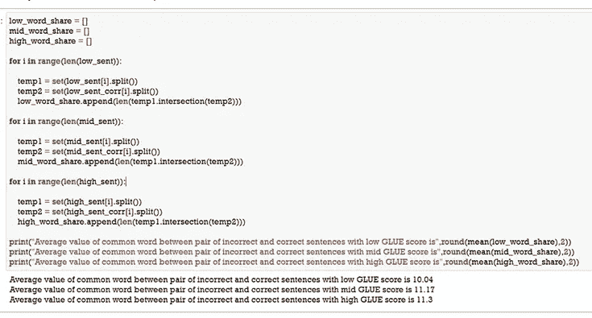**

## **10.5:误差分析总结**

**1-基于低、中、高胶合分数的输入句子的平均长度是 10.56、11.9、12.03。
2 -基于低、中、高胶合分数的输入句子的中值长度是 10.0、11、12。
3 -低中高胶字唯一号分别为 1200，1408，935。
4 -低、中、高胶合分数不正确和正确句子对之间的平均共同单词数分别为 10.04、11.17 和 11.3。**

# **11-最终管道和部署**

**定义推理的预测函数:-**

## **做预测**

> **今天我收到了我的一个郎朋友发来的消息**
> 
> ****模型预测-** 今天收到郎的一个朋友发来的消息**
> 
> **但是我今天必须参加托业考试**
> 
> **但是我今天必须参加托业考试**
> 
> **我和丈夫每个周末都去杂货店购物**
> 
> **模型预测- 我和丈夫每个周末都去杂货店购物**

**我已经使用 Flask 在我的本地系统上部署了这个模型。**

****烧瓶应用:-****

## **工作演示:-**

**工作演示**

**注意-视频中显示的预测并非对所有句子都准确。**

# **12-未来的工作**

**计算能力和更大的数据集是我在研究这个问题时面临的两个主要问题。**

**因此，下面是一些可以实现更好结果的工作。**

*   **可以使用更复杂的模型基于变压器的模型，其已经在其他序列中被证明是最先进的，以对像机器翻译这样的学习任务进行排序。**
*   **通过用更多的超参数调谐来增加 LSTM 单元的数量，该模型可以被训练用于更多的时期。**
*   **在大量数据的基础上建立模型。**
*   **在所有的模型中，我使用了简单的 LSTM，但是也可以使用双向 lstm。**

# **13-参考文献**

*   **[基于注意力的神经机器翻译的有效方法](https://arxiv.org/abs/1508.04025)**
*   **[学习者英语数据集 Lang-8 语料库](https://docs.google.com/forms/d/e/1FAIpQLSflRX3h5QYxegivjHN7SJ194OxZ4XN_7Rt0cNpR2YbmNV-7Ag/viewform)**
*   **[构建教育应用 2019 共享任务:语法纠错](https://www.cl.cam.ac.uk/research/nl/bea2019st/#data)**
*   **[快速正文](https://fasttext.cc/)**
*   **[应用人工智能课程](https://www.appliedaicourse.com/course/11/Applied-Machine-learning-course)**
*   **[深度学习模型用于语法错误处理的最新趋势](https://www.researchgate.net/publication/344160222_Recent_Trends_in_the_Use_of_Deep_Learning_Models_for_Grammar_Error_Handling)**

# **14.结束注释**

**这就把我们带到了这篇文章的结尾。**

**我希望你喜欢这个博客，这是我的第一个博客，所以请提供你的反馈，我一定会考虑并努力改进这个博客。**

**我要感谢整个应用人工智能团队和我的导师乌代先生在整个项目期间对我的指导。**

****Github 库****

**请查看该项目的完整代码。**

** [## 用神经网络纠正语法错误

### 通过创建一个关于……的帐户，为使用神经网络进行语法纠错的开发做出贡献

github.com](https://github.com/mridul1012/Grammatical-Error-Correction-with-Neural-Networks) 

**LinkedIn 个人资料**

如果你喜欢我的工作或对这个项目有任何疑问，随时通过 LinkedIn 联系我。

 [## Mridul Agrawal -机器学习培训生-应用人工智能课程| LinkedIn

### 查看 Mridul Agrawal 在全球最大的职业社区 LinkedIn 上的个人资料。Mridul 有一份工作列在他们的…

www.linkedin.com](https://www.linkedin.com/in/mridul-agrawal-ai/)**