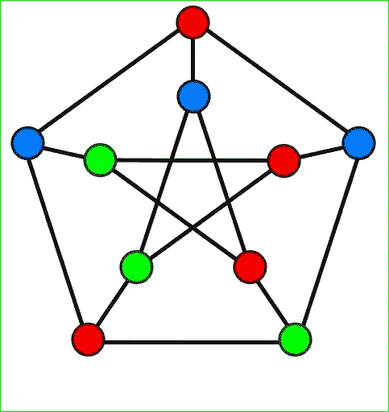
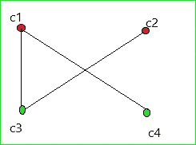
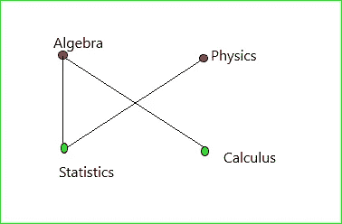

# 图的着色及其应用

> 原文：<https://medium.com/analytics-vidhya/graph-coloring-and-applications-2157912f505d?source=collection_archive---------2----------------------->

图论是计算机科学最重要的课题之一，在算法和数据结构方面有着重要的意义。这是编程中任何问题解决者不可缺少的一部分。在图论的众多部分中，有一个有趣且容易理解的子主题是图着色，它可以解决现实世界中的许多问题，我们将在这里讨论并应用它。

让我们从基础开始。

## **定义**

**图着色**就是简单地给图的每个顶点分配颜色，这样就不会有两个相邻的顶点被分配相同的颜色。

如果你想知道相邻的顶点是什么，请看下图。

顶点是 c1、c2、c3 和 c4。一对相邻顶点是 c1 和 c3。你能猜到其他人吗？

它们是(c1，c4)和(c3，c2)。为什么？因为它们是由边连接的。你可以在上图中清楚地看到它们通过边连接在一起。

上面的图描述了图着色的定义，即没有两个相邻的顶点被赋予相同的颜色，也没有一个顶点在上面的图中。

现在，在我们对什么是图着色有了基本的了解之后，让我们来看看它的应用。

## **应用**

图的着色有许多应用，研究起来非常有趣。让我们列举其中的几个:

1.  考试日程安排

2.无线电台的频率分配

3.找出循环执行期间临时存储变量的变址寄存器的数量

但在这里，我们将处理考试时间安排，这是最有趣的，也是最容易掌握的。

## **考试安排**

让我们假设代数、物理、统计和微积分是我们学院的四门课程。让我们假设以下几对有共同的学生:

1.  代数和统计
2.  代数和微积分
3.  统计学和物理学

问题**:假设代数和统计考试在同一天举行，那么选修两门课程的学生必须错过至少一门考试。他们不能同时拿走两个。我们如何在最少的天数内安排考试，以便有共同学生的课程不在同一天举行？**

****解法**:图着色。**

**首先画一个以课程为顶点的图，如果它们有共同的学生，它们通过边连接。对图表进行第二次着色，使得没有两个相邻的顶点被赋予相同的颜色，如下所示:**

****

**看上面的图。它解决了我们的问题。如果课程颜色相同，我们可以在同一天进行考试。**

****我们的解决方案:**
第一天:代数和物理
第二天:统计和微积分**

**这解决了我们安排考试的问题，这样所有学生都可以参加考试，而不用担心错过一场考试。**

****色号:****

**在学术上，给图 G 着色所需的最少颜色数称为图的色数，用χ(G)表示。χ读作 chi。对于上面的例子，χ(G)=2，因为 2 是在图表上着色所需的最小颜色数。**

**这都是关于图着色的基础知识，我们需要理解这些知识来解决现实世界中的各种各样的问题。你可以多研究一下。**

**是的，你可能想知道是否有特定的算法来解决这个问题。有，但还没有已知的有效算法，我们可以用来解决图着色问题。**

**你可能是做这件事的人。祝你好运。不断学习。继续激励。**

**谢谢你。😀**