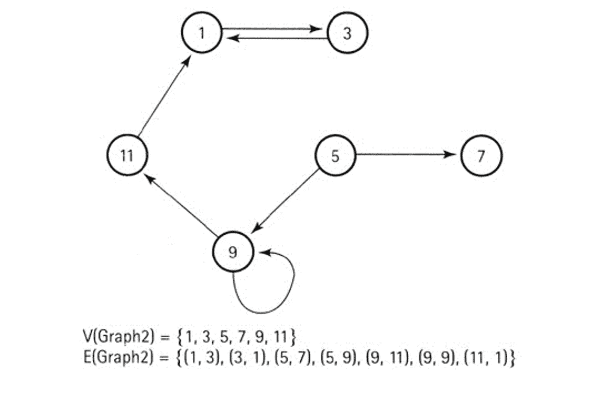

# 图:是飞机吗？还是一只鸟？

> 原文：<https://medium.com/analytics-vidhya/graph-is-it-a-plane-or-a-bird-a92dc7b2f7e2?source=collection_archive---------15----------------------->

我们都熟悉数据结构的一个主题，叫做图。此外，我们经常想，这是一架飞机吗？还是一只鸟？在下面的段落中，我将尽可能多地讨论这一点。

那么，什么是图形呢？根据这本书，图是一种数据结构，由一组节点和一组将节点相互关联的连接组成。主要问题是怎么做？要理解这一点，首先我们需要知道什么是[链表](https://www.geeksforgeeks.org/data-structures/linked-list/)。

我打赌你能听到 Photo^

现在，Graph 是一个带有特定索引号的链表。稍后我们会详细讨论。事实上，图有顶点(单数形式的顶点)和边。在图中你可以看到，哪个是哪个。

顶点和边

顶点是图中的[节点](https://www.google.com/search?biw=1920&bih=931&ei=ezkJXIvgD5CCrtoPzoeY2Ak&q=what+is+node&oq=what+is+node&gs_l=psy-ab.3..0i67j0l9.1689185.1690486..1691206...0.0..0.138.1160.8j4......0....1..gws-wiz.......0i71j0i131j35i39.IYec_BTfKdI)，边是表示图中两个节点之间连接的一对顶点。此外，有两种类型的图形。一种是无向图，另一种是有向图。现在，如果你检查上面的照片，你会看到一个有箭头，另一个没有。所以，我猜你已经对这两张图有了概念。然而，无向图的定义是边没有方向的图。而有向图是每条边都从一个顶点指向另一个(或同一个)顶点的图。

现在我将直接讨论技术术语:

一个图 G 表示为 G = (V，E)，其中

v:顶点集

e:连接 V 中顶点的一组边

边 e = (u，v)是一对顶点

为了方便起见，这里有一些照片:

图表

每棵树都是图，但不是每张图都是树

图表中还有更多类型/事物:

1.  **完全图**:其中每个顶点都与其他所有顶点直接相连的图。
2.  **加权图:**每条边携带一个值的图。
3.  **相邻顶点:**图中由一条边连接的两个顶点。
4.  **路径:**连接图中两个节点的顶点序列。

这里有一张照片可以帮助你想象…

这是美国一些州的票价图

你可能认为“理论已经够多了，我想看到一些实现”。我不会让你失望的。我们用 [2D 数组](https://www.tutorialspoint.com/cplusplus/cpp_multi_dimensional_arrays.htm)来实现这些图。索引包含顶点，它们存储的值包含边。基本上链表的节点包含相邻顶点的索引、权重和指向下一个边节点的指针。

现在，你知道具体的指数是什么了😉

现在，你可能会问我是否理解图形、树之类的东西。这有什么用？嗯，图被用在很多网络相关的算法中。在[马尔可夫链](https://en.wikipedia.org/wiki/Markov_chain)中可以看到图形的一个常见应用，它在预测分析中得到应用。文本预测等。脸书的社交媒体连接不过是一个非常大的分布式图表。基本上，如果你想找到一个模式或什么的，Graph 是一个非常有用的方法。

另外，让我们考虑一下您正在使用的操作系统。这个文件管理系统是一棵树。你可以使用脸书，这是基于图形和它的算法。另外，谷歌地图也是基于图形算法的。

# **终于**

我知道你对这无聊的闲聊有什么感觉，但你猜怎么着？就要结束了。我希望你能找到这个图表。如果我有任何错误，请一定要纠正我。我会一直等，直到那时，再见。

我能感觉到你；_;