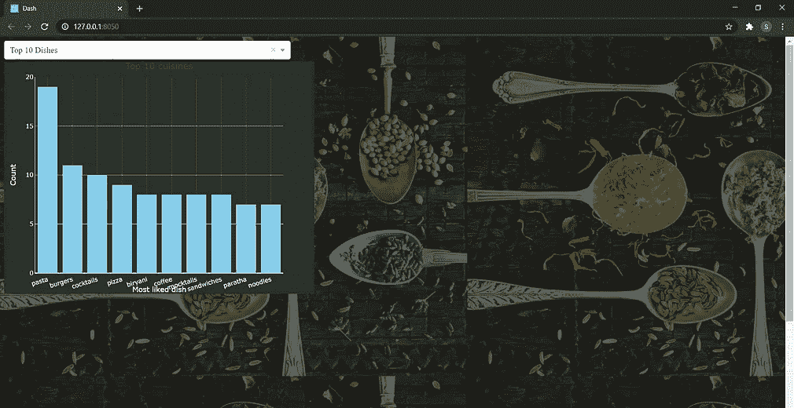
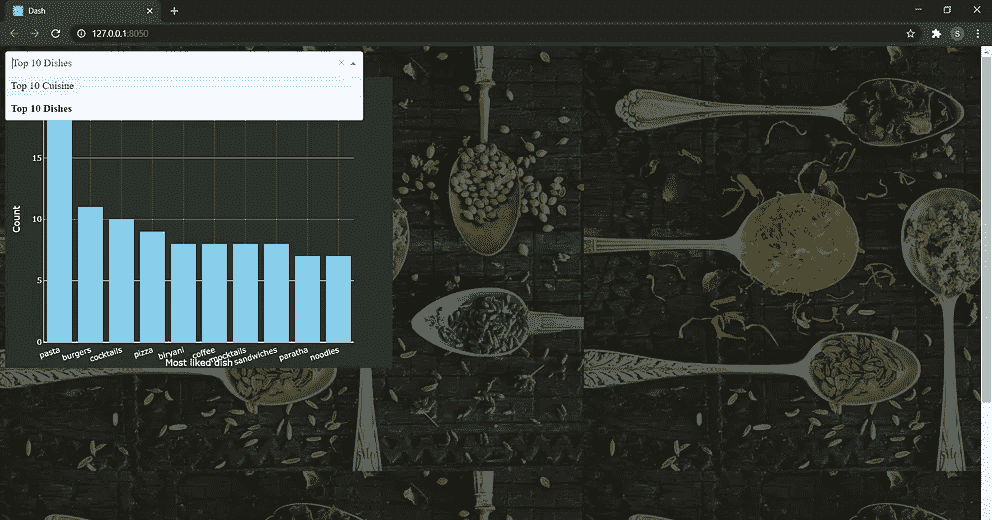
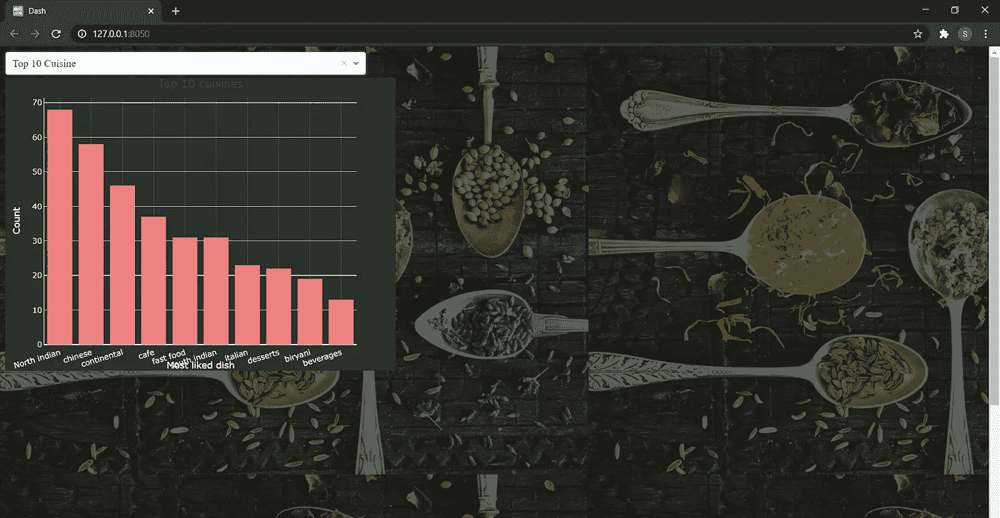
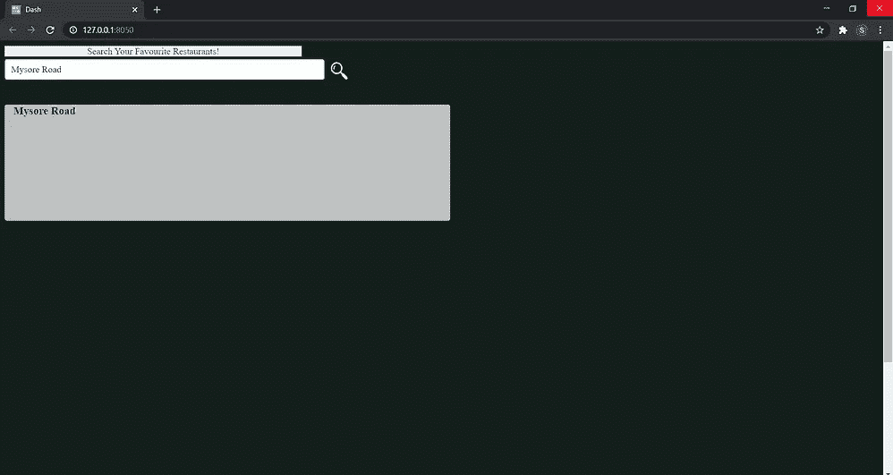
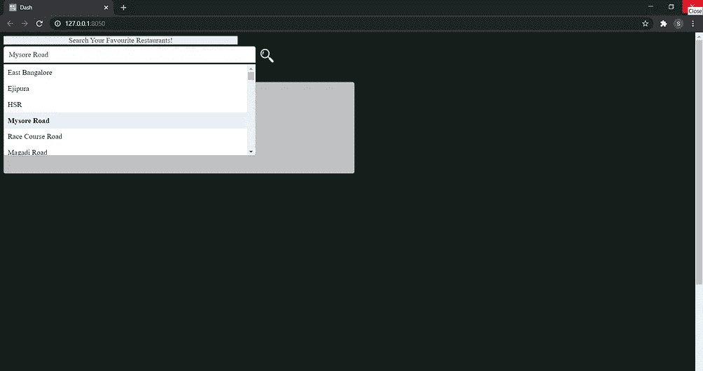

# 虚线中带有下拉菜单的图形

> 原文：<https://medium.com/analytics-vidhya/graphs-with-dropdown-menu-in-dash-plotly-bb6cd4295009?source=collection_archive---------8----------------------->

我希望你已经从上一篇文章中掌握了 Dash 的基本知识。上一篇
另一种有效可视化图表的方法是为图表添加一个下拉菜单。

**如何用下拉菜单创建图形？**

有些时候，你只想绘制不同参数的图形，或者在两个轴上保持相同的比例。在同一图形布局上绘制不同的图形。

[ [在这里找到代码](https://github.com/27shraddhaS/dropdown-graphs-dash)

这里是 Dash 中带有下拉菜单的图形的完整代码的链接。[ [下拉图形破折号](https://github.com/27shraddhaS/dropdown-graphs-dash)

**Dash 中的简单搜索栏。**

让我们举一个例子。你想为酒店创建一个搜索栏，显示与其位置、菜肴类型、平均价格、电话号码、地址等相关的信息。这正是如何做的。
以下是在 dash 中创建简单搜索栏的链接。[ [搜索栏](https://github.com/27shraddhaS/search-bar-in-dash)

现在你已经知道 Dash 是怎么做的了，开始构建你漂亮的仪表盘吧。

希望这对你有帮助。谢谢大家！