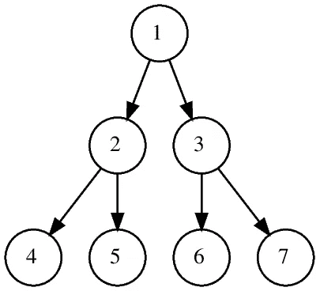
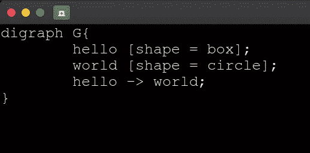

# Graphviz:制作图表从来没有这么容易

> 原文：<https://medium.com/analytics-vidhya/graphviz-making-graphs-was-never-so-easy-58ae72ab15b0?source=collection_archive---------19----------------------->

图表是以有组织的方式对数据或数值的图形或图解表示。在陈述/作业中包含一个可视化的图表会使它更有说服力和更有趣。使用 Graphviz 工具，用最少的代码量将您的手工制作的枯燥图表转换成丰富多彩、井然有序的图表。

Graphviz 是一款开源图形可视化软件。它用简单的文本语言描述图表，并提供了几种有用的格式，如 jpg，png，pdf 等。它有许多有用的选项来使图形更具视觉吸引力，如颜色、字体、形状、标签、超链接、线条样式等。安装 graphviz 非常快速简单，只需一个命令:

## **$ pip 安装 graphviz**

(注意:对于 windows 用户，不要忘记将 graphviz 文件夹下的 dot.py 添加到 path 变量中。还要确保您的系统上安装了 python。更多参考请参考**[**【https://graphviz.org/download/】**](https://graphviz.org/download/)**)****

**在 graphviz 中创建一个图表非常简单。首先，我们将创建一个无向的“Hello World”图:**

**首先我们将创建一个名为 helloWorld.gv 的文件。**

**然后在其中编写以下代码:**

****

**要运行代码，请使用以下命令:**

## ****$ dot -Tps <文件名>。gv -o <文件名>。pdf****

**它将生成以下输出:**

****

**让我们也学习通过改变形状、颜色、背景颜色、添加标签等来给我们的图表添加一些定制。我们的图表。**

**要创建有向图:**

********

**要更改节点的形状:**

********

**要更改节点的背景颜色:**

********

**要更改指针的样式:**

********

**要将标签添加到指针:**

********

**因此，使用这个超级酷的工具来创建整洁干净的图形是如此简单和容易。您可以使用 Graphviz 提供的各种属性创建更复杂和定制的图形。请继续关注一些更有趣、更酷的东西。直到那时，继续编码，继续建设:)**