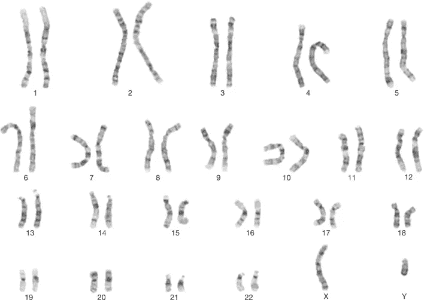
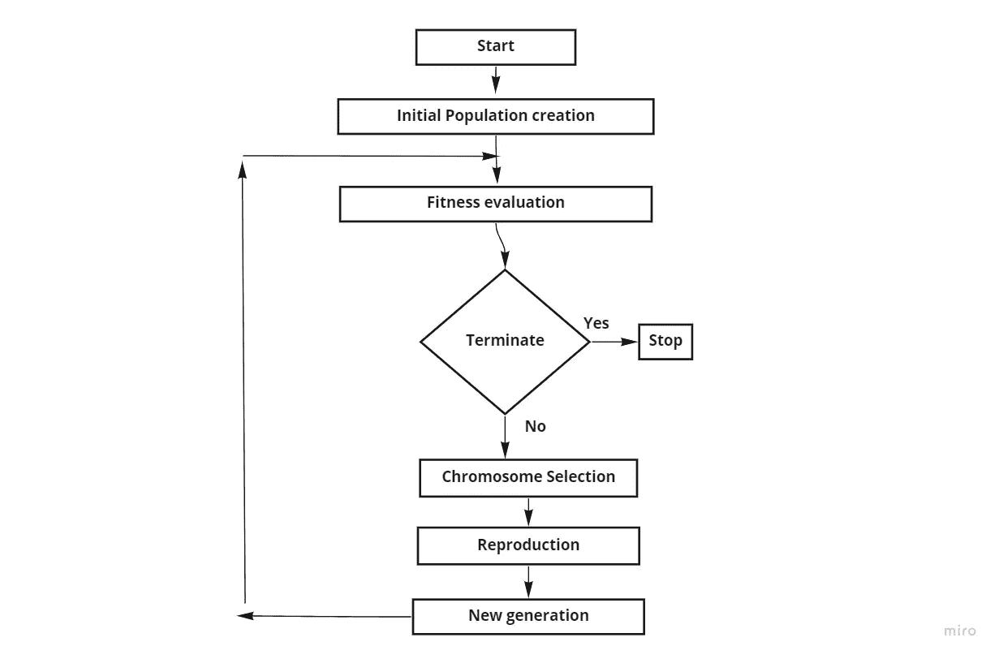
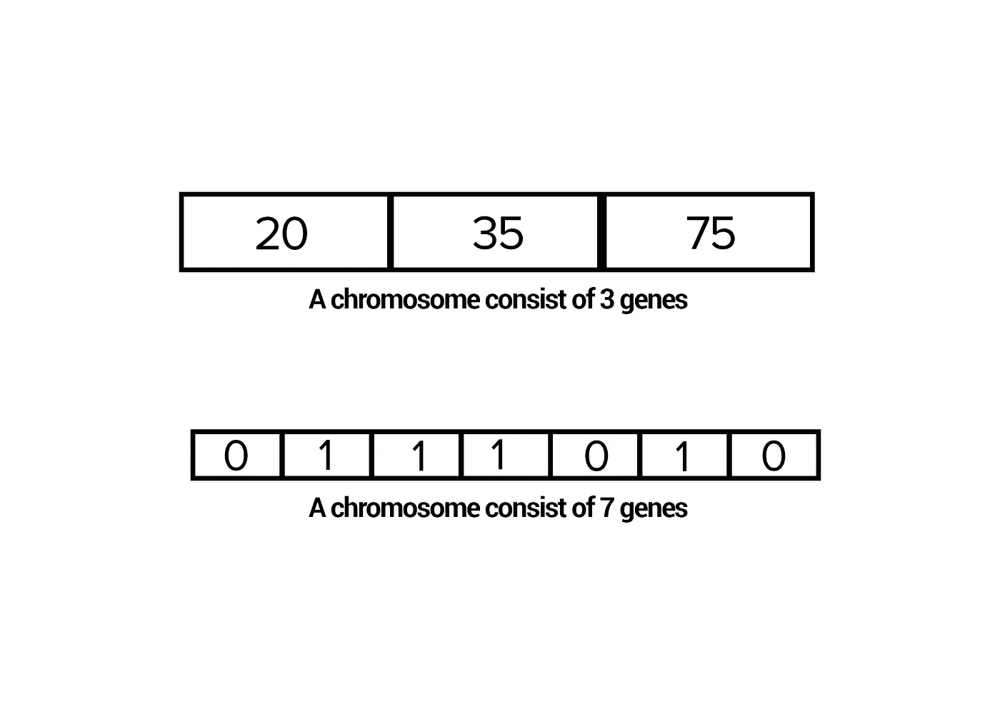
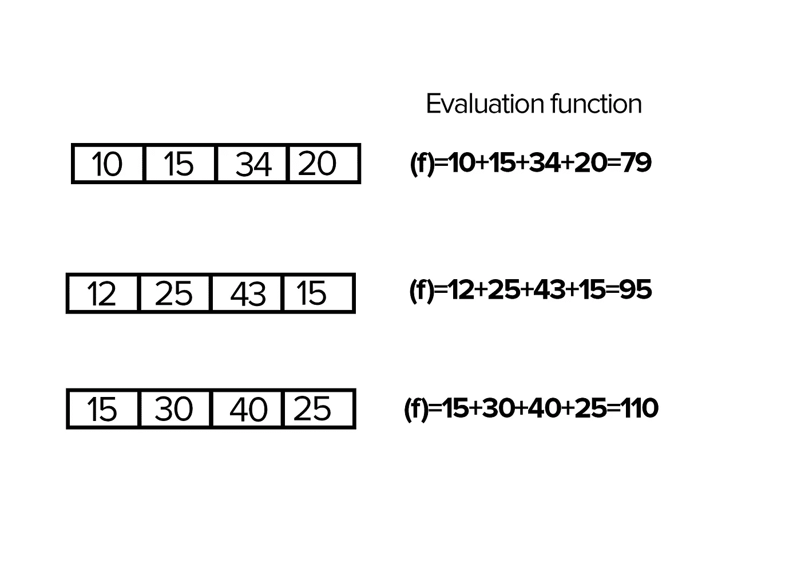
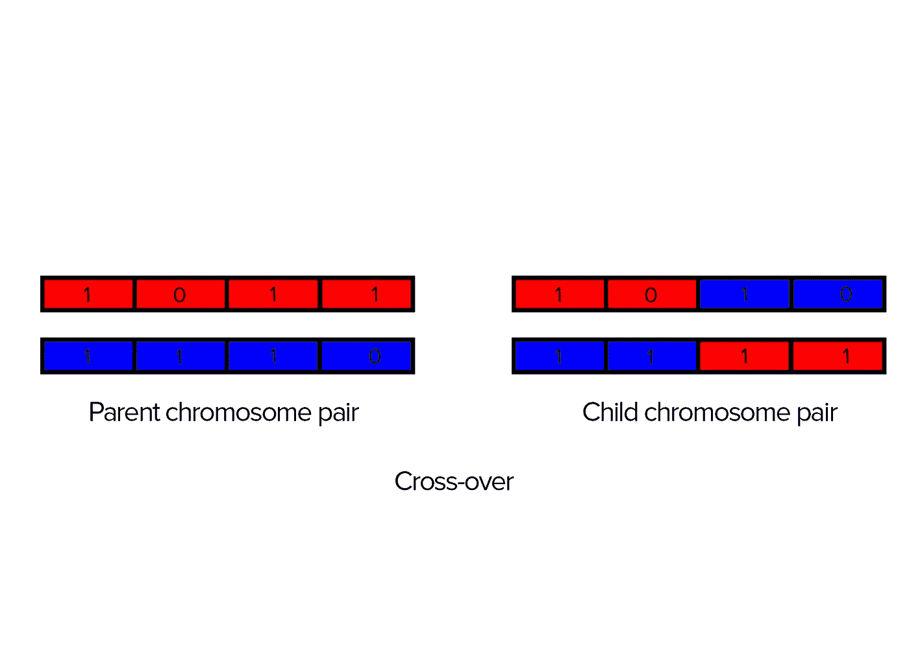
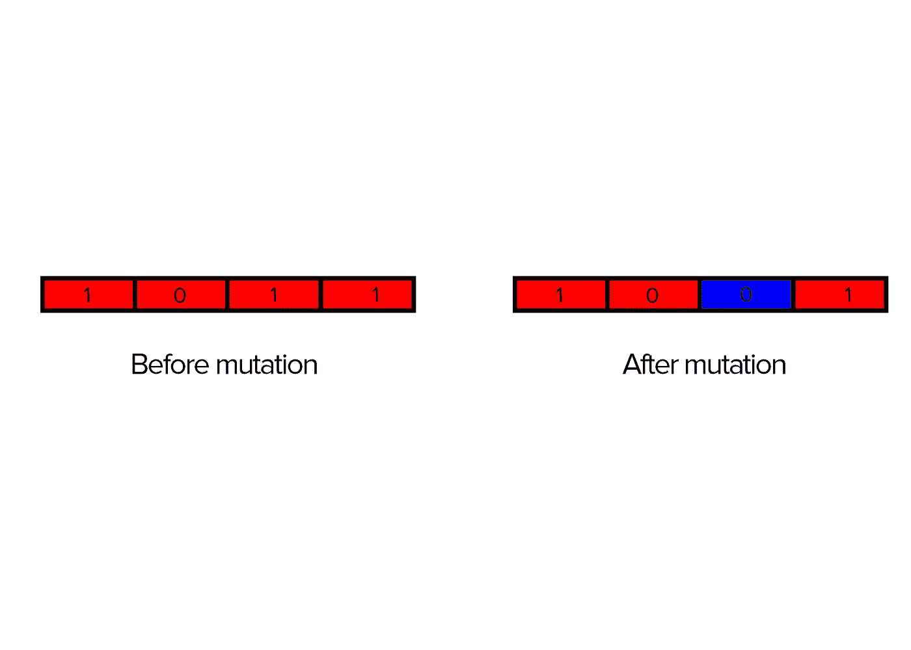
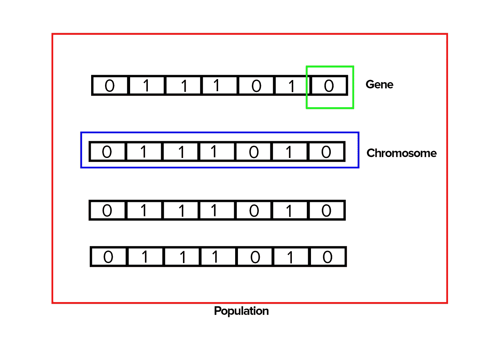
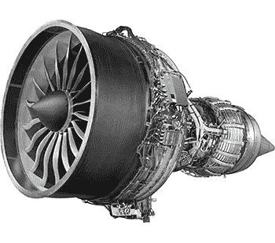

# 掌握遗传算法-进化计算。

> 原文：<https://medium.com/analytics-vidhya/grasp-into-genetic-algorithms-321b6bbadb33?source=collection_archive---------17----------------------->

在看遗传算法之前，什么是算法？我知道非计算机科学背景的人可能对此没有清晰的概念(也许我错了)。简而言之，算法是计算机完成任务所需的指令和规则的列表。本质上，算法只是一系列的指令，一步一步地执行，做一些有用的事情或者解决一个问题。你可以把布丁食谱看作制作布丁的算法。算法无处不在，只是我们不太注意。

在计算机科学和数学领域，算法几乎无处不在。他们能够以各种方式处理和操作数据或进行计算。在这篇文章中，我想给你一个非常简单的遗传学算法的介绍。除此之外，遗传算法是人工智能的核心概念。我希望你喜欢这篇文章！

遗传算法-简介

遗传算法技术是基于自然界中一个美好的概念。这是自然进化。我们知道动物和植物都会进化，并通过繁殖产生强壮的后代。进化是自然选择过程的结果，在这个过程中，最适合的个体被选择出来进行繁殖，以产生更强大的下一代。如果人类可以开发一个模拟这一过程的计算机程序会怎么样？这难道不是一个突破吗？遗传算法是由霍兰德和他的合作者在 20 世纪 70 年代早期首次提出的。这些计算机算法可以模仿自然进化，并为优化和搜索问题生成高质量的解决方案。

为了使用传统算法(回归模型等)解决复杂的问题。)需要在一段时间内收集大量数据。但是在遗传算法中，不需要这些数据。此外，这是唯一能够为依赖动态数据的系统提供解决方案的技术。例如，想想黑洞的性质或决定股票交易的趋势。

# 遗传算法剖析

图 1 基本遗传算法

# 基因

根据遗传学，染色体的特征由染色体内的基因来表示。让我们从计算机科学的角度来看这个想法。我们可以用二进制这样的数字系统来表示基因的特征。

# 染色体

根据遗传学，**基因**是染色体的片段。从计算机科学的角度来看，我们可以将染色体视为一维数组。

图 1.0 染色体

# 评价函数

正如查尔斯·达尔文的自然进化所说，只有强有力的染色体才会参与繁殖过程。GA(遗传算法)将这种能力表示为数学函数。这个函数被称为评估函数，也称为适应度函数。

图 1.2 评估功能

# **交叉**

**交叉**发生在两条**染色体**断裂，然后重新连接到不同的末端片段。交换是基因重组的主要方法。GA 利用这种现象来得到问题的类似解。

图 1.3 交叉

# 变化

**突变**是 DNA 序列(基因)的变化。在某些情况下，父母生下的孩子与他们的父母有着不同的特征。这是因为基因突变造成的。

请注意，交换发生在染色体对之间，但突变发生在两个基因片段之间的一条染色体中。

然而，从计算机科学的角度来看，我们可以应用这个概念来生成我们从未见过的解决方案，来解决一个特定的问题。

图 1.4 突变

# 遗传算法的实现

为了实现遗传算法，我们可以使用像 Java、C、C++这样的编程语言。

图 1.5 初始群体

乍看之下，在编程 g a 时将遵循以下步骤。

1.创建初始染色体群体

2.使用评估函数验证染色体

3.对染色体进行交叉和变异

4.使用评估函数再次验证染色体

5.重复，直到解决方案的群体足够清晰。

# 应用程序

# 具有动态数据的系统

想想交通灯系统或气象站。如果我们没有考虑所有可能的事故类型或天气状况，系统就不能给出避免事故或预报天气的解决方案。

# 找到最佳的解决方案

有些系统对某个问题有类似的解决方案。所以我们必须从中选择一个最优解。在线性规划等概念的帮助下，我们可以处理大量的数学公式来提取解决方案。但是通常数学公式没有最优解。换句话说，有时数学公式甚至不期望最优答案。

例如，考虑√3，根据代数它是 1.73205080757……但它不具有某个值。因此，在这种情况下，可以利用遗传算法来寻找最优解。

# 为同一问题找到相对相似的解决方案

想想设计一辆汽车或一架飞机。

如果我们需要迭代与第一个设计相比略有不同且更优化的设计，我们不能使用数学、统计学或神经网络。因为这些方法依赖于以前收集的数据和假设，而这只是对所有上述数据的一种证明。但是遗传算法不受这种理由的影响。

# 获得前所未见的答案(数据挖掘)

我们知道突变是基因序列的变化，也是生物多样性的主要原因。这些变化发生在许多不同的层面上，它们会产生非常不同的后果。就像遗传算法会导致突变一样，它提供了前所未有的答案。然而，即使是神经网络技术也用于数据挖掘。另文再说吧。但是我想提一下，在动态数据挖掘中，遗传算法是唯一的方法。

# 现实世界的应用

## 航空航天工程

GAs 在航空航天工程中用于优化超音速飞机机身设计，以降低气动阻力系数，并在突破音障时最大限度地降低超音速轰鸣声。此外，在设计波音 747 喷气发动机时，航空工程师使用遗传算法来优化喷气发动机叶片的形状，以在最大空气动力载荷下有效工作，并实现最大的燃油经济性(图 1.6)。

图 1.6 波音 747 喷气发动机“通用电气 GEnx 发动机”

## 物理学

遗传算法正在帮助解决许多物理问题。例如，优化与黑洞相关的天文计算。此外，在粒子物理又名高能物理遗传算法被广泛使用，因为高计算需求。在 LHC 的标准希格斯玻色子模型搜索中，甚至使用遗传算法来分离信号和背景。( [*看报*](https://www.sciencedirect.com/science/article/pii/S0168900205022631) )。

## 金融科技

预测股票趋势。

# 结论

现在我们已经谈论了遗传算法的基础，我希望你能很好地掌握它。尽管 GAs 在应用上有一些限制，但它是一项非常迷人的技术，领先于许多其他技术。

## 参考

**遗传算法在物理学和天文学中各种问题的应用**
*凯文·理查德·威廉斯，田纳西大学诺克斯维尔分校*

**高能物理中的进化计算** *英国莉莉安娜·特奥多尔斯库·布鲁内尔大学*

***遗传算法简介*** *梅勒妮·米切尔著*

***遗传算法在搜索、优化和机器学习中的应用*** *大卫·e·戈德堡著*

***人工智能***
*a soka . s . karunanda 博士著*

额外的图片和插图来自维基媒体，谷歌图片。