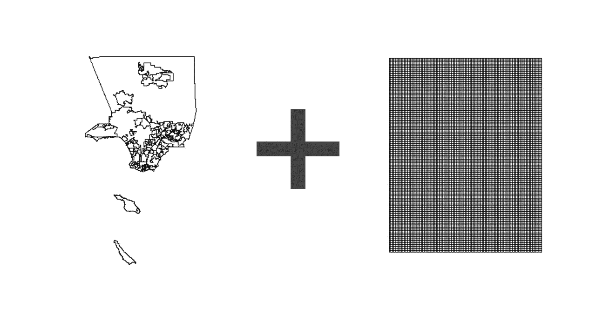
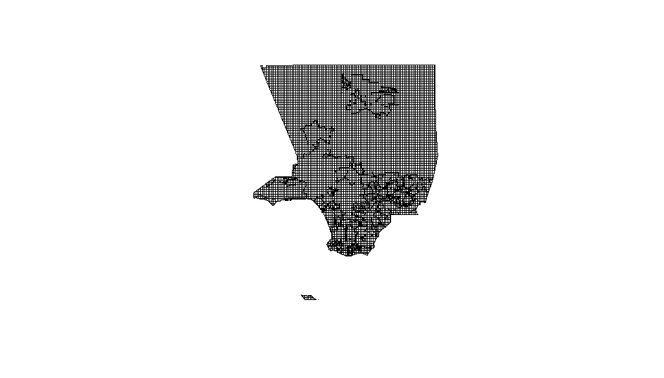
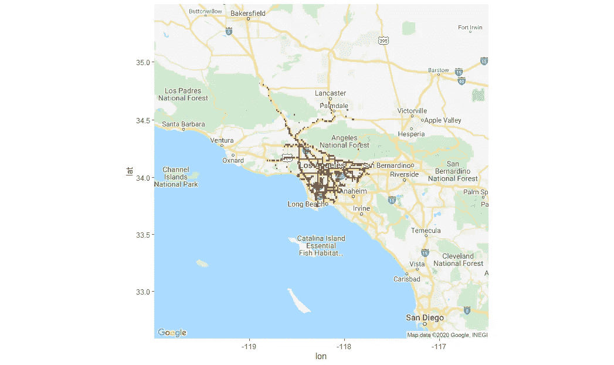

# 使用 DNN 的基于网格的事故预测

> 原文：<https://medium.com/analytics-vidhya/grid-based-accident-prediction-using-dnn-10b2513c3aca?source=collection_archive---------24----------------------->

# 1.介绍

道路交通事故是与日常生活相关的严重问题之一。与其他地区相比，某些地区的事故发生频率更高，这是由于其周围的各种地标或该地区的位置。计算机科学领域在最近的领域中有了很大的改进，并且它为解决不同领域中的各种问题开辟了各种途径。基于网格的位置数据预测方法已被证明是一种成功的算法，因此我们将重点关注基于网格的模型与深度神经网络的集成。此外，以前的事故发生频率可以预测某个区域的事故发生率，从而将该区域归类为事故多发区域，因此我们将使用以前的事故发生次数来训练与每个区域相对应的模型。

# 2.先决条件

*   [R](https://www.r-project.org/) —用于创建 DNN 模型
*   [谷歌地图静态 Api](https://developers.google.com/maps/documentation)——用于预测热点的最终标绘
*   GitHub 代码—【https://github.com/Hardik0175/Neural_Net_Project 

> 已经使用 Scala 对数据集进行了预处理，所以不需要预处理和数据清理

# 3.要运行的步骤

1.  提取代码并设置 R studio
2.  更改代码中文件的路径(一个用于数据文件，另一个用于使用地图形状文件)
3.  下载没有安装在 R 中的库，比如 ggmap、h2o 和任何其他需要的库。
4.  从 Google 控制台激活 Google Map Api，并在 R studio 中运行这个命令。

```
register_google(key = "[your key]", write = TRUE)
```

5.运行代码和加载地图可能需要一些时间。



图 1 洛杉矶地图和网格(100x100)



图 2 网格和洛杉矶地图的交叉点


图 3 在移除整个数据集中没有事故的点之后剩余的点(3975)

# 4.模型设计

使用 h2o 库建立深度学习模型，每个模型有 7 个隐含层 100 个神经元。

> 学习率为 0.001
> 
> 激活功能是“整流器 WithDropout”
> 
> 纪元“30”


图 4 DNN 模型

# 5.不同型号

**通过划分训练和测试数据集，共建立了 8 个 DNN 模型和 8 个随机森林模型。*(层数和神经元数不变)。***

1.  大约 60%的培训和 40%的测试。
2.  大约 75%的培训和 25%的测试。
3.  大约 80%的培训和 20%的测试。
4.  大约 83%的培训和 17%的测试。
5.  大约 85%的培训和 15%的测试。
6.  大约 87.5%的培训和 12.5%的测试。
7.  大约 88.88%的培训和 11.12%的测试。
8.  大约 90%的培训和 10%的测试。

> 需要注意的是，测试数据的数量必须在一段时间内保持不变，因为我们在地图上有预先定义的数量的点，这些点是不能改变的。

# 6.结果


图 5 从 DNN 模型的混淆矩阵得到的结果


图 6 随机森林模型混淆矩阵的结果



图 7 模型 1 的预测热点


图 8 实际热点(地面实况)