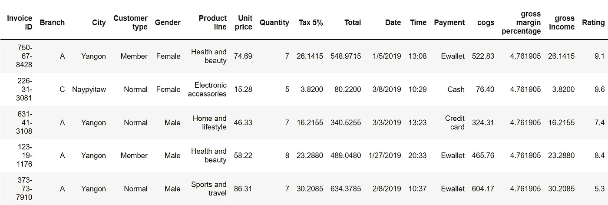
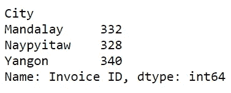
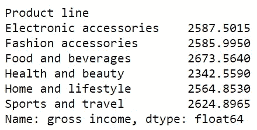
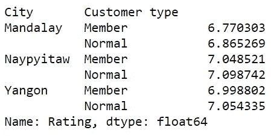
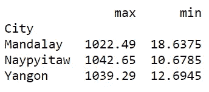

# 小组比:熊猫模块的“瑞士刀”

> 原文：<https://medium.com/analytics-vidhya/groupby-the-swiss-knife-of-the-pandas-module-fd0072f19fb8?source=collection_archive---------2----------------------->

## 如何利用最被低估的熊猫业务之一

帕斯卡·米勒在 [Unsplash](https://unsplash.com?utm_source=medium&utm_medium=referral) 上的照片

# 介绍

如果您使用 Python 来处理数据集或从中提取见解，那么您无疑对 Pandas 库很熟悉。它是数据操作的首选工具。

Pandas 是一个强大的软件包，具有巨大的实用性，这就是为什么我对人们在使用它时几乎没有触及它的表面感到惊讶。

尽管这个库提供了各种各样有用的功能，但是人们忽略了许多可以使他们的工作更容易并节省代码的功能。

一个显著的例子是 g *roupby* 操作。

groupby 操作允许您将数据分成组，然后对每个组应用聚合。具体来说，它可以执行以下聚合:

*   数数
*   总和
*   平均
*   福建话
*   最大

在我看来，groupby 函数应该出现在任何数据科学家的工具包中。从希望深入了解其消费者的企业到希望更多了解其患者的医院，许多实体都将受益于更精细地检查其样本。

根据经验，我知道许多人倾向于通过手动从他们的数据集中过滤出不同的组，然后逐个对它们执行计算来处理这种问题，这是荒谬的。

当你有一个工具为你做所有的工作时，为什么要经历那么多麻烦呢？

通过一个案例研究，我将展示 groupby 操作的多功能性，并说明为什么它值得更多的关注。

# 个案研究

在这个演示中，我将使用一个数据集来存储 3 个不同超市的销售记录。如果您想继续，您可以通过点击[这里](https://www.kaggle.com/aungpyaeap/supermarket-sales)来检索数据集。

首先，让我们导入 Pandas 模块并加载数据集。

现在，让我们预览一下数据集，看看我们需要处理什么。

前 5 行数据

每一行代表一个独特的销售。对于每笔销售，您可以访问诸如日期、城市、付款方式、产品类型和总收入等信息。

假设您被要求找到以下内容:

*   每个城市的销售数量
*   每个产品线的总收入
*   每个城市超市的平均评分
*   每个城市超市的会员和普通顾客给出的平均评分
*   每个超市最便宜和最贵的销售

从表面上看，在确定这些值之前，似乎有很多东西需要解开。

然而，如果我告诉你，使用 groupby 函数，只需 **1 行代码**就可以回答这些问题，会怎么样呢？听起来很疯狂，不是吗？

让我们通过一次回答一个问题来看看实际情况。

## 1.每个城市的销量是多少？

要找到每个城市的销售数量，您需要按城市划分记录，然后对每个组进行计数。下面是如何用 Python 实现这一点。

问题 1 输出

为了更好地理解，让我们来分解这行代码的组成部分。首先，“df.groupby('City ')”部分根据城市将所有记录分成不同的组。的”。count()"部分查找每个城市的每个要素中的记录数。

注意:在这种情况下，由于每个要素都有相同的记录数，所以每一列都将生成相同的计数。有了”。iloc[:，0]"部分，我只选择第一列来查看计数。这一步是可选的；您可以选择要筛选的列，也可以不筛选任何列。

## **2。每个产品线产生多少收入？**

要找到每个产品线的总收入，您需要按产品线对记录进行分段，然后找到每个组的总收入。这是它在 Python 中的样子。

问题 2 输出

这里，我们根据“df.groupby('Product line ')”部分中的产品线对数据进行分段，然后用“.”对每一列中的值求和。sum()”部分。

然而，与问题 1 不同，在问题 1 中，每一列中的计数是相同的，在这种情况下，每一列中的合计值是**而不是**相同。因此，在汇总后特别选择了“总收入”一栏。

## 3.每个城市的平均收视率是多少？

要找到每个超市的平均评分，您需要按超市对记录进行分段，然后计算每个超市的平均评分。这是它在 Python 中的样子。

问题 3 输出

这里的方法类似于问题 2。在这里，我们根据“df.groupby('City ')部分中的城市对数据进行分段，然后使用“来计算每一列中值的平均值。mean()”部分。

因为我们只对平均评级感兴趣，所以在执行汇总后，我们只选择“评级”列。

## 4.每个城市的会员和普通客户给出的平均评分是多少？

这和问题 3 类似。

如果我们不仅想知道每个城市的平均评分，还想知道每个城市的会员和普通客户给出的平均评分，会怎么样？

这需要按照“城市”变量将数据分成组，然后按照“客户类型”变量将每个组分开。

幸运的是，groupby 操作允许您通过一个以上的变量来增加分段的粒度(仍然只有一行)。这是它在 Python 中的样子。

问题 4 输出

这里的代码与问题 3 中的非常相似。关键区别在于 groupby 操作中输入的参数。groupby 操作采用的不是一个变量，而是一个变量列表。

在这种情况下，这意味着数据将首先按城市划分，然后再按客户类型划分。接下来，计算每组的平均值，得出每列的平均值。最后，选择“评级”列以获得平均评级。

*注意:*group by 操作会根据列表中变量的时间顺序对数据进行分段。如果您试图基于多个变量对数据进行分段，请在输入 groupby 操作时注意它们的顺序。

## 5.这三个城市最便宜和最贵的销售价格是多少？

寻找 3 个城市中最便宜和最贵的销售额需要使用 2 个不同的聚合函数。groupby 操作的另一个好处是它允许您一次执行多个聚合函数。

问题 5 输出

请注意，所有这些信息仍然是通过一行代码获得的！

在这种情况下，一旦数据帧按城市进行了分段。agg(['max '，' min'])"部分返回每组中每列的最大值和最小值。因为我们只对总销售额感兴趣，所以在执行汇总后，我们选择“total”列。

# 结论

在 [Unsplash](https://unsplash.com?utm_source=medium&utm_medium=referral) 上 [Prateek Katyal](https://unsplash.com/@prateekkatyal?utm_source=medium&utm_medium=referral) 拍摄的照片

在熟悉 Pandas 模块时，人们经常会遇到 groupby 函数，但是他们没有利用它的多功能性。

毕竟，阅读一个函数比知道如何在实际应用中使用它要容易得多。

groupby 函数允许您一次性完成所有这些任务，而不是花费大量代码按每个类别过滤您的数据，分别对其执行计算，然后合并这些结果(我见过许多初学者这样做)。

希望你现在能相信这个不被重视的熊猫项目带来的好处。

我祝你在未来的数据分析工作中好运！