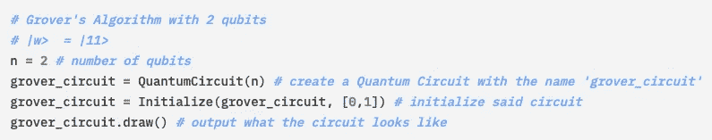
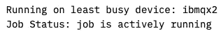

# Grover 的算法 Python 语言！

> 原文：<https://medium.com/analytics-vidhya/grovers-algorithm-in-python-c1dfa132e3af?source=collection_archive---------7----------------------->

在了解了 Grover 的算法之后，我决定试着用 Python 3 使用 IBM Quantum Experience 的 Quantum Lab 和 Jupyter(笔记本)为它编写两个和三个量子位的程序！在这篇文章中，我将引导你通过我的步骤，以及我学到了什么。请跟我来！对了，[这是我跟随的](https://qiskit.org/textbook/ch-algorithms/grover.html)教程。

## 在我们开始之前。。。

在我们开始之前，我们需要做一些事情。首先，也是最重要的，如果你不知道格罗弗算法是什么，这里的是我写的一篇关于格罗弗算法的中型文章。其次，为了运行该算法，您将需要一个 IBM Quantum 体验帐户；你可以[点击这里](https://quantum-computing.ibm.com)来创建一个。最后，如果你是 Python 编程的新手，你可以看看[这篇](https://www.w3schools.com/python/)教程来熟悉这门语言。

好了，现在我们开始吧！

## 导入模块

我们需要使用 import 语句导入专门为量子计算机编写代码而设计的专门模块(由 IBM 创建)。顺便说一句，你也可以阅读我在代码中的注释(它们用一个' # '或者用三重引号括起来的文本来表示 example " " " ")。

导入标准 Python 模块

我们首先导入“标准”Python 模块，它们是 MatPLotLib，一个为绘图而设计的模块，以及 NumPy，一个通过其内置函数简化复杂计算的模块(比如计算向量的点积)。在这种情况下，我们只使用 MatPlotLib 的 pyplot“子模块”。为了方便起见，我对 matplotlib.pyplot 和 numpy 分别使用了缩写“plt”和“np”。

导入 Qiskit

接下来，我们导入 Qiskit，这是一种由 IBM 开发的特殊编程“语言”,用于运行使用 IBMQ 的量子计算机的代码。它包含一堆具有特定功能的特殊模块，例如创建量子电路的模块和编译并运行代码的模块。

## 创建一个初始化量子位的函数

在导入所有东西后，我们创建一个函数来初始化所有的量子位，这基本上是使用哈达玛门将它们置于一个相等的叠加态。关于量子门/操作的更多信息，这里的[是我的另一篇中型文章，描述了不同的操作/门(在 IBM Quantum Experience 中)。](/swlh/introduction-to-quantum-operations-e797fae3fab)

用于初始化量子位的函数

该函数接受两个参数，QC，这是一个量子电路，和量子位，我们正在初始化的量子位的数量。然后，使用一个 **for-each** 循环，我们遍历所有的量子位，并对它们应用哈达玛门。然后我们返回新的量子电路，这就完成了我们的初始化功能！

# 两量子位 Grover 算法

我们将从简单的开始，用一个简单的 Grover 算法的两个量子位版本。在这个例子中，我们将使用“胜利者”状态 *⎪w〉=⎪11〉.*这意味着我们希望量子计算机“发现”这种状态，而忽略其他状态。

创造量子电路

我们创建一个值为 2 的**整数**变量 n(类型为 **int** ),和一个类型为**quantum circuit**Grover _ circuit 的变量，一个 n = 2 量子位的量子电路。我们使用刚刚创建的初始化函数初始化电路。然后我们输出电路的可视化表示。这是它看起来的样子；如你所见，我们有两个哈达玛门。

到目前为止的量子电路

## 应用 Oracle 矩阵

创建电路后，我们应用 Oracle 矩阵。在我们的例子中，它只是一个受控的 Z 门，我们将其添加到量子电路 grover_circuit 中。

应用 Oracle 矩阵

同样，我们可以输出电路的可视化表示。你可以看到，除了两个 H 门，我们现在还有 CZ 门，也就是两端各带一个点的蓝线。

这是新的(额)电路

## 应用扩散器

接下来，我们应用漫射器。在这种情况下，它是 H 门(在两个量子位上)，接着是 Z 门(在两个量子位上)，接着是 CZ 门(在两个量子位上)，最后是 H 门(在两个量子位上)。

应用扩散器

和以前一样，我们可以把电路输出到屏幕上。您可以清楚地看到我们添加的新门，它们共同构成了扩散器。

最终量子电路

## 模拟！

信不信由你，这实际上是我们创建一个两量子位格罗弗算法所需要的全部！然后，我们可以在量子模拟器中模拟该算法，以了解预期的结果应该是什么。它应该与我的意图相匹配，也就是赢家状态 *⎪w〉=⎪11〉* 有 1.000 的概率被发现。

模拟

第一行获得一个“statevector_simulator”类型的后端(使用 Aer 模块中的函数)，并将其赋给一个名为 sv_sim 的变量。然后，我们使用模拟器 sv_sim 执行电路 grover_circuit，并将其值放在一个名为 job_sim 的变量中。然后我们得到 job_sim 的 statevector 结果，赋给变量 statevec，我们打印出来。

然后我们使用 measure_all 函数测量量子位。现在，我们将使用“qasm 模拟器”，而不是使用“statevector_simulator”类型的模拟器我们将这个新的后端分配给变量 qasm_simulator。我们创建一个名为 shots 的**整数**变量(类型为 **int** )，并将其设置为 1024。这将是我们重复实验的次数。然后，我们模拟电路并得到结果，存储在变量 results 中。接下来，我们使用 get_counts 函数存储测量每个量子位状态的概率，并将值存储在答案中。最后，我们绘制了这些概率的直方图。

在模拟和绘制结果直方图之后，期望值与模拟输出相匹配——状态 *⎪w〉=⎪11〉* 以概率 1.000 被测量，如上所示。

## 运行在真正的量子计算机上

在运行了两量子位 Grover 算法的模拟之后，我们可以使用 IBM Quantum Experience 和 IBMQ 在一台真实的量子计算机上试用它。结果应该反映模拟。

我们加载我们的 IBMQ 帐户(在本例中是我的帐户)并将其存储在变量 provider 中。然后我们选择我们的设备，过滤掉少于三个量子位的设备，配置为模拟器的设备(因此不是实际的硬件)，以及不可操作的设备。我们将该设备存储在“设备”变量中。最后，我们使用与上述相同的程序运行电路。

运行在真实的量子硬件上

两个量子位的 Grover 算法现在运行在 ibmqx2 上，IBM qx 2 是一台连接到云的 IBM 量子计算机。

算法正在运行！

该作业已成功运行。正如预期的那样，输出显示状态 *⎪w〉=⎪11〉* 以 0.805 的概率被测量，这与模拟非常接近。其他结果是由于量子计算中的误差和轻微的退相干。

决赛成绩

# 三量子位格罗弗算法

在试验了两个量子位的 Grover 算法之后，我们可以更进一步，尝试一个三个量子位的版本。在这个算法中，我们将有两个胜利者状态， *⎪w〉=⎪101〉* 和*⎪w〉=⎪110〉*，而不是一个。

## 初始化

我们必须重新初始化一切，这包括创建一个具有三个量子位(而不是两个)的新电路，以及重新定义神谕和为任何数量的量子位创建一个更通用的扩散器。

我们将变量 n 的值改为 3(因为我们现在有三个量子位)，并用 n=3 个量子位重建我们的量子电路。然后我们用我们在开始时创建的初始化函数初始化它。

再次初始化一切

你可能会疑惑，什么是 *oracle_ex3* 和*扩散器(n)* ？ *oracle_ex3* 简单来说就是针对三个量子位的甲骨文矩阵，*扩散器(n)* 就是前面提到的广义扩散器。我们将很快看到更多关于这方面的内容！

## 应用 Oracle 矩阵和扩散器

我们再次将甲骨文矩阵应用于三个量子位，这一次，它由两个受控 Z 门组成:一个用于第一和第三个量子位，一个用于第二和第三个量子位。为了方便起见，我们可以将神谕作为大门归还。

应用神谕

现在，我们将广义扩散器应用于 n 个量子位，它接受一个参数:*量子位*，量子位的数量。然后，它对每个量子位应用 H 门，接着对每个量子位应用 X 门，然后应用 MCZ 门(由对最后一个量子位的 H 门、对每个量子位和最后一个量子位的 MCT 门以及对最后一个量子位的另一个 H 门组成)，接着是更多的 X 门和 H 门。同样，为了方便起见，我们可以将扩散器作为门返回。

广义扩散器

我们可以将完成的电路输出到屏幕上。第一个垂直紫色矩形是我们的 Oracle 矩阵， *oracle_ex3，*，第二个垂直紫色矩形是我们的三个量子位的扩散器，*扩散器(3)。*

完整电路(3 量子位)

## 模拟

模拟代码

同样，我们可以模拟我们的新算法。模拟的过程与用于两个量子位的过程是相同的，所以我不会在这里过多地解释代码。模拟产生的结果如下所示。如您所见，我们有 50–50%的机会衡量每一个优胜州，这正是我们所期望的。

模拟结果

## 运行在真正的量子计算机上

最后，我们可以在真实的量子计算机上运行我们的三量子位 Grover 算法，再次使用 IBMQ 和 IBM Quantum Experience。结果应该与模拟结果相匹配。

运行在真实的量子计算机上

我们的作业目前正在 ibmq_anthens 上排队，所以我们需要等待一段时间。幸运的是，队列中只有五个工作，所以等待时间不会太长。

作业正在排队

大约七分钟后，我们的作业成功运行了！

作业已成功运行！

我们可以在下面看到结果。同样，它们与模拟输出相匹配。获胜的州被测量的概率大致相同，并且都接近 50%对 50%的比例。其他测量是由于量子计算中的误差和轻微的退相干。

决赛成绩

## 结束语和结论

恭喜你！你不仅创造了一个两量子位的格罗弗算法，也创造了一个三量子位的版本！另外，你还成功定义了两个相当复杂的量子函数！您可以任意多次运行它，也可以进行调试。

这是我第一次用 Qiskit 创建量子算法！我经历了许多困难，比如代码中的错误和不理解某些函数的作用，特别是因为我太懒了，没有去读 Qiskit 文档中所有的函数等等。然而，这是一次有趣的经历，我非常喜欢！在不久的将来，我可能会尝试一个更难的算法，比如 Shor 的算法，所以为即将到来的新文章做好准备吧！

## 额外服务和资源

如果你想了解更多关于量子计算的知识，有很多关于这个主题的课程！下面我列举了几个(列表并不详尽)。

*   [https://www.coursera.org/learn/quantum-computing-algorithms](https://www.coursera.org/learn/quantum-computing-algorithms)
*   【https://www.coursera.org/learn/quantum-computing-lfmu 号
*   [https://www . coursera . org/learn/physical-basis-quantum-computing](https://www.coursera.org/learn/physical-basis-quantum-computing)

EdX 和 Udemy 上也有很多课程，所以看看吧！

再次，[这里是](https://qiskit.org/textbook/ch-algorithms/grover.html)教程的链接。顺便说一句，如果你想给自己一个挑战，你也可以尝试格罗弗的算法数独！我试过了，超级好玩！我想你也会喜欢的！

最后，[这里是](https://repl.it/@PurpleSus1002/Grovers-Algorithm-23qubit-Sudoku)算法的代码。请注意，它只在 IBM Quantum Experience Quantum Lab 中起作用，所以如果你在 [repl.it](https://repl.it) 中运行它，它实际上不会起作用。另外，请不要只是复制和粘贴，因为这样你就什么也学不到了。

## 反馈？

你有什么反馈给我吗？有什么不够清楚的吗？请不要犹豫，在 [LinkedIn](https://www.linkedin.com/in/max-cui-9889641b7/) 上告诉我，我们非常感谢您的反馈！同时，请继续关注即将发布的更多文章！