# 基于图形用户界面的边缘脉冲深度学习方法

> 原文：<https://medium.com/analytics-vidhya/gui-based-approach-for-deep-learning-using-edge-impulse-2c6565d09d25?source=collection_archive---------6----------------------->

在实用的深度学习方法中，你为一切编写代码。您使用代码对数据进行预处理，使用代码创建和训练模型，通过代码创建输出可视化，所有事情都通过代码完成。如果我说你可以使用一个只需要拖放的工具来最小化你的编码工作，并且自己完成后面的工作，那会怎么样？听起来很有趣。

# 市场上可用的基于 GUI 的选项

没有多少这样的工具为深度学习提供基于 GUI 的方法。像 Azure 这样的大平台在他们的机器学习模块中有这些类型的实用程序，但它们的成本很高。即使像 Google Colab 和 Kaggle 这样的云平台，就其提供的资源(数据集、GPU)而言也非常好，但缺乏这种基于 GUI 的方法。最近我偶然发现了 [**Edge Impulse**](https://www.edgeimpulse.com/) 平台，它几乎拥有你在深度学习世界工作时所需的一切。

# 基于 GUI 的方法适合我吗？

写这篇文章的想法并不是要阻止你编写自己的代码并完全依赖这个工具。有些人总是喜欢命令行，有些人可能觉得它令人困惑，更喜欢使用图形界面。根据我的建议，你应该知道这两种方法，并根据你的可行性和要求使用其中的一种。我创造了一种计量器来帮助你决定这种方法的可用性。

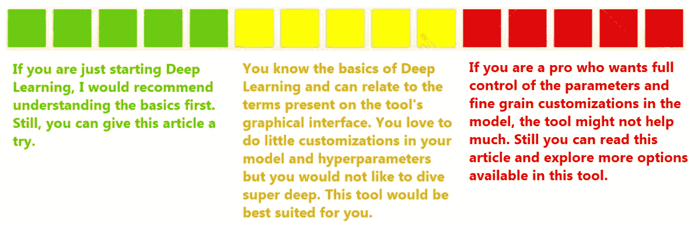

GUI 方法适合你吗？

# 边缘脉冲及其特征

这个平台背后的主要动机是让机器学习在[边缘设备](https://searchnetworking.techtarget.com/definition/edge-device)上成为可能(比如 Raspberry Pi 或 Arduino 或 Jetson Nano)。像 Raspberry Pi 或 Arduino 这样的设备缺乏足够的资源(如 GPU)，而这些资源在训练深度学习模型时是大量需要的。想法是在 Edge Impulse 平台上执行重负载工作(模型训练),并将训练的模型返回到边缘设备，因此边缘设备所要做的就是使用该模型并执行检测或分类。尽管该平台是为边缘设备设计的，但您仍然可以在普通系统中使用它。我非常喜欢这个平台的一些特性:

1.  将多个设备连接到平台。你也可以把你的手机当成一个设备:

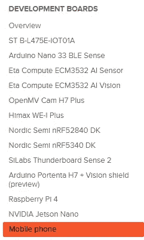

多种设备选项

2.有很多方法和来源来准备你的输入数据。您可以将设备直接连接到该平台，并使用设备的摄像头拍照。

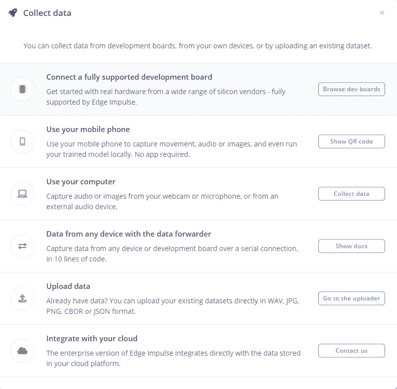

准备输入数据的多种方法

3.最后但并非最不重要的是，它有一个拖放式 UI，对于代码管理、测试和部署来说，一切都非常用户友好。

# 让我们训练一个边缘冲动的模型

出于演示目的，我将使用数据集后面的[。这个模型的目标是检测图像中的人是否戴着面具。*这个数据集完全归 Kaggle 所有，我对这个数据集没有任何所有权。*我还使用传统的 Jupyter 笔记本方法创建了我的模型，你可以在这里](https://www.kaggle.com/pdhruv93/mask-vs-no-mask/#data)查看[。在本文的其余部分，我们将关注如何使用这个数据集来创建模型，而无需编写任何代码。](https://www.kaggle.com/pdhruv93/mask-vs-no-mask/)

1.  **上传数据集文件:**您执行的第一步是将数据集上传到平台。如前所述，你可以直接从你的系统上传或从设备的摄像头拍照。这张图片是不言自明的，我已经强调了主要步骤。一旦你上传了数据集，你将有你的数据仪表板，不要忘记检查它，因为它超级棒！

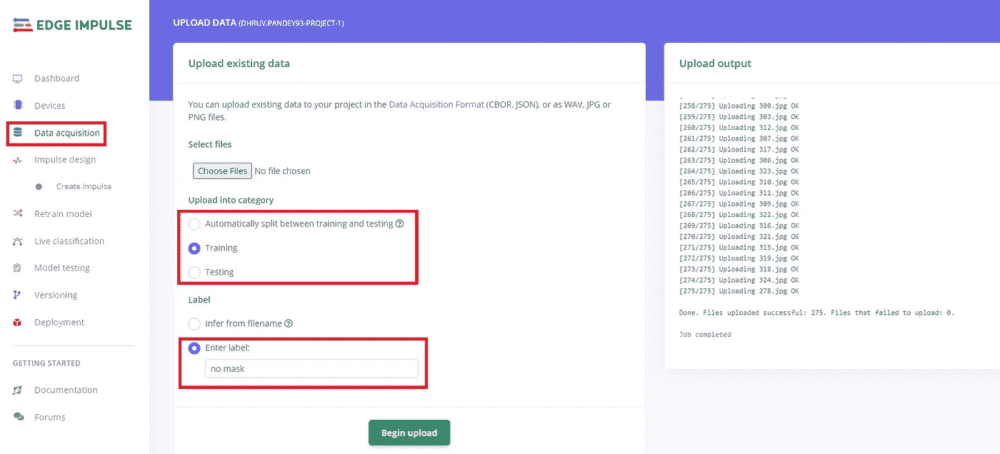

**步骤 1** :数据集准备

2.**创造冲动(管道):**这是整个流程的核心。您决定步骤并为您的模型训练创建管道。您可以执行数据调整大小，数据预处理，添加多个预处理块。*管道中的每一步都有自己的名字*，图中的黄线显示了每一步如何连接到管道中的下一步。我在图片上添加了简短的解释，但是当你使用这个工具时会更清楚。

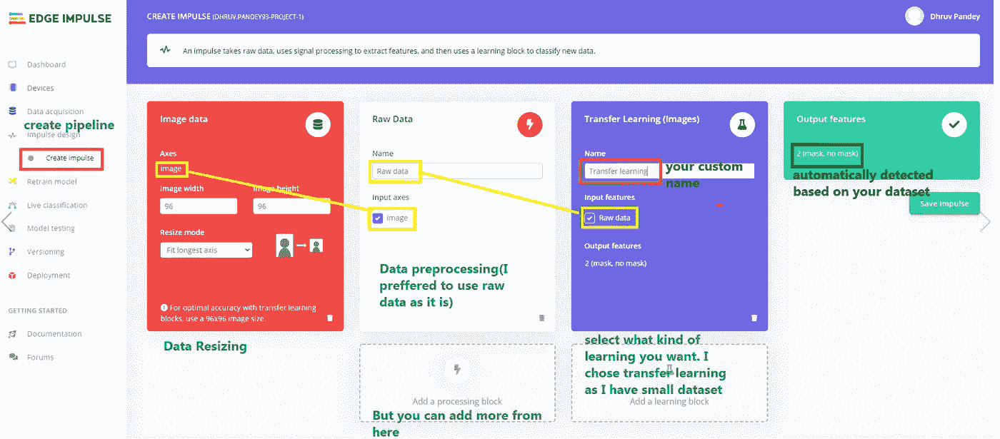

**步骤 2:** 创建脉冲(管道)

3.**定义参数:**保存脉冲后，工具会要求您定义用于训练的参数。如果您注意到左侧，您将会看到您在上一步中创建的每个块都有一个单独的链接。你必须访问每个区块，并根据你的要求调整参数。有些程序块可能不需要您的任何输入，而对于有些程序块，您必须添加参数。每个块链接还将在同一个选项卡上显示该步骤的输出。

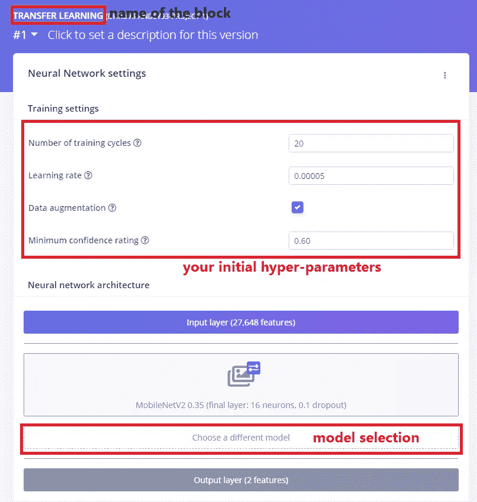

**步骤 3:** 定义您的参数

4.**开始训练:**一旦您决定了参数，您只需点击“开始训练”，工具将开始执行您定义的管道。所有实时日志和错误将显示在右侧。训练完成后，工具会显示这样的最终结果(工具会显示很多，我只是放一个小图):

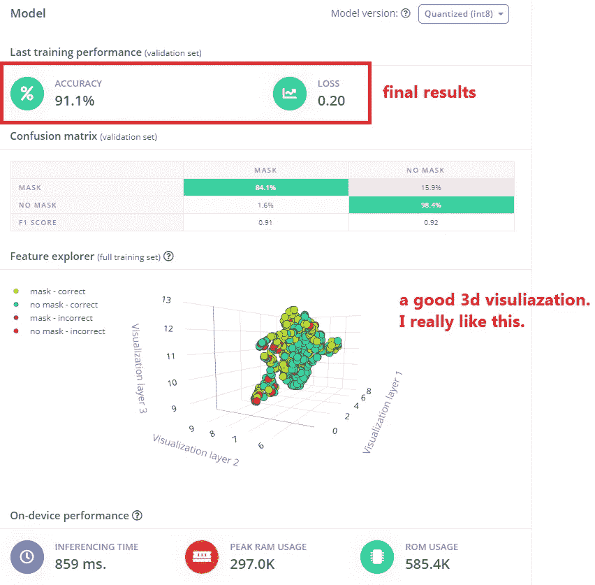

**第四步:**结果

5.**使用经过训练的模型:**一旦脉冲(模型)经过训练，该工具将为您提供重新训练模型、测试模型、实时分类或将模型部署到您连接的设备的选项。

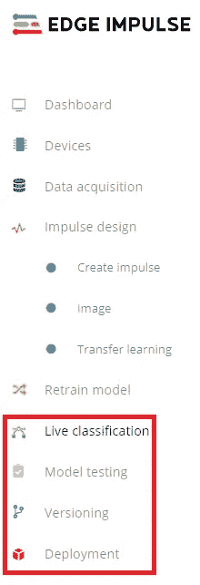

**第五步:**使用训练好的模型

# 不要忘记检查这些令人敬畏的功能

我不确定其他人，但我对这个平台提供的 UI 特性非常着迷。我知道大部分都可以通过写代码来准备，但是不写一行代码就做所有的事情有多容易呢？我会列出一些我非常喜欢的功能，如果你错过了，你一定要检查一下。

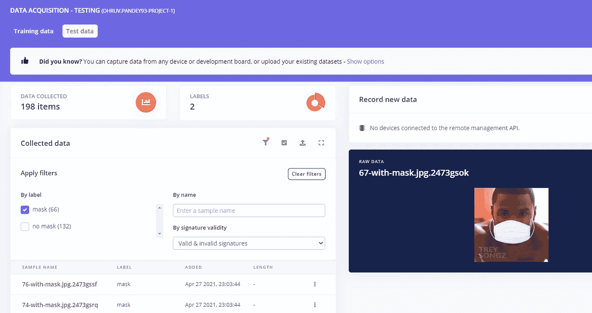

上传数据的数据仪表板

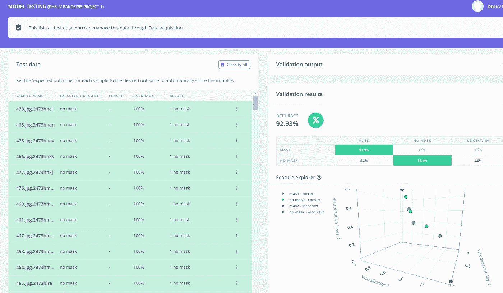

实时数据测试

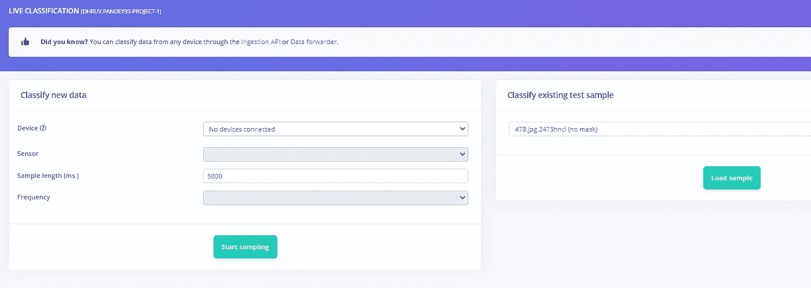

使用训练好的模型进行实时分类

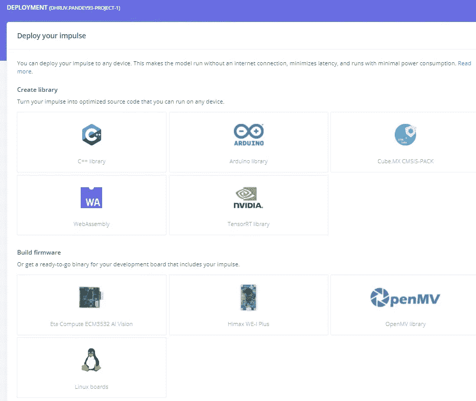

轻松部署到您的任何边缘设备

# 最后的话

我想再次提到，写这篇文章背后的想法并不是阻止你写自己的代码，完全依赖 GUI。即使您正在使用拖放功能，您也应该知道该工具在幕后可能正在做什么。是的，在某种程度上，我们不得不承认，与编写代码相比，基于 GUI 的方法更加用户友好，耗时更少。深度学习仍在发展，你可以期待市场上出现更多这样的工具，其中一些可能会成为行业标准，所以去体验一下吧。