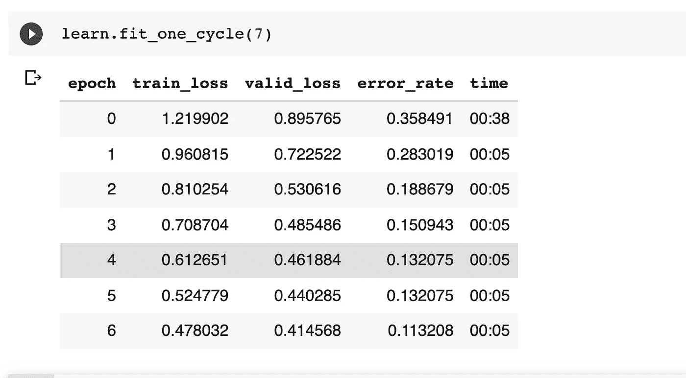

# 使用 fast.ai 库的吉他分类器

> 原文：<https://medium.com/analytics-vidhya/guitar-classifier-using-fast-ai-library-778e985123d9?source=collection_archive---------11----------------------->

这是我为 fast-ai 第 1 部分课程创建的一个入门项目。该分类器仅使用 200 幅示例图像就能够以大约 90%的准确度学习区分芬达和吉布森吉他。这个项目展示了 fast-ai 库中可用的开箱即用工具的力量，是开始深度学习的一个很好的方式。

Photo by [戸山 神奈](https://unsplash.com/@toyamakanna?utm_source=medium&utm_medium=referral) on [Unsplash](https://unsplash.com?utm_source=medium&utm_medium=referral)

**提取吉他图像**

快速人工智能库让这一步变得异常简单。打开 google images 选项卡，搜索感兴趣的关键字，对于我们的例子，我们可以简单地搜索“fender guitar”和“gibson guitar”。

运行这个由 fast-ai 团队提供的 javascript 代码来保存 google images 标签中所有图片的 URL。

一旦我们得到了所有图片的网址，fast-ai library 就可以直接使用 api [调用](https://docs.fast.ai/vision.utils.html#download_images)来下载图片。

**加载并预处理数据**

在此步骤中，我们使用 fast-ai 视觉库函数[*image data loaders::from _ folder*](https://docs.fast.ai/vision.data.html#ImageDataLoaders.from_folder)，该函数加载图像，并将它们分割到训练/测试/验证集中，并对数据进行批处理。它还提供了在加载图像之前对图像数据进行转换的选项。

通过预览批来验证数据看起来合理。

检查训练和测试数据——在我们的例子中，我们有 216 个训练样本和 53 个验证集。

**列车型号**

使用 cnn 风格的 resnet 架构训练模型。使用 [cnn_learner](https://fastai1.fast.ai/vision.learner.html#cnn_learner) fast-ai 函数实例化学习者。

使用一个周期[调度器](https://sgugger.github.io/the-1cycle-policy.html)开始训练模型。注意在随后的时期中错误率的降低，在 7 个时期(1 个时期=训练数据的一次扫描)之后，模型收敛到 11%的错误率。

通过绘制混淆矩阵来检查结果。从矩阵中可以看出，模型误差率= (5+1)/(5+1+18+29) = 11.3%

Github 回购代码/数据可从以下网址获得:

[https://github.com/shreyas88/gibson-or-fender](https://github.com/shreyas88/gibson-or-fender)