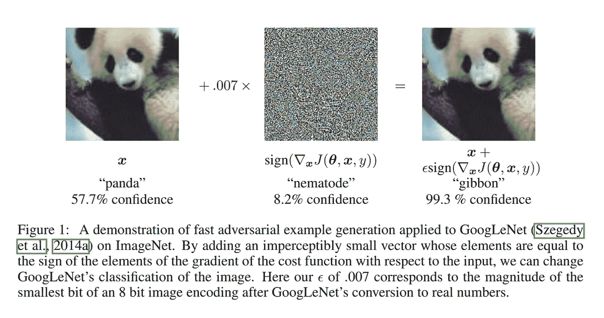
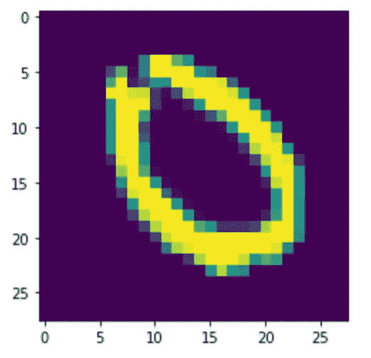
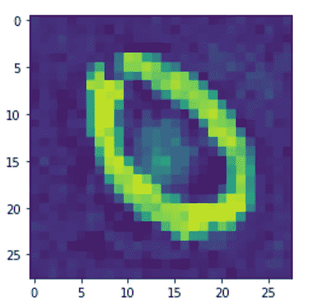

# 只用 10 行代码就能黑进一个神经网络！！！

> 原文：<https://medium.com/analytics-vidhya/hack-a-neural-network-in-just-10-lines-of-code-ecd2192930a1?source=collection_archive---------4----------------------->


杰佛森·桑多斯在 [Unsplash](https://unsplash.com?utm_source=medium&utm_medium=referral) 上拍摄的照片

大家好！希望你一切都好。让我们开始吧。

# 什么是入侵神经网络？

> 黑掉一个神经网络就是简单的愚弄一个神经网络。神经网络越来越多地用于不同领域的各种安全和调节系统。在不同类型的攻击中保持完整性是非常重要的。在这篇文章中，我将解释我们如何修改一幅图像(而不改变太多)来迫使神经网络对它进行错误分类(这也有很高的确定性)。
> 
> 下面是伊恩·古德菲勒论文的摘录，[解释和利用对立的例子](https://arxiv.org/pdf/1412.6572.pdf)。



在上面的例子中，我们可以看到，在图像中添加精心设计和数学设计的噪声可以极大地扰乱神经网络的预测，同时设法保持图像在视觉上不变。

在这篇文章中，我将黑客 MNIST 数字分类器神经网络。让我们拍摄一个数字为 0 的图像(如下所示)。由于我建立的模型有大约 96%的准确率，它将正确地将这张图像分类为 0。现在，我想通过添加一些策略噪声(这是通过简单的梯度下降实现的)来修改 0 的图像，以便 MNIST 模型将其分类为图像 8 **和**，图像没有被修改太多。因此，对我们人类来说，我们仍然可以清楚地看到图像是数字 0，但模型认为图像很有可能由数字 8 组成。

结果如下所示:



上面的图像被 MNIST 分类器识别为 0 号，有 99%的把握。下面给出的是被 NN 以 99.6%的确定性识别为 8 号的修改图像。



在这篇文章中，我将解释我如何能够将第一幅图像修改为第二幅图像，即，我如何欺骗神经网络将一幅明显为 0 的图像分类为 8(具有非常高的可信度)。

# ***破解 MNIST 分类器的步骤:***

基于在这篇[文章](https://towardsdatascience.com/handwritten-digit-mnist-pytorch-977b5338e627)中找到的 MNIST 分类器来训练要被攻击的模型。既然我们已经有了准备好接受黑客攻击的训练模型，让我们开始黑客攻击吧。

我们将使用简单的梯度下降来计算必须添加到原始图像中的精确噪声，以便摆脱神经网络。首先，我要为梯度下降做一个损失函数。损失函数是任何涉及梯度下降系统的最重要部分之一。梯度下降只是最小化损失函数的一种方式。因此，我们需要建立一个反映我们目标的损失函数，即，使图像的预测概率为 8 最大，并保持原始图像和修改图像之间的差异最小。这是损失函数的样子。

```
**def** findloss(diff,pred): l1=torch.mean(torch.square(diff))
    l2=pred**(-1)

    fl=(l1+l2)**0.5

    **return** fl
```

l1 表示修改后的图像和原始图像之间的偏差(差异或噪声)。l2 表示概率的倒数，NN 将修改的图像分类为数字 8。因此，最小化 l1 和 l2 之和的平方根，导致最小化 l1 和 l2，从而最小化噪声并最大化修改图像同时被 NN 分类为 8 的概率。

现在，让我们使用梯度下降来修改噪声，以便最小化上面定义的损失函数(这自动实现了我们设置的攻击神经网络的目标)。下面是代码。

```
learning_rate=0.0005
num_descents=2000000 
*#number of times gradient descent is employed*

img=img.cuda()
#generate random noise to finetune using gradient descent
diff=torch.rand(784).cuda().requires_grad_()**for** i **in** range(num_descents):

    #get the modified image
    imagef=img+diff pred=torch.exp(model(imagef.reshape([1,784])))[0][8]

    totalloss=findloss(diff,pred)
    **if** i%10000 ==0:
        print('Loss and prediction by the model after '+str(i)+' steps of gradient descent are '+str(totalloss.item()),str(pred.item()))

    *#find gradients of totalt wrt yarray.*
    totalloss.backward()

    gradients=diff.grad
    *#torch.clip(gradients,max=100.0)*
    **with** torch.no_grad():
        diff[1:]=diff[1:]-learning_rate*gradients[1:]
    diff.grad.data.zero_()
```

完整的代码可以在我的 [repo](https://github.com/mohammadaaftabv/HackNN/blob/master/SimpeGradientDescentToHackNN.ipynb) 中找到。通过这种方法获得的结果已经在上面写了。

所以，这就是简单梯度下降是如何骗过 MNIST 分类器的。

感谢您通读这篇文章。这里有另一篇文章展示了简单梯度下降是多么强大。

[](/analytics-vidhya/neural-networks-vs-simple-gradient-descent-the-age-old-brachistochrone-problem-7503be69d611) [## 神经网络与简单梯度下降:古老的最速降问题。

### 简介:

medium.com](/analytics-vidhya/neural-networks-vs-simple-gradient-descent-the-age-old-brachistochrone-problem-7503be69d611) 

如果你喜欢这篇文章，让我们联系。

[Linkedin](https://www.linkedin.com/in/mohammadaaftabv/) ， [Twitter](https://twitter.com/Aaftab08924859) ， [Github](https://github.com/mohammadaaftabv)