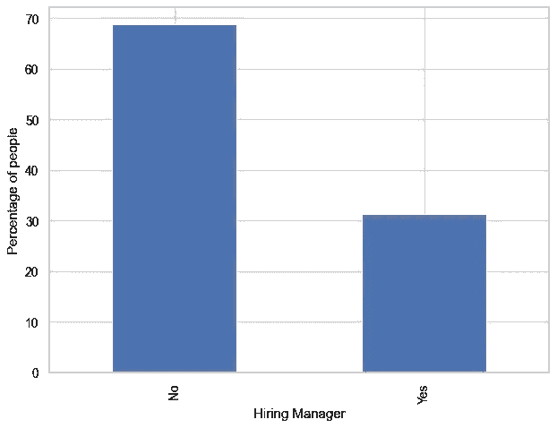

# 关于开发者，HakerRank 数据暗示了什么？

> 原文：<https://medium.com/analytics-vidhya/hacker-rank-developer-survey-2018-5fa5060b802f?source=collection_archive---------22----------------------->

Hacker Rank 是一个学习代码和提高计算机科学不同算法技能的好地方。

这是一个来自世界各地的程序员聚集在一起，参加不同的算法、机器学习或人工智能等编码竞赛的地方。

2018 年，HackerRank 对从事计算机科学不同领域工作的 25，000 名专业人士和开发者学生进行了一项调查，并根据[知识共享许可](https://creativecommons.org/licenses/by-sa/4.0/)向所有人公开了[数据集](https://www.kaggle.com/hackerrank/developer-survey-2018)。

我检查了数据，并提出了一些问题，我想通过这篇文章来回答。

> “人们学习代码最常用的平台是哪个？”
> 
> "招聘经理在候选人身上寻找什么样的品质？"
> 
> "当寻找工作机会时，人们在公司里寻找什么？"

# 第一部分:人们学习代码最常用的平台是什么？

首先，我想看看不同学习资源的数据。

图 1

在这里，您可以在条形图上看到不同平台的个人比例。

StackOverflow 是使用最广泛的学习网站。

通过查看条形图(图 1)，大约 83.70 %的人正在使用 StackOverflow 通过发布问题或使用之前回答的问题来学习代码。

> 注:由于被调查者可以在调查中选择多个选项，因此总百分比之和可能大于 100。

## 1.1 不同年龄段的开发者使用最多的平台是什么

结果发现，25-35 岁年龄组的人通常使用 StackOverflow 最多(89.51%)，其次是 25-34 岁年龄组(87.57%)，然后是 45-54 岁年龄组(86.97%)。

年龄在 18 到 24 岁之间的开发者(72.22%)经常使用 youtube 和 StackOverflow

图 1.1

## 1.2 各国对不同平台的使用

来自大约 153 个国家的开发人员参与了此次调查。在这里，我刚刚调查了每个国家提交调查数量最多的 10 个国家。

来自印度和印度尼西亚的人使用 YouTube 最多，与其他国家相比，近 74%至 75 %的人表示他们使用 YouTube。

图 1.2

然而，与其他国家相比，俄罗斯人(78.57%)和波兰人(75.00%)仍然更喜欢读书。

## 1.3 不同资源的性别明智使用

关于资源的使用，没有任何基于性别的重大差异。

图 1.3

# 第二部分:招聘经理希望应聘者具备哪些品质？

图 2

根据数据集，7841 名开发人员自称是招聘经理。

以下部分描述了他们在招聘过程中对候选人的期望。

## 2.1 招聘经理需要什么样的资格

> 一般来说，人们认为计算机科学学位会增加科技行业招聘过程中的成功机会。让我们看看数据对此有何暗示。

招聘经理更喜欢有工作经验(77.24 %)和多年工作经验(59.75 %)的候选人。

图 2.1

只有 38.25 %的招聘经理认为计算机科学学位是进入该领域的必要条件。

事实证明，招聘经理更喜欢以前的工作经验、多年的经验以及 Github 和个人项目，而不是 CS 学位。

## 2.2 招聘经理希望你了解什么语言或框架

> 有没有什么特别的编程语言或者框架是招聘经理最关注的？

嗯，这个问题的答案也取决于你申请的领域，但让我们来概括一下大多数招聘经理需要什么。

在下面的柱状图中，我感兴趣的是有没有招聘经理最关注的特殊类型的编程语言。

在这里，您可以看到以降序排列的各种语言的招聘经理的比例。

图 2.2

通过查看上面的条形图，结果显示只有 47.95 %的招聘经理在寻找 javascript 开发人员，46.56 %的招聘经理在寻找 Java 开发人员。

图 2.3

框架也是如此，分别有 36.37%和 37.86 %的招聘经理通常会挑选了解 AngularJS 和 NodeDotJS 的候选人。

# 3.人们在寻找工作机会时会在一家公司寻找什么？

让我们来看看大多数开发人员在申请技术机构的工作时都在寻找什么。

图 3

从柱状图(图 3)可以清楚地看出，大多数申请人寻求职业发展和学习(55.80%)，工作与生活的平衡(54.39%)。

虽然他们也看到有趣的问题(44.03%)和聪明人团队(43.54%)。

## 3.1 基于年龄组

> 不同年龄段的人在申请公司工作时都在寻找什么。

18 - 24 岁、25 - 34 岁和 35 - 44 岁的求职者大多更喜欢工作生活平衡和职业成长与学习。

图 3.1

年龄在 65 - 74 岁之间的人选择拥有聪明人团队的公司。

## 3.2 基于性别

> 基于性别的候选人的选择有什么不同吗？

图 3.2

与男性相比，女性(63.42 %)选择职业发展和学习作为他们的主要优先事项。

## 3.3 基于不同的国家

> 让我们看看基于国家的变化

图 3.3

来自土耳其(68.00%)、巴西(66.14%)和印度尼西亚(62.79%)的人表示，工作与生活的平衡是他们的主要优先事项。

还有巴西(64.54%)、印度(64.24%)、俄罗斯(61.64%)希望自己的专业成长和学习得到尊重。

# 结论:

在这篇文章中，我只是根据对 Kaggle 上的 HackerRank 数据集的分析提出了我的观察，要获得关于数据集[的更多细节，请单击此处](https://www.kaggle.com/hackerrank/developer-survey-2018)。

*   StackOverflow 成为冠军。这是学习用途最广泛的网站。有趣的是，与其他国家相比，来自俄罗斯和波兰的人通常更喜欢读书。
*   招聘经理通常更喜欢有工作经验和多年工作经验的候选人。
*   人们通常在寻找尊重他们的职业成长和学习、工作与生活平衡的工作。

要了解更多关于这个分析的内容，请点击这里查看我的 Github 链接[。](https://github.com/aarsh-pandey/Hacker-Rank-2018-Analysis)