# Hadoop:如何在 Windows 10 中用 5 个步骤安装

> 原文：<https://medium.com/analytics-vidhya/hadoop-how-to-install-in-5-steps-in-windows-10-61b0e67342f8?source=collection_archive---------0----------------------->

在 Windows 10 中安装 Hadoop 的简单指南


图片取自谷歌图片

# 1.先决条件

1.  硬件要求
    * RAM —最小值。8GB，如果您的系统中有 SSD，那么 4GB RAM 也可以。
    * CPU —最小值。四核，至少 1.80GHz
2.  [JRE 1.8](https://www.java.com/en/download/windows_offline.jsp)—JRE 的离线安装程序
3.  [Java 开发套件— 1.8](https://www.oracle.com/java/technologies/javase/javase-jdk8-downloads.html#license-lightbox)
4.  我将使用 64 位 windows 操作系统，请检查并下载您的系统 x86 或 x64 支持的所有软件版本。
5.  [下载 Hadoop zip](https://archive.apache.org/dist/hadoop/core/hadoop-2.9.2/)

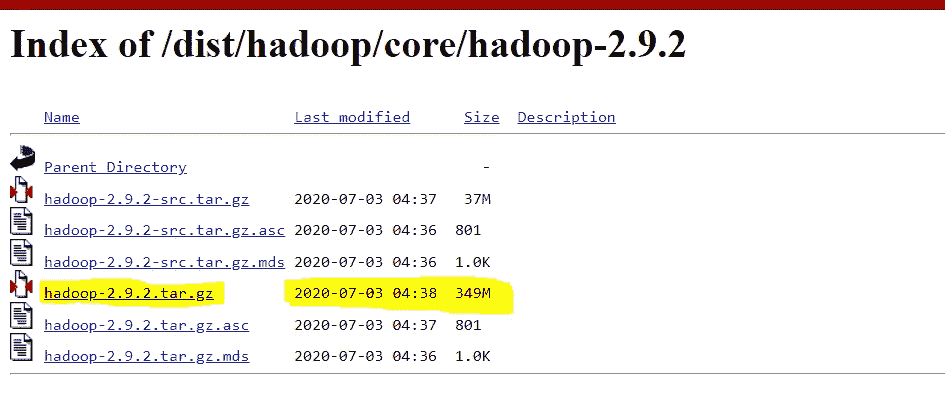

图 1:-下载 Hadoop 2.9.2

一旦我们下载了上述所有软件，我们就可以继续安装 Hadoop 的后续步骤。

# **2。解压并安装 Hadoop**

下载完 Hadoop 后，我们需要解压 hadoop-2.9.2.tar.gz 文件。

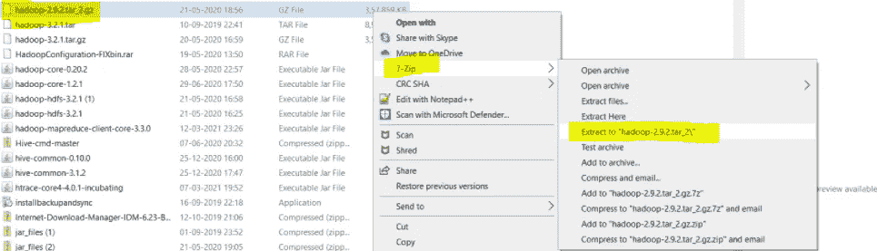

图 2:-提取 Hadoop 步骤 1

一旦提取，我们将得到一个新的文件 hadoop-2.9.2.tar。现在，我们再次需要提取这个 tar 文件。

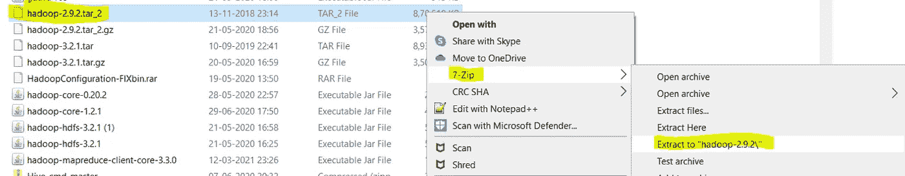

图 3:-提取 Hadoop 步骤 2

*   现在，我们可以组织我们的 Hadoop 安装，我们可以创建一个文件夹，并在其中移动最终提取的文件。比如说

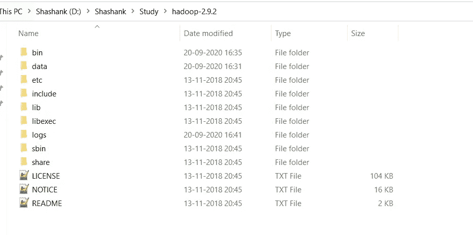

图 4:- Hadoop 目录

*   请注意，创建文件夹时，不要在文件夹名称之间添加空格。(这可能会导致以后出现问题)
*   我已经把我的 Hadoop 放在了 D: drive 中，你也可以使用 C:或者任何其他的驱动器。

# 3.设置环境变量

设置工作环境的另一个重要步骤是设置系统环境变量。

要编辑环境变量，进入控制面板>系统>点击“高级系统设置”链接
,或者，我们可以右键单击该电脑图标，点击属性，然后点击“高级系统设置”链接
,或者，最简单的方法是在搜索栏中搜索环境变量😉

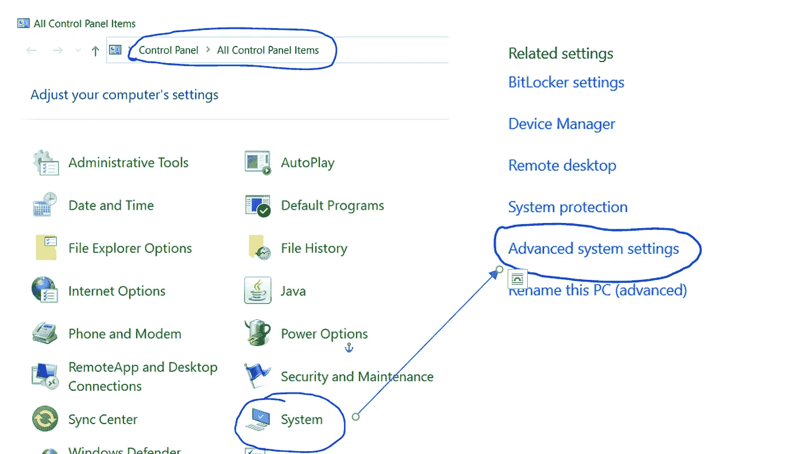

图 5:-环境变量的路径


图 6:-高级系统设置屏幕

**3.1 设置 JAVA_HOME**

*   打开环境变量，点击“用户变量”中的“新建”


图 7:-添加环境变量

*   点击“新建”,我们进入下面的屏幕。

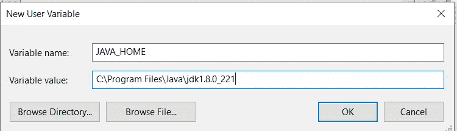

图 8:-添加 JAVA_HOME

*   现在如图所示，在变量名中添加 JAVA_HOME，在变量值中添加 Java(jdk)的路径。
*   单击 OK，我们就完成了 JAVA_HOME 设置的一半。

**3.2 设置 HADOOP_HOME**

*   打开环境变量，点击“用户变量”中的“新建”


图 9:-添加环境变量

*   点击“新建”,我们进入下面的屏幕。

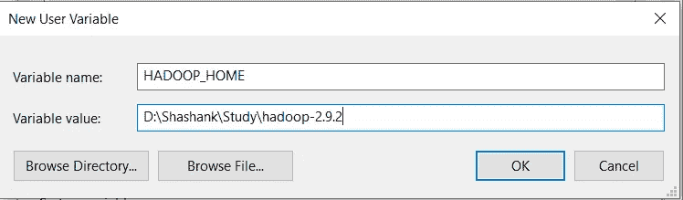

图 10:-添加 HADOOP_HOME

*   现在如图所示，在变量名中添加 HADOOP_HOME，在变量值中添加 HADOOP 文件夹的路径。
*   单击 OK，我们就完成了 HADOOP_HOME 设置的一半。

> 注意:-如果您想要为所有用户设置路径，您需要从系统变量中选择“新建”。

**3.3 设置路径变量**

*   设置环境变量的最后一步是在系统变量中设置路径。


图 11:-设置路径变量

*   在系统变量中选择路径变量并点击“编辑”。

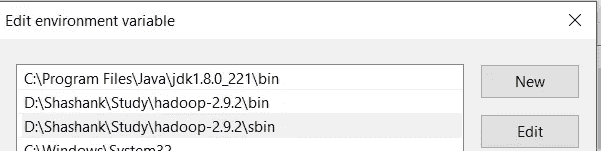

图 12:-添加路径

*   现在我们需要将这些路径逐个添加到 Path 变量:-
    * % JAVA _ HOME % \ bin
    * % HADOOP _ HOME % \ bin
    * % HADOOP _ HOME % \ sbin
*   单击确定和确定。&我们已经完成了环境变量的设置。

**3.4 验证路径**

*   现在我们需要验证我们所做的是正确的和反映的。
*   打开一个**新的**命令窗口
*   运行以下命令

```
echo %JAVA_HOME% 
echo %HADOOP_HOME%
echo %PATH%
```

# 4.编辑 Hadoop 文件

一旦我们配置了环境变量，下一步就是配置 Hadoop。它有三个部分:-

**4.1 创建文件夹**

我们需要在 hadoop 目录下创建一个文件夹`data`，以及两个子文件夹`namenode`和`datanode`

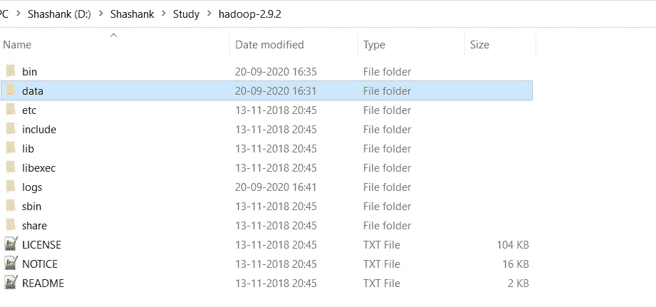

图 13:-创建数据文件夹

*   在 Hadoop 目录下创建**数据文件夹**

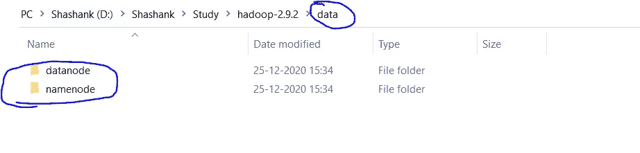

图 14:-创建子文件夹

*   创建数据文件夹后，我们需要在数据文件夹中创建两个新文件夹，即 **namenode 和**datanode
*   这些文件夹很重要，因为 HDFS 上的文件驻留在 datanode 中。

**4.2 编辑配置文件**

现在我们需要在 hadoop 中编辑以下配置文件来配置它:-
(我们可以在 Hadoop - > etc - > hadoop 中找到这些文件)

```
* core-site.xml
* hdfs-site.xml
* mapred-site.xml
* yarn-site.xml
* hadoop-env.cmd
```

**4.2.1 编辑 core-site.xml** 右击文件，选择编辑，将以下内容粘贴在<配置></配置>标签内。
***注意:——下面的部分已经有了配置标签，我们只需要复制它里面的部分。***

```
<configuration>
<property>
  <name>fs.defaultFS</name>
  <value>hdfs://localhost:9000</value>
 </property>
</configuration>
```

**4.2.2 编辑 hdfs-site.xml** 右击文件，选择编辑，将以下内容粘贴在<配置></配置>标签内。
***注意:-下面的部分已经有了配置标签，我们只需要复制它里面的部分。
同样用我们最近创建的 namenode 和 datanode 文件夹的路径替换 PATH~1 和 PATH~2(步骤 4.1)。***

```
<configuration>
 <property>
  <name>dfs.replication</name>
  <value>1</value>
 </property>
 <property>
  <name>dfs.namenode.name.dir</name>
  <value>PATH~1\namenode</value>
  <final>true</final>
 </property>
 <property>
  <name>dfs.datanode.data.dir</name>
  <value>PATH~2\datanode</value>
  <final>true</final>
 </property>
</configuration>
```

**4.2.3 编辑 mapred-site.xml** 在文件上点击右键，选择编辑，将以下内容粘贴在<配置></配置>标签内。
***注意:——下面的部分已经有了配置标签，我们只需要复制它里面的部分。***

```
<configuration>
 <property>
  <name>mapreduce.framework.name</name>
  <value>yarn</value>
 </property>
</configuration>
```

**4.2.4 编辑 yarn-site.xml** 右击文件，选择编辑，将以下内容粘贴在<配置></配置>标签内。
***注意:-下面的部分已经有了配置标签，我们只需要复制它里面的部分。***

```
<configuration>
 <property>
  <name>yarn.nodemanager.aux-services</name>
  <value>mapreduce_shuffle</value>
 </property>
 <property>
  <name>yarn.nodemanager.auxservices.mapreduce.shuffle.class</name>
  <value>org.apache.hadoop.mapred.ShuffleHandler</value>
 </property>
<!-- Site specific YARN configuration properties --></configuration>
```

**4.2.5 验证 hadoop-env.cmd** 右击文件，选择编辑，检查 JAVA_HOME 设置是否正确。我们可以用我们在系统变量中配置的实际 JAVA_HOME 替换文件中的 JAVA_HOME 变量。

```
set JAVA_HOME=%JAVA_HOME%
           OR
set JAVA_HOME="C:\Program Files\Java\jdk1.8.0_221"
```

**4.3 更换纸盒**

配置 hadoop 的最后一步是[下载](https://github.com/cdarlint/winutils/tree/master/hadoop-2.9.2/bin)并替换 bin 文件夹。
*到这个 [GitHub Repo](https://github.com/cdarlint/winutils/tree/master/hadoop-2.9.2) 下载 bin 文件夹为 zip。
*解压 zip 并将 bin 文件夹下的所有文件复制到%HADOOP_HOME%\bin

> **注意:-如果您使用不同版本的 Hadoop，请搜索其各自的 bin 文件夹并下载。**

# 5.测试设置

祝贺..！！！！！
我们已经完成了系统中 Hadoop 的设置。

现在我们需要检查是否一切顺利…

**5.1 格式化 Namenode**

在启动 hadoop 之前，我们需要格式化 namenode，为此我们需要启动一个新的命令提示符并运行下面的命令

```
hadoop namenode -format
```

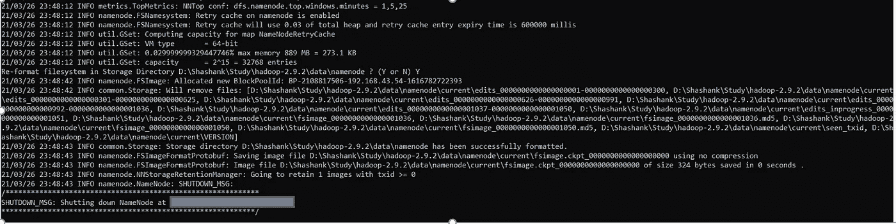

图 15:-格式化 Namenode

> **注意:-该命令格式化 namenode 中的所有数据。因此，建议只在开始时使用，而不要在启动 hadoop 集群时每次都使用，以避免数据丢失。**

**5.2 启动 Hadoop**

现在我们需要启动一个新的命令提示符，记住以管理员身份运行它，以避免权限问题，并执行下面的命令

```
***start-all.cmd***
```

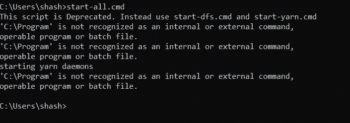

图 16:-启动所有命令

这将打开 4 个新的 cmd 窗口，运行 4 个不同的 hadoop 守护进程:-
* Namenode
* Datanode
* resource manager
* node manager

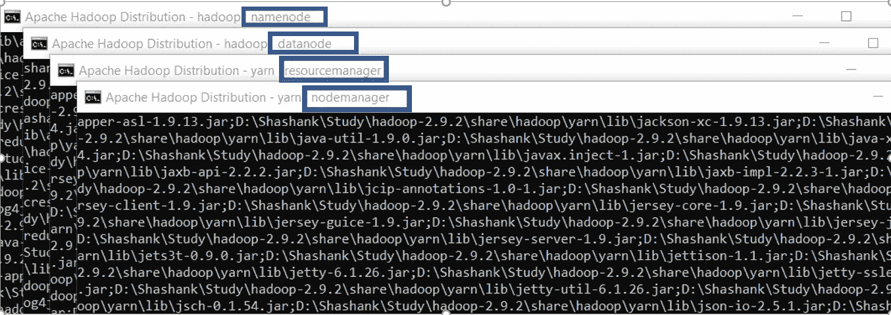

图 17:- Hadoop Deamons

> **注意:-我们可以在新的 cmd 窗口中使用** `**jps**` **命令来验证是否所有的守护进程都已启动并运行。**

# **6。运行 Hadoop(验证 Web 用户界面)**

**6.1 Namenode**

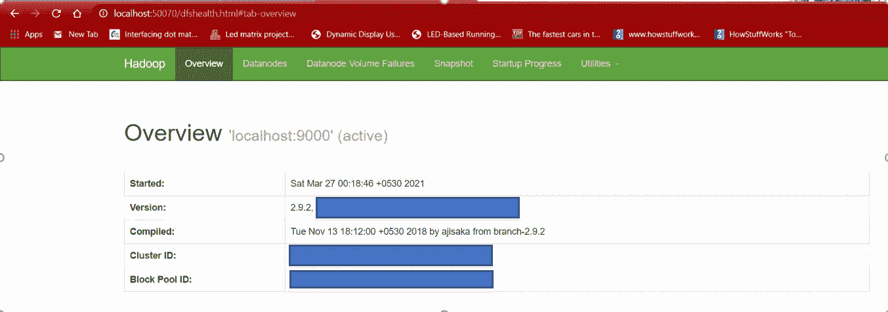

图 18:- Namenode Web 用户界面

**6.2 资源管理器** 在浏览器标签中打开 localhost:8088，查看资源管理器详情。

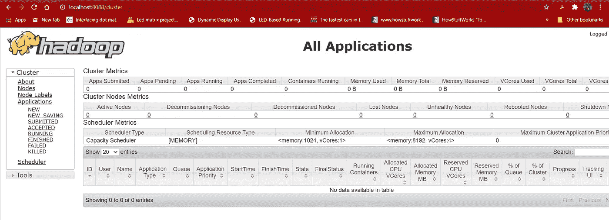

图 19:-资源管理器 Web 用户界面

**6.3 Datanode
在浏览器标签页中打开 localhost:50075 来结帐 Datanode。**

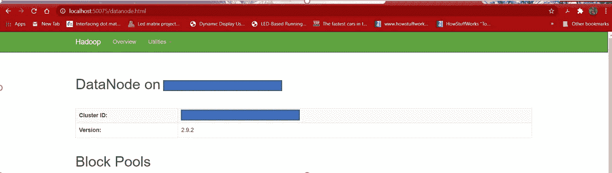

图 20:- Datanode Web 用户界面

# 7.恭喜..！！！！🎉

恭喜你！我们已经成功安装了 Hadoop。我们中的一些人可能会遇到一些问题…不要担心，这很可能是由于一些小失误或不兼容的软件。如果您遇到任何此类问题，请再次仔细访问所有步骤，并验证软件版本是否正确。
如果你仍然不能启动和运行 Hadoop，请在评论区描述你的问题。

# 8.记名票据🙏

别忘了喜欢并分享给你的朋友和同事。另外，不要错过分享你对这篇文章或新文章的观点和建议的机会。

你可以在这里了解我更多。。

快乐学习…！！！🙂