# Windows 上的 Hadoop！

> 原文：<https://medium.com/analytics-vidhya/hadoop-on-windows-eb322f520168?source=collection_archive---------5----------------------->

大家好！我带着新的议程回来了，你可以从标题中了解到，我们将学习在 windows 上安装和运行 hadoop 的一些命令。我最近在我的课程中遇到了 hadoop 框架，在我工程的最后一个学期，我叫 BDA(BigDataAnalytics)。基本上，hadoop 似乎可以轻松地与 Ubuntu 等开源操作系统一起工作..等等，在我的 windows10 笔记本电脑上安装 hadoop 时，我遇到了一些问题，所以我想给大家一个清晰的印象，并简要介绍安装 hadoop 的步骤，没有任何错误(无缝地)。

什么是 Hadoop？

Hadoop 是一个专门为处理大数据而构建的软件框架，数据大小从 Pb 到 zettabytes 不等。它最初设计灵感来自 Google 文件系统(GFS)和 MapReduce。

hadoop 框架有两个主要组件，它们是

1.  Hadoop 分布式文件系统(HDFS)
2.  MapReduce

HDFS 是 Hadoop 的主要存储单元，在存储和访问文件系统方面，它依赖于分布式文件系统的原理，基于主从架构。

它基本上将数据划分为 128MB 的固定块大小，并且再次复制每个块，以确保容错能力(即，即使某个节点不工作，也不会对您的数据造成损害，数据将一直存在)。

# 所以让我们跳过安装 Hadoop！

安装 hadoop 的第一步不是安装 hadoop！哈哈，开玩笑，但是你需要确保你的机器上安装了正确版本的 java，即 Java8。

如果您有更高版本，请从这里安装 Java 8[https://www . Oracle . com/Java/technologies/javase/javase-JDK 8-downloads . html](https://www.oracle.com/java/technologies/javase/javase-jdk8-downloads.html)

并更新您的环境变量，然后使用 java -version 检查它是否安装正确。

下载完 Java，现在可以从这里下载 Hadoop 3 . 1 . 4 版本:[https://archive . Apache . org/dist/Hadoop/common/Hadoop-3 . 1 . 4/Hadoop-3 . 1 . 4 . tar . gz](https://archive.apache.org/dist/hadoop/common/hadoop-3.1.4/hadoop-3.1.4.tar.gz)

安装后，您现在可以解压缩文件夹，视图如下所示

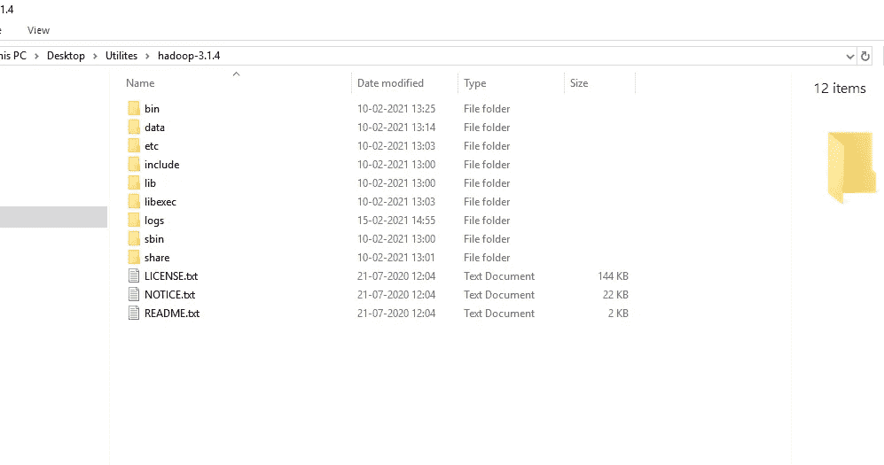

# 现在，设置环境变量:

像这样搜索 env

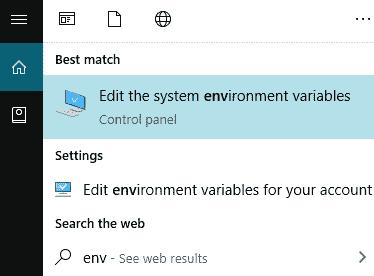

然后点击环境变量，然后编辑系统变量；

将 hadoop 的路径复制到 hadoop 文件夹中的 bin 文件夹，并创建变量名称 HADOOP_HOME，如下所示:

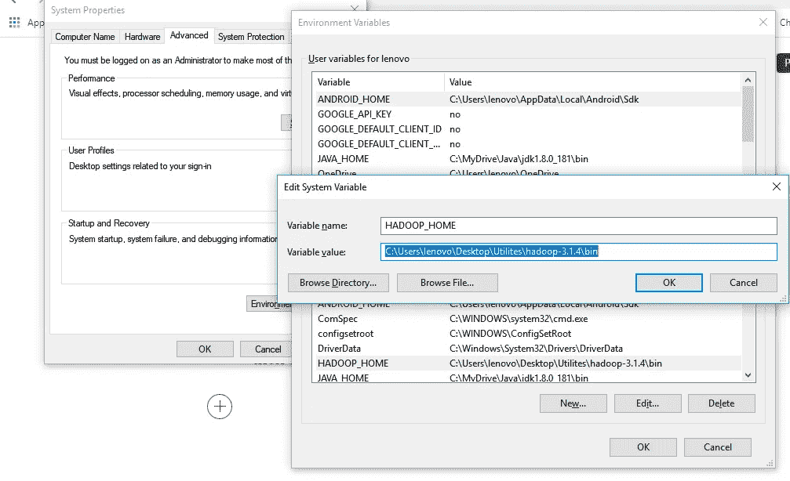

同样，创建一个新的用户变量，变量名为 JAVA_HOME，变量为 JAVA 目录中 bin 文件夹的路径。

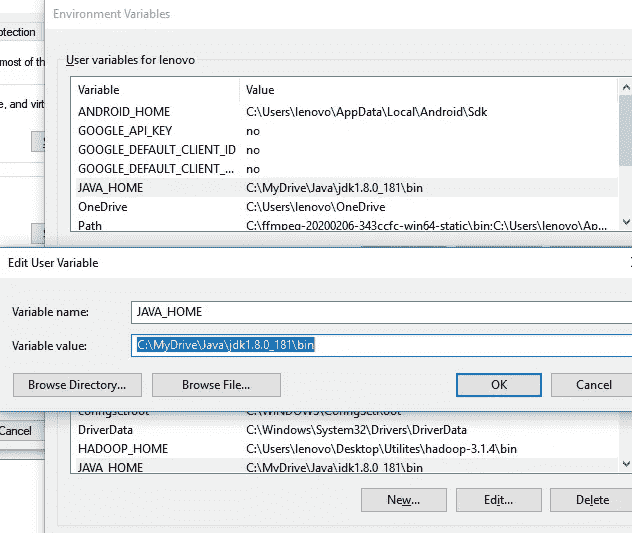

现在我们需要在系统变量 path 中设置 Hadoop bin 目录和 Java bin 目录路径。编辑系统变量中的路径。

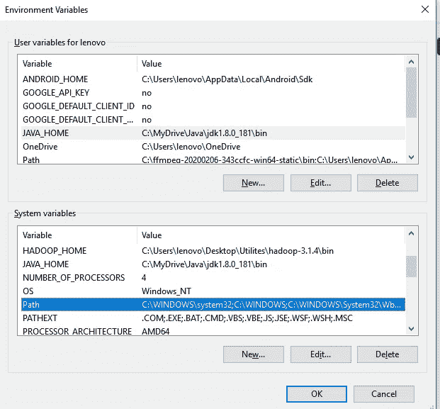

点击 New，在里面添加 Hadoop 和 Java 的 bin 目录路径。

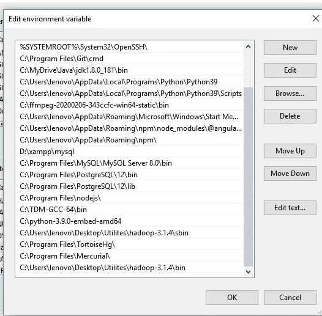

另外，将 hadoop 文件夹中的/sbin 文件夹路径放入系统路径变量中。

# 配置

现在我们需要编辑一些文件，这些文件位于我们安装 hadoop 的 etc 文件夹的 hadoop 目录中。需要编辑的文件已突出显示。

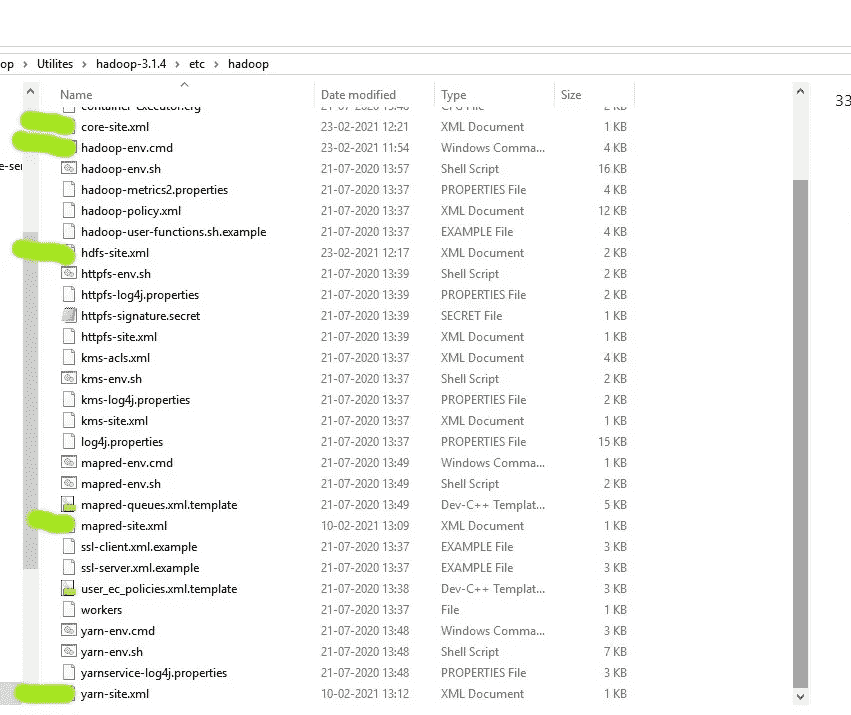

1.  编辑 hadoop 目录中的 core-site.xml 文件。将此 xml 属性复制到文件的配置中。

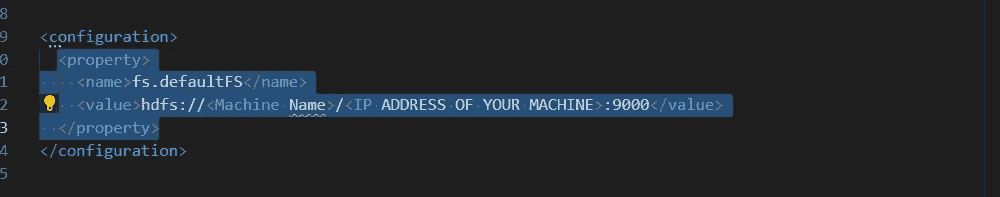

*请注意:在上述文件中提及您的机器名称/以及您的机器 ip 地址。

2.编辑 mapred-site.xml 并在配置中复制该属性

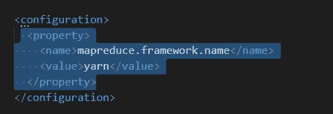

3.在 hadoop 目录下创建一个“数据”文件夹

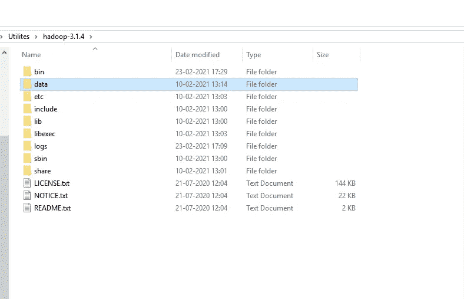

在此数据目录中创建一个名为“datanode”和“namenode”的文件夹

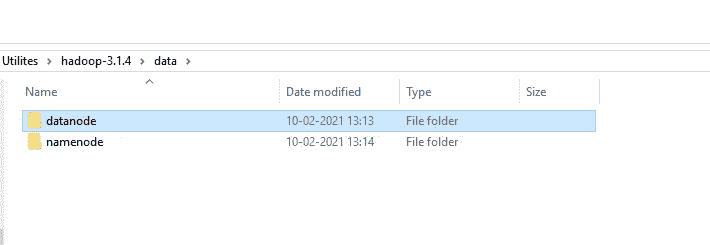

4.编辑 hdfs-site.xml 文件，并在配置中添加以下属性

注意:跨值的 namenode 和 datanode 的路径将是您刚刚创建的 datanode 和 namenode 文件夹的路径。

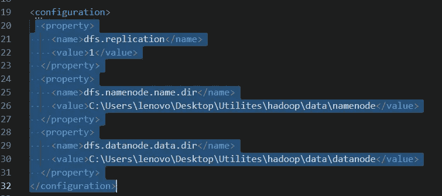

5.编辑 yarn-site.xml 并在配置中添加以下属性。

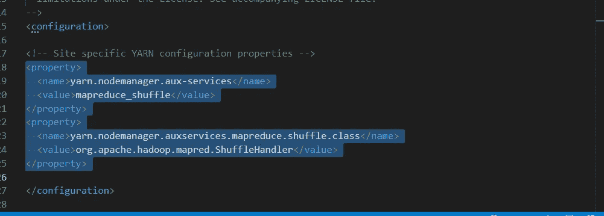

6.编辑 hadoop-env.cmd 并用安装 jdk 1.8 的 JAVA 文件夹的路径替换%JAVA_HOME%

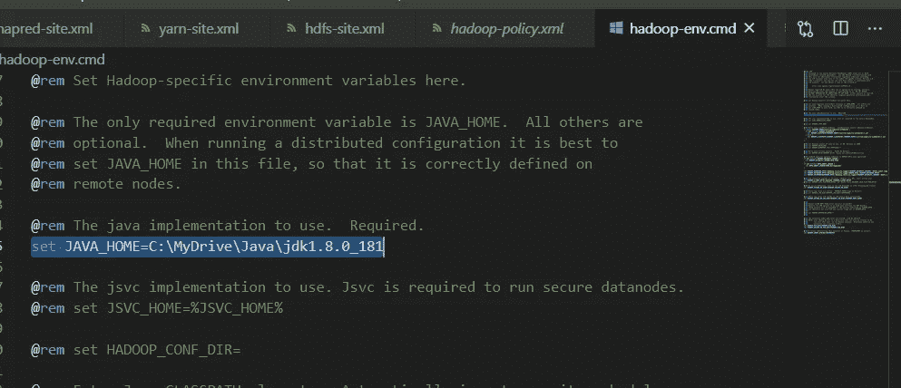

*   *请注意:这里是许多人犯错误的地方，因为在安装 java jdk 时，默认情况下，它将存储在 Program <space>文件夹中，因此由于空间的原因，hadoop 会出现一些问题，无法识别它，所以我们可以做的只是将 java jdk 文件夹放入新的 MyDrive 文件夹，并将此路径作为环境变量放入 JAVA_HOME 系统变量和系统路径变量中。</space>
*   hadoop 需要特定于 windows 操作系统的文件，这些文件不包含在 Hadoop 的默认下载中。
*   要包含这些文件，请用 github 链接中提供的 bin 文件夹替换 hadoop 目录中的 bin 文件夹。
*   [https://github.com/s911415/apache-hadoop-3.1.0-winutils](https://github.com/s911415/apache-hadoop-3.1.0-winutils)
*   下载成 zip 文件。提取它并复制其中的 bin 文件夹。如果要保存旧的 bin 文件夹，将其重命名为 bin_old，并将复制的 bin 文件夹粘贴到该目录中。

现在，终于在这样一个大力士任务之后，我们现在可以通过简单地键入 commad hadoop 版本来测试 hadoop 是否正确安装。

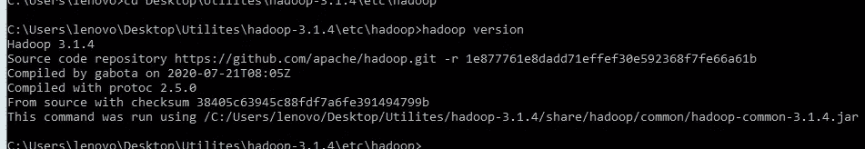

yeppy，因为现在它没有抛出错误，现在我们可以说我们的 windows 机器上安装了 hadoop。

# 格式化 Namenode

安装 hadoop 时格式化 NameNode 一次，不是为了运行 hadoop 文件系统，否则会删除 HDFS 中的所有数据。运行以下命令-

HDFS NameNode-格式

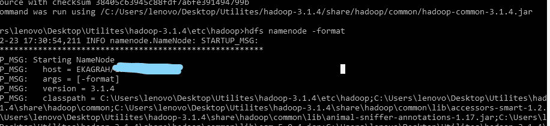

现在让我们从启动 dfs 和 yarn 命令开始，因为这个 cmd 文件在 sbin 中可用，我们已经在系统路径变量中给出了 sbin 的路径，所以我们不需要进入 sbin 文件夹来运行该文件。

这一步包括使用以下命令启动 namenode 和 datanode

通过执行上述命令，您将得到四个 Apache 分发窗口。

现在您可以访问这个 URL:[http://localhost:9870/](http://localhost:9870/)，在这里您可以获得您的 dfs、namenode 和 datanode 的状态。

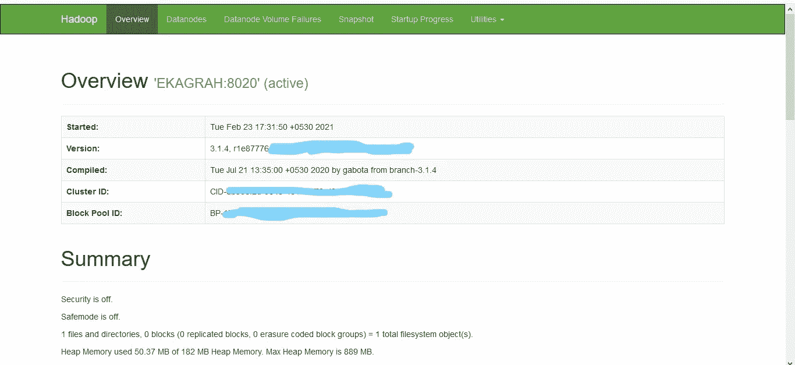

与 HDFS 合作:-

我将在我的本地文件系统中创建一个演示文件. txt，以便将它放入 hdfs usjng hdfs 命令行工具中。

我将使用以下命令创建目录名/用户

现在你可以看到新的文件夹/用户是在 hdfs 中创建的。

现在，我们将在本地文件系统中创建一个 txt 文件，这样我们就可以使用下面的命令将它放到 hdfs 中。

如您所见，RLabInst.txt 现在存储在我们的 hdfs 文件系统中。

要查看文件中的内容，我们可以执行以下命令，

所以，恭喜你！！我们已经成功安装了 hadoop 并执行了几个命令；).hadoop 还有更多的事情要做我们刚刚看到了它的一瞥，你可以从这里得到更多的命令[https://Hadoop . Apache . org/docs/r 3 . 1 . 0/Hadoop-project-dist/Hadoop-HDFS/HDFS commands . html](https://hadoop.apache.org/docs/r3.1.0/hadoop-project-dist/hadoop-hdfs/HDFSCommands.html)

我希望现在在 windows 上安装 hadoop 时不会出现错误，如果有任何问题，您可以随时在这里发表评论。再次感谢你！😃