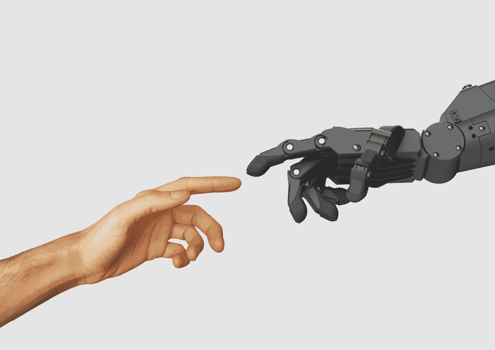
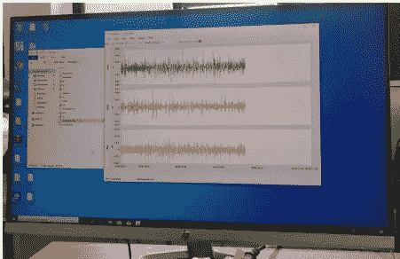
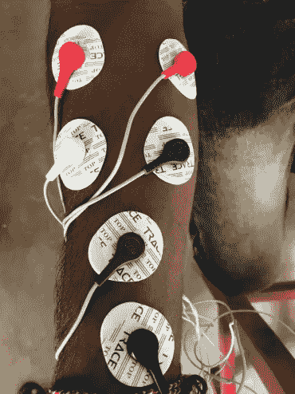
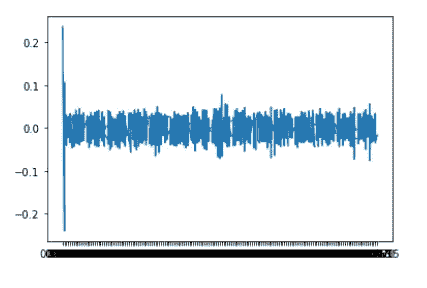

# 基于 CNN 的手势分类——第一部分

> 原文：<https://medium.com/analytics-vidhya/hand-gesture-classification-using-cnn-part-i-dbb0632337d0?source=collection_archive---------21----------------------->

**动机**

110 亿人或世界人口的 15%都有某种残疾。这是一个很大的数目，对吗？许多国家没有一个合适的系统来帮助残疾人获得公共服务。

如果你把一个没有手的残疾人从他的手腕上拿下来，他很难进行日常活动。所以为了解决这个问题，有一些人造手臂可以连接到他们的手腕上，这样他们就可以做一些特定的活动，比如拿杯子或啤酒。但是现有的肢体具有一些缺点，例如可以执行的手势数量较少，它们不支持实时活动，并且它们缺乏对肢体反馈的敏感性。

# **解决方案**

所以我们想出了解决方案来克服现有肢体的这一缺点。我们计划收集每个手势的手腕表面肌电信号，并使用卷积神经网络对这些信号进行分类。训练好的模型可以用于假肢。这种方法将有助于比其他传统肢体更准确的输出，我们可以用更少的数据训练模型。

# 数据收集

数据收集是任何研究的重要任务。因为算法的输入是数据。因此，算法的效率和准确性取决于数据的正确性和质量。

有 29 名健康受试者(12 名女性和 17 名男性，年龄从 20-26 岁)使用生物无线电装置记录前臂肌电活动。

**生物无线电装置**

这是一款无线多通道监护仪，用于捕捉生理信号，如心脏、大脑和肌肉的电活动。在这项工作中采用了以下手势:中立，手关闭，手打开，手腕伸展，手腕弯曲，尺偏和桡偏。我们采用无创的方法采集受试者手部的表面肌电信号。所有的参与者都被要求练习每个手势，直到他们按照我们的实验要求完成任务。之前，我们收集了 5 名受试者的表面肌电信号，以分析所需的原始数据，并检查特定设备是否正常工作。

在生物无线电装置中采集 3 路信号

对于训练数据集和测试数据集，通过要求用户保持每个手势 15 秒来创建标记数据。只有当参与者正确地保持所要求的姿势时，研究人员才手动开始数据记录。一般来说，每个手势之间给参与者五秒钟的时间。结果没有记录休息时间。我们用 BioCapture 软件记录了这些表面肌电信号。在所有情况下，我们都将录音提取为. csv 文件

在记录过程中，参与者被指示坐在舒适的椅子上，前臂平行于地板，由自己支撑。这些基于凝胶的电极需要剃刮和清洗皮肤，以获得受试者皮肤和电极之间的最佳接触，从而获得更准确的原始数据。11 收集的数据集包含每个主题的文件夹。每个文件夹包含七个按特定顺序排列的文件。注意，对于实验来说，不区分左撇子和右撇子，因为所提出的系统能够自动适应这些变化

从前臂采集肌电信号

# 数据预处理

**噪声去除**

去噪信号

EMG 信号也容易受到多种噪声的影响。sEMG 主要包含两个来源，即肌电活动和伪像。当肌电信号通过各种组织时，会获得多种噪声。噪声是肌电信号中不需要的电信号。信号中的噪声和伪像是一个需要考虑的严重问题，因为这会对信号质量产生不利影响。此外，肌电信号的分析也因此变得困难。因此，使用 BioCapture 软件对接收到的信号进行滤波，以便在系统使用之前去除无用信号。并且还去除了涉及放松位置的头部和尾部，以提取肌肉活动。因此，我们移除该部分以获得平滑信号。

…未完待续❤